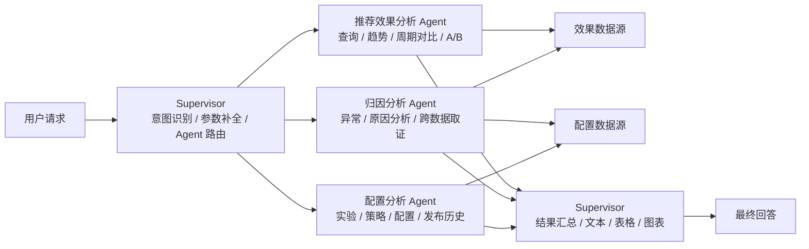
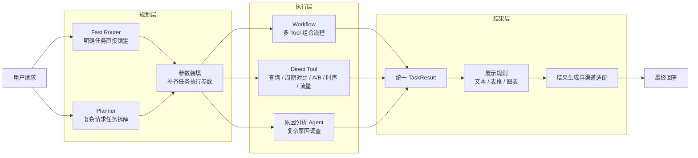

# 推荐效果分析 Agent 方案对比

## 0. 本周工作

| 工作 | 本周产出 |
| --- | --- |
| 对比 Mentor 与当前 Agent 方案 | 梳理两套多 Agent 架构、执行方式和职责边界 |
| 优化 Agent 编排链路 | 将任务锁定、参数装填、执行调度拆开，减少主 Agent 自主判断 |
| 完善分析 Tool | 收敛指标查询、周期比较、A/B、时序、流量等确定性分析能力 |
| 优化结果输出 | 将业务结果与文本、表格、图表展示拆开 |

本周主要是在 Mentor 方案和现有方案之间做对比，并在此基础上组合优化当前架构。

---

## 1. Agent 架构对比

### 1.1 Mentor Agent 架构

Mentor 方案采用 **Supervisor + 专业分析 Agent** 的多 Agent 架构。Supervisor 负责意图判断、参数补全、Agent 路由和最终输出，具体分析交给不同专业 Agent。

### 1.2 当前 Agent 架构

当前方案分为 **规划层、执行层、结果层**。规划层负责确定“做什么、参数是什么”，执行层并行执行不同任务，结果层统一组织输出。

> 执行层中的 Workflow、Direct Tool、原因分析 Agent 是同一级执行单元，可以根据任务计划并行执行。A/B 分析后续计划从 Workflow 收敛为独立 Tool。

### 1.3 架构差异

| 对比点 | Mentor 方案 | 当前方案 |
| --- | --- | --- |
| 规划方式 | Supervisor 同时负责意图、参数和路由 | Fast Router / Planner 负责任务锁定，参数装填独立处理 |
| 执行方式 | 路由到效果、归因、配置三个专业 Agent | Workflow、Direct Tool、原因分析 Agent 作为并行执行单元 |
| 普通分析 | 查询、趋势、周期、A/B 都进入效果分析 Agent | 能确定性计算的能力优先下沉到 Tool / Workflow |
| 原因分析 | 独立归因 Agent | 保留独立原因分析 Agent |
| 配置查询 | 独立配置分析 Agent | 配置能力作为确定性 Tool 能力接入执行层 |
| 并行能力 | 默认一次选择一个分析 Agent，少量场景可并行 | 任务拆解后可直接并行执行多个独立任务 |
| 结果输出 | Supervisor 同时负责汇总和展示 | TaskResult 统一收敛后，由结果层决定文本、表格和图表 |
| 核心特点 | Agent 分工直观，架构简单 | Agent 更少，确定性能力更多，复杂任务编排能力更强 |

### 1.4 方案判断与本周优化

两套方案各有优势，当前方案不是完全重新设计，而是**保留 Mentor 多 Agent 的专业分工思路，再把适合确定性执行的能力从 Agent 中拆出来**。

| 保留 / 优化 | 具体调整 |
| --- | --- |
| 保留专业 Agent | “为什么、异常原因、配置是否导致变化”等复杂调查继续由原因分析 Agent 处理 |
| 普通分析 Tool 化 | 查询、周期比较、A/B、时序、流量等尽量由确定性 Tool 完成 |
| 规划拆分 | 将 Supervisor 中的任务识别拆为 Fast Router / Planner，再独立进行参数装填 |
| 支持并行 | 多个无依赖任务在执行层并行执行，不要求由一个 Agent 串行调用 |
| 输出解耦 | 执行结果统一收敛为 TaskResult，再决定文本、表格、图表和渠道格式 |

**当前方案更适合正式落地。** Mentor 方案更简洁，但效果分析 Agent 和 Supervisor 承担的职责较多；当前方案保留复杂分析所需的 Agent 推理，同时把可以稳定计算和校验的部分交给 Workflow / Tool，使执行过程更可控，也更容易测试和扩展。