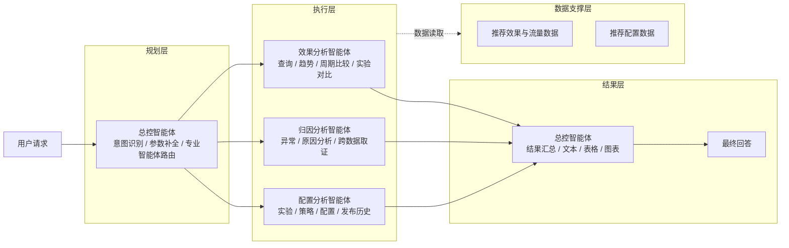
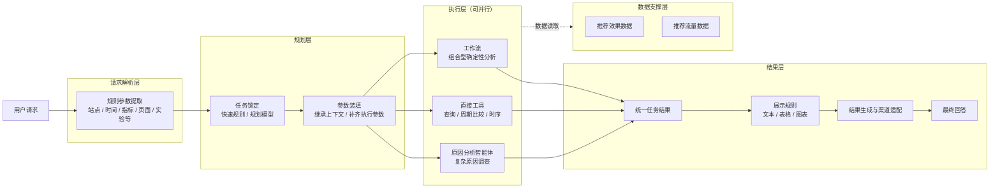

# 推荐效果分析智能体方案对比

## 0. 本周工作

| 工作 | 本周产出 |
| --- | --- |
| 重整分析工具设计 | 重新梳理指标查询、周期比较、实验对比、时序分析等工具的职责边界、输入输出和执行规则 |
| 完善指标计算口径 | 重新整理多日聚合、派生指标、排序与 TopN、统计检验等计算逻辑，保证结果口径准确且可解释 |
| 收敛智能体设计原则 | 对比导师方案后，重新明确默认执行、追问边界以及“效果怎么样”等宽泛请求的处理方式 |
| 对比导师方案与当前方案 | 梳理两套智能体架构、运行方式和职责边界，为后续逐节点优化提供依据 |

本周重点是**重新整理工具能力与计算规则，并结合导师方案重新收敛智能体的设计原则**。架构本身没有做大的调整，后续将在现有架构上按新的原则逐节点优化。

---

## 1. 设计原则

### 1.1 导师方案

导师方案整体更偏向**目标驱动和主动分析**。用户给出一句业务问题后，系统优先理解用户真正想解决的分析目标，而不是要求用户明确指定某个工具、指标或分析步骤。

例如用户问：

> Q2 的购物车页面推荐效果怎么样？

导师方案会将其理解为“评价 Q2 购物车页面的推荐效果”，然后主动补齐默认指标和分析步骤，组织整体效果、趋势、对比、贡献等分析，而不是只执行一次指标查询。

在缺少部分条件或原分析路径无法继续时，导师方案也会尽量自行寻找可执行的替代路径。例如原计划比较 Q2 与 Q1，当 Q1 无数据时，可能继续尝试 Q2 前半段与后半段的比较，以尽量完成一次完整分析。

### 1.2 我们之前的方案

我们之前的方案更强调**固定任务识别和确定性执行**。用户请求先被映射到明确任务，再由工具、工作流和规则完成后续执行；当关键参数缺失时，通过参数补全或追问后再进入执行链路。

例如：

```text
“Q2购物车页CTR是多少？”
→ 指标查询

“Q2购物车页推荐效果怎么样？”
→ 指标查询
```

也就是说，之前的设计主要从“这个请求对应哪个任务”出发理解用户问题。“效果怎么样”“表现如何”等宽泛表达，在任务路由阶段通常仍会被收敛到已有的指标查询任务，再按照该任务的固定输入、计算和输出规则执行。

### 1.3 总结与修改内容

对比后，我们认为导师方案的**目标驱动和主动分析**更符合用户使用习惯，但其兜底范围需要收紧：在原分析路径无法继续时，导师方案可能为了尽量给出答案而自行替换比较基准或切换分析路径，例如 Q1 无数据时将“Q2 vs Q1”改成“Q2 前半段 vs 后半段”，这已经改变了用户原始问题的业务语义。我们之前方案的**确定性边界**需要继续保留，但上层任务理解不能过度受固定 Tool 能力限制。

因此这次将设计原则调整为：

> **主动理解用户的分析目标，默认执行；只有缺失信息会改变业务语义、比较口径或数据范围时才追问，同时不得为了给出答案而替用户改变问题。**

具体修改如下：

1. **修改任务语义。** 将“CTR 是多少”和“推荐效果怎么样”拆成不同目标：前者继续按明确指标查询处理；后者不再简单锁定为一次指标查询，而是作为综合效果分析目标处理。
2. **增强宽泛问题的默认分析。** 对“效果怎么样”这类问题，系统主动组织整体水平、相对基准和期间变化等默认分析，不再要求用户逐项指定指标、比较方式和展示形式。
3. **收紧追问条件。** 不影响业务语义的缺省项直接使用系统默认值；能够唯一确定的信息通过规则或上下文直接推导；只有会改变查询对象、比较基准、实验角色或数据范围的信息才追问。
4. **保留原有确定性边界。** 底层 Tool、统计计算和业务口径继续严格执行；没有基准数据不自动替换比较基准，没有贡献证据不强行解释原因，没有显著性证据不表述为统计显著，A/B 角色、站点和无法唯一映射的对象也不进行猜测。

对应到实际处理上，指标、TopN、展示方式等非关键缺省项由系统直接使用默认值；“Q2”、可唯一映射的页面与站点、“那 EC20 呢”这类信息由规则或上下文直接推导；站点无法唯一确定、A/B 角色不明确、“相比之前”无法确定比较周期等情况继续追问。

因此这次修改主要集中在**上层任务理解、默认执行和追问边界**，底层工具与计算体系不做方向性改变。最终定位可以概括为：

> **导师方案的易用性 + 当前方案的确定性边界。**

既尽量让用户少补参数，也不为了给出答案替用户改变问题。

---

## 2. 智能体架构对比

为便于直接比较，两套方案统一按照 **请求处理 / 规划 / 执行 / 结果 / 数据支撑** 的职责进行整理，只展示核心模块，不展开内部节点。

### 2.1 导师方案



导师方案的核心是：**总控智能体统一负责规划和路由，再将任务交给效果、归因、配置三个专业智能体执行，结果回到总控智能体统一组织输出。**

### 2.2 当前方案



当前方案的核心是：**先通过规则提取用户请求中的显式参数，再在规划层完成任务锁定和参数装填；执行层根据任务类型，将任务并行分发给工作流、直接工具或原因分析智能体；最终统一收敛结果并决定展示方式。**

> 执行层中的工作流、直接工具和原因分析智能体是同一级执行单元，可根据任务依赖关系并行运行。

### 2.3 架构差异

| 对比点 | 导师方案 | 当前方案 |
| --- | --- | --- |
| 请求处理 | 主要由总控智能体直接理解用户请求 | 先通过规则提取站点、时间、指标、页面、实验等显式参数 |
| 规划层 | 一个总控智能体同时完成意图识别、参数补全和专业智能体路由 | 任务锁定与参数装填拆开；明确任务走快速规则，复杂任务再进入规划模型 |
| 执行层 | 效果、归因、配置三个专业分析智能体 | 工作流、直接工具、原因分析智能体三个执行单元 |
| 普通分析 | 查询、趋势、周期比较、实验对比主要由效果分析智能体完成 | 查询、周期比较、时序等确定性能力优先由直接工具完成；组合分析由工作流承载 |
| 实验对比 | 由效果分析智能体完成 | 当前由工作流承载 |
| 原因分析 | 独立归因分析智能体 | 保留独立原因分析智能体，只负责复杂调查 |
| 配置能力 | 独立配置分析智能体 | 当前架构暂不包含配置查询与配置数据能力 |
| 并行执行 | 默认选择一个专业分析智能体，跨分析师场景才考虑并行 | 规划后多个无依赖任务可直接并行执行 |
| 结果层 | 总控智能体同时负责结果汇总和展示生成 | 先统一收敛任务结果，再由展示规则决定文本、表格和图表 |
| 数据支撑 | 效果与流量数据、推荐配置数据支撑专业智能体 | 当前由推荐效果数据和推荐流量数据支撑执行层 |

**我的意见：从当前业务需求看，当前方案更合适。**

导师方案的优势是**通用性更强**：大量任务交给大模型和专业智能体自主理解、选工具和分析，因此面对未预先定义的问题时适应能力更好。但这种方式也意味着更多步骤依赖大模型推理，简单查询和固定分析同样需要经过智能体链路，执行速度较慢，任务判断、参数生成和工具调用也更容易受到模型波动影响。

推荐效果分析本身是一个**边界相对明确的垂直业务场景**。核心问题集中在指标查询、周期比较、实验分析、时序分析和原因调查等固定类型，业务侧更关注的是**结果快、口径准、执行稳定**，而不是让大模型自由完成所有分析。因此当前方案优先把高频、确定性的能力沉淀为规则、工具和工作流，让大部分请求走短链路确定性执行；只有复杂语义和无法通过固定能力覆盖的问题，再交给规划模型或原因分析智能体处理。

整体思路可以概括为：**垂直能力优先保证速度和准确性，大模型负责复杂场景和长尾问题兜底。** 这样既保留了垂直分析的稳定性，也没有完全牺牲对未知问题的通用处理能力。

---

## 3. 能力对比

### 3.1 能力对比总览

先从用户实际能够完成的分析任务看两套方案覆盖了哪些核心能力，后续再选择重点能力比较其具体实现方式。

| 核心能力 | 导师方案 | 当前方案 |
| --- | --- | --- |
| 指标查询 | 查询指定时间和业务范围内的曝光、点击、转化、GMV 等推荐效果，并给出结果解释 | 查询指定时间和业务范围内的核心推荐指标，可按页面、店铺、推荐方式等维度展开 |
| 周期对比 | 比较两个时间周期的推荐效果，判断哪些指标或对象发生了变化 | 既可以比较两个周期的整体变化，也可以在同一周期内比较不同页面、店铺或推荐方式的表现 |
| 趋势分析 | 查看一段时间内指标的变化趋势并判断表现变化 | 按天查看指标变化，并识别趋势、异常和明显变化信号 |
| 异常识别 | 结合效果数据识别异常表现，并可继续进入原因调查 | 先确定异常发生的时间和对象，再将需要解释的问题交给原因分析能力 |
| 实验对比 | 对实验组与对照组的推荐效果进行比较 | 对实验组与对照组进行整体效果、趋势和店铺差异等分析 |
| 综合效果分析 | 面对“效果怎么样”等宽泛问题，主动组合多种分析方式形成整体判断 | 将“效果怎么样”识别为综合分析目标，再组合指标、对比和趋势等能力完成判断 |
| 原因分析 | 针对指标变化或异常进行跨数据调查，给出原因判断和证据 | 针对复杂变化和异常进行原因调查，并使用已有确定性分析结果作为证据 |
| 配置分析 | 查询实验、策略、场景和发布历史等配置内容 | 当前暂不包含配置查询与配置分析能力 |
| 开放式 / 长尾问题 | 专业智能体可以根据问题自主选择分析方式，覆盖范围较广 | 高频业务问题由固定能力处理，超出已有能力范围时再由大模型处理复杂语义和长尾问题 |

整体上，两套方案覆盖的核心推荐分析问题接近，主要差异不在“有没有这个能力”，而在**能力内部如何理解输入、执行计算以及组织输出**。下面选择核心能力进一步展开。

### 3.2 周期对比能力

周期对比能力既用于回答“这个周期相比另一个周期表现如何”，也用于回答“同一个周期里哪些页面、店铺或推荐方式表现更好/变化更大”。这里从输入、处理和输出三个阶段比较具体实现。

| 阶段 | 当前方案 | 导师方案 |
| --- | --- | --- |
| 输入 | 可以只给一个当前周期，用于比较同一周期内不同对象的表现；也可以同时给出当前期和基准期，用于比较两个周期的变化。进入执行前需要能够确定当前周期，只有用户存在明确跨期比较意图时才需要确定基准周期。用户还可以限定站点、页面、店铺、推荐方式或实验范围，并指定最多两个分组维度和需要关注的指标。 | 待补充 |
| 处理 | 两个周期始终使用完全相同的业务范围进行比较，避免因为页面、店铺或推荐方式不同造成口径偏差。多日数据先累计曝光、点击、转化等基础量，再重新计算 CTR、CVR 等比例指标，不直接平均每日比例。双周期按同一个比较对象对齐，缺失数据保持为空而不是补 0；排名基于整个周期的结果统一完成，可以按当前表现、增减量或变化率找出主要对象。需要日级结果时，也先确定整个周期的入选对象，再展开每天的数据，避免每天重新选出不同对象。 | 待补充 |
| 输出 | 单周期比较返回各对象在当前周期的表现和排名；双周期比较同时返回当前期、基准期、增减值、变化比例和变化方向。既可以输出整个周期的汇总结果，也可以展开到每日变化；同时标记数据缺失、覆盖不足、零分母、周期重叠等情况，不可计算的结果保持为空，不使用 0 伪造结果。 | 待补充 |

当前方案的核心是：**先保证两个周期和各比较对象处于同一业务口径，再进行变化计算和排名；计算规则由确定性逻辑完成，缺失或不可计算的数据不会被自动补成正常结果。**