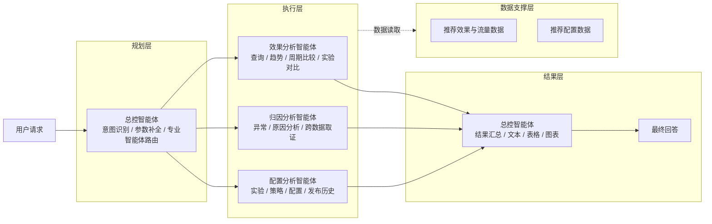
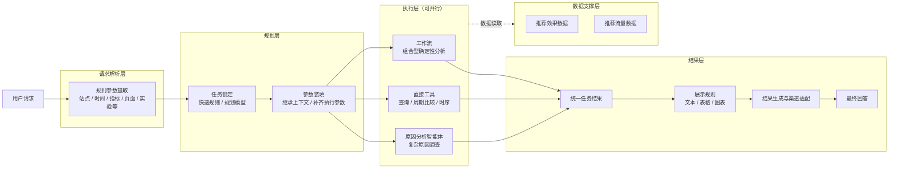

# 推荐效果分析智能体方案对比

## 0. 本周工作

| 工作 | 本周产出 |
| --- | --- |
| 重整分析工具设计 | 重新梳理指标查询、周期比较、实验对比、时序分析等工具的职责边界、输入输出和执行规则 |
| 完善指标计算口径 | 重新整理多日聚合、派生指标、排序与 TopN、统计检验等计算逻辑，保证结果口径准确且可解释 |
| 收敛智能体设计原则 | 对比导师方案后，重新明确默认执行、追问边界以及“效果怎么样”等宽泛请求的处理方式 |
| 对比导师方案与当前方案 | 梳理两套智能体架构、运行方式和职责边界，为后续逐节点优化提供依据 |

本周重点是**重新整理工具能力与计算规则，并结合导师方案重新收敛智能体的设计原则**。架构本身没有做大的调整，后续将在现有架构上按新的原则逐节点优化。

---

## 1. 设计原则

### 1.1 导师方案

导师方案整体更偏向**目标驱动和主动分析**。用户给出一句业务问题后，系统优先理解用户真正想解决的分析目标，而不是要求用户明确指定某个工具、指标或分析步骤。

例如用户问：

> Q2 的购物车页面推荐效果怎么样？

导师方案会将其理解为“评价 Q2 购物车页面的推荐效果”，然后主动补齐默认指标和分析步骤，组织整体效果、趋势、对比、贡献等分析，而不是只执行一次指标查询。

在缺少部分条件或原分析路径无法继续时，导师方案也会尽量自行寻找可执行的替代路径。例如原计划比较 Q2 与 Q1，当 Q1 无数据时，可能继续尝试 Q2 前半段与后半段的比较，以尽量完成一次完整分析。

### 1.2 我们之前的方案

我们之前的方案更强调**固定任务识别和确定性执行**。用户请求先被映射到明确任务，再由工具、工作流和规则完成后续执行；当关键参数缺失时，通过参数补全或追问后再进入执行链路。

例如：

```text
“Q2购物车页CTR是多少？”
→ 指标查询

“Q2购物车页推荐效果怎么样？”
→ 指标查询
```

也就是说，之前的设计主要从“这个请求对应哪个任务”出发理解用户问题。“效果怎么样”“表现如何”等宽泛表达，在任务路由阶段通常仍会被收敛到已有的指标查询任务，再按照该任务的固定输入、计算和输出规则执行。

### 1.3 总结与修改内容

对比后，我们认为导师方案的**目标驱动和主动分析**更符合用户使用习惯，但其兜底范围需要收紧：在原分析路径无法继续时，导师方案可能为了尽量给出答案而自行替换比较基准或切换分析路径，例如 Q1 无数据时将“Q2 vs Q1”改成“Q2 前半段 vs 后半段”，这已经改变了用户原始问题的业务语义。我们之前方案的**确定性边界**需要继续保留，但上层任务理解不能过度受固定 Tool 能力限制。

因此这次将设计原则调整为：

> **主动理解用户的分析目标，默认执行；只有缺失信息会改变业务语义、比较口径或数据范围时才追问，同时不得为了给出答案而替用户改变问题。**

具体修改如下：

1. **修改任务语义。** 将“CTR 是多少”和“推荐效果怎么样”拆成不同目标：前者继续按明确指标查询处理；后者不再简单锁定为一次指标查询，而是作为综合效果分析目标处理。
2. **增强宽泛问题的默认分析。** 对“效果怎么样”这类问题，系统主动组织整体水平、相对基准和期间变化等默认分析，不再要求用户逐项指定指标、比较方式和展示形式。
3. **收紧追问条件。** 不影响业务语义的缺省项直接使用系统默认值；能够唯一确定的信息通过规则或上下文直接推导；只有会改变查询对象、比较基准、实验角色或数据范围的信息才追问。
4. **保留原有确定性边界。** 底层 Tool、统计计算和业务口径继续严格执行；没有基准数据不自动替换比较基准，没有贡献证据不强行解释原因，没有显著性证据不表述为统计显著，A/B 角色、站点和无法唯一映射的对象也不进行猜测。

对应到实际处理上，指标、TopN、展示方式等非关键缺省项由系统直接使用默认值；“Q2”、可唯一映射的页面与站点、“那 EC20 呢”这类信息由规则或上下文直接推导；站点无法唯一确定、A/B 角色不明确、“相比之前”无法确定比较周期等情况继续追问。

因此这次修改主要集中在**上层任务理解、默认执行和追问边界**，底层工具与计算体系不做方向性改变。最终定位可以概括为：

> **导师方案的易用性 + 当前方案的确定性边界。**

既尽量让用户少补参数，也不为了给出答案替用户改变问题。

---

## 2. 智能体架构对比

为便于直接比较，两套方案统一按照 **请求处理 / 规划 / 执行 / 结果 / 数据支撑** 的职责进行整理，只展示核心模块，不展开内部节点。

### 2.1 导师方案



导师方案的核心是：**总控智能体统一负责规划和路由，再将任务交给效果、归因、配置三个专业智能体执行，结果回到总控智能体统一组织输出。**

### 2.2 当前方案



当前方案的核心是：**先通过规则提取用户请求中的显式参数，再在规划层完成任务锁定和参数装填；执行层根据任务类型，将任务并行分发给工作流、直接工具或原因分析智能体；最终统一收敛结果并决定展示方式。**

> 执行层中的工作流、直接工具和原因分析智能体是同一级执行单元，可根据任务依赖关系并行运行。

### 2.3 架构差异

| 对比点 | 导师方案 | 当前方案 |
| --- | --- | --- |
| 请求处理 | 主要由总控智能体直接理解用户请求 | 先通过规则提取站点、时间、指标、页面、实验等显式参数 |
| 规划层 | 一个总控智能体同时完成意图识别、参数补全和专业智能体路由 | 任务锁定与参数装填拆开；明确任务走快速规则，复杂任务再进入规划模型 |
| 执行层 | 效果、归因、配置三个专业分析智能体 | 工作流、直接工具、原因分析智能体三个执行单元 |
| 普通分析 | 查询、趋势、周期比较、实验对比主要由效果分析智能体完成 | 查询、周期比较、时序等确定性能力优先由直接工具完成；组合分析由工作流承载 |
| 实验对比 | 由效果分析智能体完成 | 当前由工作流承载 |
| 原因分析 | 独立归因分析智能体 | 保留独立原因分析智能体，只负责复杂调查 |
| 配置能力 | 独立配置分析智能体 | 当前架构暂不包含配置查询与配置数据能力 |
| 并行执行 | 默认选择一个专业分析智能体，跨分析师场景才考虑并行 | 规划后多个无依赖任务可直接并行执行 |
| 结果层 | 总控智能体同时负责结果汇总和展示生成 | 先统一收敛任务结果，再由展示规则决定文本、表格和图表 |
| 数据支撑 | 效果与流量数据、推荐配置数据支撑专业智能体 | 当前由推荐效果数据和推荐流量数据支撑执行层 |

**我的意见：从当前业务需求看，当前方案更合适。**

导师方案的优势是**通用性更强**：大量任务交给大模型和专业智能体自主理解、选工具和分析，因此面对未预先定义的问题时适应能力更好。但这种方式也意味着更多步骤依赖大模型推理，简单查询和固定分析同样需要经过智能体链路，执行速度较慢，任务判断、参数生成和工具调用也更容易受到模型波动影响。

推荐效果分析本身是一个**边界相对明确的垂直业务场景**。核心问题集中在指标查询、周期比较、实验分析、时序分析和原因调查等固定类型，业务侧更关注的是**结果快、口径准、执行稳定**，而不是让大模型自由完成所有分析。因此当前方案优先把高频、确定性的能力沉淀为规则、工具和工作流，让大部分请求走短链路确定性执行；只有复杂语义和无法通过固定能力覆盖的问题，再交给规划模型或原因分析智能体处理。

整体思路可以概括为：**垂直能力优先保证速度和准确性，大模型负责复杂场景和长尾问题兜底。** 这样既保留了垂直分析的稳定性，也没有完全牺牲对未知问题的通用处理能力。

---

## 3. 能力对比

### 3.1 能力对比总览

先从用户实际能够完成的分析任务看两套方案覆盖了哪些核心能力，后续再选择重点能力比较其具体实现方式。

| 核心能力 | 导师方案 | 当前方案 |
| --- | --- | --- |
| 指标查询 | 查询指定时间和业务范围内的曝光、点击、转化、GMV 等推荐效果，并给出结果解释 | 查询指定时间和业务范围内的核心推荐指标，可按页面、店铺、推荐方式等维度展开 |
| 周期对比 | 比较两个时间周期的推荐效果，判断哪些指标或对象发生了变化 | 既可以比较两个周期的整体变化，也可以在同一周期内比较不同页面、店铺或推荐方式的表现 |
| 趋势分析 | 查看一段时间内指标的变化趋势并判断表现变化 | 按天查看指标变化，并识别趋势、异常和明显变化信号 |
| 异常识别 | 结合效果数据识别异常表现，并可继续进入原因调查 | 先确定异常发生的时间和对象，再将需要解释的问题交给原因分析能力 |
| 实验对比 | 对实验组与对照组的推荐效果进行比较 | 对实验组与对照组进行整体效果、趋势和店铺差异等分析 |
| 综合效果分析 | 面对“效果怎么样”等宽泛问题，主动组合多种分析方式形成整体判断 | 将“效果怎么样”识别为综合分析目标，再组合指标、对比和趋势等能力完成判断 |
| 原因分析 | 针对指标变化或异常进行跨数据调查，给出原因判断和证据 | 针对复杂变化和异常进行原因调查，并使用已有确定性分析结果作为证据 |
| 配置分析 | 查询实验、策略、场景和发布历史等配置内容 | 当前暂不包含配置查询与配置分析能力 |
| 开放式 / 长尾问题 | 专业智能体可以根据问题自主选择分析方式，覆盖范围较广 | 高频业务问题由固定能力处理，超出已有能力范围时再由大模型处理复杂语义和长尾问题 |

整体上，两套方案覆盖的核心推荐分析问题接近，主要差异不在“有没有这个能力”，而在**能力内部如何理解输入、执行计算以及组织输出**。下面选择核心能力进一步展开。

### 3.2 周期对比能力

两套方案都把周期对比分成两类：**单周期内不同对象的横向比较**，以及**同一对象在当前期和基准期之间的纵向比较**。因此这里不重复双方一致的能力，而是先按输入、处理和输出说明实际实现，再单独总结有区别的部分。

| 阶段 | 导师方案 | 当前方案 |
| --- | --- | --- |
| 输入 | 只有一个时间窗口时，在同一窗口内选择一个主要分析维度，对页面、店铺、推荐方式、实验等对象进行横向比较；同时给出当前期和基准期时，则比较同一业务范围在两个周期中的变化。未要求拆分时直接分析整体。 | 同样支持单周期横向比较和双周期纵向比较。未要求拆分时分析整体；需要展开时可以按一个业务维度比较，也可以把两个维度组合成一个完整对象后统一比较。当前周期必须能够确定，只有存在明确跨期比较意图时才需要基准周期。 |
| 处理 | 每个窗口先汇总曝光、点击、转化、GMV 等基础量，再重新计算 CTR、CVR 等比例或人均指标。双周期按相同对象对齐后计算当前值、基准值和变化。排序与 TopN 都基于整个窗口完成，日级趋势只对窗口级已经入选的对象展开，不会每天重新选择对象。双周期默认按当前期主指标排序；用户明确要求“增长最多”“下降最多”“变化最大”等语义时，再改用相应变化值排序。 | 两个窗口先投影到完全相同的业务范围，再分别汇总基础量并重算派生指标。双周期按同一对象对齐，缺失数据和不可计算值保持为空，不补成 0。排序同样先基于整个窗口确定对象，再展开日级结果；双周期没有指定排序语义时，默认优先找出变化幅度最大的对象。页面、推荐模式等候选较少的分组默认全部返回，店铺等候选较多的分组再使用 TopN 控制结果数量。 |
| 输出 | 单周期返回各分组的窗口值和排名；双周期返回当前值、基准值、变化值和变化比例，也可以继续展开入选对象的日级趋势。分组比较时可以额外带一个整体结果作为参考，但整体不参加 TopN 排名。 | 单周期返回各比较对象的窗口值和排名；双周期返回当前期、基准期、绝对变化、相对变化和变化方向，也可以展开固定入选对象的日级结果。分组结果不会自动附带整体参照；如果用户同时需要整体结果和分组结果，由上层生成独立的整体分析任务。缺失、零分母、周期重叠等情况会作为明确状态或提示返回。 |

#### 核心实现差异

| 差异点 | 导师方案 | 当前方案 |
| --- | --- | --- |
| 分组粒度 | 一次选择一个主要分析维度进行分组比较 | 支持一个维度，也支持两个维度组合后作为完整比较对象 |
| 双周期默认排序 | 默认优先按当前期主指标排序，明确要求增长、下降或变化时才切换到变化值 | 默认优先按两个周期的变化幅度排序，更直接定位变化最大的对象 |
| 整体参照 | 分组结果中可以同时带整体结果作为参考线，整体不参加排名 | 分组结果不自动附带整体，需要整体参照时单独生成整体分析任务 |
| TopN 适用方式 | TopN 作为通用分组筛选能力，可用于页面、店铺等候选对象 | 页面、推荐模式等候选较少的分组默认全部返回；店铺等高基数分组才主要通过 TopN 控制数量 |

两套方案在核心计算规则上其实比较接近：都采用**窗口级汇总后重算指标、窗口级固定排名对象、再展开日级趋势**。真正的区别主要集中在**允许怎样分组、默认按什么排序、整体参照怎么组织以及 TopN 如何使用**。

### 3.3 时序分析能力

两套方案都采用“**先构建逐日序列，再在同一序列上完成趋势与异常判断**”的基本思路，缺失或不可计算日期也都保持为空而不补零。主要差异集中在时序工具的职责范围、异常基线和统计护栏设计。

| 阶段 | 导师方案 | 当前方案 |
| --- | --- | --- |
| 输入 | 在一个时间范围内选择站点、指标和需要观察的页面、店铺、推荐方式、实验或策略等对象，并按需要启用趋势、两期比较、异常、变点和滚动比较等分析模块。多对象分析需要明确一个主指标用于统一排序；统计门槛既可以由工具配置，也允许随请求调整。 | 在一个最长14天的目标窗口内选择站点、1～5个指标和最多一个业务分组维度；未分组时分析整体。趋势固定执行，异常默认执行，变点按需要启用。异常会自动向目标窗口之前扩展一段历史作为基线；跨周期比较不放在时序工具内部，而由周期对比能力单独负责。统计门槛由版本化配置统一管理，不向上层模型开放。 |
| 处理 | 先构建完整日级序列并计算均值、中位数、MAD、首尾、峰谷和波动等通用特征，再在同一序列上执行趋势、异常、变点、两期比较和滚动比较。异常以当前分析窗口整体的中位数和MAD作为稳健基线；变点在当前窗口内扫描；两期与滚动比较使用紧邻的前一等长窗口。所有有效候选先完成统计检验和BH-FDR，再结合变化幅度、噪声地板和覆盖度判断是否显著，最后进行TopN展示。 | 同样先构建日级序列和趋势统计，但异常检测采用滚动历史基线：判断某一天时，只使用该日之前的历史有效点，当前日和未来数据都不会进入自己的基线。变点只在当前目标窗口内扫描，并根据指标类型分别使用日级数值检验或比例检验。统计检验先在完整有效候选上完成，再做FDR和TopN；异常与变点使用各自独立的判定护栏，而不是套用一套统一的显著性规则。 |
| 输出 | 在同一次时序分析中可同时返回趋势摘要、逐日序列、异常日、变点、两期变化、滚动结果以及显著性、噪声、完整性等护栏。即使没有检出异常或变点，也会继续给出趋势要点和“未检出显著变化”的判读。 | 返回固定入选对象的完整日级序列、首尾/峰谷/窗口值等趋势统计、异常点或异常区间、可选变点结果，以及覆盖度、模块状态和告警。异常和变点统一使用“统计检出、规则信号、未统计检出、不可评估”等结论状态；跨周期比较结果不会混入时序结果，而由对应的周期对比任务单独输出。 |

#### 核心实现差异

| 差异点 | 导师方案 | 当前方案 |
| --- | --- | --- |
| 能力边界 | 一个时序工具同时承载趋势、异常、变点、两期比较和滚动比较，尽量复用同一份序列和统计结果 | 时序工具只负责单窗口的趋势、异常和变点；跨周期比较保持为独立能力，避免时序工具继续膨胀 |
| 异常基线 | 使用当前整个分析窗口的中位数和MAD作为稳健基线，当前点可以参与该窗口的整体分布 | 判断某一天时只使用此前历史窗口作为基线，当前点和未来点不会进入自身基线 |
| 统计门槛 | 最小样本、分母、事件量、显著性阈值等既可由工具默认配置，也允许作为请求参数调整 | 统计阈值不作为上层请求参数，由版本化配置统一维护，避免模型或调用方临时改变统计口径 |
| 显著性护栏 | 各类检测统一强调同时通过校正后显著性、最小变化幅度、噪声地板和覆盖度后才判为显著 | 按检测器分别定义判定条件：异常主要结合校正后显著性、异常强度和历史覆盖度；变点再额外要求变化幅度和噪声地板 |

双方在**缺失值按空值处理、先完整统计再做FDR和TopN、多指标不混排、变点只在当前窗口内扫描**等规则上基本一致。最核心的设计取舍是：导师方案更强调把相关分析统一到一个时序工具中复用，而当前方案更强调**跨能力职责拆分和时间方向上的严格基线**。

### 3.4 A/B 对比能力

两套方案都把 A/B 对比限定在 **EC10 的实验数据**上，并且都坚持同一个原则：只描述实验组与对照组在相同时间和业务范围内观察到的数值差异，**不自动判定“谁更好”、不做显著性检验，也不输出 winner、lift 或放量结论**。差异主要集中在页面分析方式、店铺榜的可配置程度以及覆盖不一致时的处理边界。

从能力结构看，导师方案的 EC10 A/B 分析可以概括为：**整体组间比较 → 日级趋势 → 各组店铺构成榜 → 重叠店铺差异榜 → 完整性与告警**，页面只作为共同过滤条件；EC20 不具备 A/B 维度，转而建议使用召回或策略维度做替代分析。当前方案则把 EC10 A/B 固定成一套完整诊断：**整体比较 → 页面比较 → 日级趋势 → 店铺构成榜与差异榜 → 数据完整性诊断**。

| 阶段 | 导师方案 | 当前方案 |
| --- | --- | --- |
| 输入 | 只在 EC10 上比较明确的实验组和对照组，使用同一个日期范围和共同页面范围。页面主要用于限定实验比较范围；店铺分析通过 TopN 和曝光门槛控制结果规模。EC20 没有实验维度，A/B 请求本身不成立。 | 同样只支持 EC10，并要求对照组与实验组角色明确且互斥；不会根据编号、名称或结果表现猜角色。一个对照组可以同时与多个实验组独立比较，所有组共用日期、页面和店铺范围；页面既可以指定，也可以分析实验涉及的全部实际页面。 |
| 处理 | 比率类指标先汇总分子分母后重算，累计量直接比较窗口值。店铺差异榜只使用两组共同覆盖的店铺，先通过双侧曝光门槛，再按 CTCVR 差异绝对值取 TopN；仅单侧出现的店铺不进入差异榜，但保留在各组按曝光量得到的构成榜中。日级趋势固定实验组，不每天重选对象；缺失日保持为空。工具不执行显著性或自动判优。 | 整体、页面、日级和店铺四个诊断区域在同一共同范围内统一计算；派生指标同样基于聚合后的基础量重算。店铺构成榜与重叠店铺差异榜都在完整窗口一次性选取，但差异榜可以选择比较指标以及“绝对差异、实验组提升、实验组下降”等方向，构成榜的排序指标也可以独立选择。单侧店铺不进入差异榜；缺失日和不可计算值保持为空。工具同样不执行显著性、winner 或 lift 判断。 |
| 输出 | 返回两组整体指标、日级 CTCVR 趋势、各组头部店铺构成、重叠店铺差异榜以及缺失组、缺失日期、无重叠店铺、噪声门槛等告警。页面不会在一次调用中生成页面榜，需要在相同页面范围下分别运行后比较。EC20 会返回 A/B 不适用的诊断说明，并建议改走召回/策略对比。 | 返回整体比较、选定范围内各实际页面的实验差异、各实验组日级趋势、两套店铺榜、候选与单侧店铺统计以及完整的数据覆盖和 Warning。既可以看逻辑全页面整体，也可以在同一次诊断中看到具体页面差异；EC20 会直接判定站点能力不匹配，召回和策略分析由其他能力单独处理。 |

#### 核心实现差异

| 差异点 | 导师方案 | 当前方案 |
| --- | --- | --- |
| 页面分析 | 页面主要作为共同过滤条件；需要比较不同页面时分别按页面运行，不在 A/B Tool 内形成页面比较结果 | 页面是固定诊断区域之一，一次调用可以在相同实验范围内返回各具体页面的实验组与对照组差异 |
| 店铺差异榜 | 差异榜固定以 CTCVR 组间差异绝对值排序；各组构成榜固定按曝光量排序 | 差异榜可选择比较指标和差异方向，构成榜也可选择独立排序指标，在保持固定诊断结构的同时开放有限的专业参数 |
| 覆盖不一致 | 两组有效天数不一致时仍保留累计量的窗口差异，但需要通过完整性告警提醒其受覆盖天数影响，必要时人工改用日均理解 | 两侧覆盖日期集合不一致时，累计量只保留各侧窗口值，差异、相对差异和高低关系直接置为空；比例或人均指标可基于各侧实际基础量继续比较，但必须标记覆盖不一致 |
| EC20 处理 | 明确 A/B 不适用后，会给出召回/策略维度的替代分析路径 | A/B Contract 严格只接受 EC10，不在本能力内部把 EC20 请求改写成召回/策略比较；相关需求交给其他任务能力处理 |

双方在**实验角色必须明确、共同业务范围一致、比率聚合重算、店铺差异只看重叠对象、缺失不补 0、TopN 在窗口级固定选择、A/B Tool 不做显著性和自动判优**这些关键边界上基本一致。当前方案主要是在 Mentor 的固定实验比较结构上进一步强化了**页面级固定诊断、覆盖不一致时的受控降级，以及店铺分析参数的确定性开放**。