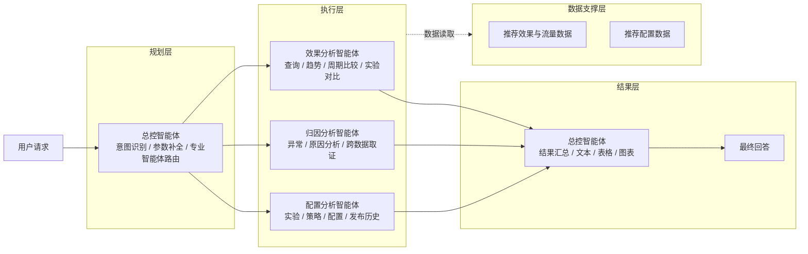
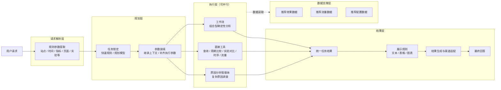

# 推荐效果分析智能体方案对比

## 0. 本周工作

| 工作 | 本周产出 |
| --- | --- |
| 对比导师方案与当前方案 | 梳理两套智能体架构、执行方式和职责边界 |
| 优化智能体编排链路 | 将规则参数提取、任务锁定、参数装填和执行调度拆开，减少大模型自主判断 |
| 完善分析工具 | 收敛指标查询、周期比较、实验对比、时序、流量等确定性分析能力 |
| 优化结果输出 | 将业务结果与文本、表格、图表展示拆开 |

本周主要是在导师方案和现有方案之间做对比，并在此基础上组合优化当前架构。

---

## 1. 智能体架构对比

为便于直接比较，两套方案统一按照 **请求处理 / 规划 / 执行 / 结果 / 数据支撑** 的职责进行整理，只展示核心模块，不展开内部节点。

### 1.1 导师方案

导师方案的核心是：**总控智能体统一负责规划和路由，再将任务交给效果、归因、配置三个专业智能体执行，结果回到总控智能体统一组织输出。**

### 1.2 当前方案

当前方案的核心是：**先通过规则提取用户请求中的显式参数，再在规划层完成任务锁定和参数装填；执行层根据任务类型，将任务并行分发给工作流、直接工具或原因分析智能体；最终统一收敛结果并决定展示方式。**

> 执行层中的工作流、直接工具和原因分析智能体是同一级执行单元，可根据任务依赖关系并行运行。实验对比能力后续从工作流进一步收敛为独立工具。

### 1.3 架构差异

| 对比点 | 导师方案 | 当前方案 |
| --- | --- | --- |
| 请求处理 | 主要由总控智能体直接理解用户请求 | 先通过规则提取站点、时间、指标、页面、实验等显式参数 |
| 规划层 | 一个总控智能体同时完成意图识别、参数补全和专业智能体路由 | 任务锁定与参数装填拆开；明确任务走快速规则，复杂任务再进入规划模型 |
| 执行层 | 效果、归因、配置三个专业分析智能体 | 工作流、直接工具、原因分析智能体三个执行单元 |
| 普通分析 | 查询、趋势、周期比较、实验对比主要由效果分析智能体完成 | 可确定性计算的能力优先下沉到工具或工作流 |
| 原因分析 | 独立归因分析智能体 | 保留独立原因分析智能体，只负责复杂调查 |
| 配置能力 | 独立配置分析智能体 | 配置查询下沉为确定性工具；复杂原因调查按需读取配置数据 |
| 并行执行 | 默认选择一个专业分析智能体，跨分析师场景才考虑并行 | 规划后多个无依赖任务可直接并行执行 |
| 结果层 | 总控智能体同时负责结果汇总和展示生成 | 先统一收敛任务结果，再由展示规则决定文本、表格和图表 |
| 数据支撑 | 效果与流量数据、推荐配置数据支撑专业智能体 | 效果、流量、配置数据统一作为执行层的数据支撑 |

**我的意见：** 两套方案的核心取向不同。导师方案把更多任务交给大模型和专业智能体完成，通用性更强，也更容易覆盖开放式问题，但链路相对更长，执行速度、稳定性和结果一致性更依赖大模型表现。当前业务属于较明确的垂直推荐分析场景，核心诉求更偏向“快、准、稳定”，因此更适合优先用规则、工具和工作流完成可确定的任务，只在复杂语义、原因调查和长尾问题上使用大模型兜底。这样既能保证垂直场景下的效率和准确性，也保留了对复杂问题的通用处理能力。本周架构本身没有做大的调整，主要是通过对比进一步明确了当前设计的取舍依据。