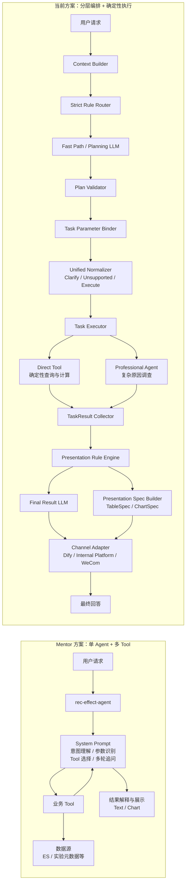

# 推荐效果分析 Agent 方案对比

## 0. 本周工作概览

本周工作重点是对 **Mentor 方案** 与 **当前方案** 的整体设计进行系统对比，并整理成可用于周汇报的材料。两套方案面向的是同一类推荐效果分析问题，但在 Agent 编排方式、职责划分、确定性执行边界和结果展示方式上采用了不同设计。

| 本周工作 | Mentor 方案 | 当前方案 | 本周产出 |
| --- | --- | --- | --- |
| Agent 架构梳理 | 单 Agent + 多 Tool | 分层编排 + Direct Tool + Professional Agent | 统一架构对比图 |
| 执行链路梳理 | Agent 直接理解请求并选择 Tool | Router / Planner / Binder / Normalizer / Executor 分层执行 | 执行流程对比 |
| Tool 与计算边界整理 | 主要通过 Tool 承载查询与分析能力 | Tool 负责确定性计算，复杂调查交给专业 Agent | 能力边界对比 |
| 输出链路整理 | Agent 解释 Tool 结果并输出文本/图表 | TaskResult → Presentation Rule Engine → Text / Table / Chart | 输出能力对比 |
| 典型问题验证 | 汇总、周期对比、A/B、异常等场景 | 在相同场景上进一步支持任务拆解、组合执行和专业调查 | 后续案例对比 |

### 本周对比重点

两套方案的主要差异不是“Tool 数量多少”，而是 **Agent 本身承担多少职责，以及不确定性在什么位置被收敛**。

- **Mentor 方案**：采用单 Agent + 多 Tool，Agent 负责理解问题、选择 Tool、补充信息和结果解释，整体链路更直接。
- **当前方案**：把请求理解、任务规划、参数绑定、确定性校验、任务执行和结果展示拆成独立阶段；简单请求尽量走规则 Fast Path，复杂分析再进入 Planner 或 Professional Agent。
- **核心变化**：从“一个 Agent 负责理解并调用 Tool”变成“先形成可校验的执行计划，再由确定性节点和专业 Agent 分工执行”。

---

## 1. Agent 架构对比

### 1.1 整体架构



从整体结构上看，Mentor 方案强调 **单 Agent 内完成理解、选择和解释**；当前方案强调 **把 Agent 编排过程拆成多个职责明确、可以独立校验的阶段**。

### 1.2 架构职责对比

| 架构维度 | Mentor 方案 | 当前方案 | 主要差异 |
| --- | --- | --- | --- |
| 总体模式 | 单 Agent + 多 Tool | 分层编排 + Direct Tool + Professional Agent | 从单 Agent 主导变为分层协作 |
| 请求理解 | System Prompt 统一理解用户问题 | Context Builder + Strict Rule Router | 明确信息先由确定性规则识别 |
| 任务选择 | Agent 根据问题选择 Tool | Router 锁定 Contract；无法确定时进入 Planning LLM | Tool 选择前增加任务契约层 |
| 任务拆解 | 主要由 Agent 在调用过程中处理 | Planning LLM 输出结构化 TaskShell / 依赖关系 | 多任务请求显式形成执行计划 |
| 参数识别 | Agent 根据 Prompt 直接生成 Tool 参数 | Task Parameter Binder 独立绑定参数 | 任务选择与参数理解解耦 |
| 执行前校验 | 主要依赖 Tool 参数 Schema 和 Agent 自身判断 | Plan Validator + Unified Normalizer | LLM 结果不能直接进入执行 |
| 简单请求 | 仍经过 Agent 推理选择 Tool | Router 全部锁定时可走 Fast Path | 简单问题减少不必要 LLM 推理 |
| 数据查询与计算 | Tool 承载查询和分析计算 | Direct Tool 承载确定性查询、聚合和计算 | 两者都依赖 Tool，但当前方案进一步固定计算边界 |
| 复杂原因分析 | Agent 组合多个 Tool 结果进行解释 | Professional Agent 在独立节点内执行 ReAct 调查 | 复杂调查从主编排链路中隔离 |
| 多任务执行 | Agent 按推理过程连续调用 Tool | 独立任务走 Iteration，依赖任务走 Loop | 调度关系显式化 |
| 结果汇总 | Agent 读取 Tool 结果后直接生成回答 | TaskResult Collector 统一收敛任务结果 | 执行结果先标准化，再进入展示 |
| 图表与表格 | Agent 根据结果决定文本或图表 | Presentation Rule Engine 决定展示形式，Spec Builder 生成 TableSpec / ChartSpec | 展示决策与业务计算解耦 |
| 最终回答 | Agent 同时负责数据理解和表达 | Final Result LLM 只基于标准化 TaskResult 组织正文 | 降低结果生成阶段重新解释业务数据的空间 |
| 渠道适配 | 复用现有输出结构 | Channel Adapter 统一适配 Dify、内部平台、企业微信 | 展示内容与渠道格式分离 |

### 1.3 核心架构差异

#### 1. Agent 职责从“集中”变为“拆分”

Mentor 方案中，主要的自然语言理解职责集中在 `rec-effect-agent`：Agent 根据 System Prompt 理解用户问题、识别参数、选择 Tool，并在 Tool 返回后继续解释结果。

当前方案把这一过程拆为：

```text
请求理解
→ 任务匹配
→ 必要时规划
→ 参数绑定
→ 确定性校验
→ 任务执行
→ 结果展示
```

这样每个阶段只处理一种不确定性，避免一个 Prompt 同时承担任务识别、参数生成、任务依赖和输出组织。

#### 2. LLM 从“执行中心”变为“必要时参与”

Mentor 方案的主链路以 Agent 推理为中心；当前方案则优先判断哪些内容可以由 Code 或规则直接确定：

```text
能够百分之百确定
→ Strict Rule Router / Fast Path
→ 跳过 Planning LLM

存在任务歧义或复杂拆解
→ Planning LLM

参数作用域无法确定
→ Parameter Binder LLM

复杂原因调查
→ Professional Agent
```

因此，LLM 主要处理真正需要语义判断的部分，确定性的 Contract、参数范围、任务依赖和 Tool 执行由代码约束。

#### 3. 数据结果与最终展示进一步解耦

Mentor 方案中，Agent 在获取 Tool 结果后直接完成结果解释和图表输出。

当前方案增加统一的 `TaskResult` 和展示层：

```text
Tool / Professional Agent
→ TaskResult
→ Presentation Rule Engine
├── Final Result LLM → answer_text
└── Presentation Spec Builder → TableSpec / ChartSpec
→ Channel Adapter
```

业务 Tool 只负责返回正确的数据事实和分析结果，不为了图表展示反向调整查询结果；展示层再根据结果类型决定使用文本、表格还是图表。

### 1.4 架构对比结论

| 对比结论 | Mentor 方案 | 当前方案 |
| --- | --- | --- |
| 设计重点 | 快速形成可运行的单 Agent 分析链路 | 建立可校验、可扩展的分析编排链路 |
| Agent 定位 | Agent 是主要理解、选择和解释中心 | Agent / LLM 是编排体系中的语义判断组件 |
| 确定性边界 | Tool 内部保证数据计算确定性 | 从任务匹配、参数校验到 Tool 计算和展示投影均建立确定性边界 |
| 复杂问题处理 | 依赖主 Agent 自主组合 Tool | 任务计划 + 显式依赖 + Professional Agent |
| 输出方式 | Agent 直接组织回答和图表 | 业务结果与 Presentation / Channel 分离 |

**整体上，两套方案解决的是同一类业务问题。Mentor 方案更偏向“单 Agent 驱动多个 Tool 的直接分析链路”，当前方案则进一步把任务理解、执行和展示拆开，目标是提高复杂问题下的可控性、可验证性和后续扩展能力。**
