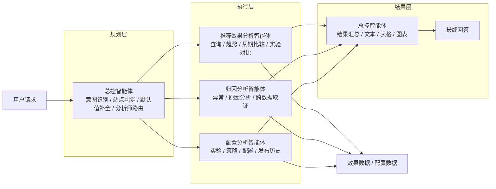
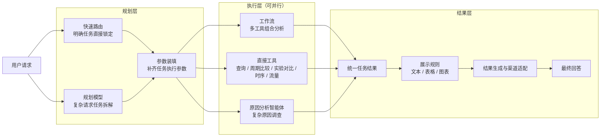

# 推荐效果分析智能体方案对比

## 0. 本周工作

| 工作 | 本周产出 |
| --- | --- |
| 对比导师方案与当前方案 | 梳理两套智能体架构、执行方式和职责边界 |
| 优化智能体编排链路 | 将任务锁定、参数装填、执行调度拆开，减少主智能体自主判断 |
| 完善分析工具 | 收敛指标查询、周期比较、实验对比、时序、流量等确定性分析能力 |
| 优化结果输出 | 将业务结果与文本、表格、图表展示拆开 |

本周主要是在导师方案和现有方案之间做对比，并在此基础上组合优化当前架构。

---

## 1. 智能体架构对比

两套方案都按 **规划层 → 执行层 → 结果层** 进行整理，便于直接比较各层职责。

### 1.1 导师方案

导师方案的核心是：**总控智能体负责规划和路由，三个专业分析智能体分别负责效果、归因和配置分析，最后再由总控智能体统一整理结果。**

### 1.2 当前方案

当前方案的核心是：**规划层先确定任务和参数，执行层将独立任务分发给工作流、直接工具或原因分析智能体并行执行，最后统一收敛结果并决定展示方式。**

### 1.3 架构差异

| 对比点 | 导师方案 | 当前方案 |
| --- | --- | --- |
| 规划层 | 一个总控智能体同时负责意图识别、参数补全和路由 | 快速路由与规划模型负责任务锁定，参数装填单独处理 |
| 执行层 | 效果、归因、配置三个专业分析智能体 | 工作流、直接工具、原因分析智能体三个执行单元 |
| 普通分析 | 查询、趋势、周期比较、实验对比由效果分析智能体完成 | 可确定性计算的能力优先由工具或工作流完成 |
| 原因分析 | 独立归因分析智能体 | 保留独立原因分析智能体 |
| 配置查询 | 独立配置分析智能体 | 下沉为确定性工具能力 |
| 并行执行 | 默认选择一个专业分析智能体，跨分析师场景才考虑并行 | 任务拆解后，无依赖任务可直接并行执行 |
| 结果层 | 总控智能体同时负责结果汇总和展示生成 | 先统一结果，再由展示规则决定文本、表格和图表 |

### 1.4 方案判断与本周优化

两套方案都不是完全照搬。当前方案主要是**保留导师方案中“复杂问题交给专业智能体”的设计，同时把可以确定性完成的能力进一步工具化和流程化。**

| 本周优化方向 | 调整内容 |
| --- | --- |
| 规划职责拆分 | 将总控智能体中的任务识别拆为快速路由和规划模型，并将参数装填独立出来 |
| 普通分析工具化 | 查询、周期比较、实验对比、时序、流量等能力尽量由确定性工具完成 |
| 保留专业智能体 | “为什么下降、异常原因、配置是否导致变化”等复杂调查继续交给原因分析智能体 |
| 执行支持并行 | 多个无依赖任务可以在执行层同时执行，不再依赖一个智能体串行调用 |
| 结果与展示拆分 | 执行结果先统一收敛，再决定文本、表格、图表和渠道格式 |

**当前组合后的方案更适合正式落地。** 导师方案的优势是结构简单、专业智能体分工直观；当前方案进一步减少了普通查询对大模型推理的依赖，并将规划、执行和展示的边界拆得更清楚，更容易控制、测试和扩展。