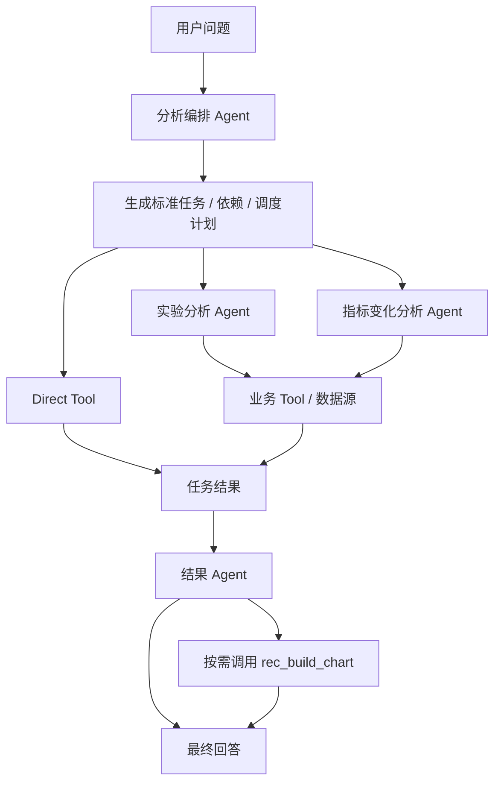
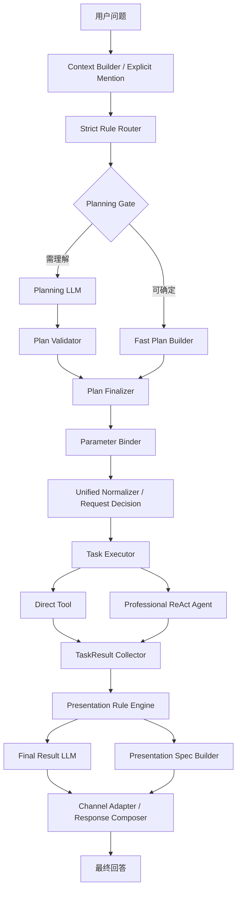

# 推荐效果分析 Agent 方案对比

## 0. 本周工作

| 工作 | 本周产出 |
| --- | --- |
| 对比 Mentor 与当前 Agent 方案 | 梳理两套多 Agent 架构、执行方式和职责边界 |
| 优化 Agent 编排链路 | 将 Router、Planning、Plan Validator、参数绑定、执行调度拆成独立阶段 |
| 完善分析 Tool | 继续收敛指标查询、周期比较、A/B、时序、流量等 Tool 的计算与输出规则 |
| 优化结果输出 | 将业务结果、表格/图表选择、渲染和渠道适配拆开 |

本周的重点不是重新设计一套完全不同的 Agent，而是**对比 Mentor 方案和现有方案后，将两者可取部分结合，再把执行确定性和职责边界进一步收敛**。

---

## 1. Agent 架构对比

### 1.1 Mentor 方案

Mentor 方案本身就是多 Agent：**分析编排 Agent 负责规划和调度，实验分析 Agent / 指标变化分析 Agent负责专业调查，结果 Agent 负责统一汇总和输出。**

### 1.2 当前方案

当前方案仍然保留多 Agent，但把**主链路编排从一个自治 Agent 拆成“确定性 Code + 必要 LLM”**：简单任务直接进入 Direct Tool，只有复杂原因调查才进入 Professional Agent。当前正式链路也明确将 TaskResult、Presentation Rule Engine、Final Result LLM 和 Spec Builder 分开。

### 1.3 架构差异

| 对比点 | Mentor 方案 | 当前方案 |
| --- | --- | --- |
| 编排核心 | 分析编排 Agent 负责理解、规划和调度 | Router + Planning LLM + Validator + Binder 分阶段完成 |
| 简单查询 | 统一进入任务规划和调度体系 | 可通过 Fast Path 直接形成任务并调用 Direct Tool |
| 复杂分析 | 实验分析 Agent、指标变化分析 Agent | 保留专业 Agent，只用于需要多步调查的问题 |
| 执行约束 | 依赖标准任务和 Agent Prompt 控制 | Plan、参数、依赖、运行时绑定均有确定性校验 |
| 结果处理 | 独立结果 Agent 汇总结果、决定图表和回答 | TaskResult 后拆成 Presentation Rule、Final Result LLM、Spec Builder |
| 特点 | 结构清楚、Agent 分工直观 | 链路更复杂，但执行边界更明确、可复现性更高 |

### 1.4 判断与本周优化

**不建议直接照搬其中任意一套，当前方案本质上是在 Mentor 多 Agent 思路上做了一次收敛和组合优化。**

Mentor 方案的优势是 Agent 分工清楚，尤其是“编排 Agent + 专业 Agent + 结果 Agent”的分层很适合复杂分析；问题是编排 Agent 和结果 Agent 承担的职责仍然比较多，很多本可以确定性完成的工作仍交给 Agent 判断。

当前方案保留了 Mentor 的两个核心设计：**复杂问题交给专业 Agent、执行结果统一收敛后再输出**；同时主要做了三点优化：

1. **编排确定性化**：Router、Validator、Binder、Normalizer 用 Code 约束，Planning LLM 只处理无法确定的任务语义。
2. **简单请求短路**：明确查询、周期比较、A/B、时序等任务可以直接走 Direct Tool，不必全部经过专业 Agent。
3. **结果与展示解耦**：业务结果统一为 TaskResult，文字、表格、图表和渠道格式在后续展示层决定。

因此，如果目标是当前推荐效果分析项目的正式落地，**当前组合后的方案更合适**：不是因为 Agent 更多，而是因为保留了多 Agent 的专业分工，同时减少了不必要的 Agent 自主决策。