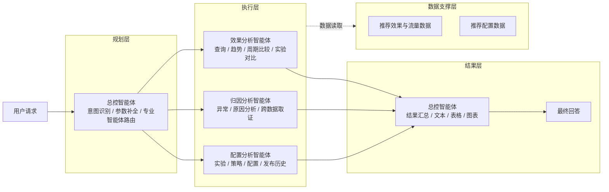
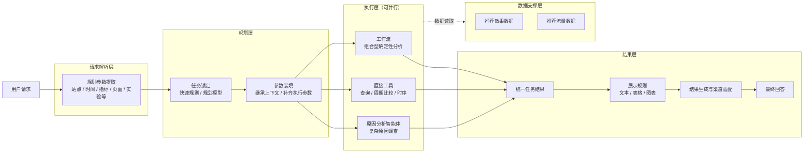

# 推荐效果分析智能体方案对比

## 0. 本周工作

| 工作 | 本周产出 |
| --- | --- |
| 重整分析工具设计 | 重新梳理指标查询、周期比较、实验对比、时序分析等工具的职责边界、输入输出和执行规则 |
| 完善指标计算口径 | 重新整理多日聚合、派生指标、排序与 TopN、统计检验等计算逻辑，保证结果口径准确且可解释 |
| 收敛智能体设计原则 | 对比导师方案后，明确“默认执行、关键歧义才问，同时不得替用户改变业务语义”的交互原则 |
| 对比导师方案与当前方案 | 梳理两套智能体架构、运行方式和职责边界，为后续逐节点优化提供依据 |

本周重点是**重新整理工具能力与计算规则，并结合导师方案重新收敛智能体的设计原则**。架构本身没有做大的调整，后续将在现有架构上按新的原则逐节点优化。

---

## 1. 设计原则

本次对比后，整体原则不再是“为了准确，缺参数就追问”，也不是“为了尽量回答，可以替用户猜”。更合适的方向是：

> **主动理解用户的分析目标，默认执行；只有缺失信息会改变业务语义、比较口径或数据范围时才追问，同时不得为了给出答案而替用户改变问题。**

### 1.1 从“执行一次查询”转向“理解用户目标”

导师方案最值得借鉴的是**目标驱动**。用户说“Q2 购物车页推荐效果怎么样”，真正想得到的是一份效果判断，而不是指定系统执行某一个查询工具。

因此需要区分两类问题：

| 用户表达 | 应理解为 |
| --- | --- |
| “Q2 购物车页 CTR 是多少？” | 明确指标查询 |
| “Q2 购物车页推荐效果怎么样？” | 综合效果分析目标 |

对于“效果怎么样”这类宽泛问题，系统应主动组织整体水平、相对基准和期间变化等分析，而不是因为用户没有逐项指定指标、比较方式和展示形式就不断追问。

### 1.2 默认执行，关键歧义才追问

缺失信息按是否会改变用户问题本身分三类处理：

| 情况 | 处理方式 |
| --- | --- |
| 不影响业务语义的缺省项 | 使用系统默认值 |
| 可以唯一确定的信息 | 通过规则或上下文直接推导 |
| 会改变查询对象、比较基准或实验角色的信息 | 追问用户 |

例如，指标未指定可以使用默认核心指标，TopN 未指定可以使用默认值；“Q2”可以确定性映射到具体日期，“那 EC20 呢”可以继承上一轮其他条件并只替换站点。相反，站点无法唯一确定、A/B 对照与实验角色不明确、“相比之前”无法确定比较周期时，则必须追问。

### 1.3 主动性可以增强，但不能替用户改变问题

导师方案的优势是主动性强，但有些兜底行为不能直接照搬。例如原本计划比较 Q2 与 Q1，如果 Q1 无数据，不能自动改成“Q2 前半段与后半段比较”，因为这已经改变了用户的比较基准。

同样需要坚持：

- 没有基准数据，不自动替换比较基准；
- 没有贡献证据，不强行给出原因；
- 没有显著性证据，不表述为统计显著；
- A/B 角色、站点、无法唯一映射的对象，不为了顺滑体验而猜测。

因此可以概括为：**导师方案的主动性可以学，但语义替换不能学。**

### 1.4 底层严格，上层易用

这次原则调整主要作用于上层任务理解和交互，不需要推翻现有底层工具与计算体系。底层计算继续由工具、规则和校验逻辑保证口径准确，上层则尽量减少用户补参数的负担，并通过规划模型和原因分析智能体覆盖复杂语义与长尾问题。

最终设计定位可以概括为：

> **导师方案的易用性 + 当前方案的确定性边界。**

既不是“什么都问用户”，也不是“为了给答案什么都替用户决定”。后续真正需要逐步调整的是任务语义与规划逻辑，让“效果怎么样”这类问题从单次指标查询升级为默认综合分析目标，而底层工具、计算口径和校验边界继续保持严格。

---

## 2. 智能体架构对比

为便于直接比较，两套方案统一按照 **请求处理 / 规划 / 执行 / 结果 / 数据支撑** 的职责进行整理，只展示核心模块，不展开内部节点。

### 2.1 导师方案

导师方案的核心是：**总控智能体统一负责规划和路由，再将任务交给效果、归因、配置三个专业智能体执行，结果回到总控智能体统一组织输出。**

### 2.2 当前方案

当前方案的核心是：**先通过规则提取用户请求中的显式参数，再在规划层完成任务锁定和参数装填；执行层根据任务类型，将任务并行分发给工作流、直接工具或原因分析智能体；最终统一收敛结果并决定展示方式。**

> 执行层中的工作流、直接工具和原因分析智能体是同一级执行单元，可根据任务依赖关系并行运行。实验对比能力后续从工作流进一步收敛为独立工具。

### 2.3 架构差异

| 对比点 | 导师方案 | 当前方案 |
| --- | --- | --- |
| 请求处理 | 主要由总控智能体直接理解用户请求 | 先通过规则提取站点、时间、指标、页面、实验等显式参数 |
| 规划层 | 一个总控智能体同时完成意图识别、参数补全和专业智能体路由 | 任务锁定与参数装填拆开；明确任务走快速规则，复杂任务再进入规划模型 |
| 执行层 | 效果、归因、配置三个专业分析智能体 | 工作流、直接工具、原因分析智能体三个执行单元 |
| 普通分析 | 查询、趋势、周期比较、实验对比主要由效果分析智能体完成 | 查询、周期比较、时序等确定性能力优先由直接工具完成；组合分析由工作流承载 |
| 实验对比 | 由效果分析智能体完成 | 当前由工作流承载，后续收敛为独立工具 |
| 原因分析 | 独立归因分析智能体 | 保留独立原因分析智能体，只负责复杂调查 |
| 配置能力 | 独立配置分析智能体 | 当前架构暂不包含配置查询与配置数据能力 |
| 并行执行 | 默认选择一个专业分析智能体，跨分析师场景才考虑并行 | 规划后多个无依赖任务可直接并行执行 |
| 结果层 | 总控智能体同时负责结果汇总和展示生成 | 先统一收敛任务结果，再由展示规则决定文本、表格和图表 |
| 数据支撑 | 效果与流量数据、推荐配置数据支撑专业智能体 | 当前由推荐效果数据和推荐流量数据支撑执行层 |

**我的意见：从当前业务需求看，当前方案更合适。**

导师方案的优势是**通用性更强**：大量任务交给大模型和专业智能体自主理解、选工具和分析，因此面对未预先定义的问题时适应能力更好。但这种方式也意味着更多步骤依赖大模型推理，简单查询和固定分析同样需要经过智能体链路，执行速度较慢，任务判断、参数生成和工具调用也更容易受到模型波动影响。

推荐效果分析本身是一个**边界相对明确的垂直业务场景**。核心问题集中在指标查询、周期比较、实验分析、时序分析和原因调查等固定类型，业务侧更关注的是**结果快、口径准、执行稳定**，而不是让大模型自由完成所有分析。因此当前方案优先把高频、确定性的能力沉淀为规则、工具和工作流，让大部分请求走短链路确定性执行；只有复杂语义和无法通过固定能力覆盖的问题，再交给规划模型或原因分析智能体处理。

整体思路可以概括为：**垂直能力优先保证速度和准确性，大模型负责复杂场景和长尾问题兜底。** 这样既保留了垂直分析的稳定性，也没有完全牺牲对未知问题的通用处理能力。