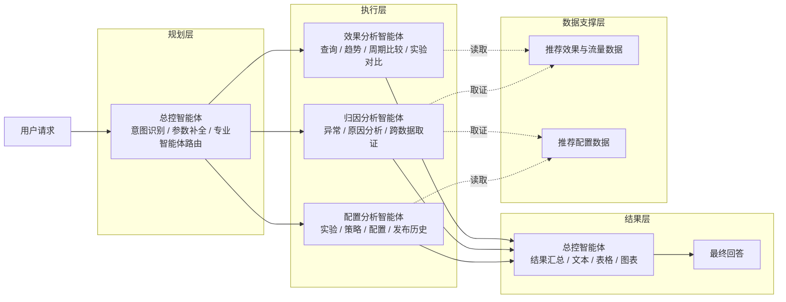
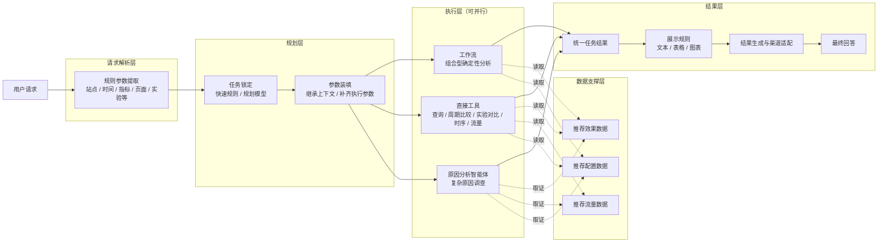

# 推荐效果分析智能体方案对比

## 0. 本周工作

| 工作 | 本周产出 |
| --- | --- |
| 对比导师方案与当前方案 | 梳理两套智能体架构、执行方式和职责边界 |
| 优化智能体编排链路 | 将规则参数提取、任务锁定、参数装填和执行调度拆开，减少大模型自主判断 |
| 完善分析工具 | 收敛指标查询、周期比较、实验对比、时序、流量等确定性分析能力 |
| 优化结果输出 | 将业务结果与文本、表格、图表展示拆开 |

本周主要是在导师方案和现有方案之间做对比，并在此基础上组合优化当前架构。

---

## 1. 智能体架构对比

为便于直接比较，两套方案统一按照 **请求处理 / 规划 / 执行 / 结果 / 数据支撑** 的职责进行整理，只展示核心模块，不展开内部节点。

### 1.1 导师方案

导师方案的核心是：**总控智能体统一负责规划和路由，再将任务交给效果、归因、配置三个专业智能体执行，结果回到总控智能体统一组织输出。**

### 1.2 当前方案

当前方案的核心是：**先通过规则提取用户请求中的显式参数，再在规划层完成任务锁定和参数装填；执行层根据任务类型，将任务并行分发给工作流、直接工具或原因分析智能体；最终统一收敛结果并决定展示方式。**

> 执行层中的工作流、直接工具和原因分析智能体是同一级执行单元，可根据任务依赖关系并行运行。实验对比能力后续从工作流进一步收敛为独立工具。

### 1.3 架构差异

| 对比点 | 导师方案 | 当前方案 |
| --- | --- | --- |
| 请求处理 | 主要由总控智能体直接理解用户请求 | 先通过规则提取站点、时间、指标、页面、实验等显式参数 |
| 规划层 | 一个总控智能体同时完成意图识别、参数补全和专业智能体路由 | 任务锁定与参数装填拆开；明确任务走快速规则，复杂任务再进入规划模型 |
| 执行层 | 效果、归因、配置三个专业智能体 | 工作流、直接工具、原因分析智能体三个执行单元 |
| 普通分析 | 查询、趋势、周期比较、实验对比主要由效果分析智能体完成 | 可确定性计算的能力优先下沉到工具或工作流 |
| 原因分析 | 独立归因分析智能体 | 保留独立原因分析智能体，只负责复杂调查 |
| 配置能力 | 独立配置分析智能体 | 配置查询下沉为确定性工具；复杂原因调查按需读取配置数据 |
| 并行执行 | 默认选择一个专业分析智能体，跨分析师场景才考虑并行 | 规划后多个无依赖任务可直接并行执行 |
| 结果层 | 总控智能体同时负责结果汇总和展示生成 | 先统一收敛任务结果，再由展示规则决定文本、表格和图表 |
| 数据支撑 | 效果与流量数据、推荐配置数据支撑专业智能体 | 效果、流量、配置数据统一作为执行层的数据支撑 |

### 1.4 方案判断与本周优化

两套方案的核心思路并不冲突。当前方案主要是**保留导师方案中“复杂问题交给专业智能体”的设计，同时将普通查询、确定性计算和固定规则从智能体中拆出。**

| 本周优化方向 | 调整内容 |
| --- | --- |
| 增加规则参数提取 | 在进入规划前先确定性提取站点、时间、指标、页面、实验等显式信息，减少后续大模型重复识别 |
| 规划职责拆分 | 将总控智能体中的任务识别拆为任务锁定和参数装填，仅复杂语义进入规划模型 |
| 普通分析工具化 | 查询、周期比较、实验对比、时序、流量等能力尽量由确定性工具完成 |
| 保留专业智能体 | “为什么下降、异常原因、配置是否导致变化”等复杂调查继续交给原因分析智能体 |
| 执行支持并行 | 多个无依赖任务可以在执行层同时执行，不再依赖一个智能体串行调用 |
| 结果与展示拆分 | 执行结果先统一收敛，再决定文本、表格、图表和渠道格式 |

**当前组合后的方案更适合正式落地。** 导师方案的优势是结构简单、专业智能体分工直观；当前方案则进一步把规则判断和确定性分析从大模型中拆出，同时保留复杂调查需要的智能体推理，使整体链路更容易控制、测试和扩展。