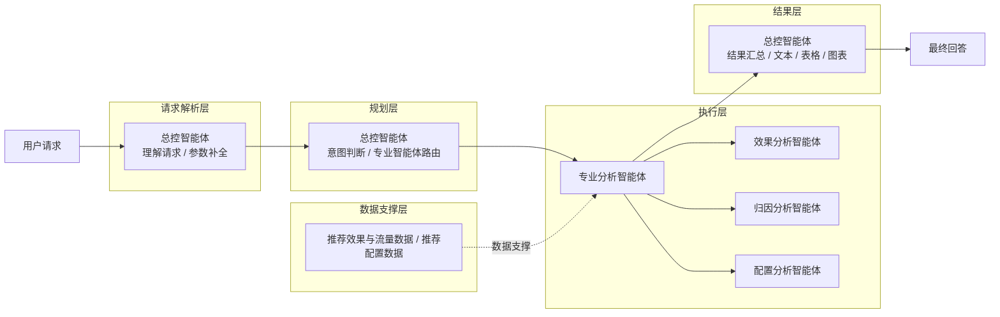
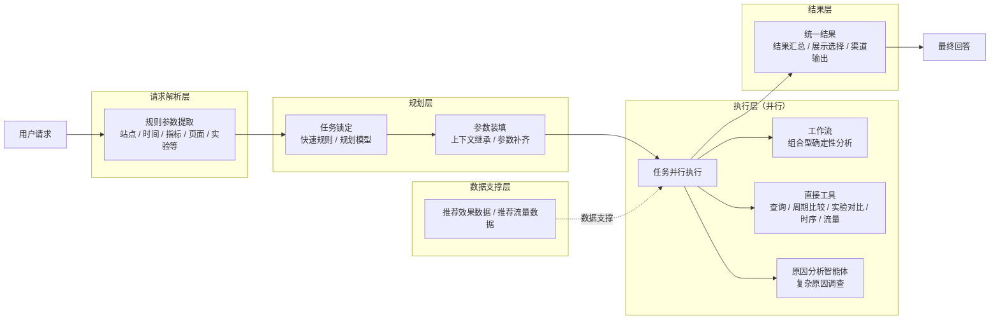

# 推荐效果分析智能体方案对比

## 0. 本周工作

| 工作 | 本周产出 |
| --- | --- |
| 对比导师方案与当前方案 | 梳理两套智能体架构、执行方式和职责边界 |
| 优化智能体编排链路 | 将规则参数提取、任务锁定、参数装填和执行调度拆开，减少大模型自主判断 |
| 完善分析工具 | 收敛指标查询、周期比较、实验对比、时序、流量等确定性分析能力 |
| 优化结果输出 | 将业务结果与文本、表格、图表展示拆开 |

本周主要是在导师方案和现有方案之间做对比，并在此基础上继续完善当前方案。

---

## 1. 智能体架构对比

为便于直接比较，两套方案统一按照 **请求解析层 → 规划层 → 执行层 → 结果层** 展示，数据来源作为执行层的统一支撑，不展开内部节点和具体调用细节。

### 1.1 导师方案

导师方案的核心是：**由总控智能体承担请求理解、参数补全和任务路由，再将任务交给不同专业分析智能体完成，最后仍由总控智能体统一组织结果。**

### 1.2 当前方案

当前方案的核心是：**先通过规则提取明确参数，再由快速规则或规划模型锁定任务并完成参数装填；执行阶段将无依赖任务并行分发给工作流、直接工具或原因分析智能体，最后统一收敛结果。**

> 实验对比能力后续从工作流进一步收敛为独立工具。

### 1.3 架构差异与方案判断

| 对比点 | 导师方案 | 当前方案 |
| --- | --- | --- |
| 请求解析 | 主要依赖总控智能体理解和补全 | 明确信息优先通过规则提取 |
| 任务规划 | 总控智能体同时完成意图判断、参数补全和路由 | 任务锁定与参数装填拆开，明确任务优先走快速规则，复杂语义再由规划模型处理 |
| 执行方式 | 主要路由到不同专业分析智能体 | 工作流、直接工具、原因分析智能体并行执行 |
| 普通查询分析 | 主要依赖效果分析智能体调用工具并完成分析 | 查询、周期比较、实验对比、时序等确定性能力直接工具化 |
| 原因分析 | 由归因分析智能体完成 | 保留原因分析智能体作为复杂问题兜底 |
| 通用性 | 较强，新的分析问题可以更多依赖大模型自主理解和调用能力 | 垂直能力边界更明确，超出固定能力后再由大模型兜底 |
| 执行速度 | 多数任务需要经过大模型理解和专业智能体执行，链路相对较长 | 明确任务可直接进入确定性执行链路，整体更快 |
| 稳定性 | 任务判断、参数理解、工具调用较多依赖大模型，结果容易受模型推理影响 | 规则、工具和工作流承担主要确定性逻辑，执行结果更稳定、可测试 |
| 扩展成本 | 新场景可通过提示词和智能体能力较快接入 | 高频垂直能力通常需要先沉淀规则、工具或工作流 |

**从当前业务需求看，当前方案更合适。**

导师方案的优势是**通用性更强**：大量任务交给大模型和专业智能体自主理解、选工具和分析，因此面对未预先定义的问题时适应能力更好。但这种方式也意味着更多步骤依赖大模型推理，简单查询和固定分析同样需要经过智能体链路，执行速度较慢，任务判断、参数生成和工具调用也更容易受到模型波动影响。

推荐效果分析本身是一个**边界相对明确的垂直业务场景**。核心问题集中在指标查询、周期比较、实验分析、时序分析和原因调查等固定类型，业务侧更关注的是**结果快、口径准、执行稳定**，而不是让大模型自由完成所有分析。因此当前方案优先把高频、确定性的能力沉淀为规则、工具和工作流，让大部分请求走短链路确定性执行；只有复杂语义和无法通过固定能力覆盖的问题，再交给规划模型或原因分析智能体处理。

整体思路可以概括为：**垂直能力优先保证速度和准确性，大模型负责复杂场景和长尾问题兜底。** 这样既保留了垂直分析的稳定性，也没有完全牺牲对未知问题的通用处理能力。