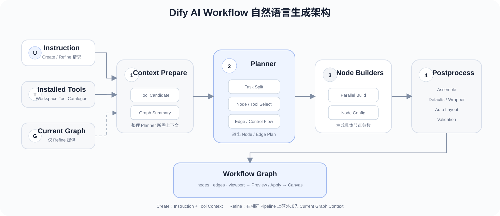
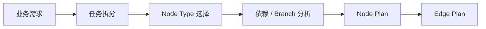
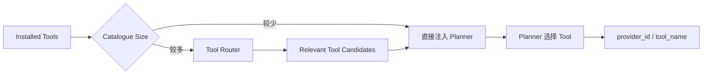
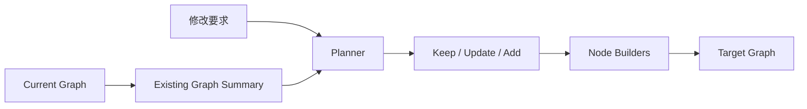
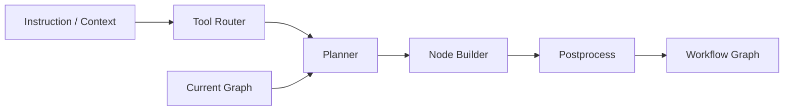
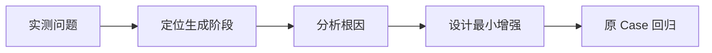

# Dify 1.17 AI Workflow 自然语言生成调研

## 1. 调研介绍

### 1.1 调研背景

传统 Dify Workflow 需要人工完成需求拆分、节点选择、参数配置和连线。AI Workflow 将这部分工作前移到自然语言输入：用户描述目标后，由 Dify 自动生成 Workflow，并在已有 Workflow 上继续修改。


本次只研究 **Dify 1.17 AI Workflow 的自然语言生成能力**，重点分析其使用方式、内部实现、能力边界和增强空间。

### 1.2 调研目标

1. **使用分析**：自然语言生成 Workflow 怎么使用，适合解决什么问题。
2. **实现分析**：Dify 如何把自然语言转换为 Node、Edge 和节点配置。
3. **增强分析**：通过真实 Case 找到生成质量的边界，并确定需要增强的位置。

### 1.3 调研方法

| 方法 | 目标 |
| --- | --- |
| 产品使用 | 梳理 Create / Refine 的实际使用流程 |
| 源码分析 | 分析 Tool Router、Planner、Node Builder、Postprocess |
| Case 实测 | 从简单 Workflow 到真实推荐分析 Workflow |
| 问题归因 | 将问题定位到生成链路中的具体阶段 |
| 增强设计 | 基于问题设计对应改造方案 |

---

## 2. 功能与使用

### 2.1 功能定位

AI Workflow 解决的是 **从业务需求到 Workflow Graph 的构建成本**。

| | 传统 Workflow | AI Workflow |
| --- | --- | --- |
| 需求拆分 | 人工 | AI |
| Node 选择 | 人工 | AI |
| Tool 选择 | 人工 | AI |
| 参数配置 | 人工 | AI 生成 |
| Node 连线 | 人工 | AI 生成 |
| 最终确认 | 人工 | 人工 |

核心能力包括：

| 能力 | 作用 |
| --- | --- |
| `/create` | 根据自然语言从零生成 Workflow |
| `/refine` | 根据自然语言修改已有 Workflow |
| Installed Tool Context | 生成时结合 Workspace 已安装 Tool |
| Current Graph Context | Refine 时结合当前 Workflow |
| Preview / Apply | 生成结果先预览，再写入 Canvas |

### 2.2 创建 Workflow


测试使用真实推荐分析需求：

> 输入站点、店铺和时间范围，查询推荐效果指标；如果发现异常，再查询流量、实验和配置相关信息，最后汇总异常原因。

重点观察生成结果中的：

- Node 类型；
- Node 数量；
- Edge / Branch；
- Tool；
- 输入输出变量；
- Tool 参数；
- LLM Prompt。

### 2.3 修改 Workflow


典型修改：

| 修改类型 | 示例 |
| --- | --- |
| Add | 增加异常判断节点 |
| Update | 修改 Tool 参数或 Prompt |
| Structure | 将串行查询改为并行 |
| Branch | 增加异常处理分支 |
| Remove | 删除不再需要的节点 |

---

## 3. 实现原理

### 3.1 整体架构



Dify 1.17.1 的 Workflow Generator 采用 **Tool Router → Planner → Node Builders → Postprocess** 的生成链路。


不是一次 LLM 调用直接生成完整 DSL，而是先生成 Workflow 结构，再生成节点配置，最后由确定性代码完成 Graph 组装和校验。

### 3.2 Prompt 与需求理解

Planner 接收到的核心信息包括：

```text
User Instruction
+
Workflow Mode
+
Available Node Types
+
Node Selection Rules
+
Installed Tool Catalogue
+
Current Graph（Refine）
+
Output Schema
```

Planner Prompt 主要解决两个问题：

1. 让模型理解 **Dify 有哪些 Node，以及每种 Node 应该在什么场景使用**。
2. 约束模型输出固定的 **Node / Edge JSON Plan**。

其中明确包含：

| Prompt 信息 | 作用 |
| --- | --- |
| Available Node Types | 定义可生成的 Dify Node |
| Control Flow Rules | 指导 If-Else、Iteration、Loop 等结构 |
| Installed-Tool-First | 有匹配 Tool 时优先使用 Tool Node |
| Start Input Rules | 定义 Workflow 输入变量 |
| Graph Rules | 约束 ID、Edge、Branch、终止节点 |
| Output Schema | 固定 Planner JSON 输出格式 |

### 3.3 Workflow Planning

Planner 负责把自然语言转换为高层 Workflow 结构。



Planner 主要决定：

- 需要哪些 Node；
- 每个 Node 的类型；
- Node 之间如何连接；
- 是否需要 Branch / Iteration / Loop；
- Workflow 输入变量；
- Tool Node 使用哪个 Tool。

Node 选择规则：

| 需求 | Node |
| --- | --- |
| 推理 / 文本生成 | LLM |
| 已安装外部能力 | Tool |
| 未被 Tool 覆盖的 API | HTTP Request |
| 确定性数据处理 | Code |
| 确定性条件判断 | If-Else |
| 语义分类 | Question Classifier |
| 列表逐项处理 | Iteration |
| 循环直到满足条件 | Loop |
| 知识库查询 | Knowledge Retrieval |

Planner 只生成结构计划，不负责生成所有节点的完整配置。

### 3.4 Tool 选择机制

Tool 选择建立在 Workspace 已安装 Tool Catalogue 上。



核心逻辑：

1. 读取 Workspace 已安装并可用的 Tool；
2. Tool 数量较少时直接提供给 Planner；
3. Tool 数量较大时，Tool Router 先根据能力需求筛选候选 Tool；
4. Planner 根据语义匹配选择具体 Tool；
5. 输出实际 `provider_id` 和 `tool_name`。

因此 Tool 不是只靠名字生成，而是先把真实 Workspace Tool 能力作为 Context 提供给模型。

### 3.5 Node 配置生成

Planner 确定结构后，Node Builder 为每个节点生成完整配置。


多个 Node Builder 使用有界并行执行。

| Node | 主要生成内容 |
| --- | --- |
| Start | 输入变量、变量类型、文件配置 |
| LLM | Model、Prompt、Context |
| Tool | Provider、Tool、Tool Parameters |
| If-Else | Conditions / Branch |
| Knowledge Retrieval | Dataset、Query、Retrieval 配置 |
| Code | Code、Input、Output Schema |
| End / Answer | 输出变量 |

Planner 负责回答“**需要什么节点**”，Node Builder 负责回答“**节点具体怎么配置**”。

### 3.6 Refine 实现

`/refine` 仍然复用同一套 Generator Pipeline，但会额外提供当前 Workflow Graph。



Planner 能看到已有 Workflow 的：

- Node ID；
- Node Type；
- Node Title；
- Edge Source / Target；
- Branch `sourceHandle`。

对目标 Graph 中的 Node 使用三类 Action：

| Action | 处理 |
| --- | --- |
| `keep` | 保留已有 Node Config |
| `update` | 将已有配置交给 Builder 后重新生成 |
| `add` | 创建新 Node |
| Remove | 不再出现在目标 Plan 中 |

Edge 可以直接重新规划，因此只调整连线时，不一定需要重建 Node。

### 3.7 Graph 生成与校验

Node Builder 完成后，由 Postprocess 将结果转换为最终 Workflow Graph。

| 阶段 | 作用 |
| --- | --- |
| Defaults | 为缺失配置补安全默认值 |
| Assemble | 合并 Node Config 与 Edge Plan |
| Wrapper | 补齐 Dify Node 外层结构 |
| Layout | 自动计算 Canvas 位置 |
| Edge Process | 处理 Edge ID 和连接关系 |
| Validate | 做最终结构检查 |
| Output | 输出 nodes、edges、viewport |

LLM 与确定性代码的职责边界：

| LLM | 确定性代码 |
| --- | --- |
| 理解自然语言需求 | JSON / Schema 检查 |
| Workflow Planning | Graph Assemble |
| Node / Tool 选择 | Node Wrapper |
| Node 参数语义生成 | 默认值补全 |
| Refine 修改判断 | Edge 处理 |
| Prompt 生成 | Auto Layout / Validation |

核心思路可以概括为：

```text
LLM：决定 Workflow 应该怎么设计
            ↓
确定性代码：把设计转换为合法的 Dify Graph
```

### 3.8 核心源码

| 模块 | 路径 |
| --- | --- |
| Generator Runner | `api/core/workflow/generator/runner.py` |
| Planner Prompt | `api/core/workflow/generator/prompts/planner_prompts.py` |
| Node Builder Prompt | `api/core/workflow/generator/prompts/node_builder_prompts.py` |
| Node Config Reference | `api/core/workflow/generator/prompts/builder_prompts.py` |
| Tool Router Prompt | `api/core/workflow/generator/prompts/tool_router_prompts.py` |
| Tool Catalogue | `api/core/workflow/generator/tool_catalogue.py` |
| Generator Service | `api/services/workflow_generator_service.py` |

---

## 4. 能力实测

### 4.1 测试设计

测试从简单结构逐步增加复杂度。

| Case | 场景 | 主要验证能力 |
| --- | --- | --- |
| Case 1 | 简单线性 Workflow | 基础 Node / Edge |
| Case 2 | 条件分支 Workflow | Branch / Condition |
| Case 3 | 多 Tool Workflow | Tool 选择与参数 |
| Case 4 | Loop / Iteration Workflow | 复杂控制流 |
| Case 5 | 已有复杂 Workflow Refine | 修改范围与原逻辑保持 |
| Case 6 | 推荐分析真实 Workflow | 综合生成能力 |

Case 6 不直接告诉 AI 固定架构，而是只描述业务目标，观察 AI 是否能够自主生成合理 Workflow。

### 4.2 评价指标

| 维度 | 判断内容 |
| --- | --- |
| 需求理解 | 是否正确理解业务目标 |
| Planning | Workflow 结构是否合理 |
| Node | Node 类型和数量是否正确 |
| Edge | 连线、Branch、Loop 是否正确 |
| Tool | 是否选择正确 Tool |
| Parameter | 变量和 Tool 参数是否完整 |
| Prompt | LLM Prompt 是否符合目标 |
| Executable | Apply 后是否能直接运行 |
| Refine | 是否只修改目标范围 |
| 人工修改量 | 生成后需要人工修改多少 |

### 4.3 测试记录

| Case | 结果 | 主要问题 | 人工修改 |
| --- | --- | --- | --- |
| Case 1 |  |  |  |
| Case 2 |  |  |  |
| Case 3 |  |  |  |
| Case 4 |  |  |  |
| Case 5 |  |  |  |
| Case 6 |  |  |  |

---

## 5. 能力边界与问题分析

测试发现的问题按照生成 Pipeline 定位。



问题记录统一使用：

| 问题 | Case | 发生阶段 | 实际表现 | 根因 | 影响 |
| --- | --- | --- | --- | --- | --- |
|  |  | Prompt / Router / Planner / Builder / Postprocess / Refine |  |  |  |

重点关注：

- 复杂 Workflow Planning 是否稳定；
- Tool 是否能正确选择；
- Tool / Node 参数是否完整；
- 复杂控制流是否正确；
- Refine 是否只修改目标范围；
- 结构合法但业务逻辑错误的情况。

---

## 6. 增强方案

增强方案只针对第 5 章确认的问题设计，不重新实现一套 Workflow Generator。

### 6.1 增强原则

| 问题类型 | 处理方式 |
| --- | --- |
| Prompt / Context 不足 | 增强输入 Context 或 Prompt |
| Tool 选择问题 | 增强 Tool Catalogue / Router |
| Planning 问题 | 修改 Planner |
| Node 参数问题 | 修改对应 Node Builder |
| Graph 结构问题 | 修改 Postprocess / Validation |
| 原生能力已满足 | 直接使用，不改 |

### 6.2 问题与方案映射



| 原生问题 | 根因 | 增强位置 | 增强方案 | 优先级 | 验证结果 |
| --- | --- | --- | --- | --- | --- |
|  |  |  |  |  |  |

### 6.3 最终输出

调研最终需要回答三个问题：

1. **原生 AI Workflow 能稳定生成到什么复杂度。**
2. **真实推荐分析 Workflow 中主要失败点位于哪里。**
3. **哪些直接使用 Dify 原生能力，哪些需要对 Generator 做二次增强。**
