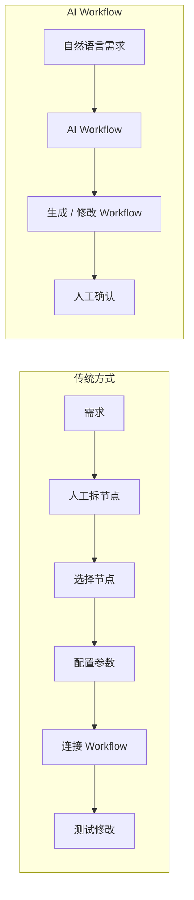
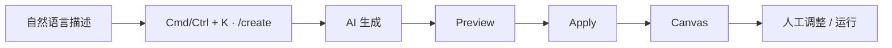
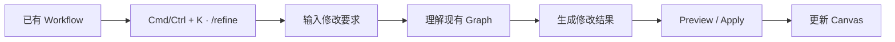
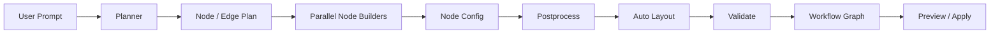
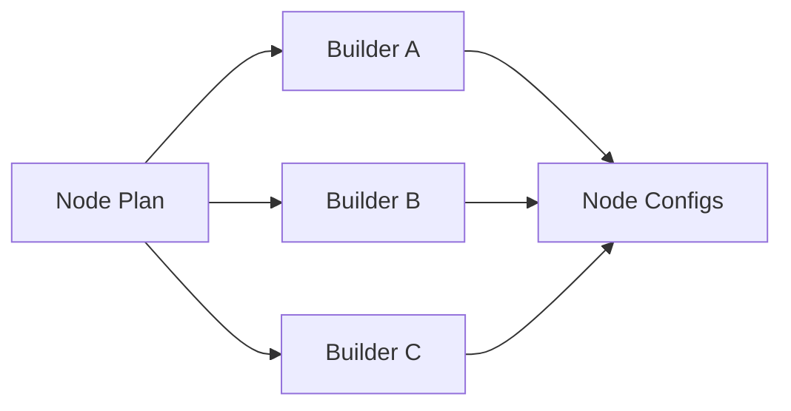
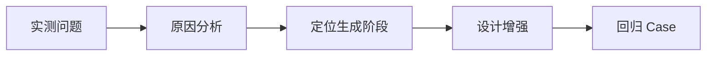
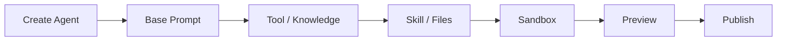
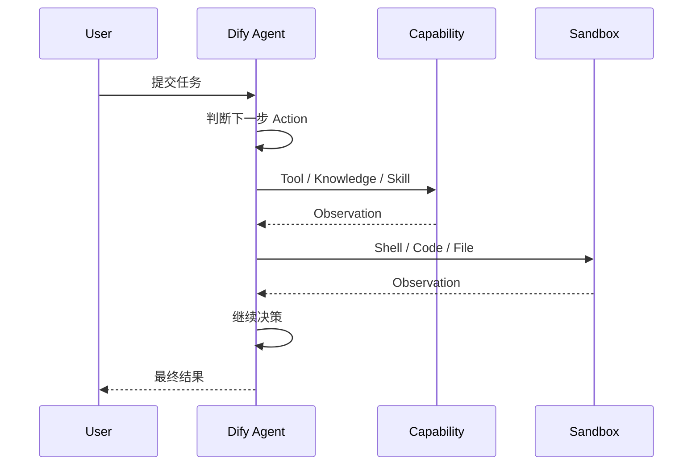
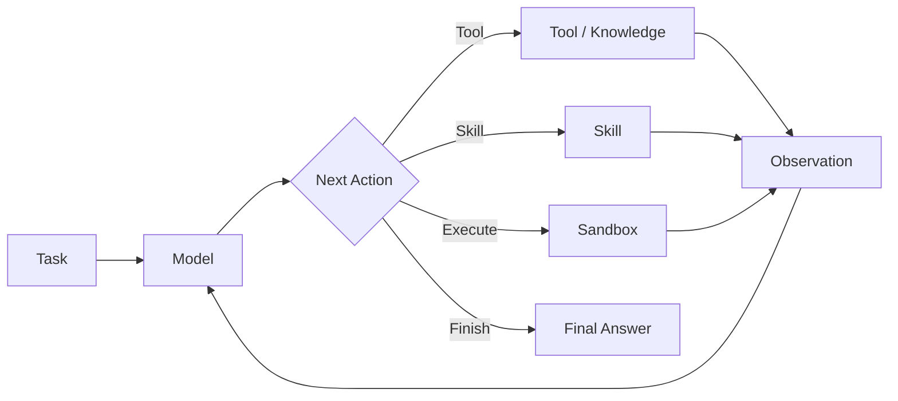
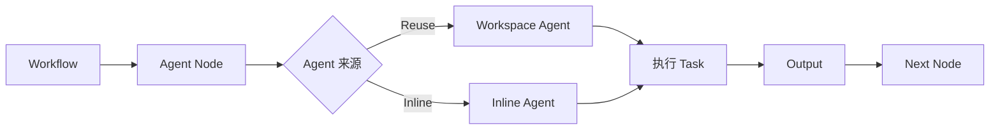

# Dify 1.17 核心能力调研

## 1. 调研介绍

### 1.1 调研背景

Dify 1.16 开始提供 AI Workflow 与新版 Dify Agent，两项能力分别改变 Workflow 的开发方式与复杂任务的执行方式。

| 能力 | 原有方式 | 新能力 | 目标 |
| --- | --- | --- | --- |
| AI Workflow | 人工选择节点、配置参数、连接流程 | 自然语言创建 / 修改 Workflow | 降低 Workflow 构建成本 |
| Dify Agent | 在 Workflow 中配置 Agent Node | 独立 Agent 应用自主执行任务 | 提高复杂任务自主执行能力 |

### 1.2 调研目标

| 目标 | 内容 |
| --- | --- |
| 使用分析 | 功能是什么、怎么使用、适合解决什么问题 |
| 实现分析 | 核心架构、执行流程与关键实现机制 |
| 增强分析 | 实测能力边界与不足，并设计增强方案 |

### 1.3 调研范围

| 功能 | 核心问题 |
| --- | --- |
| AI Workflow | AI 如何根据自然语言创建、理解和修改 Dify Workflow |
| Dify Agent | Agent 如何自主规划、调用能力并完成复杂任务 |

---

## 2. 整体能力架构

| 能力 | 所处阶段 | 输入 | 核心处理 | 输出 |
| --- | --- | --- | --- | --- |
| AI Workflow | Workflow 开发 | 自然语言需求 / 修改要求 | Planning + Graph Generation | Workflow Graph |
| Dify Agent | 任务运行 | 用户任务 | Agent Loop + Tool / Skill / Sandbox | 任务结果 |

AI Workflow 负责**生成和修改执行流程**，Dify Agent 负责**在运行阶段自主完成任务**。Agent 可作为 Workflow 节点使用，因此两项能力可以组合：AI Workflow 负责构建流程，Dify Agent 作为其中的自主执行单元。

---

## 3. AI Workflow 调研

### 3.1 功能介绍

AI Workflow 将自然语言转换为 Dify Workflow，并支持继续修改已有 Workflow。

#### 3.1.1 构建方式变化

#### 3.1.2 核心能力

| 能力 | 作用 |
| --- | --- |
| /create | 根据自然语言从零生成 Workflow |
| /refine | 根据修改要求调整已有 Workflow |
| Tool-aware Generation | 生成时优先使用 Workspace 已安装并配置的 Tool |
| Context Suggestions | 根据 Workspace 上下文生成 Workflow 建议 |
| Parallel Node Generation | 并行生成节点配置，提高生成速度 |

### 3.2 使用方式

#### 3.2.1 创建 Workflow

示例：

> 创建一个推荐异常分析 Workflow，输入店铺、站点和时间范围，查询推荐效果指标；发现异常后继续查询流量和策略信息，最后由 LLM 汇总异常原因。

生成结果重点包括节点、连线、Tool、参数和 Prompt。

#### 3.2.2 修改 Workflow

| 修改类型 | 示例 |
| --- | --- |
| 增加节点 | 增加参数完整性检查 |
| 增加分支 | Tool 查询失败进入错误处理 |
| 调整结构 | 两个查询改为并行执行 |
| 修改配置 | 调整 LLM Prompt 或 Tool 参数 |

### 3.3 实现原理

#### 3.3.1 整体架构

Dify 1.17.1 Workflow Generator 将生成过程拆为 **规划、节点构建、后处理** 三段。

#### 3.3.2 Planner

Planner 先生成 Workflow 的结构计划，不直接生成完整节点配置。

| 输入 | 处理 | 输出 |
| --- | --- | --- |
| 用户需求 | 判断任务步骤与节点类型 | Nodes / Edges Plan |
| 可用节点能力 | 将任务步骤映射到 Dify Node | Node Type |
| Workspace Tool | 优先匹配已安装 Tool | Tool Provider / Tool Name |

Planner Prompt 内包含节点选择规则。例如列表逐项处理映射为 Iteration，持续执行直到条件满足映射为 Loop；当已安装 Tool 能完成某一步时优先选择 Tool Node。

#### 3.3.3 Node Builder

Planner 输出结构后，Node Builder 为每个节点生成具体配置。

节点配置并行生成，减少复杂 Workflow 中逐节点串行生成的等待时间。

#### 3.3.4 Postprocess

| 步骤 | 作用 |
| --- | --- |
| Assemble | 将节点配置和 Edge Plan 组装为 Graph |
| Wrapper | 补充 Dify Workflow 节点外层结构 |
| Auto Layout | 计算 Canvas 节点位置 |
| Validate | 校验生成 Graph |
| Output | 输出 nodes、edges、viewport |

最终结果进入前端 Preview，用户确认后 Apply 到 Canvas。

#### 3.3.5 LLM 与确定性逻辑分工

| LLM | 确定性逻辑 |
| --- | --- |
| 理解自然语言需求 | Graph 结构组装 |
| 规划节点与连线 | Node Wrapper 补全 |
| 选择节点 / Tool | Auto Layout |
| 生成节点语义配置 | Graph Validation |

### 3.4 能力实测

| Case | 测试内容 | 观察项 | 结果 |
| --- | --- | --- | --- |
| Case 1 | 简单线性 Workflow | 节点、连线、参数 | 待测 |
| Case 2 | 条件分支 Workflow | 条件、分支路径 | 待测 |
| Case 3 | 多 Tool Workflow | Tool 选择、参数 | 待测 |
| Case 4 | 复杂 Agent Workflow | 结构、上下文传递 | 待测 |
| Case 5 | 已有复杂 Workflow 修改 | 修改范围、原逻辑保持 | 待测 |
| Case 6 | 推荐分析 Workflow | 完整度、人工修改量 | 待测 |

统一记录：节点正确性、连线正确性、参数正确性、Tool 选择、Prompt、一次生成成功率、Refine 对原 Workflow 的影响。

### 3.5 能力边界与不足

| 问题 | Case | 表现 | 原因 | 影响 |
| --- | --- | --- | --- | --- |
| 待实测 |  |  |  |  |

### 3.6 AI Workflow 增强方案

| 问题 | 增强位置 | 方案 | 验证结果 |
| --- | --- | --- | --- |
| 待实测 |  |  |  |

---

## 4. Dify Agent 调研

### 4.1 功能介绍

新版 Dify Agent 是独立 Agent 应用。Agent 在 Linux Sandbox 中运行，可以使用 Dify 的 Tool、Knowledge、Skill 和文件，并可直接发布或作为 Workflow 节点复用。

#### 4.1.1 与原 Agent Node 的区别

| | 原 Agent Node | Dify Agent |
| --- | --- | --- |
| 形态 | Workflow 内节点 | 独立 Agent 应用 |
| 使用方式 | 随 Workflow 配置 | 独立创建、配置、发布 |
| 执行环境 | Workflow Runtime | Linux Sandbox |
| 能力 | Model + Tool | Tool + Knowledge + Skill + Files + Sandbox |
| 复用 | 依赖所在 Workflow | Workspace Agent 可被 Workflow 引用 |
| 发布 | 随 Workflow 发布 | 可直接发布 Web App |

### 4.2 使用方式

#### 4.2.1 创建 Agent

Agent Builder 也可以通过对话辅助完成 Sandbox 环境配置、依赖安装、Skill 和文件创建。

#### 4.2.2 执行复杂任务

推荐分析场景可以将指标查询、流量诊断、策略查询等能力交给 Agent，根据中间结果继续选择下一步调查动作。

### 4.3 实现原理

#### 4.3.1 整体架构

| 层 | 组件 | 作用 |
| --- | --- | --- |
| Dify Platform | Agent Builder / Config | 创建和管理 Agent |
| Dify Platform | Tool / Knowledge | 提供 Dify 生态能力 |
| Dify Platform | Workflow / Web App | Agent 调用与发布 |
| Agent Runtime | Agent Loop | 多步骤任务执行 |
| Agent Runtime | Skills / Files | 提供可复用能力和工作文件 |
| Execution | Linux Sandbox | Shell / Code 执行环境 |
| Execution | E2B Sandbox | 1.17 新增的云 Sandbox backend |

#### 4.3.2 Agent 执行循环

Agent 根据任务和当前上下文决定下一步 Action，能力执行结果作为 Observation 回到下一轮决策，直到输出最终结果。

#### 4.3.3 核心能力

| 能力 | 在 Agent 中的作用 |
| --- | --- |
| Model | Reasoning 与下一步 Action 决策 |
| Tool | 调用 Dify Tool / 外部服务 |
| Knowledge | 获取 Workspace 知识 |
| Skill | 提供可复用的任务能力 |
| Files | 保存和读取任务文件 |
| Sandbox | Shell、代码、依赖与文件操作 |
| Context | 保存任务执行所需上下文 |

#### 4.3.4 Workflow 集成

Workflow 可以引用已经创建的 Workspace Agent，也可以临时创建 Inline Agent。Agent 完成节点定义的任务后，将输出继续传给下游节点。

### 4.4 能力实测

| Case | 测试内容 | 观察项 | 结果 |
| --- | --- | --- | --- |
| Case 1 | 简单问答 | 基础执行 | 待测 |
| Case 2 | 单 Tool | Tool 选择、参数 | 待测 |
| Case 3 | 多 Tool | 调用顺序、结果利用 | 待测 |
| Case 4 | 多步骤任务 | 规划、状态保持 | 待测 |
| Case 5 | 文件 + Tool | 文件与能力协同 | 待测 |
| Case 6 | 长链路任务 | Context、错误恢复 | 待测 |
| Case 7 | 推荐分析任务 | 完成度、人工介入 | 待测 |

### 4.5 能力边界与不足

| 问题 | Case | 表现 | 原因 | 影响 |
| --- | --- | --- | --- | --- |
| 待实测 |  |  |  |  |

### 4.6 Dify Agent 增强方案

| 问题 | 增强位置 | 方案 | 验证结果 |
| --- | --- | --- | --- |
| 待实测 |  |  |  |

---

## 5. 综合分析与增强架构

### 5.1 两类能力的问题总结

| | AI Workflow | Dify Agent |
| --- | --- | --- |
| 解决的问题 | Workflow 构建 | 复杂任务执行 |
| AI 决策对象 | Workflow Graph | 下一步 Action |
| 核心机制 | Planning + Graph Generation | Agent Loop |
| 主要能力边界 | 待实测 | 待实测 |
| 增强方向 | 待实测 | 待实测 |

### 5.2 增强目标

| 问题类型 | 处理方式 |
| --- | --- |
| 原生能力可解决 | 直接使用 Dify |
| 配置层可解决 | Prompt / Tool / Skill / Workflow 配置增强 |
| 原生机制存在不足 | 设计二次增强 |
| 收益较低 | 不进入增强范围 |

### 5.3 整体增强架构

实测完成后，根据 AI Workflow 与 Dify Agent 的实际问题补充最终增强架构。

---

## 6. 调研结论

### 6.1 AI Workflow

| 结论项 | 结果 |
| --- | --- |
| 原生能力范围 | 待实测 |
| 主要能力边界 | 待实测 |
| 是否需要增强 | 待实测 |
| 增强优先级 | 待实测 |

### 6.2 Dify Agent

| 结论项 | 结果 |
| --- | --- |
| 原生能力范围 | 待实测 |
| 主要能力边界 | 待实测 |
| 是否需要增强 | 待实测 |
| 增强优先级 | 待实测 |

### 6.3 最终方案

| 类型 | 内容 |
| --- | --- |
| 直接使用 | 待实测 |
| 配置增强 | 待实测 |
| 二次开发 | 待实测 |
| 暂不处理 | 待实测 |
