# Dify 1.17 核心能力调研

## 1. 调研介绍

### 1.1 调研背景

本次调研不做 Dify 1.17.1 Change Log 盘点，只研究两个直接影响 Agent 开发方式的核心能力。

| 能力 | 变化 | 价值 |
| --- | --- | --- |
| AI Workflow | 从人工拆节点、配置参数、连接流程，扩展为自然语言创建和修改 Workflow | 降低 Workflow 构建成本 |
| Dify Agent | 从 Workflow 内 Agent Node，扩展为可独立创建、运行、发布和复用的 Agent 应用 | 提高复杂任务自主执行能力 |

两者分别作用于 **Workflow 开发阶段** 与 **任务执行阶段**。

### 1.2 调研目标

| 目标 | 核心问题 |
| --- | --- |
| 使用分析 | 是什么、怎么用、适合解决什么问题 |
| 实现分析 | 核心架构、执行流程、关键实现机制 |
| 增强分析 | 能做到什么、做不到什么、应该在哪里增强 |

### 1.3 调研范围

| 功能 | 调研问题 |
| --- | --- |
| AI Workflow | AI 如何根据自然语言创建、理解和修改 Dify Workflow |
| Dify Agent | Agent 如何自主选择能力并完成多步骤复杂任务 |

---

## 2. 整体能力架构

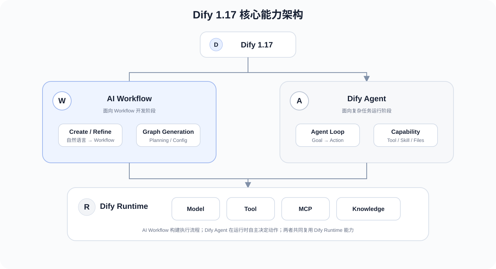

| | AI Workflow | Dify Agent |
| --- | --- | --- |
| 面向对象 | Workflow 开发者 | 最终任务 |
| 输入 | 自然语言构建 / 修改需求 | 用户目标 |
| AI 决策对象 | Workflow Graph | 下一步 Action |
| 核心机制 | Planning + Graph Generation | Agent Execution Loop |
| 输出 | 可运行 Workflow | 任务结果 |
| 所处阶段 | 开发阶段 | 运行阶段 |

两者不是两个孤立功能。AI Workflow 负责**生成执行流程**；Dify Agent 负责**在运行时自主完成任务**。Dify Agent 又可以作为 Workflow 节点使用，因此 Workflow 可以负责确定性编排，把需要自主决策的子任务交给 Agent。

---

## 3. AI Workflow 调研

### 3.1 功能介绍

AI Workflow 的核心变化，是把 Workflow 构建过程从“人工配置 Graph”变成“自然语言生成 / 修改 Graph”。

#### 3.1.1 构建方式变化

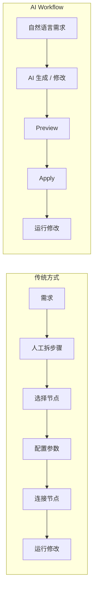

#### 3.1.2 核心能力

| 能力 | 作用 |
| --- | --- |
| Create | 根据自然语言从零生成 Workflow |
| Refine | 根据修改要求调整已有 Workflow |
| Node Planning | 将需求转换为节点与连线计划 |
| Tool Selection | 根据 Workspace 可用 Tool 选择 Tool Node |
| Node Configuration | 生成各节点的语义配置 |
| Graph Generation | 组装、布局并校验 Workflow Graph |

### 3.2 使用方式

#### 3.2.1 创建 Workflow

```mermaid
flowchart LR
    A[描述 Workflow 目标] --> B[/create]
    B --> C[生成 Workflow]
    C --> D[Preview]
    D --> E[Apply]
    E --> F[Canvas]
    F --> G[运行 / 人工调整]
```

以推荐分析为例，输入可以直接描述业务目标：

> 输入店铺、站点和时间范围，查询推荐效果指标；发现异常后继续查询流量和策略信息，最后汇总异常原因。

AI Workflow 负责把需求转换为节点、连线、Tool 与节点配置，用户在 Preview 中确认后写入 Canvas。

#### 3.2.2 修改 Workflow

```mermaid
flowchart LR
    A[已有 Workflow] --> B[/refine]
    B --> C[输入修改要求]
    C --> D[结合当前 Graph 生成修改]
    D --> E[Preview]
    E --> F[Apply]
    F --> G[更新 Workflow]
```

| 修改目标 | 示例 |
| --- | --- |
| 节点 | 增加参数检查节点 |
| 分支 | Tool 查询失败后进入异常处理 |
| 结构 | 两个独立查询改为并行 |
| 配置 | 修改 Tool 参数或 LLM Prompt |

### 3.3 实现原理

### 3.3.1 整体架构


Dify 1.17.1 的 Workflow Generator 将自然语言到 Workflow Graph 的生成拆成三段：

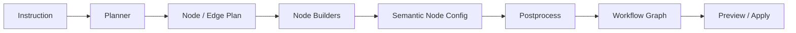

核心不是让一次 LLM 调用直接生成完整 DSL，而是先规划结构，再分别生成节点配置，最后由代码完成 Graph 组装和校验。

### 3.3.2 Planning

Planner 负责把用户需求转换为 Workflow 的结构计划。

| 输入 | Planner 决策 | 输出 |
| --- | --- | --- |
| 用户 Instruction | 任务拆分 | Node Plan |
| Dify 节点能力 | Node Type 选择 | Node Type |
| Workspace Tool | Tool 匹配 | Tool Node |
| 节点依赖 | 执行顺序 / 分支关系 | Edge Plan |

Planner 只描述“需要哪些节点、节点之间如何连接”，具体节点参数交给后续 Node Builder。

### 3.3.3 Node Configuration

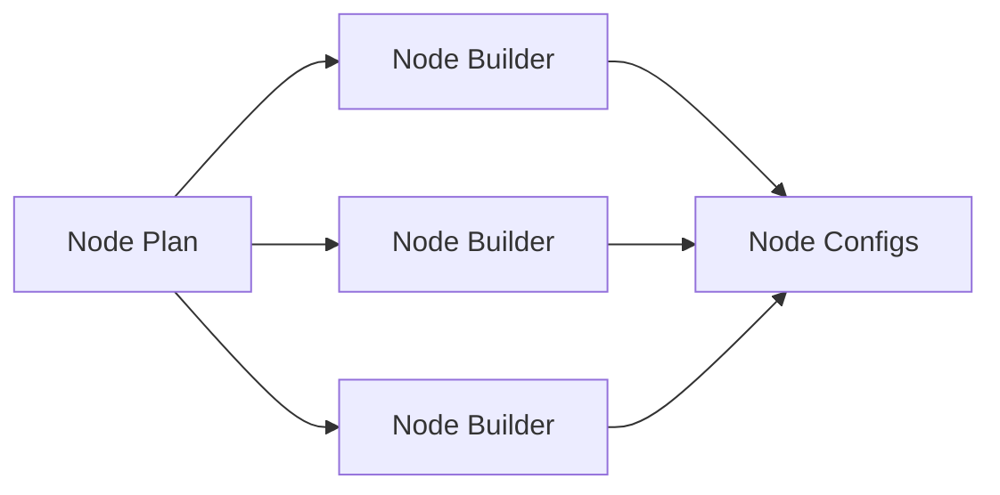

多个节点配置采用有界并行生成。每个 Builder 根据节点类型和节点计划生成对应的语义配置，再交给 Postprocess 统一组装。

### 3.3.4 Graph Generation

| 阶段 | 作用 |
| --- | --- |
| Assemble | 合并 Node Config 与 Edge Plan |
| Wrapper | 补齐 Dify Graph 所需节点结构 |
| Auto Layout | 计算 Canvas 节点位置 |
| Validate | 校验生成 Graph |
| Output | 输出 nodes、edges、viewport |

最终生成结果不是直接执行，而是进入 Preview / Apply 流程，由用户确认后写入 Workflow。

### 3.3.5 LLM 与确定性代码分工

| LLM | 确定性代码 |
| --- | --- |
| 理解自然语言需求 | Graph 数据结构组装 |
| 规划节点与连线 | 节点 Wrapper 补齐 |
| 选择节点 / Tool | Auto Layout |
| 生成节点语义配置 | Graph Validation |

这种拆分把语义判断交给 LLM，把 Graph 结构完整性相关工作留给确定性代码。

### 3.4 能力实测

实测从简单结构逐步增加复杂度，最后使用当前推荐分析 Workflow 验证。

| Case | 场景 | 主要观察项 |
| --- | --- | --- |
| 1 | 简单线性 Workflow | 节点、连线、参数 |
| 2 | 条件分支 Workflow | 条件生成、分支路径 |
| 3 | 多 Tool Workflow | Tool 选择、Tool 参数 |
| 4 | 复杂 Agent Workflow | 结构规划、上下文传递 |
| 5 | 已有复杂 Workflow Refine | 修改范围、原逻辑保持 |
| 6 | 推荐分析 Workflow | 完整度、人工修改量、一次生成成功率 |

统一记录：**节点正确性、连线正确性、参数正确性、Tool 选择、Prompt 质量、一次生成成功率、Refine 是否破坏原 Workflow**。

### 3.5 能力边界与不足

根据 3.4 实测结果填写。

| 问题 | 触发 Case | 实际表现 | 实现原因 | 影响 |
| --- | --- | --- | --- | --- |
|  |  |  |  |  |

### 3.6 AI Workflow 增强方案

增强方案与 3.5 的问题一一对应。

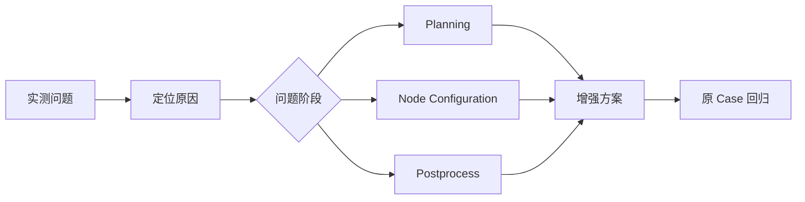

| 原生问题 | 增强位置 | 增强方案 | 验证结果 |
| --- | --- | --- | --- |
|  |  |  |  |

---

## 4. Dify Agent 调研

### 4.1 功能介绍

Dify Agent 是独立 Agent 应用。它运行在 Linux Sandbox 中，可以连接 Dify 的 Tool 和 Knowledge，并使用 Skill、文件与 Shell / Code 完成多步骤任务。

#### 4.1.1 与原 Agent Node 的区别

| | 原 Agent Node | Dify Agent |
| --- | --- | --- |
| 产品形态 | Workflow 内节点 | 独立 Agent 应用 |
| 创建方式 | 在 Workflow 中配置 | Agent Builder 独立创建 |
| 运行方式 | Workflow Runtime 中执行节点 | Agent Backend + Sandbox |
| 能力组织 | Model + Tool | Prompt + Tool + Knowledge + Skill + Files + Sandbox |
| 复用 | 随 Workflow 存在 | Workspace Agent 可被 Workflow 引用 |
| 发布 | 随 Workflow 发布 | 可直接发布为 Web App |

### 4.2 使用方式

#### 4.2.1 创建 Agent

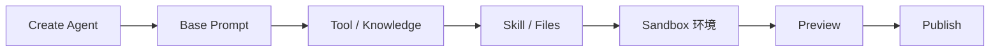

除手工配置外，Dify 提供 Agent Builder。用户可以通过对话让 Builder 配置 Sandbox、安装依赖以及创建 Skill 和文件。

#### 4.2.2 执行复杂任务

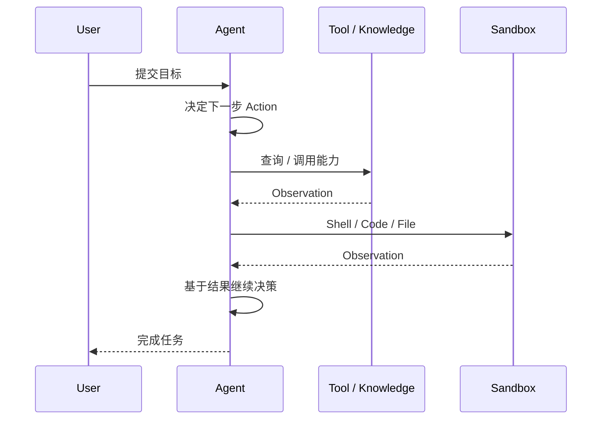

对于推荐分析任务，可以把效果查询、流量诊断、实验 / 策略查询等能力提供给 Agent，由 Agent 根据当前 Observation 决定下一步调查动作。

#### 4.2.3 在 Workflow 中使用

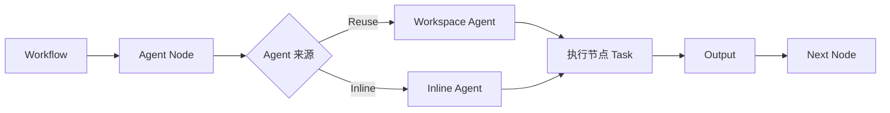

Workflow 可以引用已有 Workspace Agent，也可以在节点中创建 Inline Agent。Agent 完成节点 Task 后把结果传给下游节点。

### 4.3 实现原理

#### 4.3.1 整体架构

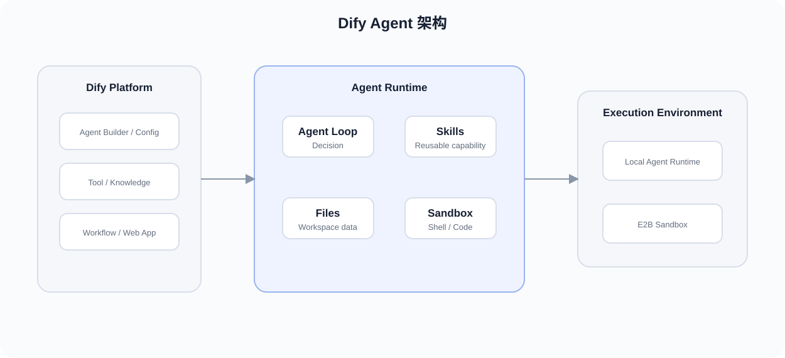

Dify Agent 不只是原 Workflow Agent Node 的 UI 扩展，而是新增了独立的 Agent Backend 与 Sandbox 执行体系。

| 层 | 组件 | 职责 |
| --- | --- | --- |
| Dify API | Agent 配置、Tool / Knowledge、Workflow 集成 | 产品控制面与 Dify 能力接入 |
| Agent Backend | Agent Run、运行状态、执行协调 | Agent 运行控制 |
| Agent Runtime | Model / Skill / Files / Shell 能力 | 任务执行 |
| Sandbox Backend | Local Sandbox / E2B | 隔离 Shell、Code、文件环境 |
| Redis | Agent Runtime 状态与运行协作 | 运行基础设施 |

### 4.3.2 执行链路

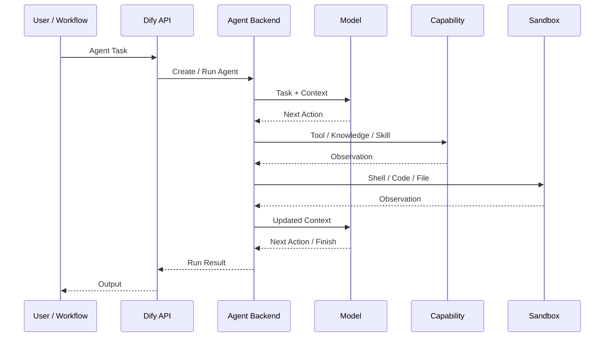

### 4.3.3 Agent 执行循环

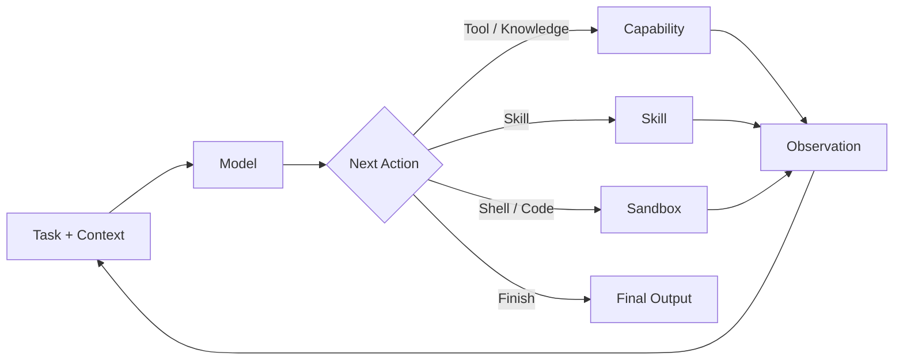

Agent 的核心是运行时循环：模型根据 Task、Context 与已有 Observation 产生下一步 Action；执行结果重新进入 Context，直到模型结束任务。

### 4.3.4 能力与状态

| 能力 | 作用 |
| --- | --- |
| Base Prompt | 定义长期行为与任务边界 |
| Tool | 调用 Dify Tool / 外部服务 |
| Knowledge | 获取 Workspace 知识 |
| Skill | 向 Agent 提供可复用任务能力 |
| Files | 提供 Agent 可使用的文件 |
| Sandbox | Shell、Code、依赖和文件操作 |
| Context | 连接多轮 Action 与 Observation |
| Runtime State | 保存运行过程所需状态 |

1.17 增加 E2B Sandbox Backend，Agent 的 Shell / Code 执行环境可以从本地 Sandbox 切换到 E2B，Agent 上层任务模型不需要因此改变。

### 4.4 能力实测

| Case | 场景 | 主要观察项 |
| --- | --- | --- |
| 1 | 简单问答 | 基础任务完成 |
| 2 | 单 Tool | Tool 选择、参数 |
| 3 | 多 Tool | 调用顺序、Observation 利用 |
| 4 | 多步骤任务 | Planning、状态保持 |
| 5 | 文件 + Tool | 文件与 Tool 协同 |
| 6 | 长链路任务 | Context、错误恢复、终止 |
| 7 | 推荐分析任务 | 完成度、调查路径、人工介入 |

### 4.5 能力边界与不足

根据 4.4 实测结果填写。

| 问题 | 触发 Case | 实际表现 | 实现原因 | 影响 |
| --- | --- | --- | --- | --- |
|  |  |  |  |  |

### 4.6 Dify Agent 增强方案

| 原生问题 | 增强位置 | 增强方案 | 验证结果 |
| --- | --- | --- | --- |
|  |  |  |  |

---

## 5. 综合分析与增强架构

### 5.1 两类能力的问题总结

两类能力解决的是同一 Agent 开发链路中的不同问题。

| | AI Workflow | Dify Agent |
| --- | --- | --- |
| 解决的问题 | Workflow 构建 | 复杂任务执行 |
| AI 决策对象 | Workflow Graph | 下一步 Action |
| 决策发生时间 | 开发时 | 运行时 |
| 核心机制 | Planning + Graph Generation | Agent Execution Loop |
| 确定性部分 | Graph 组装、布局、校验 | Agent Runtime、能力执行、Sandbox |
| 非确定性部分 | Workflow Planning、节点配置 | Action 决策 |
| 能力边界 | 由 3.4 实测确定 | 由 4.4 实测确定 |

### 5.2 增强目标

增强不重新实现 Dify，而是针对实测暴露的问题选择对应层处理。

| 问题位置 | 增强方式 |
| --- | --- |
| Prompt / Context 不足 | 调整生成或 Agent 上下文 |
| Tool / Skill 能力描述不足 | 增强能力元数据与选择信息 |
| Workflow Planning 问题 | 在 AI Workflow Planning 层增强 |
| Agent Action 决策问题 | 在 Agent 决策输入或执行约束层增强 |
| Graph / Runtime 已能保证的问题 | 直接复用原生能力 |

### 5.3 整体增强架构

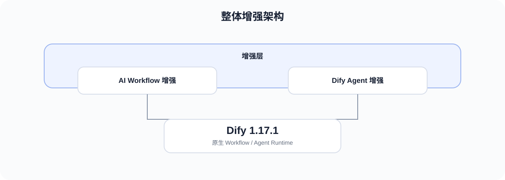

最终增强点由 3.5 与 4.5 的实测问题决定。整体边界保持为：

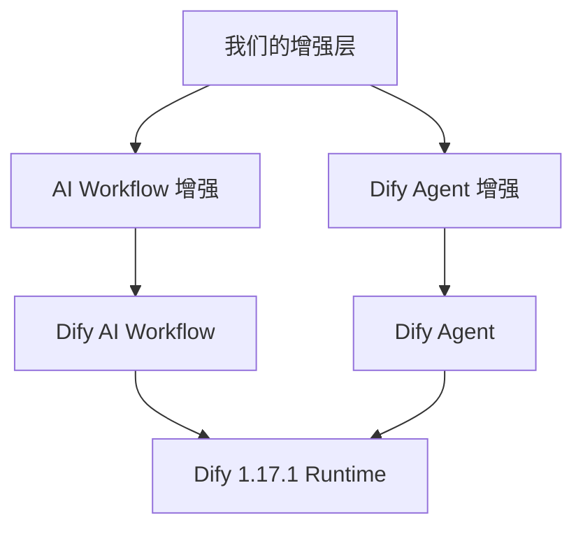

---

## 6. 调研结论

本次调研最终不是判断两个功能“有没有”，而是确定它们在当前项目中**能替代什么、需要增强什么**。

### 6.1 AI Workflow

最终从三个维度形成结论：

- **可直接使用范围**：哪些 Workflow 可以由原生 AI Workflow 完成创建 / Refine。
- **能力边界**：在哪类结构、Tool 或修改任务中开始需要人工介入。
- **增强范围**：哪些问题值得在 Planning、Node Configuration 或 Context 层增强。

### 6.2 Dify Agent

最终从三个维度形成结论：

- **可直接使用范围**：哪些复杂任务可以交给原生 Dify Agent。
- **能力边界**：在哪类多步骤任务中出现规划、Context、Tool 或执行问题。
- **增强范围**：哪些问题需要在能力描述、决策输入或运行约束层增强。

### 6.3 最终输出

| 类型 | 判定标准 |
| --- | --- |
| 直接使用 | 原生能力在真实 Case 中可以稳定完成 |
| 配置增强 | 通过 Prompt、Tool、Skill 或 Workflow 配置即可解决 |
| 二次增强 | 原生生成 / 执行机制存在稳定复现的问题 |
| 不处理 | 不影响当前业务目标或增强收益低 |

最终以真实推荐分析 Case 的测试结果确定增强项及优先级。
