# Dify 1.17 AI Workflow 调研

## 1. 调研介绍

### 1.1 调研背景

传统 Dify Workflow 需要人工完成需求拆分、节点选择、参数配置和连线。AI Workflow 将这部分工作转换为自然语言交互：用户描述目标后，由 Dify 自动生成 Workflow，也可以继续修改已有 Workflow。

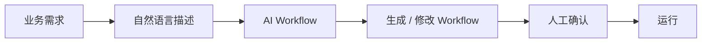

本次只研究 **Dify 1.17 的 AI Workflow 自然语言生成能力**。

### 1.2 调研目标

| 目标 | 核心问题 |
| --- | --- |
| 使用分析 | 自然语言如何创建、修改 Workflow |
| 实现分析 | Dify 如何把自然语言转换为可执行 Workflow Graph |
| 能力分析 | 原生能力能做到什么，在哪些场景开始出现问题 |
| 增强分析 | 问题发生在哪一层，应该如何增强 |

---

## 2. 功能与使用

### 2.1 功能定位

AI Workflow 解决的是 **从业务需求到 Workflow Graph 的构建成本**。

| | 传统 Workflow | AI Workflow |
| --- | --- | --- |
| 需求拆分 | 人工 | AI |
| Node 选择 | 人工 | AI |
| Tool 选择 | 人工 | AI |
| 参数配置 | 人工 | AI 生成 |
| Node 连线 | 人工 | AI 生成 |
| 最终确认 | 人工 | 人工 |

核心能力只有两类：

| 能力 | 作用 |
| --- | --- |
| `/create` | 根据自然语言从零生成 Workflow |
| `/refine` | 根据自然语言修改已有 Workflow |

### 2.2 Create：创建 Workflow

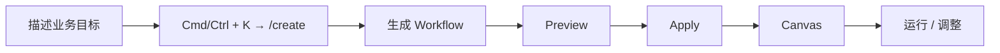

测试使用真实推荐分析需求：

> 输入站点、店铺和时间范围，查询推荐效果指标；如果发现异常，再查询流量、实验和配置相关信息，最后汇总异常原因。

主要观察生成出的：

- Node 与 Edge；
- Branch / Loop 等控制流；
- Tool 及参数；
- 输入输出变量；
- LLM Prompt。

### 2.3 Refine：修改 Workflow


典型修改包括：

| 类型 | 示例 |
| --- | --- |
| Add | 增加异常判断节点 |
| Update | 修改 Tool 参数或 Prompt |
| Rewire | 串行改并行、调整分支 |
| Remove | 删除节点 |

---

## 3. 实现架构

### 3.1 总体架构


Dify 1.17.1 的 Workflow Generator 可以收敛为四层：

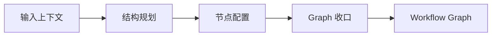

| 阶段 | 核心模块 | 负责什么 |
| --- | --- | --- |
| 输入上下文 | Instruction / Tool Context / Current Graph | 告诉模型用户要什么、能用什么、当前已有结构 |
| 结构规划 | Tool Router + Planner | 决定需要哪些 Node、Tool 和 Edge |
| 节点配置 | Parallel Node Builders | 生成每个 Node 的具体参数 |
| Graph 收口 | Postprocess | 组装、补默认值、布局、校验 |

核心思路不是一次 LLM 直接生成完整 Workflow，而是：

```text
自然语言
   ↓
先生成 Workflow 结构
   ↓
再生成各节点配置
   ↓
最后由确定性代码组装成合法 Graph
```

### 3.2 输入上下文

Create 和 Refine 共用同一套 Generator，但输入上下文不同。

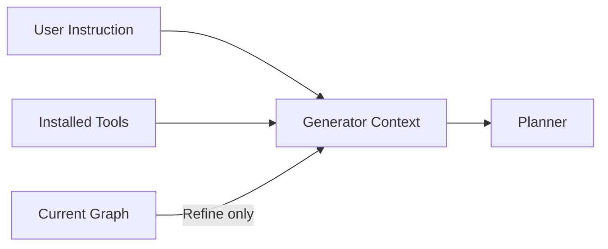

Planner 主要接收：

| 输入 | 作用 |
| --- | --- |
| User Instruction | 用户希望生成或修改什么 |
| Workflow Mode | Workflow / Advanced Chat |
| Node Rules | Dify 有哪些 Node、各自怎么使用 |
| Installed Tools | Workspace 当前可用 Tool |
| Current Graph | Refine 时提供已有 Workflow 结构 |
| Output Schema | 约束 Planner 输出格式 |

其中 Tool 很多时，不会全部直接塞给 Planner，而是先经过 Tool Router 做候选筛选。

### 3.3 结构规划

结构规划是自然语言生成的核心阶段。

#### 3.3.1 Tool Context 准备

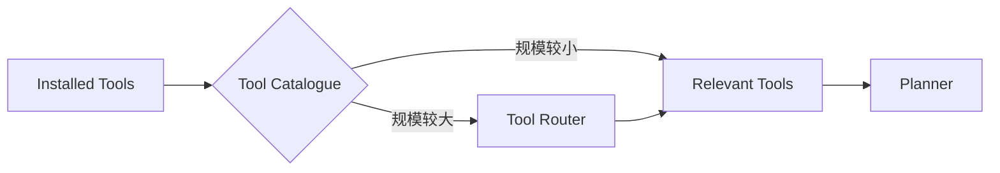

Tool Router 只负责缩小候选范围，不负责最终决定 Workflow 使用哪个 Tool。

#### 3.3.2 Planner

Planner 将业务需求转换为 **Node / Edge Plan**。

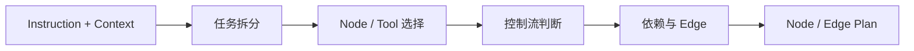

Planner 主要决定：

- Workflow 需要哪些步骤；
- 每一步使用什么 Node；
- 是否使用 Workspace Tool；
- 是否需要 If-Else / Iteration / Loop；
- Node 之间如何连接；
- Workflow 有哪些输入。

Node 选择规则由 Planner Prompt 明确提供：

| 需求 | Node |
| --- | --- |
| 推理 / 文本生成 | LLM |
| 已安装能力 | Tool |
| 未被 Tool 覆盖的外部 API | HTTP Request |
| 确定性处理 | Code |
| 条件判断 | If-Else |
| 语义分类 | Question Classifier |
| 列表逐项执行 | Iteration |
| 重复直到满足条件 | Loop |
| 知识查询 | Knowledge Retrieval |

当已安装 Tool 可以完成某一步时，Planner Prompt 要求优先使用 Tool Node，并从 Tool Context 中选择实际的 `provider_id / tool_name`。

Planner 输出只描述高层结构，不生成所有节点的完整配置。

### 3.4 节点配置

Planner 输出 Node Plan 后，由 Node Builder 为每个节点生成实际配置。

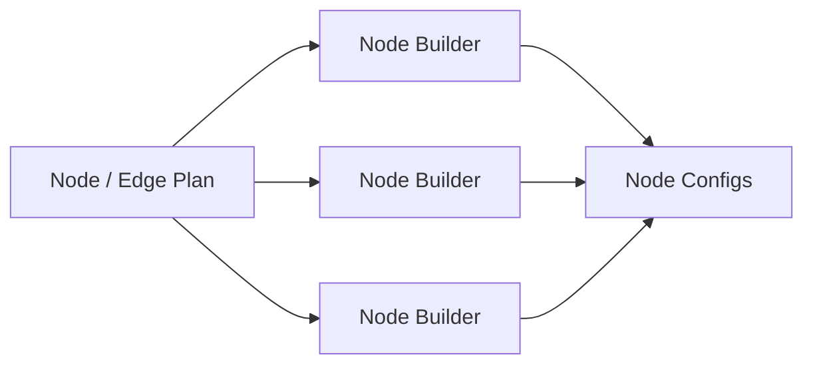

多个 Builder 采用有界并行执行。

| Node | Builder 主要生成 |
| --- | --- |
| Start | 输入变量、类型、文件配置 |
| LLM | Model、Prompt、Context |
| Tool | Provider、Tool、Parameters |
| If-Else | Conditions / Branch |
| Knowledge Retrieval | Dataset、Query、Retrieval 配置 |
| Code | Code、Input、Output Schema |
| End / Answer | 输出变量 |

职责边界：

```text
Planner：决定“需要什么节点、怎么连接”
Node Builder：决定“这个节点具体怎么配置”
```

### 3.5 Graph 收口

Node Builder 完成后，Postprocess 将结构计划和节点配置转换成最终 Graph。

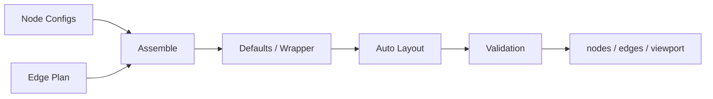

| 处理 | 作用 |
| --- | --- |
| Assemble | 合并 Node Config 与 Edge Plan |
| Defaults | 补缺失的安全默认值 |
| Wrapper | 补齐 Dify Node 外层结构 |
| Layout | 计算 Canvas 位置 |
| Edge Process | 处理 Edge ID 与连接 |
| Validation | 做最终结构检查 |

LLM 与确定性代码的分工：

| LLM | 确定性代码 |
| --- | --- |
| 理解需求 | JSON / Schema 检查 |
| Workflow Planning | Graph Assemble |
| Node / Tool 选择 | 默认值与 Wrapper |
| Node 参数语义生成 | Edge / Layout |
| Refine 修改判断 | Structural Validation |

即：

```text
LLM 决定“Workflow 应该怎么设计”
                ↓
代码保证“结果符合 Dify Graph 结构”
```

### 3.6 Refine 与 Create 的差异

Refine 不重新实现一套 Generator，而是在相同 Pipeline 中增加 **Current Graph Context**。

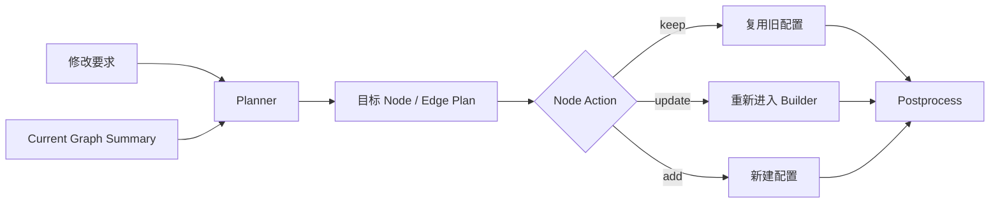

Planner 可以看到已有 Graph 中的 Node ID、类型、标题以及 Edge 关系，并对目标 Node 标记：

| Action | 处理 |
| --- | --- |
| `keep` | 直接复用已有 Node Config |
| `update` | 保留 Node 身份，重新生成配置 |
| `add` | 新建 Node |
| Remove | 从目标 Plan 中移除 |

因此 Create 与 Refine 的主要区别在 **Planning 输入和 Node 复用策略**，后面的 Node Builder 与 Postprocess 基本共用。

### 3.7 核心源码

| 模块 | 路径 |
| --- | --- |
| Generator Pipeline | `api/core/workflow/generator/runner.py` |
| Planner Prompt | `api/core/workflow/generator/prompts/planner_prompts.py` |
| Tool Router Prompt | `api/core/workflow/generator/prompts/tool_router_prompts.py` |
| Tool Catalogue | `api/core/workflow/generator/tool_catalogue.py` |
| Node Builder Prompt | `api/core/workflow/generator/prompts/node_builder_prompts.py` |
| Node Config Reference | `api/core/workflow/generator/prompts/builder_prompts.py` |
| Generator Service | `api/services/workflow_generator_service.py` |

---

## 4. 能力实测

### 4.1 测试 Case

测试按 Workflow 复杂度逐级增加。

| Case | 场景 | 主要验证 |
| --- | --- | --- |
| Case 1 | 简单线性 Workflow | 基础 Node / Edge / Variable |
| Case 2 | 条件分支 Workflow | If-Else / Branch |
| Case 3 | 多 Tool Workflow | Tool 选择与参数 |
| Case 4 | Loop / Iteration Workflow | 复杂控制流 |
| Case 5 | 已有复杂 Workflow Refine | 修改范围与原逻辑保持 |
| Case 6 | 推荐分析真实 Workflow | 综合生成能力 |

Case 6 只描述业务目标，不给定固定 Workflow 结构，观察 AI 自主生成结果。

### 4.2 评价指标

| 维度 | 判断内容 |
| --- | --- |
| Planning | 整体 Workflow 结构是否合理 |
| Node | Node 类型和数量是否正确 |
| Edge | 顺序、Branch、Loop 是否正确 |
| Tool | 是否选择正确 Tool |
| Parameter | 参数和变量引用是否完整 |
| Prompt | LLM Prompt 是否符合业务目标 |
| Executable | Apply 后能否直接运行 |
| Refine | 是否只修改目标范围 |
| 人工修改量 | 生成后需要修改多少 |

### 4.3 测试记录

| Case | 结果 | 问题 | 人工修改 |
| --- | --- | --- | --- |
| Case 1 |  |  |  |
| Case 2 |  |  |  |
| Case 3 |  |  |  |
| Case 4 |  |  |  |
| Case 5 |  |  |  |
| Case 6 |  |  |  |

---

## 5. 能力边界与问题分析

问题不按“优点 / 缺点”分类，而是沿生成链路定位。

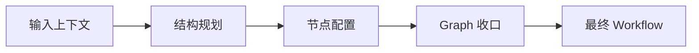

| 问题 | Case | 发生阶段 | 实际表现 | 根因 | 影响 |
| --- | --- | --- | --- | --- | --- |
|  |  | Context / Planning / Builder / Postprocess / Refine |  |  |  |

重点验证：

- 复杂 Workflow 的 Planning 是否稳定；
- Tool 是否选对；
- Node / Tool 参数是否完整；
- Branch / Loop 等控制流是否正确；
- Refine 是否只修改目标范围；
- 是否存在“Graph 合法但业务逻辑错误”的情况。

---

## 6. 增强方案

增强直接对应第 5 章的问题，不重新实现一套 Workflow Generator。

### 6.1 增强位置

| 问题发生层 | 对应增强位置 |
| --- | --- |
| 输入上下文 | Prompt / Tool Context / Current Graph Context |
| 结构规划 | Tool Router / Planner |
| 节点配置 | Node Builder |
| Graph 收口 | Postprocess / Validation |
| 原生能力已满足 | 不修改 |

### 6.2 问题与方案映射

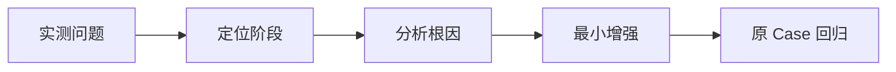

| 原生问题 | 根因 | 增强位置 | 增强方案 | 优先级 | 验证结果 |
| --- | --- | --- | --- | --- | --- |
|  |  |  |  |  |  |

### 6.3 最终结论

最终只回答三个问题：

1. **Dify 原生 AI Workflow 能稳定生成到什么复杂度。**
2. **真实推荐分析 Workflow 的主要失败点位于哪一层。**
3. **哪些直接使用原生能力，哪些需要对 Generator 做增强。**
