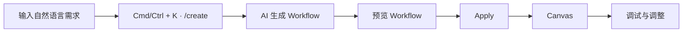
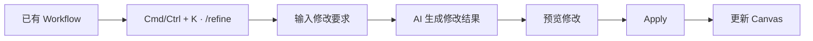
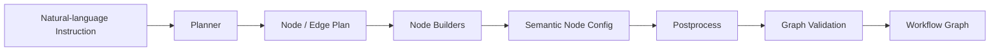
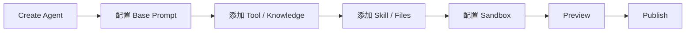
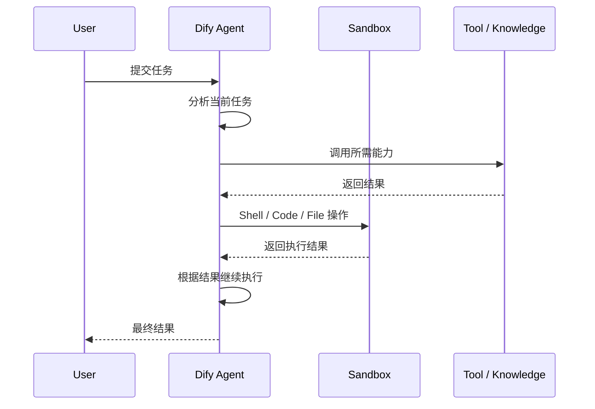
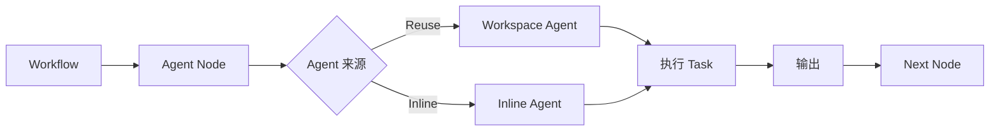
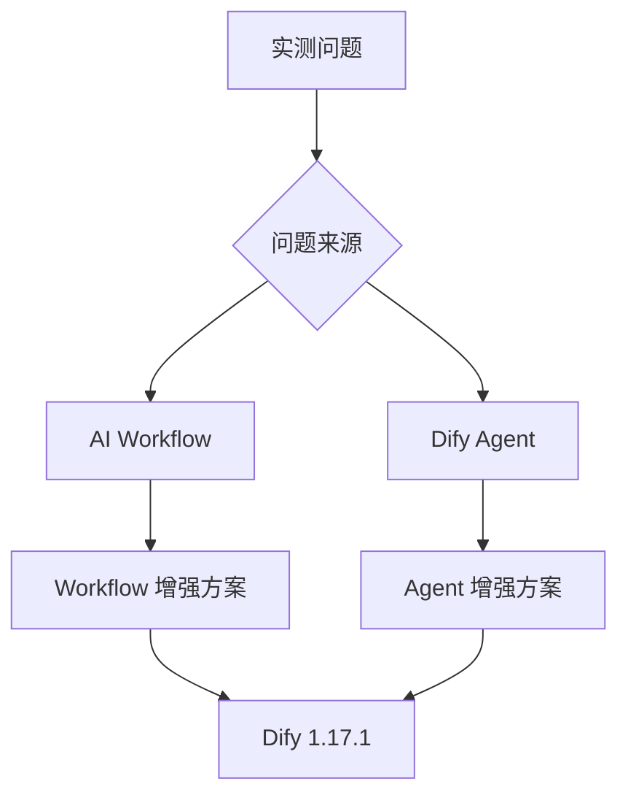

# Dify 1.17 核心能力调研

## 一、调研介绍

### 1.1 背景

Dify 1.16 引入两项核心能力：

| 能力 | 作用 | 核心变化 |
| --- | --- | --- |
| AI Workflow | 用自然语言创建、修改 Workflow | 从手工搭建转为 AI 辅助搭建 |
| Dify Agent | 自主完成多步骤复杂任务 | 从 Workflow 内 Agent Node 扩展为独立 Agent 应用 |

### 1.2 调研目标

1. 分析两项能力的**使用方式与实现机制**。
2. 通过真实 Case 测试其**能力边界与不足**。
3. 针对已发现的问题设计**增强方案**。

### 1.3 调研范围

---

## 二、AI Workflow

### 2.1 功能

AI Workflow 将自然语言需求转换为 Dify Workflow，并支持对已有 Workflow 继续修改。

| 能力 | 输入 | 输出 |
| --- | --- | --- |
| Create | Workflow 自然语言需求 | 新 Workflow |
| Refine | 已有 Workflow + 修改要求 | 修改后的 Workflow |

1.16 对 /create、/refine 的生成流程进行了增强；1.17 进一步让生成器优先选择 Workspace 中已经安装并完成配置的 Tool。

### 2.2 使用流程

#### Create

#### Refine

| 场景 | 示例 |
| --- | --- |
| 从零创建 | 创建一个推荐异常分析 Workflow，查询指标后分析异常原因并输出结论 |
| 增加逻辑 | 在 Tool 查询失败后增加错误处理分支 |
| 调整结构 | 将两个独立查询改为并行执行 |
| 修改节点 | 调整 LLM Prompt 或节点参数 |

### 2.3 实现架构

Dify 1.17.1 Workflow Generator 的核心生成链路：

| 模块 | 作用 |
| --- | --- |
| Planner | 将需求拆成节点与边的结构计划 |
| Node Builder | 根据节点计划生成具体节点配置 |
| Parallel Build | 并行生成多个节点配置，缩短生成时间 |
| Postprocess | 组装节点与边、自动布局并校验 Graph |
| Tool Context | 将 Workspace 可用 Tool 纳入生成上下文 |

最终输出 Dify Workflow Graph，包括 nodes、edges 和 viewport，再进入预览与 Apply 流程。

### 2.4 能力实测

| Case | 目标 | 观察项 | 结果 |
| --- | --- | --- | --- |
| 简单线性 Workflow | 验证基础生成 | 节点、连线、参数 | 待测 |
| 条件分支 | 验证结构规划 | 分支条件、路径 | 待测 |
| 多 Tool | 验证 Tool 使用 | Tool 选择、参数 | 待测 |
| 复杂 Agent Workflow | 验证复杂编排 | 节点结构、上下文 | 待测 |
| Refine | 验证局部修改 | 修改准确性、影响范围 | 待测 |
| 推荐分析 Workflow | 验证真实业务可用性 | 完整度、人工修改量 | 待测 |

### 2.5 不足与增强

| 原生问题 | 表现 | 原因 | 增强方案 |
| --- | --- | --- | --- |
| 待测 |  |  |  |

---

## 三、Dify Agent

### 3.1 功能

Dify Agent 是独立 Agent 应用。用户给出任务后，Agent 在 Linux Sandbox 中执行任务，并可使用 Dify 的 Tool、Knowledge、Skill 和文件。

| 能力 | 作用 |
| --- | --- |
| Base Prompt | 定义 Agent 角色与长期指令 |
| Tool | 调用 Dify Tool 与外部能力 |
| Knowledge | 使用 Workspace Knowledge |
| Skill | 封装可复用 Agent 能力 |
| Files | 为 Agent 提供长期使用的文件 |
| Linux Sandbox | 执行 Shell、代码并管理运行环境 |
| Workflow Integration | 在 Workflow 中调用已有 Agent 或 Inline Agent |
| Web App | 将 Agent 直接发布为应用 |

### 3.2 使用流程

#### 创建 Agent

Dify 同时提供 Agent Builder，可通过对话配置 Sandbox、安装依赖、创建 Skill 和文件。

#### 执行任务

### 3.3 实现架构

| 层 | 主要职责 |
| --- | --- |
| Dify Platform | Agent 配置、Tool、Knowledge、Workflow 集成、发布与管理 |
| Agent Runtime | Agent 执行、Sandbox、Skill、文件和任务运行环境 |

1.16 新增独立 Agent 应用及 Agent Builder；Agent 可以直接发布为 Web App，也可以作为 Workflow 节点使用。1.17 增加 E2B Sandbox backend，可在本地 Agent Runtime 与 E2B Sandbox 之间选择。

### 3.4 Workflow 集成

Agent 从 Workflow 内的一次性节点配置，扩展为可独立创建、发布并在 Workflow 中复用的应用能力。

### 3.5 能力实测

| Case | 目标 | 观察项 | 结果 |
| --- | --- | --- | --- |
| 单 Tool | 验证基础调用 | Tool 选择、参数 | 待测 |
| 多 Tool | 验证连续执行 | 调用顺序、结果利用 | 待测 |
| 多步骤任务 | 验证自主执行 | 步骤规划、状态保持 | 待测 |
| 文件任务 | 验证文件处理 | 文件读写、结果传递 | 待测 |
| Sandbox 任务 | 验证环境执行 | Shell、Code、依赖 | 待测 |
| 推荐分析任务 | 验证真实业务可用性 | 完成度、人工介入 | 待测 |

### 3.6 不足与增强

| 原生问题 | 表现 | 原因 | 增强方案 |
| --- | --- | --- | --- |
| 待测 |  |  |  |

---

## 四、综合分析

### 4.1 能力关系

| | AI Workflow | Dify Agent |
| --- | --- | --- |
| 目标 | 降低 Workflow 构建成本 | 提升复杂任务自主执行能力 |
| 用户输入 | Workflow 构建 / 修改需求 | 业务任务 |
| AI 输出 | Workflow Graph | 任务执行结果 |
| 主要阶段 | 开发阶段 | 运行阶段 |
| 核心对象 | Node / Edge / Config | Tool / Skill / Sandbox / Context |
| 最终载体 | Workflow | Agent App |

### 4.2 增强方案

实测后根据两类问题分别设计增强模块：

| 输出 | 内容 |
| --- | --- |
| 原生能力 | 可以直接使用的能力 |
| 能力边界 | 实测确认的限制 |
| 增强点 | 需要补充的能力 |
| 增强架构 | 与 Dify 1.17.1 的集成方式 |
| 验证结果 | 增强前后的 Case 对比 |
