# Dify 1.17 核心能力调研

## 1. 调研介绍

### 1.1 调研背景

Dify 的 Agent 开发方式正在从“人工编排 + 固定流程执行”向两个方向扩展：

| 能力 | 核心变化 | 解决的问题 |
| --- | --- | --- |
| AI Workflow | 自然语言创建、修改 Workflow | 降低 Workflow 构建和调整成本 |
| Dify Agent | 独立 Agent 应用自主完成多步骤任务 | 提高复杂任务自主执行能力 |

AI Workflow 面向 **Workflow 开发阶段**，Dify Agent 面向 **任务运行阶段**。本次调研围绕两项能力分别分析使用方式、内部实现、能力边界和增强空间。

### 1.2 调研目标

1. **使用分析**：功能是什么、怎么使用、适合解决什么问题。
2. **实现分析**：分析核心架构、执行流程和关键实现机制。
3. **增强分析**：通过真实 Case 测试能力边界和不足，并设计对应增强方案。

### 1.3 调研范围

| 功能 | 核心问题 |
| --- | --- |
| AI Workflow | AI 如何根据自然语言创建、理解和修改 Dify Workflow |
| Dify Agent | 新版 Agent 如何自主规划、调用能力并完成复杂任务 |

---

## 2. 整体能力架构


| | AI Workflow | Dify Agent |
| --- | --- | --- |
| 面向对象 | Workflow 开发者 | 最终任务执行 |
| 输入 | 自然语言构建 / 修改要求 | 用户目标 |
| AI 决策对象 | Workflow Graph | 下一步 Action |
| 核心过程 | Planning → Node Config → Graph | Model → Action → Observation → Next Action |
| 输出 | Workflow | 最终任务结果 |
| 所处阶段 | 开发阶段 | 运行阶段 |

两项能力处于同一条 Agent 开发链路的不同位置：

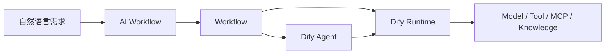

AI Workflow 负责**把需求转换成可执行流程**；Dify Agent 负责**在运行时根据目标和执行结果自主决定下一步动作**。Workflow 可以继续承担稳定、确定性的业务编排，把需要动态决策的部分交给 Agent。

---

## 3. AI Workflow 调研

### 3.1 功能介绍

AI Workflow 解决的是 **Workflow 从需求到可执行 Graph 的构建成本**。

#### 传统构建方式

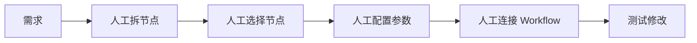

#### AI Workflow

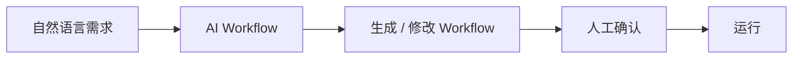

核心能力：

| 能力 | 作用 |
| --- | --- |
| `/create` | 根据自然语言从零创建 Workflow |
| `/refine` | 根据修改要求调整已有 Workflow |
| Installed Tool Context | 生成时结合 Workspace 已安装 Tool |
| Current Graph Context | Refine 时结合当前 Workflow 结构 |
| Preview / Apply | 生成结果先预览，再应用到 Canvas |

### 3.2 使用方式

#### 3.2.1 创建 Workflow

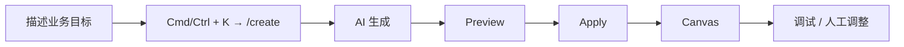

使用真实推荐分析场景测试：

> 创建推荐效果异常分析 Workflow：接收站点、店铺和时间范围，先查询推荐效果；发现指标变化后继续查询流量、实验和配置线索，最后汇总主要原因。

重点观察 AI 是否能够正确完成：

- 业务步骤拆分；
- Node 类型选择；
- Tool 选择；
- 上下游变量连接；
- Prompt 与参数配置；
- 分支、循环、Agent 等复杂结构。

#### 3.2.2 修改 Workflow

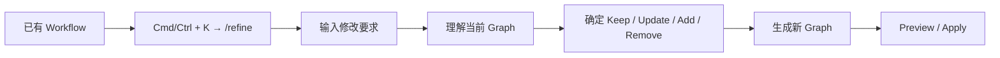

典型修改：

| 修改类型 | 示例 |
| --- | --- |
| 增加节点 | 增加参数校验或结果汇总节点 |
| 调整结构 | 将两个独立查询改为并行 |
| 增加分支 | 指标异常后再进入原因调查 |
| 修改节点 | 修改 Tool 参数或 LLM Prompt |
| 增加 Agent | 将动态原因调查交给 Agent 执行 |

### 3.3 实现原理

以下分析基于 Dify 1.17.1 Workflow Generator 源码。

#### 3.3.1 整体生成链路


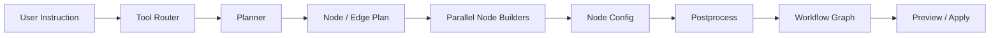

核心实现不是“一次 LLM 直接生成完整 DSL”，而是拆成：

1. **Tool Router**：Tool 很多时先筛选相关能力。
2. **Planner**：生成高层 Node / Edge Plan。
3. **Node Builders**：按节点类型并行生成具体配置。
4. **Postprocess**：补默认值、组装 Graph、布局并做结构校验。

#### 3.3.2 Prompt 与 Workflow Planning

Planner Prompt 直接定义 Dify 可用节点类型和规划规则。

| Prompt 内容 | 作用 |
| --- | --- |
| Available Node Types | 告诉模型可选择哪些 Dify Node |
| Control-flow Rules | 指导分支、Iteration、Loop 等结构选择 |
| Installed-Tool-First | 有匹配 Tool 时优先生成 Tool Node |
| Start Inputs Rules | 明确 Workflow 输入变量 |
| Graph Rules | 约束 Node ID、Edge、终止节点等结构 |
| Output Schema | 要求输出固定 JSON Plan |

Planner 输出的不是完整 Graph，而是较轻量的规划结果：

```text
title / description / mode
start_inputs
nodes:
  id
  label
  node_type
  purpose
  tool
edges:
  source
  target
  source_handle
```

这一步主要解决 **需求理解、任务拆分、Node 选择和拓扑规划**。

#### 3.3.3 Node 与 Tool 选择

Node 选择主要由 Planner 完成。

| 需求特征 | 对应 Node |
| --- | --- |
| 确定性条件判断 | If-Else |
| 语义分类 | Question Classifier |
| 列表逐项处理 | Iteration |
| 持续执行直到条件满足 | Loop |
| 外部能力调用 | Tool |
| 无 Tool 覆盖的外部 API | HTTP Request |
| 数据转换 | Code |
| 推理 / 生成 | LLM |

Tool 选择使用 Workspace Tool Catalogue：

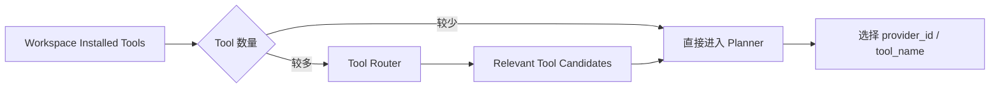

Planner 需要使用 Tool Catalogue 中的实际 `provider_id / tool_name`，而不是只生成一个语义上的“搜索工具”。

#### 3.3.4 Node 参数生成

Planner 确定结构后，每个 Node Builder 根据节点类型生成配置。

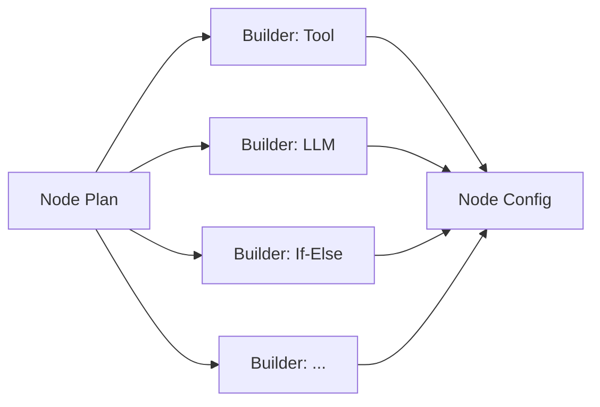

Dify 为不同 Node 提供对应配置参考，内容对齐实际 Workflow Node 的默认结构，例如：

| Node | Builder 主要生成内容 |
| --- | --- |
| Start | 输入变量、类型、文件配置 |
| LLM | Model、Prompt、Context、Vision |
| Tool | Provider、Tool、Tool Parameters |
| If-Else | Conditions、Branch |
| Knowledge Retrieval | Dataset 与 Retrieval 配置 |
| Code | Code、输入变量、输出 Schema |
| End / Answer | 最终输出变量 |

Node Builder 负责语义配置，Runner 负责节点 Wrapper、位置和拓扑等确定性结构。

#### 3.3.5 Refine 如何理解并修改已有 Workflow

`/refine` 与 `/create` 使用同一套生成 Pipeline，区别是请求中会传入 `current_graph`。

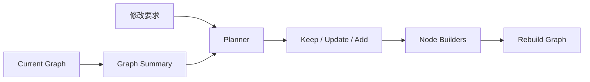

Planner 接收到的已有 Workflow 信息主要包括：

- Node ID；
- Node Type；
- Node Title；
- Edge Source / Target；
- Branch 的 `sourceHandle`。

Planner 对目标 Graph 中保留的节点标记：

| Action | 处理 |
| --- | --- |
| `keep` | 直接复用已有 Node Config，不再调用 LLM 重建 |
| `update` | 将当前 Node Config 交给 Builder，只修改该节点 |
| `add` | 创建新节点 |
| Remove | 目标 Plan 中不再保留该节点 |

因此 Refine 不是简单“重新生成整个 Workflow”：结构层由 Planner 重新规划，但未修改节点可以直接复用原配置。

#### 3.3.6 如何保证生成结果可用

生成过程同时使用 LLM 和确定性代码：

| LLM 负责 | 确定性代码负责 |
| --- | --- |
| 理解用户需求 | JSON / Schema 检查 |
| Workflow Planning | Graph 组装 |
| Node / Tool 选择 | Node Wrapper |
| Node 参数语义配置 | 安全默认值补全 |
| Refine 修改判断 | Edge ID / 拓扑处理 |
| Prompt 生成 | Auto Layout |
|  | Structural Validation |

Runner 还包含 JSON 修复、失败重试、默认配置补全和最终结构检查。它保证的是 **Graph 结构可以被 Dify 加载和执行**；业务流程是否符合用户真实意图，需要通过实际 Case 验证。

#### 3.3.7 核心源码位置

| 模块 | 路径 |
| --- | --- |
| Generator Pipeline | `api/core/workflow/generator/runner.py` |
| Planner Prompt | `api/core/workflow/generator/prompts/planner_prompts.py` |
| Node Builder Prompt | `api/core/workflow/generator/prompts/node_builder_prompts.py` |
| Node Config Reference | `api/core/workflow/generator/prompts/builder_prompts.py` |
| Tool Catalogue | `api/core/workflow/generator/tool_catalogue.py` |
| Service Entry | `api/services/workflow_generator_service.py` |

### 3.4 能力实测

测试从简单 Workflow 逐步增加复杂度，最后使用当前推荐效果分析流程。

| Case | 测试场景 | 主要观察项 |
| --- | --- | --- |
| Case 1 | 简单线性 Workflow | 节点、连线、变量 |
| Case 2 | 条件分支 Workflow | Branch 结构、Condition |
| Case 3 | 多 Tool Workflow | Tool 选择、参数映射 |
| Case 4 | Agent + Workflow | Agent Node 选择与上下文传递 |
| Case 5 | 已有复杂 Workflow Refine | 修改范围、原逻辑保持 |
| Case 6 | 推荐分析主流程：Fast → Plan → ReAct → Summary | 结构规划、Tool、Prompt、人工修改量 |

统一记录：

| 维度 | 判断内容 |
| --- | --- |
| Node | 类型和数量是否合理 |
| Edge | 顺序、分支和容器连接是否正确 |
| Parameter | 变量与节点参数是否完整 |
| Tool | 是否选择正确 Tool |
| Prompt | 是否表达正确业务目标 |
| 一次成功率 | Apply 后能否直接运行 |
| Refine | 是否只修改目标范围 |
| 人工成本 | 生成后需要修改多少内容 |

### 3.5 能力边界与不足

实测后将问题落到具体生成阶段，而不是只记录“生成失败”。

| 问题 | Case | 发生阶段 | 实际表现 | 原因 | 影响 |
| --- | --- | --- | --- | --- | --- |
|  |  | Planning / Builder / Postprocess / Refine |  |  |  |

### 3.6 AI Workflow 增强方案

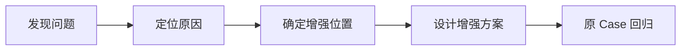

| 原生问题 | 根因 | 增强位置 | 增强方案 | 验证结果 |
| --- | --- | --- | --- | --- |
|  |  |  |  |  |

最终需要回答：**基于原生 AI Workflow，哪些问题通过 Prompt / Context 即可解决，哪些需要修改 Generator，哪些不值得增强。**

---

## 4. Dify Agent 调研

### 4.1 功能介绍

Dify Agent 将 Agent 从 Workflow 中的一个执行节点，扩展为可以独立创建、配置、运行、发布并被 Workflow 复用的 Agent 应用。

#### 与原 Workflow Agent Node 的区别

| | Workflow 内 Agent Node | Dify Agent |
| --- | --- | --- |
| 配置位置 | 当前 Workflow 内 | 独立 Agent |
| 复用方式 | 随 Workflow 配置 | Workspace Agent 可复用 |
| 运行能力 | 节点内部自主调用 Tool | Tool / Knowledge / Skill / Files / Sandbox |
| 文件与环境 | 依赖 Workflow 运行上下文 | 独立 Sandbox Workspace |
| 发布 | 随 Workflow 发布 | 可直接发布 Web App |
| Workflow 集成 | 本身就是节点 | 可作为 Agent Node 被引用，也可 Inline 创建 |

它解决的问题不是“再增加一个 Agent Node”，而是把 Agent 变成一个**可独立维护、可复用、带执行环境的任务执行单元**。

### 4.2 使用方式

#### 4.2.1 创建 Agent

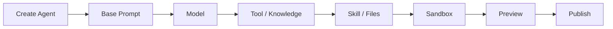

Agent Builder 还可以通过对话辅助构建 Agent，例如配置环境、安装依赖、创建 Skill 和准备文件。

#### 4.2.2 执行复杂任务

以推荐效果异常分析为例：

> 分析 2026-06-05 至 2026-06-11 某店铺推荐引导 GMV 明显上涨的原因，并判断主要来自效果变化、流量变化、实验还是配置调整。

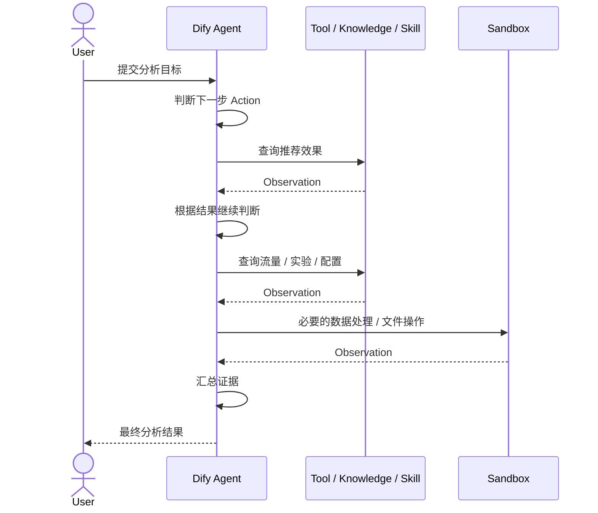

用户只定义目标，不提前固定完整执行路径；Agent 根据每一步 Observation 继续决定下一步操作。

#### 4.2.3 在 Workflow 中使用


这使 Workflow 与 Agent 可以按确定性程度拆分：

- 固定的数据准备、参数校验、结果流转继续使用 Workflow；
- 动态调查、Tool 选择和多步骤判断交给 Agent。

### 4.3 实现原理

以下分析基于 Dify 1.17.1 的 Agent App、Agent v2 和 `dify-agent` Runtime。

#### 4.3.1 整体架构


整体链路可以拆成三层：

| 层 | 核心职责 |
| --- | --- |
| Dify Platform / API | 保存 Agent 配置，解析 Model、Tool、Knowledge、Skill、Files，并创建 Agent Run |
| Agent Backend | 执行 Agent Run，维护事件、状态和 Session Snapshot |
| Runtime / Sandbox | Model-Tool Loop、Shell / Code、文件与运行环境 |

Dify API 与 Agent Backend 是独立服务。Agent Backend 使用 Redis 保存 Run Record 和 Event Stream，并通过 Plugin Daemon 调用 Dify Model / Tool。

#### 4.3.2 Agent Run Composition

Agent 运行前，Dify API 会把 Agent 配置转换为一组运行 Layer，再提交给 Agent Backend。

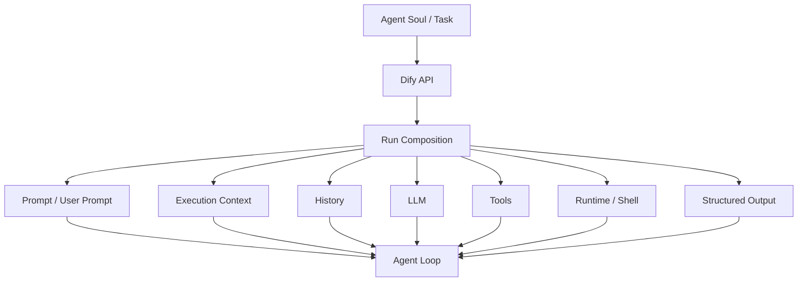

核心点是：**Agent 的能力不是运行时临时扫描出来的，而是 Dify API 在 Run 前解析并组装。**

例如 Tool 在进入 Agent Backend 前，Dify API 已经完成：

- Provider / Tool 解析；
- Credential 解析；
- Tool 参数合并；
- Model 可见的 JSON Schema 生成；
- Hidden / Manual Runtime Parameter 注入。

Agent Runtime 负责根据模型 Tool Call 执行这些已准备好的能力，并把结果转成 Observation。

#### 4.3.3 Planning / Reasoning 与 Agent Loop

Dify Agent 的运行时没有独立的“先生成完整 Plan、再一次性执行”的 Planner Pipeline。

核心是 Pydantic AI 的 Model / Tool Loop：

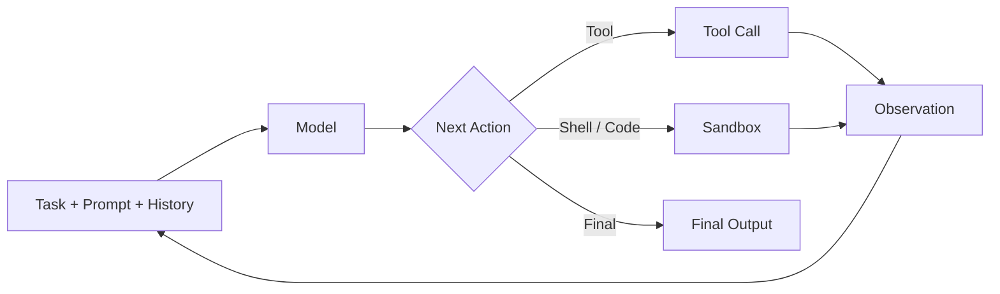

因此复杂任务中的 Planning / Reasoning 主要发生在每一轮模型决策中：

1. 读取当前 Prompt、History 和能力 Schema；
2. 选择下一步 Tool / Shell Action；
3. 获得 Observation；
4. 将新结果重新加入上下文；
5. 决定继续执行还是结束。

这和 AI Workflow 的 **先 Planning、再生成固定 Graph** 是两种不同的决策机制。

#### 4.3.4 Tool 调用

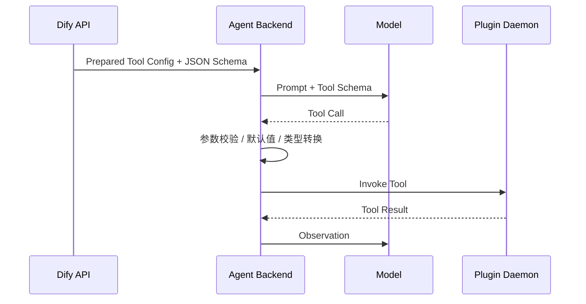

Tool Runtime 将模型可见参数和 Dify 内部 Runtime Parameter 分开，因此账号、Credential、固定参数不需要暴露给模型决定。

#### 4.3.5 Context 管理

Agent Context 主要由 History Layer 和 Session Snapshot 管理。

| 机制 | 作用 |
| --- | --- |
| History Layer | 保存 Pydantic AI 对话与 Tool 历史 |
| Session Snapshot | Agent Run 结束后保存可恢复的 Layer 状态 |
| Conversation / Agent IDs | 在 Execution Context 中传递运行归属 |
| Context Compaction | 上下文接近模型窗口时压缩历史 |

Context Compaction 分两步：

1. 优先清理较旧的 Tool Result，保留最近的 Tool Call / Result；
2. 仍超出窗口时，由当前模型摘要更早历史，同时保留近期消息和首条 User Message。

因此长任务不是简单依靠无限增长的 Message History，而是在模型窗口前进行压缩。

#### 4.3.6 Skill 与文件

Agent 配置中可以保存 Skill 和文件引用：

```text
Agent Soul
├── prompt
├── tools
├── knowledge
├── config_skills
├── config_files
├── env
├── sandbox
├── memory
└── model
```

Skill 和文件不是直接塞进 Prompt：

- Skill 以规范化 Skill 包保存；
- File / Skill 通过 Agent Config 与 Sandbox 工作目录提供给 Agent；
- Agent Stub / CLI 负责 Sandbox 与 Dify API 之间的配置、Skill 和文件传输；
- 发布 Agent 时可以把已经准备好的 Home 环境形成 Snapshot，后续 Run 从该环境启动。

因此 Skill 更接近**可加载的任务说明 + 脚本 / 资源包**，Files 则作为 Agent 执行过程中可以读取和处理的工作资料。

#### 4.3.7 Sandbox 与执行环境

Shell / Code 通过独立 Sandbox 执行，而不是直接在 Dify API 进程中运行。

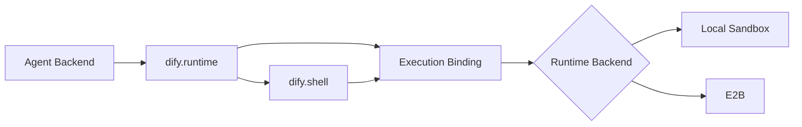

Sandbox 负责：

- Shell Command；
- Code / CLI；
- 文件读写；
- 依赖安装；
- Agent Workspace。

Runtime Backend 决定底层使用 Local 还是 E2B，Agent 上层 Loop 不需要改变 Tool / Reasoning 逻辑。

#### 4.3.8 状态管理与终止

Agent Backend 将一次执行定义为一个 `agent run`。

| 状态 / 数据 | 保存位置或形式 |
| --- | --- |
| Run Status | Redis Run Record |
| Streaming Event | Redis Event Stream |
| 对话 / Tool History | History Layer |
| 可恢复 Layer State | Session Snapshot |
| Sandbox 工作状态 | Runtime Binding / Workspace |

一个 Run 的结束路径主要包括：

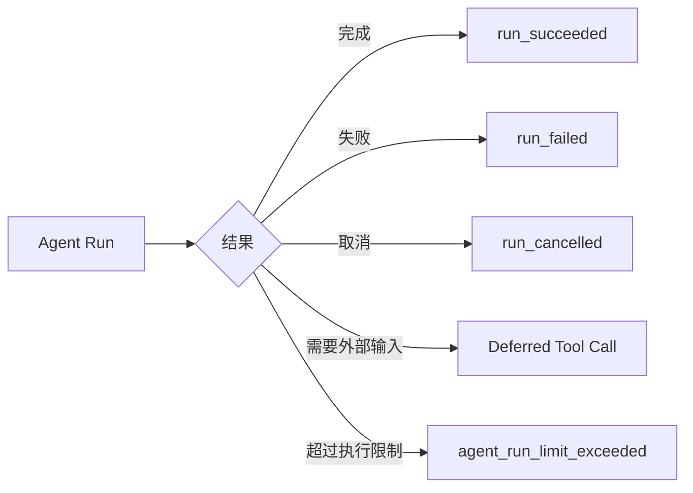

正常完成时返回 Output；需要 Human Input 等外部动作时，当前 Run 可以先结束并返回 Deferred Tool Call，后续使用原 Session Snapshot 继续新的 Agent Run。

#### 4.3.9 核心源码位置

| 模块 | 路径 |
| --- | --- |
| Agent App Runtime | `api/core/app/apps/agent_app/` |
| Workflow Agent v2 | `api/core/workflow/nodes/agent_v2/` |
| Agent Config / Soul | `api/models/agent_config_entities.py` |
| Agent Backend Client | `api/clients/agent_backend/` |
| Agent Backend Server | `dify-agent/src/dify_agent/server/` |
| Agent Protocol | `dify-agent/src/dify_agent/protocol/` |
| Runtime Layers | `dify-agent/src/dify_agent/layers/` |
| Sandbox Runtime | `dify-agent-runtime/` |

### 4.4 能力实测

测试从单次能力调用逐步增加到开放式长任务。

| Case | 测试场景 | 主要观察项 |
| --- | --- | --- |
| Case 1 | 简单问答 | 基础执行、回答完整性 |
| Case 2 | 单 Tool | Tool 选择、参数正确性 |
| Case 3 | 多 Tool | 调用顺序、Observation 利用 |
| Case 4 | 多步骤任务 | 决策路径、是否遗漏步骤 |
| Case 5 | 文件 + Tool | 文件读取、Tool 与 Sandbox 协同 |
| Case 6 | 长链路任务 | Context、重复调用、终止、错误恢复 |
| Case 7 | 推荐效果异常原因分析 | Tool 自主选择、调查路径、证据完整性、人工介入 |

Case 7 使用与当前推荐效果分析 Agent 相同的业务问题和 Tool，不提前提供固定 Fast → Plan → ReAct → Summary 路径，观察新版 Dify Agent 能否自主完成同一任务。

### 4.5 能力边界与不足

问题必须从 4.4 的实际执行轨迹中得到，并定位到具体机制。

| 问题 | Case | 发生位置 | 实际表现 | 原因 | 影响 |
| --- | --- | --- | --- | --- | --- |
|  |  | Planning / Tool / Context / Sandbox / State / Termination |  |  |  |

重点检查：规划、Tool 选择、Context、长任务、错误恢复和执行可控性。

### 4.6 Dify Agent 增强方案

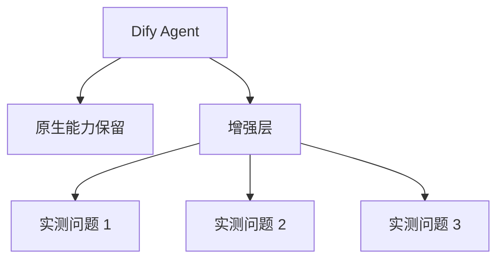

| 原生问题 | 根因 | 增强位置 | 增强方案 | 验证结果 |
| --- | --- | --- | --- | --- |
|  |  |  |  |  |

具体增强点由 4.5 的实际问题决定，不提前增加新的 Planner、Memory、Tool Router 或控制层。

---

## 5. 综合分析与增强架构

### 5.1 两类能力的问题总结

| | AI Workflow | Dify Agent |
| --- | --- | --- |
| 解决的问题 | Workflow 构建 | 复杂任务执行 |
| AI 决策对象 | Workflow Graph | 下一步 Action |
| 决策发生时间 | 开发时 | 运行时 |
| 核心机制 | Planning + Graph Generation | Agent Loop |
| 结构是否固定 | 生成后固定 | 运行中动态决定 |
| 主要能力边界 | 实测后填写 | 实测后填写 |
| 增强方向 | 实测后填写 | 实测后填写 |

两类能力最终需要分别回答：

- **AI Workflow**：原生生成器能把 Workflow 自动化到什么程度？
- **Dify Agent**：原生 Agent 能把当前自定义多 Agent / ReAct 逻辑收敛到什么程度？

### 5.2 增强目标

发现问题后按问题所在层决定处理方式：

| 类型 | 判断标准 | 处理方式 |
| --- | --- | --- |
| Dify 原生机制问题 | 在不同业务 Case 中稳定复现，问题来自 Generator / Agent Runtime 本身 | 修改 Dify |
| 业务上下文问题 | 问题来自 Tool 描述、业务规则、Prompt、Capability Context | 外围增强 |
| 配置问题 | 原生已有能力，只是当前配置没有正确使用 | 直接配置 |
| 低收益问题 | 对当前推荐分析目标影响小，人工确认成本可接受 | 不处理 |

增强目标是**尽量复用 Dify 原生能力，只补真实缺口**，而不是在 Dify 上再搭一套平行的 Workflow Generator 或 Agent Runtime。

### 5.3 整体增强架构


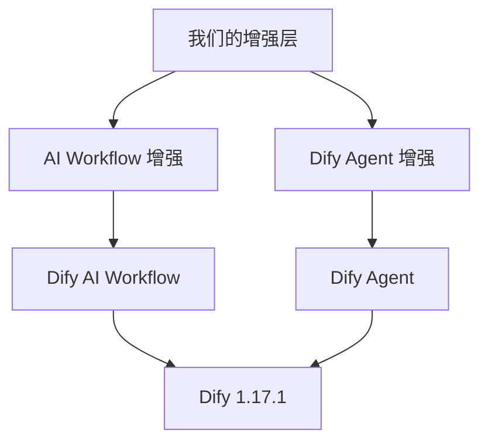

最终架构中的具体增强模块，只从 3.5 和 4.5 已确认的问题中产生。

---

## 6. 调研结论

结论只回答选型和增强问题，不再重复功能介绍。

### 6.1 AI Workflow

| 问题 | 结论 | 依据 |
| --- | --- | --- |
| 值不值得使用 |  | 3.4 实测 |
| 原生能力能做到哪里 |  | 3.4 / 3.5 |
| 需要增强什么 |  | 3.5 / 3.6 |

### 6.2 Dify Agent

| 问题 | 结论 | 依据 |
| --- | --- | --- |
| 值不值得使用 |  | 4.4 实测 |
| 原生能力能做到哪里 |  | 4.4 / 4.5 |
| 需要增强什么 |  | 4.5 / 4.6 |

### 6.3 最终方案

| 决策 | 内容 | 优先级 |
| --- | --- | --- |
| 直接使用 Dify 原生能力 |  |  |
| 配置 / 外围增强 |  |  |
| Dify 二次增强 |  |  |
| 不处理 |  |  |

最终结论由真实推荐分析 Case 的源码分析、执行轨迹和测试结果共同确定。
