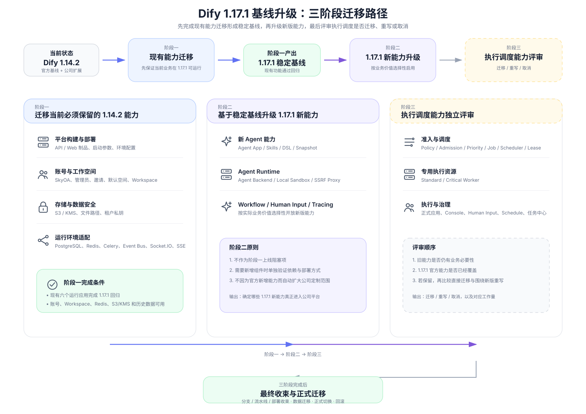

# Dify 1.17.1 基线升级方案

## 一、升级目标

当前平台基于 Dify 1.14.2，并扩展了 SkyOA、工作空间治理、S3/KMS、文件与租户私钥、托管执行调度等公司能力。本次升级以 Dify 1.17.1 为新基线，分阶段完成现有能力适配、新版本能力升级以及执行调度能力评审，最终形成统一的 1.17.1 公司版本。

| 目标 | 内容 |
| --- | --- |
| 基线升级 | 平台基础版本由 Dify 1.14.2 升级到 Dify 1.17.1 |
| 现有能力迁移 | 将 SkyOA、工作空间、S3/KMS、文件与私钥等现有公司能力适配到 1.17.1 |
| 新能力升级 | 基于 1.17.1 新增能力确定后续启用范围及运行组件 |
| 调度能力评审 | 对现有执行调度、任务中心和专用 Worker 评估迁移、重写或取消 |
| 数据兼容 | 保证账号、工作空间、历史文件、租户私钥及已有业务数据可继续使用 |
| 平稳切换 | 三阶段完成后统一收束分支、流水线、部署和数据，再执行正式迁移 |

---

## 二、升级架构与范围

### 2.1 当前架构与 Dify 1.17.1 官方架构

### 2.2 本次迁移架构

### 2.3 阶段一：现有能力迁移

| 能力方向 | 当前能力 | 阶段一处理 | 1.17.1 落点 |
| --- | --- | --- | --- |
| 平台构建与部署 | API / Web 公司构建方式、环境配置、启动参数 | 按 1.17.1 依赖和启动方式调整公司构建与发布入口 | API / Web 官方制品与运行角色 |
| 数据库与 Redis | 当前测试库、缓存、Celery 使用旧版数据空间 | 建立独立 1.17.1 数据库、Redis DB、Prefix 和队列空间 | PostgreSQL / Redis |
| Redis Event Bus | Sentinel 环境下跨进程消息 | Sentinel 模式复用远程 Redis 客户端，并隔离频道 | Redis Event Bus |
| Socket.IO | 1.17.1 新增工作流实时协作 RedisManager | 增加 Sentinel URL、认证、DB 和频道隔离 | Socket.IO |
| SkyOA 登录 | Provider、回调、账号匹配和绑定 | 适配新版 Account、Identity、Repository 和 Session | Account / Identity |
| 管理员初始化 | SkyOA 首次安装、初始管理员、失败清理 | 接入新版 Setup 流程和新版事务模型 | Setup / Account / Workspace |
| 邀请注册 | 数据库邀请记录、SkyOA 接受邀请 | 适配新版 Account Activation 和成员接口 | Account / Workspace |
| 默认工作空间 | 唯一默认空间、新用户加入、current workspace | 适配新版 Tenant、Session 和成员关系 | Workspace / Tenant |
| 工作空间管理 | 创建、指定 owner、查询、切换、归档和权限 | 复用新版成员、Session 和 RBAC 基础 | Workspace |
| SSE 请求 | 自定义 Header 与认证 Header 合并 | 迁入独立于调度的通用 Header 修复 | Web Request / SSE |
| S3 / KMS | KMS 凭据、刷新、S3 Client | 将公司 KMS Provider 接入 1.17.1 Storage | Storage Provider |
| 文件与租户私钥 | 对象前缀、应用目录、历史文件、RSA 私钥 | 适配新版 Storage / FileService 并兼容历史引用 | Storage / Tenant |

### 2.4 阶段二：1.17.1 新能力升级

| 能力方向 | 1.17.1 新增或增强能力 | 组件影响 | 阶段二处理 |
| --- | --- | --- | --- |
| Workflow 与应用编排 | 自然语言生成 Workflow / Chatflow、运行记录导出、节点定位、LLM Environment 等 | 主要复用现有 API / Web / Worker | 按公司实际使用场景启用 |
| Human Input | 富表单、Loop / Iteration 内 Human Input | 复用官方 Workflow Runtime | 使用官方能力，不接入旧公司调度 |
| Agent | 新 Agent App、Agent Skills、Agent DSL、Agent Home Snapshot | 可能引入独立 Agent Runtime | 单独验证产品需求后启用 |
| Agent Runtime | Agent Backend、Local Sandbox、Agent SSRF Proxy | 可能新增运行应用、流水线和网络支撑 | 仅在启用对应 Agent 能力时部署 |
| WebApp | 应用描述和输入提示等展示能力 | Web / API | 按业务需要开放 |
| 可观测 | Unified Tracing、Knowledge Tracing | API / Worker / Trace 后端 | 验证公司环境兼容后开放 |
| CLI | difyctl | 无长期运行组件 | 按运维需求启用 |
| 知识库与检索 | Excel 图片解析、ODT、TiDB 混合检索等 | Plugin / 向量库 / Worker | 按实际数据源和检索需求启用 |
| 多模态与工具 | 文件直接传入多模态模型、日期参数类型 | API / Plugin | 随应用场景启用 |
| 安全与数据治理 | 外部 KMS Provider、会话清理等 | Storage / 定时任务 | 与现有公司能力对齐后启用 |

### 2.5 阶段三：执行调度能力评审

| 能力方向 | 待评审项 | 主要变化点 | 评审方向 |
| --- | --- | --- | --- |
| 托管执行准入 | Policy、Admission、Priority、容量限制 | 新版应用入口和异步执行参数发生变化 | 评估直接迁移、基于 1.17.1 重写或取消 |
| 调度中心 | Job、Scheduler、Lease、Outbox、Generation | 旧任务状态与 Worker 生命周期高度绑定 | 评估保留完整调度中心、缩减为外围治理或取消 |
| 专用 Worker | Standard / Critical Worker | 旧 Worker 直接承接公司调度并调用旧 Runtime | 评估是否仍需要专用资源池及新的接入方式 |
| 正式应用托管 | Workflow、Chatflow、Chat、Completion、Agent | 1.17.1 各应用执行入口、Session、消息和结果管理变化 | 评估继续托管或直接使用官方执行 |
| Console 调试 | Draft、Single Node、Iteration、Loop | 调试入口、节点事件和前端状态变化 | 评估复用官方调试或重新接入治理层 |
| Human Input | Pause、Resume、Retry | 1.17.1 已有新的暂停恢复上下文 | 评估使用官方能力或增加外围治理 |
| Schedule | 正式和草稿定时触发 | 1.17.1 Trigger / Schedule 链路变化 | 评估使用官方调度或增加公司准入 |
| 任务管理 | Query、Cancel、Stop、Retry、Streaming / Blocking Result | 旧任务中心依赖公司 Job 状态 | 根据调度能力最终取舍决定是否保留 |
| 调度监控与审计 | Worker / Scheduler Health、OTel、执行审计 | 指标和审计主体依赖旧调度模型 | 随最终调度方案重新设计或取消 |

---

## 三、阶段一：现有能力迁移

### 3.1 功能迁移

| 功能点 | 来源 | 1.17.1 变化 | 迁移与适配 |
| --- | --- | --- | --- |
| SkyOA 登录 | `origin/feature/20260701`；后续账号匹配增强来自 `origin/feature/20260825_S3` | OAuth、账号查询、Identity 关联和 Session 接口变化 | 保留 SkyOA Provider、POST 回调、state/nonce、账号绑定和邮箱匹配规则；改用新版 Account / Identity / Repository / Session |
| 管理员初始化 | `origin/feature/20260701`；失败清理修复来自 `origin/feature/20260825_S3` | Setup 初始化流程和事务边界变化 | 在新版 Setup 中增加 SkyOA 初始化分支；失败时只清理由本次创建的账号、空间和身份关联 |
| 邀请注册 | `origin/feature/20260701` | 新版 Account Activation、成员接口和 Session 变化 | 保留邀请记录、状态、有效期、Token 及 SkyOA 邮箱校验；接受邀请时调用新版账号和成员能力 |
| 默认工作空间 | `origin/feature/20260701` | Tenant、成员关系和 current workspace 处理变化 | 保留 `is_default`、唯一默认空间、无空间账号加入和 current 修复规则；按新版 Session 重写 |
| 工作空间管理 | `origin/feature/20260701`；指定 owner 和筛选增强来自 `origin/feature/20260825_S3` | Workspace Controller、返回类型、权限和 Session 变化 | 保留创建、指定 owner、列表、筛选、切换、归档和权限保护；底层复用新版 Tenant / Session / RBAC |
| SSE Header | `origin/feature/20260825_S3` 混合提交中的通用修复 | 新版请求层仍需要处理自定义 Header 与系统 Header 的合并 | 只迁认证、CSRF、分享标识等系统 Header 的保留规则，不迁混合提交中的公司调度代码 |
| S3 / KMS | `origin/feature/20260825_S3` | 新版 Storage 已增加预签名和流式读取等实现 | 增加公司 KMS Provider、凭据刷新和受控重试；保留 1.17.1 官方 S3 Client 其余行为 |
| 文件路径 | `origin/feature/20260825_S3` | FileService、上传入口和 Workflow 文件调用链变化 | 保留对象前缀、Tenant/App 目录规则；按新版入口透传真实 app_id，并兼容历史 UploadFile.key |
| 租户私钥 | `origin/feature/20260825_S3` | Key Provider 和缓存实现变化 | 保留公司 RSA 私钥路径与 Tenant 缓存语义；新租户记录真实路径，历史私钥先核对真实对象再处理 |

### 3.2 双基线隔离运行与组件改造

阶段一只建立可独立运行的 1.17.1 升级环境，不执行正式环境切换。当前 1.14.2 与 1.17.1 两套基线并行运行，源码分支、构建流水线、部署、配置和数据空间全部隔离。

#### 3.2.1 分支、流水线与 DevOps 部署

| 对象 | 当前 1.14.2 基线 | 1.17.1 升级基线 | 阶段一处理 |
| --- | --- | --- | --- |
| 源码分支 | 当前稳定 1.14.2 公司分支 | `release/1.17.1` | 两条分支独立维护，不在阶段一提前收束 |
| 构建流水线 | 当前 test 流水线 | 新建或复制 1.17.1 独立流水线 | 分别绑定对应分支和 Commit，制品不可混用 |
| 应用 | 现有 dify-api / worker / beat / web / plugin-daemon / sandbox | 复用同一批应用 | 阶段一不申请新的基础应用 |
| 部署 | 当前 test | `test-upgrade-1.17.1` | 每个现有应用增加独立升级部署，当前 test 保持不动 |
| 配置 | 当前 test 配置 | 1.17.1 upgrade 配置 | DB、Redis、Secret、服务地址和前端构建参数独立 |
| 路由 | 当前测试域名 | 独立升级域名或路由 | 两套环境独立访问，不通过同一入口切换 |
| 制品 | 当前 1.14.2 制品 | 1.17.1 API / Web 制品 | 使用独立构建号和 Commit 标识 |

#### 3.2.2 运行组件

| 组件 | 阶段一方案 | 说明 |
| --- | --- | --- |
| API | 现有应用新增 1.17.1 upgrade 部署 | 负责 Console / Service API、登录和 Workspace |
| General Worker | 现有应用新增 1.17.1 upgrade 部署 | 只运行 1.17.1 官方普通队列，不引入 Standard / Critical Worker |
| Beat | 现有应用新增 1.17.1 upgrade 部署 | 运行 1.17.1 官方周期任务 |
| Web | 现有应用新增 1.17.1 upgrade 部署 | 使用 1.17.1 Web 制品及独立前端配置 |
| Plugin Daemon | 独立验证 1.17.1 兼容版本 | 不改变现有职责 |
| Sandbox | 独立验证 1.17.1 兼容版本 | 不改变现有职责 |
| Agent Backend / Local Sandbox / SSRF Proxy | 阶段一不默认部署 | 是否部署由阶段二的新 Agent 能力选择决定 |
| 公司 Scheduler / Standard / Critical Worker | 阶段一不部署 | 是否保留由阶段三评审决定 |

#### 3.2.3 PostgreSQL 与 Migration

| 项目 | 阶段一处理 |
| --- | --- |
| 当前 1.14.2 数据库 | 保持不动，不执行 1.17.1 migration |
| 1.17.1 数据库 | 使用独立升级数据库；本地当前为 `ai_studio_1171_dev` |
| Schema | 在 1.17.1 独立数据库中验证官方 Schema 和阶段一公司能力需要的 Schema |
| 历史数据 | 阶段一不做正式迁移；需要验证兼容时使用数据库副本或受控样本 |
| Migration 链 | 先完成官方 1.17.1 与保留公司 revision 的合流设计和副本验证，正式旧库迁移放到第六章 |
| 执行调度历史表 | 不因阶段一不启用调度代码而删除，最终去向由阶段三决定 |

#### 3.2.4 Redis、Celery、Event Bus 与 Socket.IO

| 组件 | 阶段一处理 |
| --- | --- |
| Redis Cache | 与 1.14.2 隔离；本地当前使用 DB 2 和 `dify_1171_dev` 前缀 |
| Celery Broker / Result | 与旧 Worker 隔离；本地当前使用 DB 3 和相同环境前缀 |
| Redis Pub/Sub | 不能依赖逻辑 DB 隔离，所有事件频道增加环境前缀 |
| Event Bus | Sentinel 模式复用已连接的远程 Redis 客户端；非 Sentinel 保留独立 URL |
| Socket.IO | 使用独立 RedisManager 连接同一套 Sentinel，构造 Sentinel URL 并传递认证、DB 和频道前缀 |
| 队列数据 | 阶段一不迁移旧 Celery 队列，新旧 Worker 不消费对方任务 |

#### 3.2.5 平台构建

| 项目 | 阶段一处理 |
| --- | --- |
| API / Worker / Beat | 共用 1.17.1 API 后端制品，通过不同启动角色区分 |
| Web | 独立 Web 制品 |
| build.sh | 保留公司平台制品入口，只适配 1.17.1 依赖、目录和构建产物 |
| Node / pnpm | 使用 1.17.1 官方版本要求，不恢复旧版本限制 |
| Web Host | 保留公司 SERVER_HOST 需求，同时兼容新版 pnpm 启动参数 |
| 数据库命令 | 使用目标 1.17.1 实际 migration 命令；阶段一只操作独立升级数据库 |

### 3.3 验证内容

#### 3.3.1 基础运行

| 检查项 | 通过标准 |
| --- | --- |
| API | Health 200，版本和目标 Commit 正确 |
| Web | 页面、JS、CSS、图片和基础 Console API 正常 |
| General Worker | 可启动、可 ping，只消费 1.17.1 官方队列 |
| Beat | 单实例运行，使用升级环境 Broker |
| Plugin Daemon | Health 正常，基础认证与插件连接正常 |
| Sandbox | Health 正常，Code Node 可执行 |
| PostgreSQL | 实际连接 1.17.1 独立数据库 |
| Redis | Cache、Broker、Result、频道均使用升级环境隔离空间 |

#### 3.3.2 账号与工作空间

| 场景 | 通过标准 |
| --- | --- |
| SkyOA 登录 | Provider、回调、state/nonce、绑定和邮箱匹配符合原业务规则 |
| 管理员初始化 | 只在未初始化环境执行，失败不清理既有数据 |
| 邀请注册 | 接受、过期、撤销、邮箱不符、重复接受符合原规则 |
| 默认空间 | 全局唯一，无空间账号正确加入 |
| current workspace | 始终只有一个有效 current，不落到 archived Workspace |
| Workspace 管理 | 创建、指定 owner、查询、筛选、切换和归档正常 |

#### 3.3.3 1.17.1 官方能力回归

| 类型 | 核心验证 |
| --- | --- |
| Workflow | 创建、运行、Streaming、Stop、运行记录 |
| Chatflow | 多轮会话和 Workflow 执行 |
| Chat / Completion | Streaming / Blocking、消息落库 |
| Human Input | 只验证 1.17.1 官方暂停与恢复 |
| Schedule | 只验证 1.17.1 官方定时触发 |
| Console 调试 | Draft、Single Node、Iteration、Loop 使用官方能力 |
| Agent | 阶段一只确认现有业务不会被新 Agent 链路阻断 |

#### 3.3.4 Redis 与实时协作

| 场景 | 通过标准 |
| --- | --- |
| Cache 隔离 | 1.14.2 与 1.17.1 不读取对方缓存 |
| Celery 隔离 | 两版 Worker 不消费对方任务 |
| Event Bus | 实际 API / Worker 业务事件可跨进程送达 |
| Socket.IO | 连接远程 Sentinel，不回退本机 Redis |
| WebSocket | Engine.IO / Socket.IO 握手成功 |
| Workflow 协作 | 登录后实时协作事件可跨 API 实例同步 |

#### 3.3.5 S3、KMS、文件与私钥

| 场景 | 通过标准 |
| --- | --- |
| KMS | 凭据获取与刷新正常，日志不输出敏感信息 |
| S3 | 上传、读取、下载、删除、exists、预签名和流式读取正常 |
| 历史文件 | 旧 UploadFile.key 可访问 |
| 新文件 | 新目录和对象前缀规则正确 |
| 私钥 | 新租户记录真实私钥路径；历史私钥兼容验证通过 |
| 失败清理 | Workspace 创建失败只清理由本次创建的私钥对象 |

阶段一通过后保留 1.14.2 与 1.17.1 两套隔离环境，不执行正式切换。

---

## 四、阶段二：1.17.1 新能力升级

### 4.1 功能升级

| 能力 | 实施方式 | 是否新增运行组件 |
| --- | --- | --- |
| Workflow / Chatflow 新能力 | 直接基于阶段一稳定基线验证并开放需要的产品能力 | 否 |
| Human Input 增强 | 使用 1.17.1 官方能力，不重新接入旧公司调度 | 否 |
| WebApp 增强 | 按业务需要启用新版展示能力 | 否 |
| Unified / Knowledge Tracing | 验证公司 Trace 环境和数据链路后启用 | 视现有可观测部署而定 |
| difyctl | 按运维需求启用 | 否 |
| 知识库与检索增强 | 按实际文档类型、向量库和检索需求启用 | 视数据源与向量库而定 |
| 多模态与 Tool 新参数 | 随应用需求启用 | 否 |
| 新 Agent App / Skills | 单独进行产品和技术验证 | 是，可能需要 Agent Runtime |
| Agent Sandbox | 按选定 Agent 能力验证代码 / Shell 执行边界 | 是 |
| 数据治理新能力 | 与公司已有数据治理、KMS 和清理机制对齐后启用 | 视具体能力而定 |

### 4.2 组件与部署

阶段二只为最终确认启用的新能力增加组件，不提前申请空闲应用。

| 组件 / 资源 | 处理 |
| --- | --- |
| Agent Backend | 只有新 Agent 能力确认启用后才新增应用、流水线、部署和 Secret |
| Agent Local Sandbox | 只有选择 Local Sandbox 后才新增独立运行组件 |
| Agent SSRF Proxy | 根据公司网络方案选择官方组件或公司等价代理能力 |
| API / Worker | 保持阶段一 1.17.1 基线，增加新能力所需配置和依赖 |
| Plugin / Sandbox | 复用现有组件；新增能力需要不同版本时独立验证 |
| PostgreSQL / Redis | 继续使用 1.17.1 upgrade 隔离环境，新增 Schema 或 Key 空间随功能验证 |
| 分支 / 流水线 | 继续在 1.17.1 升级分支和独立流水线上开发验证，不切换当前 1.14.2 环境 |

### 4.3 验证内容

| 验证方向 | 内容 |
| --- | --- |
| 产品能力 | 每个实际启用的新能力分别完成创建、配置、执行和异常路径测试 |
| 运行组件 | Agent Backend / Local Sandbox / Proxy 等新增组件完成 Health、依赖和重启恢复验证 |
| 网络与安全 | Sandbox 出网、SSRF Proxy、Secret 和内部认证满足公司网络与安全要求 |
| 数据 | 新能力新增表、缓存和对象存储数据只写入升级环境 |
| 兼容性 | 新能力启用后，阶段一现有 Workflow、Chatflow、账号、Workspace 和存储能力继续通过回归 |
| 运维 | 新增组件必须具备独立流水线、配置、日志和回滚方式 |

---

## 五、阶段三：执行调度能力评审

### 5.1 功能评审

评审顺序统一为：**业务必要性 → 1.17.1 官方覆盖程度 → 直接迁移可行性 → 重写方案 → 是否取消。**

| 能力 | 评审重点 | 可能结果 |
| --- | --- | --- |
| Policy / Admission / Priority | 是否仍需要统一准入、优先级和容量治理 | 迁移 / 重写 / 取消 |
| Job / Scheduler / Lease / Outbox | 是否仍需要独立任务状态和派发中心 | 迁移 / 重写 / 缩减 / 取消 |
| Standard / Critical Worker | 是否仍需要双资源池以及公司级资源隔离 | 迁移 / 重写 / 取消 |
| Workflow / Chatflow 托管执行 | 官方执行是否已经满足现有业务治理要求 | 接官方 / 重写外围治理 / 保留托管 |
| Chat / Completion / Agent 托管 | 不同应用类型是否仍需要统一公司 Job | 接官方 / 重写 / 保留 |
| Console 调试 | 官方 Draft / Node / Iteration / Loop 是否足够 | 使用官方 / 增加外围治理 |
| Human Input | 官方 Pause / Resume 是否足够 | 使用官方 / 增加外围治理 |
| Schedule | 官方 Trigger / Schedule 是否足够 | 使用官方 / 增加公司准入 |
| 任务中心 | 若不保留公司 Job，任务中心是否仍有存在基础 | 保留 / 重做 / 取消 |
| 调度监控与审计 | 最终调度方案需要哪些 Health、OTel 和 Audit | 保留 / 重做 / 取消 |

### 5.2 架构与组件评审

| 方案方向 | 架构含义 | 组件影响 |
| --- | --- | --- |
| 使用 1.17.1 官方执行 | 取消公司应用执行调度层，正式应用直接走官方 Runtime | 不新增 Scheduler / Standard / Critical Worker，任务中心随之缩减或取消 |
| 外围治理重写 | 保留准入、优先级或资源治理，但不接管官方 Runtime 内部执行 | 可能保留轻量 Job / Policy 服务，Worker 继续使用官方机制 |
| 直接迁移旧调度 | 尽量保留现有 Scheduler、Job、双 Worker 和任务中心 | 需要逐项适配新版应用入口、Session、SSE、Human Input、Schedule 和 Agent |
| 基于 1.17.1 重写托管执行 | 保留现有业务目标，但按 1.17.1 官方执行契约重新设计 | 重新定义 Scheduler / Job / Worker 与官方 Runtime 的边界 |

阶段三结束时必须形成最终组件清单：哪些公司执行组件继续存在、哪些重写、哪些删除，以及对应数据库表、队列、接口和 DevOps 应用是否继续保留。

### 5.3 评审验证

| 验证项 | 内容 |
| --- | --- |
| 官方能力覆盖 | 对 Workflow、Chatflow、Chat、Completion、Agent、Human Input、Schedule 分别验证官方能力能否满足现有业务要求 |
| PoC | 对需要保留的调度能力做最小链路验证，不先整体搬旧代码 |
| Job 映射 | 若保留公司 Job，验证与 workflow_run_id / task_id / message 等新版标识的关系 |
| Streaming / Blocking | 验证官方 SSE、最终结果、Stop / Cancel 与公司治理需求的差距 |
| Worker | 若保留专用 Worker，验证新版执行入口、Session 生命周期和队列职责 |
| 暂停恢复 | 若保留 Human Input 托管，验证官方 WorkflowPause / ResumptionContext 的可接入方式 |
| Schedule | 若保留定时任务托管，验证官方 Trigger / Schedule 与公司准入边界 |
| 结论 | 每项输出“迁移 / 重写 / 取消”及工作量，作为第六章最终收束输入 |

---

## 六、最终收束与正式迁移

三阶段完成并确定最终功能和组件范围后，再执行正式环境的整体收束。本章处理的是最终切换，不参与前三阶段的双基线验证。

### 6.1 分支与流水线收束

| 项目 | 最终处理 |
| --- | --- |
| 目标代码 | 固定最终 1.17.1 公司版本 Commit |
| 分支 | 将阶段一、二及阶段三最终保留能力收束到正式 1.17.1 发布分支 |
| 流水线 | 以最终分支建立正式 API / Web / Worker / 其他保留组件流水线 |
| 临时升级流水线 | 正式切换稳定后下线阶段验证用流水线 |
| 制品 | 所有正式组件记录同一版本、Commit 和构建号 |

### 6.2 部署收束

| 项目 | 最终处理 |
| --- | --- |
| 基础六组件 | API、Worker、Beat、Web、Plugin Daemon、Sandbox 使用最终 1.17.1 版本 |
| 阶段二新增组件 | 只保留实际启用的新能力所需组件 |
| 阶段三执行组件 | 只部署最终评审决定保留或重写的 Scheduler / Worker / Task 服务 |
| 配置 | 将升级环境验证过的配置转换为目标环境配置，Secret 继续由 DevOps 注入 |
| 路由 | 正式切换时将目标域名 / 流量指向 1.17.1 部署 |
| 临时升级部署 | 稳定观察后删除 `test-upgrade-1.17.1` 等临时部署 |

### 6.3 数据迁移

| 项目 | 最终处理 |
| --- | --- |
| PostgreSQL 备份 | 切换前完整备份目标旧库并验证备份可读取 |
| Schema Migration | 在正式目标库一次性执行 1.17.1 官方 migration + 最终保留的公司 migration |
| 账号 / Workspace | 保留 account_id、Tenant、成员关系、默认空间和归档状态 |
| 调度历史表 | 根据阶段三结论保留、只读留存或继续使用；不因代码取消直接删除历史数据 |
| Redis | 不迁移旧 Cache、Celery 队列和 Result；新版本从干净命名空间启动 |
| S3 | 默认不全量搬对象；保留历史 Key 兼容。若最终路径策略要求搬迁，再单独执行对象迁移 |
| 租户私钥 | 先核对数据库引用和真实对象，再按最终路径方案处理，禁止重新生成旧租户密钥 |

### 6.4 正式切换

1. 固定最终 Commit、构建号和配置版本。
2. 停止旧版会产生新任务的入口、Worker 和 Beat。
3. 完成 PostgreSQL 全库备份。
4. 执行最终数据库 Migration。
5. 发布最终确定的 1.17.1 组件。
6. 验证 API、Web、Worker、Plugin、Sandbox 及阶段二/三新增组件。
7. 执行账号、Workspace、Workflow、Chatflow、存储和最终调度方案的 Smoke Test。
8. 切换正式路由或流量。
9. 观察运行状态、错误率、队列和数据写入。
10. 稳定后下线旧 1.14.2 部署和临时升级环境。

### 6.5 回滚

| 场景 | 回滚处理 |
| --- | --- |
| 代码或组件异常 | 路由切回旧版并停止新版 Worker / Beat / 新增组件 |
| 数据库仍兼容旧版 | 保留当前数据库，仅回滚运行组件 |
| 数据库不兼容旧版 | 使用发布前 PostgreSQL 备份恢复 |
| Redis | 不通过恢复旧队列进行回滚，避免重复消费 |
| S3 / 文件 | 优先保持对象不变，通过数据库引用和代码回滚恢复访问 |
| 新增组件 | Agent / 调度等独立组件按各自流水线回滚，不影响基础六组件 |

---

## 七、实施计划

状态说明：✅ 已完成　🟡 基础验证已完成 / 仍需业务验证　⬜ 待实施　🔶 待评审

| 阶段 | 能力 | 当前状态 | 下一步 |
| --- | --- | --- | --- |
| 阶段一 | Dify 1.17.1 基线与升级分支 | ✅ | 固定阶段一目标 Commit |
| 阶段一 | PostgreSQL / Redis 隔离 | 🟡 | 本地已验证，补 DevOps 升级环境 |
| 阶段一 | Redis Event Bus / Socket.IO Sentinel | 🟡 | 单测和本地连接通过，补真实业务和登录协作验证 |
| 阶段一 | 平台构建与部署支持 | 🟡 | 补独立流水线、制品和 `test-upgrade-1.17.1` 部署验证 |
| 阶段一 | SkyOA 登录 | ⬜ | 按 3.1 迁入并验证 |
| 阶段一 | 管理员初始化 | ⬜ | 按 3.1 迁入并验证 |
| 阶段一 | 邀请注册 | ⬜ | 按 3.1 迁入并验证 |
| 阶段一 | 默认工作空间 | ⬜ | 按 3.1 迁入并验证 |
| 阶段一 | 工作空间管理 | ⬜ | 按 3.1 迁入并确认新版页面位置 |
| 阶段一 | SSE Header | ⬜ | 只迁通用修复 |
| 阶段一 | S3 / KMS | ⬜ | 迁入最终 Provider、刷新和重试能力 |
| 阶段一 | 文件路径 / 租户私钥 | ⬜ | 核对历史对象后迁入 |
| 阶段一 | 全量回归 | ⬜ | 完成 3.3 全部验证，保持双基线并行 |
| 阶段二 | 1.17.1 新功能 | ⬜ | 按业务价值逐项选择并验证 |
| 阶段二 | Agent Runtime 组件 | ⬜ | 只有确认启用 Agent 能力后再申请应用和流水线 |
| 阶段三 | 执行调度能力 | 🔶 | 对每项输出迁移 / 重写 / 取消结论 |
| 阶段三 | 最终组件清单 | 🔶 | 确定 Scheduler、专用 Worker、任务中心及监控是否保留 |
| 最终收束 | 分支 / 流水线 / 部署 | ⬜ | 三阶段完成后统一收束 |
| 最终收束 | 正式数据迁移与切换 | ⬜ | 按第六章执行 |
