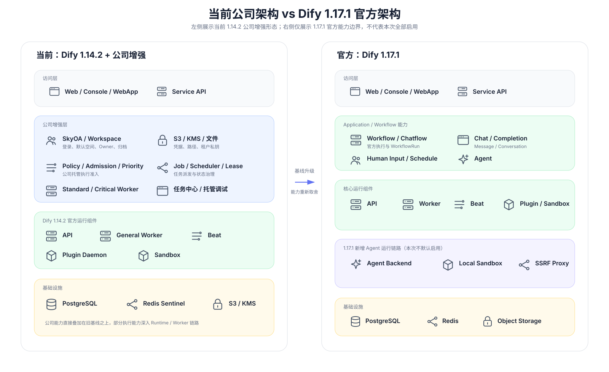
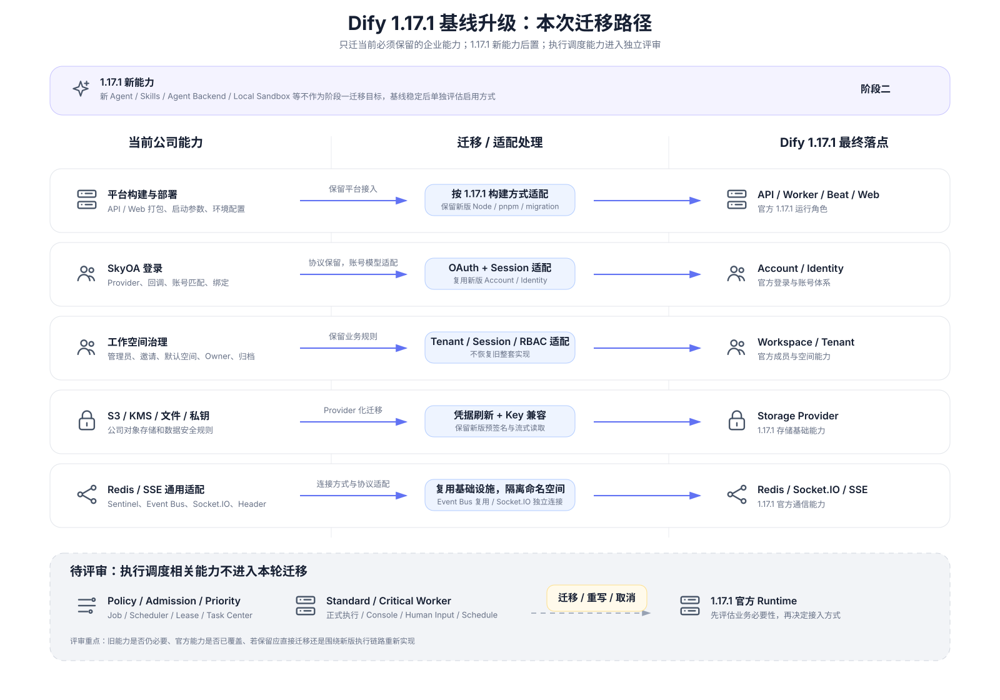

# Dify 1.17.1 基线升级方案

## 一、升级目标

当前平台基于 Dify 1.14.2，在官方能力之外扩展了 SkyOA、工作空间治理、S3/KMS、文件与租户私钥、托管执行调度等公司能力。本次将基础版本升级到 Dify 1.17.1，但不再要求一次性迁移全部公司扩展：先完成当前必须保留的核心能力与运行环境迁移，1.17.1 新能力在基线稳定后再评估启用；与旧 Runtime、Worker 和任务状态深度耦合的公司执行调度能力单独评审。

| 目标 | 内容 |
| --- | --- |
| 基线升级 | 平台基础版本由 Dify 1.14.2 升级到 Dify 1.17.1 |
| 现有能力迁移 | 保留并适配 SkyOA、工作空间、S3/KMS、文件与私钥、平台部署等当前仍需要的企业能力 |
| 数据兼容 | 保证账号、工作空间、历史文件、租户私钥及已有业务数据可继续使用 |
| 降低升级耦合 | 优先复用 1.17.1 官方实现，只迁业务目标和必要扩展，减少公司代码继续侵入 Dify Runtime |
| 平稳升级 | 在独立升级环境完成数据迁移、功能回归和回滚验证后再进入正式切换 |

---

## 二、升级架构与范围

### 2.1 当前架构与 Dify 1.17.1 官方架构

当前版本是在 Dify 1.14.2 官方运行组件之上叠加公司账号治理、存储安全和托管执行等扩展，其中执行调度部分已经进入应用入口、任务状态和 Worker 执行链路。Dify 1.17.1 自身又调整了应用执行、Human Input、Schedule、Agent 等能力，并新增独立 Agent 运行组件，因此本次不能把旧公司实现整体覆盖到新版，而需要按能力重新判断迁移方式。

### 2.2 本次迁移架构

第二张图表示本次实际迁移内容：左侧是当前公司能力，中间是迁移或适配方式，右侧是最终接入的 Dify 1.17.1 官方能力。阶段一只处理当前必须保留的企业能力；1.17.1 新 Agent 链路后置；公司执行调度能力不直接进入本轮迁移，而是在新版基线稳定后重新评审。

### 2.3 Dify 1.17.1 新增能力

以下表格只说明 1.14.2 到 1.17.1 的主要新增产品能力，不代表本次全部启用。阶段一以兼容现有业务为目标，新能力只在不需要额外公司改造时随基线获得；需要新增运行组件或改变业务使用方式的能力后置评估。

| 能力方向 | 1.17.1 新增或增强能力 | 能力说明 | 本次处理 |
| --- | --- | --- | --- |
| Workflow 与应用编排 | 自然语言生成 Workflow / Chatflow、运行记录导出、节点定位、LLM Environment 等 | 提升工作流创建、调试和配置复用能力 | 随基线保留，不做公司定制 |
| Human Input | 富表单、Loop / Iteration 内 Human Input | 官方暂停和恢复能力增强 | 使用官方能力，本轮不接入公司调度 |
| Agent | 新 Agent App、Agent Skills、Agent DSL、Agent Home Snapshot | 引入新的 Agent 应用和运行模型 | 后续评估 |
| Agent Runtime | Agent Backend、Local Sandbox、Agent SSRF Proxy 等 | 为新版 Agent 提供独立运行、工作区和网络隔离 | 后续评估，不作为阶段一默认部署 |
| WebApp | 应用描述和输入提示等展示能力 | 改善 Chatbot、Agent、Chatflow 的应用页面体验 | 随基线保留 |
| 可观测 | Unified Tracing、Knowledge Tracing | 统一查看应用、Workflow、Tool 和知识检索链路 | 随基线保留 |
| CLI | difyctl | 支持通过命令行查看和执行 Dify 应用 | 后续按运维需要评估 |
| 知识库与检索 | Excel 图片解析、ODT、TiDB 混合检索等 | 扩展知识库导入和检索能力 | 随基线保留，按实际数据源启用 |
| 多模态与工具 | 文件直接传入多模态模型、日期参数类型 | 扩展模型输入和 Tool 参数表达 | 随基线保留 |
| 安全与数据治理 | 外部 KMS Provider、会话清理等 | 增强密钥、数据生命周期和平台治理能力 | 与公司 KMS 需求结合适配 |

### 2.4 本次迁移功能

本轮确定迁移的范围来自当前 1.14.2 已在使用的企业能力，以及升级到 1.17.1 后必须完成的运行环境适配。

| 能力方向 | 当前能力 | 本次迁移或适配内容 | 1.17.1 落点 |
| --- | --- | --- | --- |
| 平台构建与部署 | API / Web 公司构建方式、环境配置、启动参数 | 保留公司平台接入，按 1.17.1 的 Node、pnpm、migration 和启动方式解决冲突 | API / Web 官方制品与运行角色 |
| 数据库与 Redis | 当前测试库、缓存、Celery 共用旧数据空间 | 为升级验证准备独立数据库，并隔离 Redis Cache、Broker、Result 和频道命名空间 | PostgreSQL / Redis |
| Redis Event Bus | Sentinel 环境下跨进程消息 | Sentinel 模式复用现有远程 Redis 客户端，非 Sentinel 保留显式地址 | Redis Event Bus |
| Socket.IO | 1.17.1 新增工作流实时协作 RedisManager | 为 RedisManager 增加 Sentinel URL、认证、DB 和频道隔离 | Socket.IO |
| SkyOA 登录 | Provider、Token/userinfo、回调、账号匹配和绑定 | 保留 SkyOA 协议，适配新版 Account、Identity、Repository 和 Session | Account / Identity |
| 管理员初始化 | SkyOA 首次安装、初始管理员、失败清理 | 接入新版 Setup 流程，只清理本次初始化产生的数据 | Setup / Account / Workspace |
| 邀请注册 | 数据库邀请记录、SkyOA 接受邀请 | 保留公司邀请生命周期，适配新版 Account Activation 和成员接口 | Account / Workspace |
| 默认工作空间 | 唯一默认空间、新用户加入、current workspace | 保留业务规则，适配新版 Tenant、Session 和成员关系 | Workspace / Tenant |
| 工作空间管理 | 创建、指定 owner、查询、切换、归档和权限 | 保留公司管理能力，复用新版成员、Session 和 RBAC 基础 | Workspace |
| SSE 请求 | 自定义 Header 与认证 Header 合并 | 只迁通用请求头修复，不迁任何调度接口逻辑 | Web Request / SSE |
| S3 / KMS | KMS 凭据、刷新、S3 Client | 将公司 KMS Provider 接入 1.17.1 Storage，保留新版预签名和流式读取 | Storage Provider |
| 文件与租户私钥 | Dify 前缀、租户/应用目录、历史文件、RSA 私钥路径和缓存 | 统一新版读写路径并兼容历史引用，不做无必要的全量对象搬迁 | Storage / Tenant |

### 2.5 待评审功能

以下能力与旧 Dify 1.14.2 Runtime、Controller、Generator、Celery 执行和公司 Job 状态深度耦合，而 1.17.1 的应用执行、Workflow、Human Input、Agent 和异步任务链路已经发生变化。直接搬迁旧代码会继续形成对新版 Runtime 的侵入，因此本轮不预设“继续保留”。后续需要先确认业务必要性和官方能力覆盖程度，再决定是直接迁移、围绕 1.17.1 重新实现，还是取消该能力。

| 能力方向 | 待评审项 | 为什么工作量大 | 可能的改造方向 | 状态 |
| --- | --- | --- | --- | --- |
| 托管执行准入 | Policy、Admission、Priority、容量限制 | 深度介入正式应用入口和执行准入，新版官方执行参数与异步链路已变化 | 评估是否仍需统一准入；若需要，优先设计 Runtime 外围控制层而不是恢复旧入口改造 | 待评审 |
| 调度中心 | Job、Scheduler、Lease、Outbox、Generation | 旧任务状态、派发、恢复和 Worker 生命周期互相绑定 | 评估整体重写、缩减为外围任务治理，或取消 | 待评审 |
| 专用 Worker | Standard / Critical Worker | 旧 Worker 直接承接公司调度并调用旧执行链路 | 评估是否在官方 Worker 外围做资源治理，避免复制官方 Runtime | 待评审 |
| 正式应用托管 | Workflow、Chatflow、Chat、Completion、Agent | 1.17.1 各应用执行入口、Session、消息和结果管理已变化 | 评估继续统一托管是否有足够收益；否则直接使用官方执行 | 待评审 |
| Console 调试 | Draft、Single Node、Iteration、Loop | 与草稿快照、前端状态、节点事件、SSE 高度耦合 | 优先复用官方调试；确需治理时再增加独立外围能力 | 待评审 |
| Human Input | Pause、Resume、Retry | 1.17.1 已有新的 WorkflowPause、ResumptionContext 和恢复链路 | 评估完全使用官方能力，或仅增加外围状态治理 | 待评审 |
| Schedule | 正式和草稿定时触发 | 1.17.1 Trigger / Schedule 链路与旧轮询方案不同 | 评估直接使用官方调度还是增加公司准入 | 待评审 |
| 任务管理 | Query、Cancel、Stop、Retry、Streaming / Blocking Result | 旧任务中心建立在公司 Job 状态模型上 | 根据调度能力最终取舍决定是否继续存在 | 待评审 |
| 调度监控与审计 | Worker / Scheduler Health、OTel、执行审计 | 指标、审计主体与旧调度模型绑定 | 若调度能力重做，再同步设计；本轮保留官方基础监控 | 待评审 |

---

## 三、具体迁移方案

本章以本地 1.17.1-change-log.md 已核对的能力来源为依据，但不复制逐提交和逐文件记录。每个功能只说明来源、1.17.1 的主要变化和本轮最终适配方式。

### 3.1 平台构建与部署支持

**来源：** origin/feature/20260624_test_1 中现有平台部署能力。

| 项目 | 当前能力 / 来源 | 1.17.1 变化 | 本次方案 |
| --- | --- | --- | --- |
| API / Web 制品 | 公司通过 build.sh 生成平台制品 | 1.17.1 依赖、前端构建和 migration 已更新 | 保留公司打包入口，只解决新版依赖和目录冲突，不覆盖官方构建逻辑 |
| Web 启动 | 公司启动脚本支持 SERVER_HOST | 新版使用 pnpm 参数并默认读取系统 HOSTNAME | 保留新版 pnpm 参数，同时继续使用公司 SERVER_HOST，避免容器名称成为监听地址 |
| Node 版本 | 旧基线允许更宽版本范围 | 1.17.1 提高 Node 要求 | 采用 1.17.1 官方版本要求，不恢复旧版本放宽 |
| 数据库 Migration | 旧分支存在对 UUIDv7 migration 的修改 | 1.17.1 已修复已有函数与后续函数创建逻辑 | 完全使用 1.17.1 官方 migration 行为 |
| 平台验证 | 当前已完成本地源码启动 | 还需验证 build.sh 到制品、镜像和 Kubernetes 发布链 | 将制品构建和平台发布作为上线前独立验收项 |

### 3.2 数据库与 Redis 运行环境隔离

**来源：** 当前测试环境配置与 1.17.1 升级验证方案。

升级验证期间旧版 1.14.2 仍需运行，因此不能直接对当前测试数据库执行 1.17.1 migration，也不能让两版 Worker 共用相同 Celery 队列和缓存命名空间。

| 项目 | 当前问题 | 升级验证方案 | 正式迁移原则 |
| --- | --- | --- | --- |
| PostgreSQL | 旧版和新版 Schema 不同 | 新版使用独立数据库 ai_studio_1171_dev | 正式切换前基于备份或副本完成目标库 migration，不直接污染仍在运行的旧环境 |
| Redis Cache | 旧环境使用 DB 0 且无独立前缀 | 新版使用 DB 2，并增加 dify_1171_dev 前缀 | 环境之间至少使用独立 DB 或独立前缀，禁止缓存互读 |
| Celery Broker / Result | 旧配置 DB 和 Sentinel URL 表达不统一 | 新版统一使用 DB 3，并使用相同环境前缀 | Broker、Result 与旧 Worker 隔离，避免跨版本消费 |
| Pub/Sub | Redis Pub/Sub 不按逻辑 DB 隔离 | 使用 REDIS_KEY_PREFIX 隔离频道名 | 事件频道必须显式区分环境，不能只依赖 Redis DB |

当前本地已经验证 PostgreSQL、Cache、Broker、Result、API、General Worker、Beat、Web、Sandbox 和 Plugin Daemon 的基础启动；这些结果只证明基础运行环境可用，不代替后续业务功能验收。

### 3.3 Redis Event Bus 与 Socket.IO

**来源：** origin/feature/20260825_S3 中 Event Bus Sentinel 复用能力，以及 1.17.1 新增 Socket.IO RedisManager 的适配。

| 项目 | 当前 / 旧实现 | 1.17.1 变化 | 本次方案 |
| --- | --- | --- | --- |
| Event Bus | Sentinel 环境已有可用 Redis 主连接 | 默认仍可根据独立地址重新建连接，地址为空时可能落到本机 | Sentinel 模式复用已经初始化的远程 Redis 客户端；非 Sentinel 仍允许独立 EVENT_BUS_REDIS_URL |
| Socket.IO | 1.14.2 无该跨进程 Redis 连接 | 1.17.1 使用独立 RedisManager | Sentinel 模式使用现有节点、Service Name、DB 和认证构造 redis+sentinel 连接 |
| 客户端关系 | Event Bus 可复用主 Redis 客户端 | Socket.IO 自己管理 RedisManager | 两者使用同一套 Sentinel 基础设施，但 Socket.IO 不复用 Event Bus 客户端 |
| 消息隔离 | 旧环境频道无前缀 | 新版频道支持 REDIS_KEY_PREFIX | 新旧环境使用不同频道前缀，避免 Pub/Sub 消息互串 |
| 验证 | 已完成单测和本地 Redis 连接 | 实际登录后的实时协作尚未验证 | 上线前补充真实 Workflow 协作和 API / Worker 业务事件验证 |

### 3.4 SkyOA 登录

**来源：** origin/feature/20260701 的 SkyOA 登录能力，以及 origin/feature/20260825_S3 中账号邮箱匹配和资料补充。

| 项目 | 当前能力 | 1.17.1 变化 | 本次方案 |
| --- | --- | --- | --- |
| 登录入口 | SkyOA 与官方 Provider 并存 | 官方 OAuth 已收敛到 AccountOAuthService | 保留官方 GitHub / Google 流程，只为 SkyOA 增加独立分支 |
| 回调协议 | SkyOA 使用 POST code、state、currentUrl | 官方 Provider 主要走 GET 回调 | 保留 SkyOA 原协议，不强行改成官方 Provider 协议 |
| state / nonce | 通过短期 Cookie 校验登录上下文 | 官方有自己的 state 机制 | SkyOA 保留原校验生命周期，和官方机制并行 |
| 账号查找 | 先找 OA 绑定，再按邮箱匹配旧账号 | 新版改用 Repository、normalized_email 和显式 Session | 按新版 Repository / Session 重写调用，保留“绑定优先、邮箱兜底、重复邮箱拒绝”业务规则 |
| OA 身份绑定 | 保存账号后关联 openId | 新版 identity 关联接口变化 | 使用新版绑定接口，保留原 account_id 和保存顺序 |
| 前端 | 按已配置 Provider 展示按钮和绑定状态 | 新版页面结构变化 | 在当前登录页和 Account 页补回 SkyOA 展示，不恢复旧页面整体实现 |
| 日志 | 已有部分敏感信息脱敏 | 新版无 SkyOA 分支 | 只记录异常类型和必要状态，不输出 Secret、授权码、完整 URL 或响应正文 |

### 3.5 管理员初始化

**来源：** origin/feature/20260701 的 SkyOA 首次安装流程，以及 origin/feature/20260825_S3 的失败清理修复。

| 项目 | 当前能力 | 1.17.1 变化 | 本次方案 |
| --- | --- | --- | --- |
| 初始化身份 | 启用 SkyOA 时通过 OA 创建初始管理员 | 官方 Setup 使用安装表单 | 在新版 Setup 入口增加 SkyOA 分支；未启用时完整保留官方表单 |
| 初始化检查 | 只允许未初始化环境执行一次 | 新版已有安装状态、空间和凭据检查 | 直接复用新版检查，不恢复旧重复初始化逻辑 |
| 初始化后登录 | 创建管理员后直接进入系统 | 官方 OAuth 返回结构变化 | 保留公司初始化后的登录结果和跳转，普通 OAuth 不改 |
| 失败清理 | 旧逻辑曾存在清理范围过大的问题 | 新版事务边界变化 | 先回滚，再仅按本次创建的账号、空间和身份关联做定向清理，禁止删除既有数据 |
| 空间创建 | 初始化同时创建管理员空间 | 本轮已有统一 Workspace 创建方案 | 复用 3.8 的统一创建服务，避免初始化流程再复制一套 |

### 3.6 邀请注册

**来源：** origin/feature/20260701 的数据库邀请与 SkyOA 接受邀请流程。

| 项目 | 当前能力 | 1.17.1 变化 | 本次方案 |
| --- | --- | --- | --- |
| 邀请记录 | 邀请持久化到数据库，包含状态、有效期和 Token 摘要 | 官方有自己的邀请和激活流程 | 保留公司邀请模型和生命周期，不提前建号或加成员 |
| 邀请登录 | 邀请场景只允许 SkyOA | 官方激活页支持多种登录方式 | 邀请流程继续只展示 SkyOA，普通登录方式不受影响 |
| 邮箱校验 | OA 邮箱必须与邀请邮箱一致 | 官方通用 OAuth 邀请处理不同 | 在 SkyOA 分支保留邮箱一致性校验 |
| 接受邀请 | OA 验证后创建或复用账号、加入 Workspace | 新版成员操作要求 Session 和授权 | 调用新版账号、成员和 Account Activation 基础能力，保留原角色与 account_id |
| 直接激活 | 公司流程不使用旧 POST 激活和密码接受邀请 | 1.17.1 仍保留官方入口 | 只停用邀请相关分支，不删除普通密码登录、重置密码和官方公共服务 |
| 旧邀请 | 已有邀请链接和数据库记录仍需可用 | migration 链发生变化 | 保留历史记录和 Token 语义，不批量重发邀请 |

### 3.7 默认工作空间

**来源：** origin/feature/20260701 的默认空间、自动加入和 current workspace 治理。

| 项目 | 当前能力 | 1.17.1 变化 | 本次方案 |
| --- | --- | --- | --- |
| 默认标记 | Tenant 增加 is_default | 官方无公司默认空间语义 | 保留字段和唯一默认空间约束 |
| SkyOA 新账号 | 已验证 OA 用户可在普通注册关闭时创建账号 | 新版注册要求显式 Session，默认个人空间逻辑变化 | 只对可信 OA 分支开放公司参数，普通注册仍按官方开关；关闭个人空间创建后加入默认空间 |
| 无空间账号 | 登录后自动加入默认空间 | 新版登录和成员方法变化 | 在新版登录流程中调用统一默认空间治理服务 |
| current workspace | 保留有效 current，否则选择正常空间，再兜底默认空间 | 新版依赖 Session 和成员上下文 | 保留原选择顺序，使用新版 Session 更新唯一 current |
| 管理员识别 | 默认空间唯一 owner 作为公司系统管理员 | 官方 owner 只表示 Workspace 角色 | 保留公司管理员判断，但不混入本轮排除的调度权限 |
| 旧库升级 | 历史数据库需要增加默认标记并维护索引 | 官方无对应 migration | 保留必要公司 migration，并与官方 migration 链安全合流 |

### 3.8 工作空间管理

**来源：** origin/feature/20260701 的 Workspace 创建、列表、切换和归档，以及 origin/feature/20260825_S3 的指定 owner 和筛选增强。

| 项目 | 当前能力 | 1.17.1 变化 | 本次方案 |
| --- | --- | --- | --- |
| 创建 Workspace | 系统管理员通过统一服务创建空间 | 官方没有同一套公司管理入口 | 保留公司入口和统一创建服务，底层复用新版 Tenant、Session 和密钥创建能力 |
| 指定 owner | 可通过已有账号或邮箱指定 owner | 新版账号查询与 Session 变化 | 复用 3.4 邮箱服务，保留大小写、重复账号和锁规则 |
| 查询 / 筛选 | 支持分页、时间区间和 owner 信息 | 新版响应类型变化 | 保留业务查询能力，按新版模型重新组装返回 |
| 切换 | 检查成员关系和归档状态 | 新版 switch_tenant 已有成员与状态检查 | 复用官方基础校验，再调用 3.7 current workspace 处理 |
| 归档 | 可归档 Workspace 并重新选择有效 current | 官方无同一公司管理入口 | 保留归档业务规则，不删除历史数据；归档后重新计算有效空间 |
| 权限 | 系统管理员和 Workspace owner 分层 | 本轮不迁调度权限 | 只保留 Workspace 管理权限，不恢复旧调度字段和页面 |
| 页面 | 原公司有 Workspace 管理页面 | 1.17.1 页面结构已变化 | 页面位置和入口需在新版信息架构中重新确认，不整页搬旧实现 |

### 3.9 通用 SSE 请求

**来源：** origin/feature/20260825_S3 中独立于公司调度的 SSE Header 修复。

| 项目 | 当前问题 | 1.17.1 情况 | 本次方案 |
| --- | --- | --- | --- |
| Header 合并 | 自定义 Header 可能覆盖认证、CSRF 或分享身份 Header | 新版请求层仍存在合并覆盖风险 | 迁入通用 Header 合并规则，系统 Header 优先保留，不冲突的自定义 Header 正常追加 |
| 调度依赖 | 原测试中混有公司调度接口场景 | 本轮不迁调度 | 测试改为普通 SSE 请求，只验证 GET / POST、同名 Header、认证和 CSRF |
| 其他行为 | Cancel、Response 等已有官方逻辑 | 新版已实现 | 不修改 |

### 3.10 S3 / KMS

**来源：** origin/feature/20260825_S3 中最终有效的 KMS Provider、S3 Client 和凭据刷新能力。

| 项目 | 当前能力 | 1.17.1 变化 | 本次方案 |
| --- | --- | --- | --- |
| KMS Provider | 使用公司 KMS_URL 和最终 data/signature 协议获取并解密 S3 凭据 | 官方没有公司协议实现 | 迁入最终协议，不恢复中间 cp/r、本地 Token 或临时 URL 拼接方案 |
| 凭据选择 | IAM 优先；KMS 完整配置时使用 KMS；未配置时可使用静态凭据 | 官方支持 IAM / 静态凭据 | 在官方 S3 初始化上增加 KMS 分支，保留新版其他客户端配置 |
| 定时刷新 | 按时区每日刷新并后台检查 | 官方无公司刷新线程 | 保留刷新、失败后继续使用旧 Client 和延迟重试 |
| 多进程 | fork 后重建锁、线程和刷新状态 | 1.17.1 Worker 仍可能多进程运行 | 保留进程隔离处理，避免继承失效刷新状态 |
| S3 操作失败 | KMS 模式下刷新凭据后重试一次 | 官方无此公司规则 | 只增加一次受控重试，不叠加无限重试 |
| exists | 仅对象不存在返回 false | 官方错误处理不同 | 保留公司错误区分，其他异常继续抛出 |
| 预签名 / 流式读取 | 旧公司实现没有新版能力 | 1.17.1 已提供 | 完整保留官方实现，只改为读取当前有效 Client |
| 配置 | 公司有 KMS、刷新时区等配置 | 1.17.1 配置目录发生变化 | 将配置放到新版对应 service 配置，不把旧 .env 整份覆盖进新版 |

### 3.11 文件路径与租户私钥

**来源：** origin/feature/20260825_S3 中对象前缀、应用目录、Tenant 私钥路径和缓存能力。

| 项目 | 当前能力 | 1.17.1 变化 | 本次方案 |
| --- | --- | --- | --- |
| 对象前缀 | 对象存储统一增加 Dify/ 前缀 | 官方直接使用文件 key | 在公共 Storage 层统一处理对象前缀，已带前缀时不重复添加；本地和 Volume Storage 不加对象前缀 |
| 上传目录 | 文件按 Tenant、可选 App 和 UUID 组织 | 新版 FileService 没有公司 app_id 参数 | 在新版 FileService 上增加可选 app_id，并校验 UUID 与租户归属 |
| 上传入口 | Console、Service API、WebApp、远程上传都需要传递应用身份 | 新版各入口参数结构变化 | 只补必要参数透传，应用入口使用已鉴权 app_id，不信任请求自报其他应用身份 |
| Workflow 文件 | 节点结果、草稿变量可能落对象存储 | 新版调用链仍存在 | 补传真实 app_id，保留新版节点和草稿逻辑 |
| 历史文件 | 数据库已保存旧 UploadFile.key | 新前缀规则不同 | 读取时兼容历史引用；不因升级主动搬迁全部对象 |
| 私钥路径 | 使用 Dify/RSA_privateKey/{tenant_id}/private.pem | 官方默认私钥路径和 Provider 引用方式不同 | 新 Tenant 继续记录公司私钥路径，读取优先使用数据库引用 |
| 私钥缓存 | 公司按 Tenant 使用独立缓存名 | 新版缓存键实现不同 | 使用最终公司缓存语义，只影响私钥缓存，不扩展为全局 Redis Key 规则 |
| 旧私钥 | 真实历史对象位置需要核对 | migration 仅写路径字符串并不会搬对象 | 升级前核对数据库引用和对象副本，再决定回填；禁止凭空改路径或重新生成旧租户密钥 |

### 3.12 数据库 Migration 与历史兼容

公司在旧基线上增加了邀请、默认空间、归档、私钥以及执行调度等多条 migration。虽然执行调度代码本轮不迁，但升级旧数据库时仍不能删除历史 revision 或假装这些 migration 从未存在，否则旧库 Alembic 链无法正确接续。

| 项目 | 处理原则 |
| --- | --- |
| 官方 migration | 以 Dify 1.17.1 当前官方 migration 为基础，不回退官方修复 |
| 本轮保留能力的 migration | 邀请、默认空间、归档、私钥等继续保留并适配新版模型 |
| 已存在的调度表和历史 revision | 不删除旧表、旧数据和已执行记录；是否继续使用由后续调度评审决定 |
| migration 链合流 | 根据旧库实际 alembic_version 和表结构设计合法的合流路径，不能直接 stamp 跳过未知变更 |
| 新库 | 只创建本轮需要的业务结构和官方结构，不因为历史链存在就重新启用调度 Runtime |
| 升级前检查 | 必须先读取目标环境 revision、公司表存在情况和关键数据，再确定最终 migration 执行顺序 |

---

## 四、部署与升级方案

### 4.1 阶段一部署原则

阶段一不主动申请新的 Agent 应用，优先复用公司当前已经存在的六个运行应用，在现有应用下增加独立的 1.17.1 升级部署或环境。如果公司平台支持“同一应用多部署”，推荐使用独立的 test-upgrade-1.17.1 部署；当前 test 环境保持不动。

现有运行应用：

| 应用 | 阶段一处理 | 说明 |
| --- | --- | --- |
| dify-api | 新增 1.17.1 升级部署 | Console / Service API 和登录、Workspace 等入口 |
| dify-worker | 新增 1.17.1 升级部署 | 只运行 1.17.1 官方 General Worker |
| dify-worker-beat | 新增 1.17.1 升级部署 | 保留官方周期 Celery Task |
| dify-web | 新增 1.17.1 升级部署 | Console / WebApp |
| dify-plugin-daemon | 使用 1.17.1 兼容版本独立验证 | 不改变现有职责 |
| dify-sandbox | 使用 1.17.1 兼容版本独立验证 | 不改变现有职责 |

阶段一不默认新增 dify-scheduler、Standard Worker、Critical Worker，也不默认申请 Agent Backend、Agent Local Sandbox 和 Agent SSRF Proxy。由于官方 1.17.1 已将 Agent Backend 纳入新版运行配置，正式部署前需要用目标代码验证：在不开放新 Agent 能力时，API / Worker 及现有 Workflow / Chatflow 是否可以在未部署 Agent Backend 的情况下正常启动和执行。若不存在运行时硬依赖，则阶段一完全不部署；若存在硬依赖，再把最小依赖组件单独作为阻塞项评审，不提前扩大本次范围。

### 4.2 升级环境隔离

阶段一目标是让 1.14.2 test 和 1.17.1 upgrade 可以同时存在，因此隔离边界不是 Pod，而是“部署 + 数据空间 + 路由”。

| 资源 | 当前 1.14.2 test | 1.17.1 upgrade |
| --- | --- | --- |
| 应用部署 | 当前 test | 同应用下 test-upgrade-1.17.1 |
| PostgreSQL | 当前测试数据库 | 独立升级数据库 / 数据库副本 |
| Redis Cache | 当前 DB / Prefix | 独立 DB 和 Prefix |
| Celery Broker / Result | 当前队列 | 独立 DB、Prefix 和队列命名空间 |
| Redis Pub/Sub | 当前频道 | 独立频道前缀 |
| S3 | 当前桶和 Key | 可复用基础设施，但新写入使用明确前缀；历史 Key 只读兼容 |
| 路由 | 当前测试域名 | 独立升级域名或独立路由 |
| Secret | 当前环境 Secret | 升级环境单独配置，不复用源码内明文 |

本地验证当前采用独立 PostgreSQL 数据库、Redis Cache DB 2、Celery DB 3 和 dify_1171_dev 前缀。正式测试平台可以更换具体编号和名称，但必须保持相同的隔离原则。

### 4.3 构建与启动

API、General Worker 和 Beat 继续复用同一套 API 后端源码与制品，通过不同运行角色区分；Web 使用独立 Web 制品。Sandbox 和 Plugin Daemon 继续按独立组件发布。

| 角色 | 构建来源 | 运行职责 |
| --- | --- | --- |
| API | API 后端制品 | HTTP API、Console、Service API |
| General Worker | API 后端制品 | 官方 Celery 异步任务 |
| Beat | API 后端制品 | 官方周期任务 |
| Web | Web 制品 | Console / WebApp 前端 |
| Plugin Daemon | 独立镜像 / 制品 | Plugin 安装和执行 |
| Sandbox | 独立镜像 / 制品 | Code Node 执行 |

构建时使用 1.17.1 官方依赖和版本约束；公司 build.sh 只承担“如何产出公司平台需要的制品”，不再维护另一套 Dify 构建逻辑。

### 4.4 升级执行顺序

1. 固定 1.17.1 升级分支和目标 Commit。
2. 为 1.17.1 准备独立 PostgreSQL、Redis 命名空间和升级路由。
3. 对当前测试数据库做完整备份，并从备份或副本准备升级数据库。
4. 在现有六个应用下创建独立 1.17.1 升级部署。
5. 配置新版 DB、Redis、S3/KMS、SkyOA、Plugin、Sandbox 和服务间地址。
6. 构建 API / Web 制品，并验证镜像或平台产物。
7. 只对升级数据库执行一次 1.17.1 + 公司保留能力 migration。
8. 启动 Plugin Daemon、Sandbox，再启动 API、General Worker、Beat 和 Web。
9. 配置独立升级域名或路由，不影响现有 test。
10. 完成第五章全部功能与数据兼容测试。
11. 验证回滚后，再决定 feature 到 release 的合并和正式环境升级。

### 4.5 数据库备份与 Migration

升级前对目标数据库做完整 PostgreSQL 备份，并记录升级前 alembic_version。Migration 只能由一个明确的一次性步骤执行，不能让 API、Worker、Beat 的 init 脚本并发执行。

迁移完成后至少确认：

| 检查项 | 通过标准 |
| --- | --- |
| Alembic revision | 等于目标 1.17.1 + 公司保留能力的最终 head |
| 官方新增表结构 | 与目标代码一致 |
| 默认 Workspace | 唯一且状态正常 |
| 管理员 / Owner | 账号和成员关系保持 |
| 邀请数据 | 历史邀请表和状态可读 |
| 历史文件 | UploadFile.key 等原引用未丢失 |
| 租户私钥 | 原租户仍能读取既有私钥 |
| 调度历史表 | 不因本轮不迁运行代码而被删除 |

### 4.6 回滚

回滚时先停止 1.17.1 upgrade 流量和 Worker，保存新版日志，再恢复到上一稳定部署。是否需要恢复数据库取决于旧代码能否兼容已升级 Schema；默认不使用 Alembic downgrade 作为回滚手段。

如果旧代码不兼容新版数据库，则使用发布前 PostgreSQL 备份恢复旧库；Redis 不作为业务数据回滚源，不能通过重新塞回旧队列的方式恢复任务。

---

## 五、测试与验收

### 5.1 基础运行

| 检查项 | 通过标准 |
| --- | --- |
| API | Health 200，版本和目标 Commit 正确 |
| Web | 页面、JS、CSS 和图片加载正常 |
| General Worker | Worker 可启动、可 ping，只消费 1.17.1 官方队列 |
| Beat | 单实例正常发布官方周期任务 |
| Sandbox | Code Node 可执行 |
| Plugin Daemon | Health 正常，插件安装和调用链路正常 |
| PostgreSQL | 实际连接升级数据库 |
| Redis | Cache、Broker、Result 实际使用升级环境 DB / Prefix |

### 5.2 SkyOA 与账号

| 场景 | 通过标准 |
| --- | --- |
| SkyOA 登录入口 | 只在配置启用时显示 |
| OAuth 回调 | code、state、nonce、Cookie 生命周期正常 |
| 已绑定账号 | 保留原 account_id |
| 邮箱匹配 | 大小写和首尾空格兼容，重复账号拒绝自动合并 |
| 待激活账号 | 只按原规则更新 OA 资料 |
| 日志 | 不输出 Client Secret、授权码、Token、完整身份信息 |

### 5.3 工作空间

| 场景 | 通过标准 |
| --- | --- |
| 初始管理员 | 仅未初始化环境可创建，失败不会清理既有数据 |
| 邀请 | 接受、过期、撤销、重发旧 Token、邮箱不符、重复接受均符合原规则 |
| 默认空间 | 全局唯一，新账号和无空间账号能正确加入 |
| current workspace | 始终只有一个有效 current，不会落到 archived Workspace |
| 创建 | 支持指定 owner，重复请求按既有幂等规则处理 |
| 查询 | 分页、日期和 owner 查询正常 |
| 切换 | 校验成员关系和状态 |
| 归档 | 归档后 current 自动收敛到有效 Workspace |

### 5.4 Dify 官方功能回归

本轮不再验证公司托管执行链路，而是确认 1.17.1 官方能力在公司环境中能够正常运行。

| 类型 | 核心验证 |
| --- | --- |
| Workflow | 创建、运行、Streaming、停止和运行记录 |
| Chatflow | 多轮会话、消息和 Workflow 执行 |
| Chat / Completion | 基础 Streaming / Blocking、消息落库 |
| Human Input | 使用 1.17.1 官方暂停和恢复 |
| Schedule | 使用官方定时触发链路 |
| Console 调试 | Draft、Single Node、Iteration、Loop 使用官方调试能力 |
| Agent | 阶段一只验证现有业务不会被新版 Agent 链路影响；新 Agent 功能不作为通过条件 |

### 5.5 Redis、Event Bus 与 Socket.IO

| 场景 | 通过标准 |
| --- | --- |
| Cache 隔离 | 1.14.2 和 1.17.1 不读取对方缓存 |
| Celery 隔离 | 两版 Worker 不消费对方队列 |
| Event Bus | Sentinel 模式下跨 API / Worker 实际业务消息可送达 |
| Pub/Sub 隔离 | 新旧频道不会互串 |
| Socket.IO | 不连接本机 Redis，能够连接远程 Sentinel |
| WebSocket | Engine.IO / Socket.IO 握手成功 |
| 实时协作 | 登录后 Workflow 协作事件可跨 API 实例正常同步 |

### 5.6 S3、KMS、文件与私钥

| 场景 | 通过标准 |
| --- | --- |
| KMS | 能获取凭据，协议和日志均不暴露敏感信息 |
| 凭据刷新 | 定时刷新成功；刷新失败继续使用旧 Client 并可重试 |
| S3 读写 | 上传、读取、下载、删除、exists、预签名正常 |
| 应用目录 | app_id 校验和租户归属正确 |
| 历史文件 | 旧 UploadFile.key 仍能读取 |
| 新文件 | 使用新的统一目录和对象前缀规则 |
| 私钥 | 旧租户私钥继续可读，新租户记录真实私钥路径 |
| 删除 | 数据库记录和对象删除行为一致 |

### 5.7 发布通过条件

只有以下条件全部满足，阶段一才认为基线迁移完成：

- 六个现有运行应用均来自同一目标 Commit，基础 Health 正常。
- PostgreSQL migration 成功，旧业务数据和历史 revision 可读。
- SkyOA、管理员初始化、邀请、默认 Workspace 和 Workspace 管理全部通过。
- Workflow、Chatflow、Chat、Completion、Human Input、Schedule 和 Console 调试的官方链路通过回归。
- Cache、Celery、Event Bus 和 Socket.IO 在 Sentinel 环境中连接正确且新旧环境隔离。
- KMS、S3、历史文件、租户私钥通过。
- Plugin Daemon、Sandbox 通过业务调用。
- 回滚流程和数据库备份可用。
- 待评审的公司调度能力没有被阶段一代码隐式重新启用。

---

## 六、实施计划

状态说明：✅ 已完成　🟡 已完成基础验证 / 仍需业务验收　⬜ 待实施　🔶 待评审

| 顺序 | 能力 | 当前状态 | 下一步 |
| --- | --- | --- | --- |
| 1 | Dify 1.17.1 基线与升级分支 | ✅ | 固定最终升级 Commit |
| 2 | 平台构建与部署支持 | 🟡 | 本地源码运行已通过，补 build.sh 制品、镜像和平台发布验证 |
| 3 | PostgreSQL / Redis 隔离 | 🟡 | 本地基础连接已通过，部署环境准备独立资源 |
| 4 | Redis Event Bus / Socket.IO Sentinel | 🟡 | 单测和本地连接通过，补真实 Workflow / API-Worker 业务验证 |
| 5 | SkyOA 登录 | ⬜ | 按 3.4 迁入并完成登录、账号匹配和绑定测试 |
| 6 | 管理员初始化 | ⬜ | 按 3.5 迁入，并验证失败定向清理 |
| 7 | 邀请注册 | ⬜ | 按 3.6 迁入并验证完整邀请生命周期 |
| 8 | 默认工作空间 | ⬜ | 按 3.7 迁入并完成旧库 migration 验证 |
| 9 | 工作空间管理 | ⬜ | 按 3.8 迁入，确认新版管理页面位置 |
| 10 | SSE Header | ⬜ | 只迁通用修复和普通 SSE 回归测试 |
| 11 | S3 / KMS | ⬜ | 按最终协议迁入 Provider、刷新和重试能力 |
| 12 | 文件路径 / 租户私钥 | ⬜ | 核对旧对象真实位置后实施路径和 migration |
| 13 | Migration 链合流 | ⬜ | 根据旧库 revision 和表结构完成最终合流方案 |
| 14 | 升级环境完整部署 | ⬜ | 在现有六个应用下建立隔离升级部署 |
| 15 | 全量功能回归与回滚 | ⬜ | 按第五章完成验收 |
| 后续 | 1.17.1 新 Agent / Skills / Local Sandbox | 🔶 | 基线稳定后单独评估业务价值和部署方式 |
| 后续 | 公司执行调度 / 任务中心 / 专用 Worker | 🔶 | 评估迁移、重写或取消，不作为阶段一上线阻塞项 |

实施顺序优先遵循依赖关系：先完成运行环境和账号入口，再完成 Workspace 治理和存储能力，最后合流数据库 migration 并进入完整部署回归。执行调度相关能力不与阶段一并行强行迁入，避免再次把旧 Runtime 耦合带到 1.17.1。
