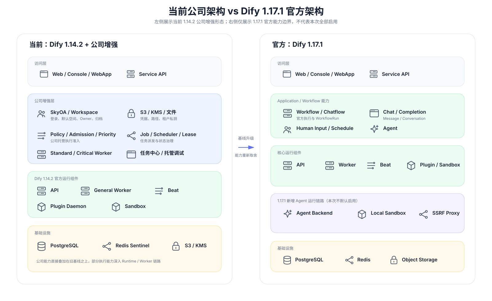
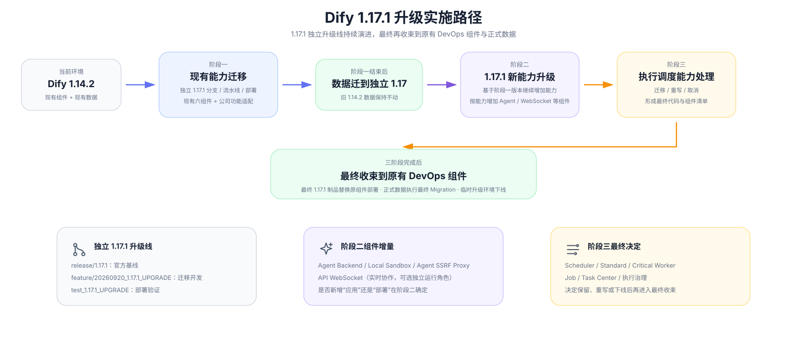

# Dify 1.17.1 基线升级方案

## 一、升级目标

当前平台基于 Dify 1.14.2，并扩展了 SkyOA、工作空间治理、S3/KMS、文件与租户私钥、托管执行调度等公司能力。本次升级以 Dify 1.17.1 为新基线，分三个阶段完成现有能力迁移、新版本能力升级和执行调度能力处理，最终将成熟的 1.17.1 版本收束到原有 DevOps 组件。

| 目标 | 内容 |
| --- | --- |
| 基线升级 | 平台基础版本由 Dify 1.14.2 升级到 Dify 1.17.1 |
| 现有能力迁移 | 将 SkyOA、工作空间、S3/KMS、文件与私钥等现有公司能力适配到 1.17.1 |
| 新能力升级 | 在阶段一形成的 1.17.1 版本上增加确定要启用的新功能及对应运行组件 |
| 调度能力处理 | 对现有执行调度、任务中心和专用 Worker 确定迁移、重写或取消方案 |
| 数据迁移 | 阶段一完成后先将数据迁到独立 1.17.1 数据空间，三阶段完成后再执行最终正式数据迁移 |
| 最终收束 | 用最终 1.17.1 制品替换原有组件部署，并下线临时升级环境 |

---

## 二、升级架构

### 2.1 当前架构与 Dify 1.17.1 官方架构

### 2.2 本次迁移架构

---

## 三、阶段一：现有能力迁移

### 3.1 功能迁移

业务功能按依赖顺序迁移：**S3/KMS → 文件路径与密钥公共操作 → 默认工作空间与自动注册 → 工作空间管理 → 邀请注册 → 管理员初始化**。SkyOA 登录和通用 SSE 修复可独立迁移。各功能新增的表、字段和索引直接接在 1.17.1 当前 Migration Head 之后，旧公司 Migration 只作为结构和数据修复规则来源，不直接复制旧父版本或调度链。

| 能力 | 主要迁移内容 | 1.17.1 适配位置 |
| --- | --- | --- |
| SkyOA 登录 | Provider、POST 回调、state/nonce、账号匹配、OA 绑定、Provider 展示与日志脱敏 | Account / Identity / OAuth / AccountIntegrationService |
| S3 / KMS | 公司 KMS 协议、凭据选择与刷新、S3 Client、失败重试 | Storage Provider / AWS S3 Storage |
| 文件路径与租户私钥 | 对象前缀、Tenant/App 文件目录、app_id 透传、私钥路径与缓存 | Storage / FileService / RSA Provider |
| 默认工作空间与自动注册 | `is_default`、可信 SkyOA 建号、默认空间加入、current workspace 恢复 | AccountService / Tenant / CurrentTenantResolver |
| 工作空间管理 | 创建、指定 owner、幂等、额度、切换、归档、成员治理和管理页面 | Workspace Service / RBAC / WorkspaceCard |
| 邀请注册 | 数据库邀请、SkyOA 接受邀请、邮箱校验、成员加入 | Account / Workspace / Invitation |
| 管理员初始化 | SkyOA 首次安装、管理员和默认空间创建、失败清理 | Setup / Workspace Provisioning |
| 通用 SSE | 系统 Header 与自定义 Header 合并 | Web Request / SSE |
| Workflow 请求参数 | 会话 ID、父消息 ID 去空格，空白值转为 None 后再做 UUID 校验 | Workflow Console Request |

#### 3.1.1 SkyOA 登录

**来源：** `origin/feature/20260701`；账号邮箱匹配与资料补充来自 `origin/feature/20260825_S3`。

| 项目 | 1.14.2 公司能力 | 1.17.1 变化 | 迁移方案 |
| --- | --- | --- | --- |
| Provider 与登录入口 | SkyOA 与官方 Provider 并存 | 官方 OAuth 登录改由新版服务承接 | 保留官方 Provider，增加独立 SkyOA 分支 |
| 回调协议 | 前端 POST `code`、`state`、`currentUrl` | 官方 Provider 采用自身回调流程 | 保留 SkyOA POST 回调，官方回调不改 |
| state / nonce | 300 秒 Cookie 保存登录上下文 | 官方有独立 state 处理 | SkyOA 继续使用原 state / nonce 与 Cookie 生命周期 |
| Token / userinfo | 使用 SkyOA Token 和 userinfo 协议解析身份 | 官方无 SkyOA Provider | 保留公司请求、身份解析及离职/停用等校验 |
| 账号匹配 | 先查 OA 绑定，未命中再按邮箱匹配 | 新版使用 Repository、显式 Session 和 `normalized_email` | 保留“绑定优先、邮箱兜底、重复邮箱拒绝”，改用新版 Repository / Session |
| OA 绑定 | 登录后将 openId 关联原账号 | 身份关联接口变化 | 使用新版 Repository.link，保留原 account_id |
| Provider 展示 | 登录页和账号页按已配置 Provider 展示 | 新版绑定列表由 AccountIntegrationService 提供 | 将 SkyOA 加入 Provider 名单，在登录页和 `/account` 展示 |
| 配置 | Client ID、Secret、授权、Token、userinfo、scope | 官方无 SkyOA 配置 | 按 1.17.1 配置结构增加六项参数 |
| 日志 | 公司摘要脱敏 | HTTP 客户端日志可能打印 URL 中的敏感参数 | 在控制台和文件日志输出前脱敏 SkyOA Token URL 中的 Secret 和授权码 |

SkyOA 新用户建号和默认空间加入统一由 3.1.4 处理，不在登录逻辑中重复实现注册流程。

#### 3.1.2 S3 / KMS

**来源：** `origin/feature/20260825_S3` 的最终 KMS / S3 实现。

| 项目 | 1.14.2 公司能力 | 1.17.1 变化 | 迁移方案 |
| --- | --- | --- | --- |
| KMS Provider | 公司 KMS 获取临时 S3 凭据 | 官方无公司 KMS 协议 | 在新版 Storage 增加公司 KMS Credential Provider |
| KMS 协议 | 最终使用 `data/signature` | 历史分支存在多版中间协议 | 只迁最终 `data/signature` 协议 |
| 凭据选择 | IAM、KMS、静态 AK/SK 分流 | 官方支持 IAM 与静态凭据 | IAM 优先；KMS 配置完整时使用 KMS；全空时使用静态凭据 |
| 定时刷新 | 临时凭据按时区周期刷新 | 官方无公司刷新线程 | 保留刷新时区、周期检查和文件操作前到期检查 |
| 刷新失败 | 保留旧 Client 并延迟重试 | 官方无该逻辑 | 新凭据成功后再替换 Client，失败时继续使用旧 Client |
| 多进程 | fork 后重新初始化刷新状态 | Worker 仍可能多进程 | 保留进程级锁、线程和状态重建 |
| 请求失败 | 认证类错误刷新 Client 后重试一次 | 官方按普通 S3 错误处理 | KMS 模式下刷新凭据并受控重试一次 |
| exists | 只有对象不存在返回 false | 官方错误路径不同 | 保留不存在与其他异常的区分 |
| 新版能力 | 旧基线缺少部分预签名和流式能力 | 1.17.1 已提供 | 保留官方能力，只让其使用当前有效 S3 Client |
| 环境配置 | 公司测试环境使用 S3 / KMS | 1.17.1 配置项发生变化 | 按新版配置结构维护 endpoint、bucket、region、寻址方式、刷新时区及 KMS 参数 |

#### 3.1.3 文件路径与租户私钥

**来源：** `origin/feature/20260701` 与 `origin/feature/20260825_S3` 的文件路径、RSA 私钥和公共密钥操作。

| 项目 | 1.14.2 公司能力 | 1.17.1 变化 | 迁移方案 |
| --- | --- | --- | --- |
| 对象前缀 | 对象存储统一使用 `Dify/` | 官方公共 Storage 直接使用业务 Key | save/load/download/exists/delete/scan/签名统一应用前缀；Local / Volume 不加 |
| 文件目录 | 按 Tenant 和可选 App 组织对象 | 新版 FileService 无公司 `app_id` 参数 | 文件保存为 `Dify/upload_files/{tenant_id}/{app_id?}/{uuid}` |
| App 归属校验 | 传入 app_id 时校验应用属于当前 Tenant | 新版无公司校验 | FileService 增加可选 app_id，并校验 UUID 与租户归属 |
| 上传入口 | Console、Service API、WebApp、Workflow 传 App 身份 | 新版上传链路重新组织 | 从已鉴权上下文透传真实 App ID；RemoteFileService 同步增加 app_id |
| Workflow 文件 | 节点结果和草稿结果按应用归档 | 新版仍会将结果落文件 | Repository 和 Draft Variable Service 传入所属 App ID |
| 私钥路径 | `Dify/RSA_privateKey/{tenant_id}/private.pem` | 官方默认私钥路径和 Provider 不同 | 新 Tenant 使用公司路径，并在 Tenant 记录实际私钥引用 |
| 私钥缓存 | 按 Tenant 缓存私钥 | 新版缓存键不同 | 使用公司最终缓存键规则，只影响私钥缓存 |
| 密钥操作 | 创建空间时分步生成、保存和失败清理 | 新版通过 Provider 统一生成 | 在新版 Provider 上保留生成、保存、删除的分步能力，供 Workspace Provisioning 使用 |
| 数据结构 | Tenant 保存私钥路径 | 1.17.1 无公司字段 | 在当前 1.17.1 Migration Head 后增加私钥字段及所需结构 |
| 历史数据 | 旧文件和私钥已有真实对象 | 新路径结构不同 | 阶段一只建立新结构；旧对象和旧私钥引用统一在 3.3 数据导入时处理 |

#### 3.1.4 默认工作空间与自动注册

**来源：** `origin/feature/20260701` 的默认空间、自动注册、current workspace 和默认 owner 保护。

| 项目 | 1.14.2 公司能力 | 1.17.1 变化 | 迁移方案 |
| --- | --- | --- | --- |
| 默认空间 | Tenant 增加 `is_default` | 官方无公司默认空间语义 | 在新版 Tenant 增加 `is_default`，建立唯一默认空间约束 |
| SkyOA 自动注册 | 已验证 OA 用户可在普通注册关闭时建号 | 新版普通注册受系统开关限制 | 给注册/建号链路增加可信 OA 参数，仅 SkyOA 验证成功时允许绕过普通注册关闭 |
| 个人空间 | SkyOA 用户不创建无意义个人空间 | 新版普通注册可创建个人空间 | SkyOA 注册后直接加入默认 Workspace |
| 成员加入 | 无空间用户自动加入默认空间 | 新版成员操作使用显式 Session | 使用同一 Session 写入成员关系；已有成员保留角色，新成员使用入口指定角色 |
| current workspace | 有效 current 优先，否则正常空间，最后默认空间 | 新版只维护当前空间上下文 | 引入 CurrentTenantResolver，按公司顺序选择并保存唯一 current |
| 角色恢复 | 切换/恢复后使用对应空间成员角色 | 新版保存空间和角色 | 复用新版角色字段，恢复时同步更新最近使用时间 |
| 默认 owner 保护 | 默认空间唯一 owner 不允许删除、降级或转移 | 官方无公司保护 | 保留 owner 删除、角色变更、转移和归档保护方法 |
| 设置默认空间 | CLI 指定默认 Tenant | 官方无对应命令 | 保留 `set-default-tenant`，校验唯一 owner 和确认邮箱 |
| 数据结构 | 默认标记、唯一 current、查询索引 | 官方缺少公司约束 | 在新环境 Migration 中创建字段、约束和索引，不复制旧 revision 链 |

#### 3.1.5 工作空间管理

**来源：** `origin/feature/20260701` 及 `origin/feature/20260825_S3` 的公司 Workspace 管理能力。

| 项目 | 1.14.2 公司能力 | 1.17.1 变化 | 迁移方案 |
| --- | --- | --- | --- |
| 管理入口 | 公司管理员创建和管理 Workspace | 新版主导航改为 WorkspaceCard | 在 `WorkspaceCard` 的 WorkspaceSwitcher 下接入“创建空间”和“管理空间”按钮 |
| 管理员可见性 | `is_system_admin` 控制入口 | 新版资料通过 userProfileQueryOptions 获取 | 在 AccountResponse 增加公司管理员字段并生成前端类型 |
| 创建 Workspace | 公司统一创建服务 | 新版无公司创建事务 | 保留 WorkspaceProvisioningService，统一处理来源、幂等、额度、owner、插件策略、密钥和事件 |
| 指定 owner | 选择已有账号或填写新邮箱 | 新版账号增加 `normalized_email` | 复用有效账号；新邮箱创建 PENDING 账号并补 normalized_email |
| 幂等 | 同一请求重试复用请求编号 | 官方无公司创建请求记录 | 保留 WorkspaceCreationRequest、摘要和唯一键 |
| 额度 | 创建前执行公司额度锁和判断 | 新版许可证读取接口变化 | 使用新版 License 读取方式，保留原锁和计数顺序 |
| 列表与筛选 | 分页、创建时间、owner 展示 | 新版无公司管理列表 | 在管理弹窗中保留分页、日期筛选、owner 信息和缓存刷新 |
| 切换 | 校验空间、账号和成员关系 | 新版切换方法使用显式 Session | 保留公司锁定和检查顺序，并更新新版 last_opened_at |
| 归档 | 逻辑归档，记录时间、操作者、原因 | 官方只有基础状态字段 | 保留归档服务、首次审计信息和 current workspace 恢复 |
| 成员治理 | 默认 owner 删除/改角色/转移保护 | 新版调用位置变化 | 在新版删除服务、成员接口和 owner 转移流程接入公司保护 |
| 前端组件 | 旧版使用 WorkplaceSelector | 新版组件体系变化 | 管理入口迁到 WorkspaceCard；弹窗使用新版 Dialog、SegmentedControl、Input 等组件 |

#### 3.1.6 邀请注册

**来源：** `origin/feature/20260701` 的数据库邀请和 SkyOA 接受邀请流程。

| 项目 | 1.14.2 公司能力 | 1.17.1 变化 | 迁移方案 |
| --- | --- | --- | --- |
| 邀请模型 | 数据库存储 Token 摘要、状态、有效期、角色和接受信息 | 官方无公司邀请表 | 在新环境增加 WorkspaceInvitation 表、唯一约束和索引 |
| 邀请入口 | 管理员生成邀请 | 新版保留复制邀请链接能力 | 保留链接分享；邮件发送依赖现有邮件服务配置 |
| 接受方式 | 受邀人通过 SkyOA 登录 | 官方激活流程不同 | 邀请页面只走 SkyOA，不使用密码注册直接激活 |
| 邮箱校验 | OA 邮箱必须等于邀请邮箱 | 新版 OAuth 与激活链路分离 | 在接受邀请时继续校验 SkyOA 邮箱 |
| 账号处理 | 不存在则创建，存在则复用 | 新版 Account / Session 变化 | 使用新版账号能力，保留原 account_id 和账号状态 |
| 成员加入 | 按邀请角色加入 Workspace | 新版成员接口变化 | 使用新版成员模型写入邀请角色 |
| 邀请状态 | pending / accepted / cancelled / expired | 官方无公司状态机 | 保留状态、有效期、重发和幂等规则 |
| 普通登录 | 旧混合逻辑包含密码邀请参数 | 新版登录服务已变化 | 邀请逻辑从普通密码登录移除，只保留 SkyOA 邀请流程 |

#### 3.1.7 管理员初始化

**来源：** `origin/feature/20260701` 的 SkyOA 首次安装与公司初始化流程。

| 项目 | 1.14.2 公司能力 | 1.17.1 变化 | 迁移方案 |
| --- | --- | --- | --- |
| Setup 入口 | SkyOA 身份初始化管理员 | 新版 Setup 服务和数据结构变化 | 在新版 Setup 增加 SkyOA 初始化分支 |
| 管理员账号 | 使用 SkyOA 资料创建初始管理员 | Account 创建与 Session 变化 | 使用新版账号接口，保留 OA 身份和公司管理员标记 |
| 默认 Workspace | 初始化时创建默认空间 | Workspace 创建逻辑已集中到公司服务 | 复用 3.1.5 WorkspaceProvisioningService 创建默认空间 |
| owner / 成员 | 初始化管理员成为默认空间 owner | 新版成员写入方式变化 | 使用公司统一创建事务保存 owner 成员 |
| 公私钥 | 创建空间同时生成并记录密钥 | 新版 Key Provider 变化 | 复用 3.1.3 已迁入的 RSA 分步接口 |
| 失败清理 | 初始化失败只清理本次新建内容 | 新版事务与外部 Storage 操作分离 | 回滚数据库，并只删除本次创建的私钥和初始化对象 |
| 安装状态 | 初始化完成后记录系统已安装 | 新版安装记录增加字段 | 使用 1.17.1 安装记录结构，不另建公司状态模型 |

#### 3.1.8 通用 SSE 请求

**来源：** `origin/feature/20260825_S3` 的通用请求头修复。

| 项目 | 1.14.2 公司能力 | 1.17.1 情况 | 迁移方案 |
| --- | --- | --- | --- |
| Header 合并 | 自定义 Header 与认证、CSRF、分享身份 Header 合并 | `fetchOptions.headers` 可能覆盖系统 Header | 系统 Header 优先，保留不冲突的自定义 Header |
| GET / POST | 两类 SSE 请求均使用相同合并规则 | 新版请求封装位置变化 | 在新版 Request 层统一处理 GET / POST |
| 调度代码 | 原提交混有公司调度测试路径 | 阶段一不迁公司调度 | 只提取通用 Header 修复，不迁调度接口和测试依赖 |

#### 3.1.9 Workflow 请求参数兼容

**来源：** `origin/feature/20260825_S3` 混合提交 `e2e06e69` 中独立于公司调度的请求参数处理。

| 项目 | 1.14.2 公司处理 | 1.17.1 情况 | 迁移方案 |
| --- | --- | --- | --- |
| 会话 ID | 去除两端空格，纯空白转为 None | 新版 `uuid_value()` 已接受空字符串，但纯空格行为不同 | 先 trim，空白转 None，其余值继续交给新版 UUID 校验 |
| 父消息 ID | 与会话 ID 使用同一规范化 | 新版未加入同一处理 | 使用相同 trim / None 规则 |
| 调度调试代码 | 同一提交包含公司 Console 调度修改 | 阶段一不迁公司调度 | 只迁请求模型处理，调度服务及对应测试排除 |

### 3.2 独立 1.17.1 基线与组件部署

#### 3.2.1 分支、流水线与 DevOps 部署

| 对象 | 1.14.2 环境 | 独立 1.17.1 环境 | 阶段一处理 |
| --- | --- | --- | --- |
| 基线分支 | `release/1.14.2` | `release/1.17.1` | 1.17.1 官方基线独立维护 |
| 迁移开发分支 | 1.14.2 开发线 | `feature/20260920_1.17.1_UPGRADE` | 阶段一能力统一在独立 1.17.1 分支迁移 |
| 测试发布分支 | `test` | `test_1.17.1_UPGRADE` | 两套测试分支互不覆盖 |
| 流水线 | 1.14.2 test 流水线 | 1.17.1 独立流水线 | 分别绑定对应分支、Commit 和制品 |
| 部署 | 当前 test 部署 | `test-upgrade-1.17.1` | 在现有应用下增加隔离部署，原 test 保持不动 |
| 配置 | 1.14.2 test 配置 | 1.17.1 upgrade 配置 | 数据库、Redis、Secret、服务地址和前端构建参数独立 |

#### 3.2.2 平台构建与启动

**来源：** `origin/feature/20260624_test_1` 的平台部署支持，以及 1.17.1 在公司基础镜像上的兼容要求。

| 项目 | 原公司实现 | 1.17.1 变化 | 阶段一处理 |
| --- | --- | --- | --- |
| Web 启动参数 | 使用 npm 参数 | 新版改为 pnpm | 使用新版 pnpm 参数 |
| Web 监听地址 | 未指定时读取 `SERVER_HOST` | 新版默认读取系统 `HOSTNAME` | 保留 `SERVER_HOST`，避免容器名成为监听地址 |
| Node 版本 | 支持较宽 Node 22 / 24 范围 | 1.17.1 使用新版 Node 要求 | 采用 1.17.1 官方 Node 版本约束 |
| UUIDv7 Migration | 已有 `uuidv7()` 时旧逻辑可能提前退出 | 新版继续创建缺失的 `uuidv7_boundary()` | 使用 1.17.1 官方 Migration 行为 |
| build.sh | 公司脚本生成部署制品 | 新版依赖、目录和构建产物变化 | 保留公司制品入口，适配 1.17.1 构建依赖和产物 |
| Git 兼容 | 旧版 `flask-restx` 从 PyPI 安装，运行环境不要求 Git | 1.17.1 从 Git 仓库获取指定提交，`uv sync --dev` 需要 Git | DevOps 初始化脚本在 `uv sync --dev` 前检查并安装 Git；正式环境由运维固化到 `.init/init_shell.sh` 或预装 Git 的后端基础镜像 |
| API / Worker / Beat | 共用后端代码 | 1.17.1 继续按运行角色区分 | 共用同一后端制品，通过不同启动角色运行 |
| Web | 独立前端制品 | 前端构建方式变化 | 使用 1.17.1 Web 制品独立发布 |

#### 3.2.3 基础运行组件

| 组件 | 阶段一部署 |
| --- | --- |
| API | 现有 `dify-api` 应用增加 1.17.1 upgrade 部署 |
| General Worker | 现有 `dify-worker` 应用增加 1.17.1 upgrade 部署，只运行官方 Worker |
| Beat | 现有 `dify-worker-beat` 应用增加 1.17.1 upgrade 部署 |
| Web | 现有 `dify-web` 应用增加 1.17.1 upgrade 部署 |
| Plugin Daemon | 沿用现有应用，部署 1.17.1 对应版本 |
| Sandbox | 沿用现有应用，部署 1.17.1 对应版本 |

#### 3.2.4 PostgreSQL、Redis 与 Celery 隔离

1.14.2 与 1.17.1 共用同一套 PostgreSQL / Redis 基础设施，通过独立数据库、Redis DB、Prefix、队列和频道完成版本隔离。

| 资源 | 1.17.1 隔离方案 |
| --- | --- |
| PostgreSQL | 使用独立数据库 `ai_studio_1171_dev` |
| Redis Cache | 使用 Redis DB 2，Key Prefix 为 `dify_1171_dev` |
| Celery Broker / Result | 使用 Redis DB 3，Key Prefix 为 `dify_1171_dev` |
| Redis Pub/Sub | 使用 `dify_1171_dev` Channel Prefix，不依赖 Redis DB 隔离 |
| Plugin Daemon | 使用独立插件数据库与 Redis 空间，不与 Dify 主库和主缓存混用 |

#### 3.2.5 Event Bus、Socket.IO 与 WebSocket 地址适配

| 项目 | 1.17.1 变化 | 阶段一处理 |
| --- | --- | --- |
| Event Bus | 开启 Sentinel 时仍可能按空 Event Bus URL 建立本机连接 | Sentinel 模式复用已初始化的远程 Redis Client；非 Sentinel 使用显式 Event Bus URL |
| Socket.IO Redis | 新增独立 `RedisManager`，不复用 Event Bus Client | 使用 Sentinel 节点、Service Name、DB 和认证构造 `redis+sentinel://` |
| Client 边界 | Event Bus 与 Socket.IO 是两套 Redis Client | 共用同一 Sentinel 基础设施，但保持独立 Client |
| Channel | Redis Pub/Sub 不按逻辑 DB 隔离 | 发布和订阅统一使用 `dify_1171_dev` 前缀 |
| Socket 地址 | 未显式配置时官方可回退到 localhost | 优先使用显式 `SOCKET_URL`；未配置时从 API 地址推导 ws/wss，并去掉路径、查询串和 fragment；解析失败再回退 localhost |
| 新版协作逻辑 | 新版客户端根据最终 Socket 地址判断草稿回退 | 保留 1.17.1 客户端判断，只替换地址推导逻辑 |

### 3.3 阶段一完成后的数据迁移

阶段一功能与新环境结构完成后，将 1.14.2 的同一时间点业务快照导入当前独立开发库 `ai_studio_1171_dev`。目标库继续保留已经建立的 1.17.1 Schema 和当前 `alembic_version`，不另建一套迁移库，也不把旧库的 Migration 版本覆盖到目标库。旧 1.14.2 环境继续运行，快照之后的新数据不自动同步。

#### 3.3.1 导入原则

| 项目 | 处理方式 |
| --- | --- |
| 目标库 | 直接使用 `ai_studio_1171_dev`，导入前完成目标库备份 |
| Schema | 保留阶段一已经建立的 1.17.1 表结构、字段、索引和约束 |
| Alembic | 保留目标库现有 `alembic_version`；旧库 revision 只作为数据结构和转换规则来源 |
| 数据源 | 从 1.14.2 源库读取同一时间点的一致性业务快照 |
| 导入范围 | 只导入已纳入迁移清单的业务数据和历史记录 |
| 调度数据 | 公司调度专用表和字段排除，不因名称包含“执行”而误删官方历史数据 |
| 写入方式 | 暂停 1.17.1 开发环境写入和后台消费，在同一事务中替换核准的测试业务数据并导入快照 |
| 旧环境 | 1.14.2 数据库、Redis、会话和队列保持不变，不切换访问入口 |

#### 3.3.2 数据范围

| 数据范围 | 迁移方案 |
| --- | --- |
| 账号与 OA 身份 | 保留 account_id、状态、邮箱和 OA open_id 绑定；生成新版 `normalized_email`，不自动合并冲突账号 |
| Workspace 与成员 | 保留 Tenant ID、owner、成员角色、归档状态和 current；按新版唯一默认空间和唯一 current 约束导入 |
| 邀请与创建记录 | 保留邀请 Token 摘要、状态、有效期、角色以及 Workspace 创建幂等记录 |
| 应用与 Workflow | 保留应用、Workflow 定义及版本字段，按新版字段映射补充结构 |
| 知识库与文件记录 | 按依赖顺序导入知识库、文档、分段和文件记录；对象本身不随数据库导入移动 |
| 会话与运行历史 | 保留会话、消息、Workflow Run、节点记录和相关配置，不重新执行历史任务 |
| 模型及工具凭据 | 保留加密内容和 Tenant 密钥引用，按新版模型类型和凭据引用关系转换 |
| 安装记录 | 保留已安装状态和原安装记录，新字段按 1.17.1 结构补齐，不重新执行初始化 |
| 新版新增表 | 没有旧数据来源的表保留阶段一结构，只写入明确需要的初始化值 |
| 调度专用数据 | 按具体表和字段排除；阶段三最终决定的调度能力不在本次阶段一快照中迁入 |

#### 3.3.3 文件、私钥及外部数据

| 范围 | 处理方式 |
| --- | --- |
| S3 文件 | 只迁数据库记录，不移动、覆盖或删除共享对象；历史 Key 继续按兼容规则读取 |
| 租户私钥 | 保留原公私钥对象和真实路径，继续使用原密钥解密历史数据，不重新生成 |
| 向量库 | 保持现有配置和集合，不自动重建索引或删除旧集合 |
| Plugin Daemon | 主库快照不覆盖插件数据库；插件数据继续由独立插件库管理 |
| Redis | 不复制旧 Cache、登录 Session、Celery 队列和 Result；1.17.1 继续使用自己的隔离命名空间 |

导入流程固定为：**备份 `ai_studio_1171_dev` → 获取 1.14.2 一致性快照 → 按表/字段迁移清单转换数据 → 暂停 1.17.1 开发环境写入 → 单事务导入 → 恢复开发环境**。源库全程只读，旧 1.14.2 环境继续运行。

---

## 四、阶段二：1.17.1 新能力升级

阶段二直接基于阶段一形成的独立 1.17.1 版本继续升级，不再新建第二套基线。功能层只选择需要启用的 1.17.1 新能力；部署层只增加这些能力实际需要的运行组件。

### 4.1 功能升级

| 能力方向 | 1.17.1 新增或增强能力 | 组件影响 | 阶段二处理 |
| --- | --- | --- | --- |
| Workflow 与应用编排 | 自然语言生成 Workflow / Chatflow、运行记录导出、节点定位、LLM Environment 等 | 主要复用 API / Web / Worker | 在阶段一 1.17.1 基线上直接启用 |
| Human Input | 富表单、Loop / Iteration 内 Human Input | 复用官方 Workflow Runtime | 使用 1.17.1 官方能力 |
| Agent | 新 Agent App、Agent Skills、Agent DSL、Agent Home Snapshot | 需要 Agent Backend；Local Runtime 还需要 Sandbox 与网络代理 | 作为阶段二重点新增能力接入 |
| WebApp | 应用描述、输入提示等展示能力 | Web / API | 直接在现有 1.17.1 组件上升级 |
| 可观测 | Unified Tracing、Knowledge Tracing | API / Worker / Trace 后端 | 接入现有公司可观测链路 |
| CLI | difyctl | 无长期运行组件 | 作为运维工具使用，不新增应用 |
| 知识库与检索 | Excel 图片解析、ODT、TiDB 混合检索等 | Worker / Plugin / Vector Store | 按现有知识库后端和数据源启用 |
| 多模态与工具 | 文件直接传入多模态模型、日期参数类型 | API / Plugin | 随应用能力直接启用 |
| 安全与数据治理 | 外部 KMS Provider、会话清理等 | Storage / 定时任务 | 与阶段一已有 KMS / Storage 能力合并使用 |

### 4.2 组件与部署

阶段二沿用阶段一已经部署的 API、General Worker、Beat、Web、Plugin Daemon 和 Sandbox；只为 1.17.1 新能力补充额外运行角色。

| 对应能力 | 新增运行组件 | DevOps 部署方式 | 与阶段一的关系 |
| --- | --- | --- | --- |
| 新 Agent App / Skills / Agent Home | `agent_backend` | 新增独立应用 `dify-agent-backend`，独立部署和运行配置 | 调用阶段一 API、Plugin Daemon、Redis 等基础服务 |
| Agent Local Runtime / Shell Workspace | `local_sandbox` | 新增独立应用 `dify-agent-local-sandbox` | 只服务 Agent Runtime，不替换阶段一 `dify-sandbox` |
| Agent Sandbox 出网隔离 | `agent_ssrf_proxy` | 作为 Agent Runtime 独立网络代理组件部署 | 与 `local_sandbox` 配套使用 |
| Workflow 实时协作 | `api_websocket` | 复用 API 后端制品，在 `dify-api` 下增加独立 WebSocket 部署 | 使用阶段一 Socket.IO / Redis Sentinel 配置 |
| Unified / Knowledge Tracing | Trace 后端连接 | 不新增 Dify 核心应用，接入公司现有 Trace 基础设施 | API / Worker 增加对应配置 |
| 知识库与检索增强 | Plugin / Vector Store 依赖 | 复用 Plugin Daemon、Worker 和现有向量数据库；仅增加对应 Provider 配置 | 不额外复制核心服务 |
| difyctl / WebApp / 多模态与 Tool 增强 | 无 | 不新增长期运行组件 | 直接使用阶段一现有组件 |

新增应用继续使用独立 1.17.1 分支和流水线体系，和阶段一组件使用同一版本基线；新增组件的 Redis、Secret、内部服务地址和网络策略随对应应用单独配置。

---

## 五、阶段三：执行调度能力评审

阶段三不直接把旧公司调度代码搬到 1.17.1。原因是这部分能力不是独立业务功能，而是直接包在 Dify 的应用执行、Runtime、Worker、任务状态、Human Input 和 Schedule 链路外层；1.17.1 对这些底层链路已经有较大变化，因此需要先判断公司能力是否仍有必要、官方能力是否已经覆盖，以及保留后应该接在哪一层。

### 5.1 为什么需要评审

| 能力方向 | 当前公司能力 | 1.17.1 主要变化 | 为什么需要评审 |
| --- | --- | --- | --- |
| 托管执行准入 | Policy、Admission、Priority、容量限制 | 应用入口、异步执行参数和执行任务模型变化 | 需要先判断公司统一准入和优先级是否仍有业务价值，再决定直接迁移、外围重写或取消 |
| 调度中心 | Job、Scheduler、Lease、Outbox、Generation | 任务状态、官方执行标识和 Worker 生命周期变化 | 旧调度中心与旧 Runtime 高度绑定，不能原样搬入；需要判断保留完整调度中心还是缩减为外围治理 |
| 专用 Worker | Standard / Critical Worker | 旧 Worker 直接消费公司队列并调用旧 Runtime | 1.17.1 执行入口已经变化，需要先确认是否仍需要双资源池，再决定新的 Worker 接入方式 |
| 正式应用托管 | Workflow、Chatflow、Chat、Completion、Agent | 各应用执行入口、Session、Message、WorkflowRun 和结果管理均发生变化 | 不同应用不能继续统一套旧执行入口，需要评估继续托管还是直接使用官方执行 |
| Console 调试 | Draft、Single Node、Iteration、Loop | 调试入口、节点事件、草稿状态和前端运行状态变化 | 旧调试托管逻辑与新版调试链路耦合较深，需要判断是否还有必要重新接入公司治理 |
| Human Input | Pause、Resume、Retry | 1.17.1 已提供 WorkflowPause、ResumptionContext 和新的恢复链路 | 官方已经覆盖核心暂停恢复能力，需要判断公司 generation / fence 等治理是否仍需保留 |
| Schedule | 正式和草稿定时触发 | 1.17.1 Trigger / Schedule 链路变化 | 直接迁旧轮询和调度可能产生重复执行，需要判断使用官方 Schedule 还是增加公司准入层 |
| 任务管理 | Query、Cancel、Stop、Retry、Streaming / Blocking Result | 旧任务中心依赖公司 Job 状态和执行标识 | 是否保留任务中心取决于 Job / Scheduler 最终是否继续存在 |
| 调度监控与审计 | Worker / Scheduler Health、OTel、执行审计 | 指标和审计主体依赖旧 Scheduler / Worker / Job 模型 | 监控对象会随最终调度架构变化，需要在架构确定后再决定保留或重做 |

### 5.2 评审输出

阶段三完成后需要形成一份确定的执行调度方案，而不是继续保留多套候选路径。

| 评审结果 | 最终处理 |
| --- | --- |
| 官方能力已覆盖且公司无额外业务诉求 | 删除对应公司执行改造，直接使用 1.17.1 官方执行链路 |
| 仍需要统一准入、优先级或容量治理 | 将这些能力保留在官方 Runtime 外围，不重新侵入各应用内部执行实现 |
| 仍需要公司 Job / Scheduler | 按 1.17.1 的执行标识、任务状态和 Worker 生命周期重新接入 |
| 仍需要 Standard / Critical 资源池 | 基于新的官方执行入口重新实现专用 Worker，只保留资源池与治理职责 |
| 任务中心、Health、OTel、Audit | 根据最终保留的 Job / Scheduler / Worker 重新确定数据源和管理入口 |

阶段三最终输出包括：**保留功能清单、删除功能清单、需要重写的连接层、最终运行组件、数据库表与 Migration、Redis 队列与频道、DevOps 应用和启动角色**。

---

## 六、最终收束

最终收束不再长期保留 `test-upgrade-1.17.1` 这套平行环境，而是将三个阶段形成的最终 1.17.1 版本覆盖到原有 DevOps 应用和正式数据链路。

### 6.1 原有组件收束

| 对象 | 最终处理 |
| --- | --- |
| `dify-api` | 原应用切换为最终 1.17.1 API 制品和配置 |
| `dify-worker` | 原应用切换为最终 1.17.1 Worker 制品和队列配置 |
| `dify-worker-beat` | 原应用切换为最终 1.17.1 Beat |
| `dify-web` | 原应用切换为最终 1.17.1 Web |
| `dify-plugin-daemon` | 切换到最终 1.17.1 对应版本 |
| `dify-sandbox` | 切换到最终 1.17.1 对应版本 |
| 阶段二新增组件 | 只保留已确定启用能力需要的 Agent Backend / Local Sandbox / WebSocket / Proxy 等组件 |
| 阶段三调度组件 | 按阶段三最终方案保留、重写或下线 |
| 临时升级部署 | 原组件切换完成后下线 `test-upgrade-1.17.1` |

### 6.2 分支与流水线收束

| 项目 | 最终处理 |
| --- | --- |
| `release/1.17.1` | 收束为最终 1.17.1 公司基线 |
| `feature/20260920_1.17.1_UPGRADE` | 阶段一到阶段三的最终代码合入 release 后结束长期开发职责 |
| `test_1.17.1_UPGRADE` | 用于最终发布前测试，正式切换后按发布流程维护或清理 |
| 基础组件流水线 | 原有 API / Web / Worker 等流水线改为构建最终 1.17.1 基线 |
| 新增组件流水线 | 仅为阶段二、三最终保留的新应用建立正式流水线 |

### 6.3 最终数据迁移

阶段一后的独立 1.17.1 数据用于阶段二、三持续开发；最终收束时仍以正式 1.14.2 数据的最新快照作为迁移源，再执行一次最终 Migration。

| 数据类型 | 最终处理 |
| --- | --- |
| PostgreSQL | 备份正式 1.14.2 数据后，执行最终 1.17.1 官方 Migration + 三阶段最终保留的公司 Migration |
| 账号 / Workspace | 保留账号 ID、成员关系、默认空间和归档状态 |
| 调度数据 | 根据阶段三最终结论继续使用、只读保留或停止新增 |
| Redis Cache | 不搬迁旧缓存，最终 1.17.1 使用新的命名空间 |
| Celery Broker / Result | 不迁旧队列和 Result，切换前停止旧任务入口后从新队列启动 |
| S3 | 优先保持对象不动并兼容历史 Key；只有最终路径方案明确需要时才搬对象 |
| 租户私钥 | 保留既有对象和引用，不重新生成历史 Tenant 私钥 |

最终流程为：**独立 1.17.1 升级线完成三个阶段 → 固定最终组件清单 → 收束 release / 流水线 → 迁移正式数据 → 原有 DevOps 组件切换到最终 1.17.1 → 下线平行升级环境。**
