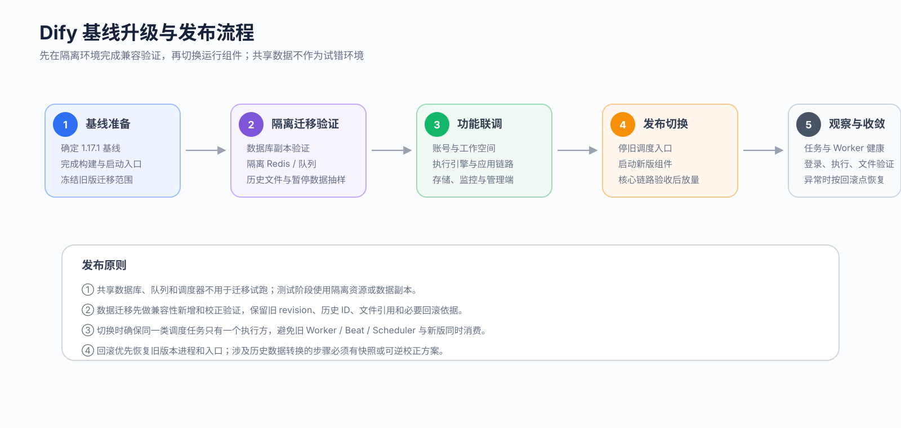

# Dify 1.17.1 基线升级方案

## 一、升级目标

当前 Dify 已完成账号与工作空间治理、托管执行引擎、Console 调试、KMS/S3 存储安全和健康监控等企业能力。本次升级以 **Dify 1.17.1** 为新基线，重点不是复制旧代码，而是把现有能力重新接入新版能力体系。

| 目标 | 内容 |
| --- | --- |
| 基线升级 | 平台升级到 Dify 1.17.1，后续统一基于新版开发 |
| 能力保留 | 现有登录、工作空间、执行调度、调试、存储安全等能力继续可用 |
| 数据兼容 | 保留账号、工作空间、执行记录、文件和租户私钥等历史数据 |
| 平稳切换 | 先完成隔离环境验证，再进行版本切换，并保留回滚能力 |

---

## 二、升级范围

| 能力方向 | 当前能力 | 升级重点 |
| --- | --- | --- |
| 账号与工作空间 | SkyOA 登录、超管、邀请注册、默认工作空间、工作空间管理 | 保留现有业务规则，适配 1.17.1 的账号和权限体系 |
| 托管执行引擎 | 准入、策略、队列、Scheduler、Worker、容量与任务管理 | 保留现有调度体系，执行部分接入新版 Runtime |
| 应用执行与调试 | Workflow、Chatflow、Chat、Completion、Agent、单节点、迭代、循环、Human Input | 基于 1.17.1 原生执行能力重新接入托管调度 |
| 存储与数据安全 | KMS、S3、文件路径、租户私钥 | 保留企业安全能力，兼容历史文件和密钥 |
| 管理与可观测 | 任务管理、Worker 健康、OTel、审计 | 适配新版运行状态和部署方式 |

目前 **平台构建与部署支持已经迁入新分支**，其余能力已经完成迁移范围梳理，进入分阶段实施。

---

## 三、总体方案

### 3.1 目标架构

整体保持两层：

- **Dify 1.17.1 官方基线**：负责应用运行、Console/WebApp、原生权限、文件和基础执行能力。
- **企业增强能力**：保留 SkyOA、工作空间治理、托管执行、KMS/S3、安全与平台管理能力。

升级过程中遵循三个原则：

1. **新版已有能力优先复用**，不使用旧实现覆盖新版。
2. **企业业务规则继续保留**，内部接口变化较大的部分按新版重新接入。
3. **历史数据不重建**，通过兼容和迁移完成升级。

### 3.2 功能迁移方式

| 方向 | 主要方案 |
| --- | --- |
| 账号与工作空间 | 保留 SkyOA、超管、邀请、默认空间和权限规则，接入新版账号体系 |
| 托管执行 | 保留 Policy、Admission、Scheduler、Worker 和 Job 管理；Worker 调用新版应用 Runtime |
| 应用与调试 | Workflow、Chatflow、Chat、Completion 等继续受管执行；调试能力接入新版原生调试链路 |
| Human Input / 定时触发 | 保留暂停恢复和统一调度能力，状态与执行逻辑以新版原生能力为基础 |
| KMS / S3 | 保留 KMS 凭据管理，新文件使用统一路径，历史文件保持兼容读取 |
| 健康与审计 | 保留任务、Worker、Scheduler 健康和审计能力，适配新版运行状态 |

---

## 四、数据与部署切换

### 4.1 数据兼容

升级需要重点保证四类历史数据继续可用：

| 数据 | 处理方式 |
| --- | --- |
| 账号与工作空间 | 保留原账号、成员关系、角色和默认工作空间 |
| 执行数据 | 保留历史 Job、Workflow Run、Message 等关联关系 |
| Human Input | 验证旧暂停数据能否转换并继续恢复 |
| 文件与私钥 | 保留历史 S3 对象、文件 Key 和租户私钥，不重新生成 |

数据库升级先在**数据副本**验证迁移链，确认历史数据可读取后再进入正式环境。

### 4.2 部署切换

升级流程统一为：

**新基线准备 → 隔离环境验证 → 功能联调 → 数据迁移验证 → 新版本部署 → 核心链路验证 → 正式切换**

正式切换时重点保证：

- 旧版和新版 Scheduler / Worker 不同时消费同一批任务；
- 新版登录、应用执行、文件和管理链路验证通过后再放量；
- 出现问题时可以停止新版执行组件并恢复旧版本。

---

## 五、验收范围

| 验收方向 | 核心内容 |
| --- | --- |
| 账号 | SkyOA 登录、初始化、邀请注册、工作空间与权限 |
| 执行 | 排队、优先级、Worker、Streaming / Blocking、停止与恢复 |
| 应用 | Workflow、Chatflow、Chat、Completion、Agent |
| 调试 | 草稿、单节点、迭代、循环、Human Input |
| 数据 | 历史账号、工作空间、任务、暂停数据、文件和私钥 |
| 存储 | KMS、上传、下载、预签名、删除 |
| 平台 | 任务管理、健康监控、审计、部署切换和回滚 |

升级完成以**核心业务链路在 1.17.1 上稳定运行，历史数据可继续使用，并具备部署与回滚能力**为准。

---

## 六、实施时间表

计划从 **2026-09-21** 开始，按能力依赖从底座到应用逐步推进。

| 时间 | 阶段 | 主要工作 | 当前完成情况 | 交付 |
| --- | --- | --- | --- | --- |
| 09.21 - 09.25 | 第 1 阶段：基线与平台治理 | 完成 1.17.1 基础运行验证；迁移 SkyOA、超管、默认工作空间与权限 | **进行中**：1.17.1 基线已确定；平台构建与部署支持已迁入，实际运行待验证；功能代码迁移进行中 | 新版基础环境 + 账号/工作空间主链路 |
| 09.28 - 10.02 | 第 2 阶段：托管执行底座 | 迁移执行数据模型、Policy、Admission、Scheduler、Worker 与任务管理 | **待开展**：迁移范围已梳理 | 托管执行主链路 |
| 10.05 - 10.09 | 第 3 阶段：应用执行与调试 | 接入 Workflow、Chatflow、Chat、Completion、Agent 及 Console 调试能力 | **待开展**：迁移范围已梳理 | 应用执行与调试主链路 |
| 10.12 - 10.16 | 第 4 阶段：存储与数据兼容 | 完成 KMS/S3、历史文件、租户私钥、Human Input 历史数据和监控能力验证 | **待开展**：迁移范围已梳理，数据副本升级验证尚未开始 | 存储与历史数据兼容 |
| 10.19 - 10.23 | 第 5 阶段：回归与上线准备 | 数据副本升级、端到端回归、部署切换演练、回滚验证 | **待开展**：端到端回归与部署切换尚未开始 | 升级验收结果 + 上线准备 |
