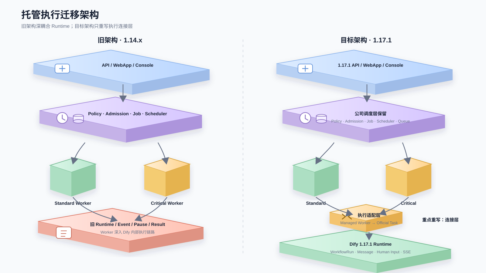
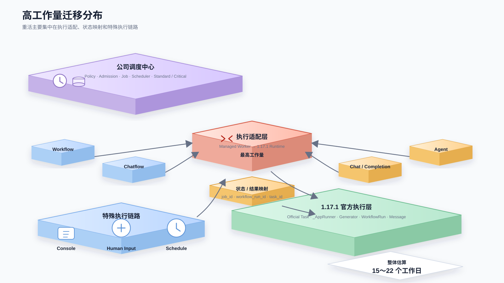
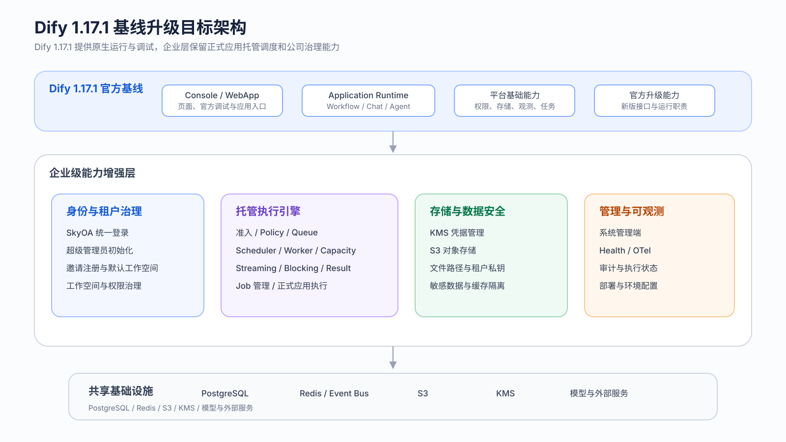

# Dify 1.17.1 基线升级方案

## 一、升级目标

当前平台基于 Dify 1.14.2，已扩展账号与工作空间治理、托管执行引擎、Console 调试、Human Input、KMS/S3 和管理监控等企业能力。本次升级到 **Dify 1.17.1**，迁移现有企业能力，并按新版执行链路重做与 Dify Runtime 的连接部分。

| 目标 | 内容 |
| --- | --- |
| 基线升级 | 平台统一升级到 Dify 1.17.1 |
| 能力保留 | SkyOA、工作空间、托管执行、Console 调试、Human Input、KMS/S3、管理与监控等现有能力继续可用 |
| 数据兼容 | 保留账号、工作空间、执行记录、文件和租户私钥等历史数据 |
| 平稳切换 | 升级前完成数据备份，测试通过后切换新版运行组件，并保留回滚能力 |

---

## 二、升级范围

### 2.1 本次升级新增功能

以下按 **Dify 1.14.2 → 1.17.1** 的官方 Release Notes 与 1.17.1 代码能力整理，只保留新增的产品功能，不包含接口重构、权限细化、Bug Fix 和一般性体验优化。

| 能力方向 | 新增功能 | 功能说明 |
| --- | --- | --- |
| Workflow 与应用编排 | 自然语言生成 Workflow / Chatflow；推理过程展示；长耗时模型任务；运行记录导出；Tool 多选参数；节点定位；LLM Environment | 可以通过自然语言直接生成和继续调整 Workflow / Chatflow；运行时可单独展示模型思考过程；支持长时间生成任务；运行记录可导出；Tool 参数支持多选；可从日志快速定位节点；模型和参数配置可在多个节点间复用 |
| Human Input | 富表单；Loop / Iteration 内 Human Input | 人工输入支持下拉选择、文件和多文件上传，并可放入循环和迭代节点中，在执行过程中暂停等待人工处理 |
| Agent | 新版 Agent App；Agent Sandbox；Agent Skills；Workspace Agent 管理；Agent DSL 导出；Agent Home Snapshot；E2B Sandbox；长会话自动压缩 | 新增独立 Agent 应用形态和运行环境；支持代码与 Shell 执行、可复用 Skills、工作空间统一管理和 Workflow 引用；支持 DSL 导出、运行环境快照、E2B 云端 Sandbox，以及长会话上下文自动压缩 |
| WebApp | WebApp 自定义展示 | Chatbot、Agent、Chatflow 可以自定义输入提示，并在应用页面展示应用描述 |
| 可观测 | Unified Tracing；Knowledge Tracing | 统一查看应用、Workflow、节点、Loop、Iteration、Agent、Tool 等执行链路，并增加知识库索引与检索过程的追踪 |
| CLI | difyctl | 可以通过命令行查看和运行 Dify 应用与 Workflow，用于脚本和自动化调用 |
| 知识库与检索 | Excel 图片解析；ODT 文档解析；TiDB 混合检索 | 知识库导入可识别 Excel 内嵌图片和 ODT 文档；TiDB Vector 可组合全文检索与向量检索 |
| 多模态与工具 | 文件直接传递给多模态模型；日期参数类型 | LLM 和 Agent 可以直接接收图片文件；Tool 插件新增 date / date-picker 参数类型 |
| 安全与密钥 | Cloudflare Turnstile；外部 KMS Provider | 登录可以接入 CAPTCHA 验证；新增可插拔 KMS 能力，并支持外部密钥服务和密钥轮换 |
| 数据治理与 Marketplace | 会话自动清理；插件作者主页 | 可以按配置自动清理历史会话数据；Marketplace 增加插件作者公开主页和作品展示 |

### 2.2 原基线开发功能

| 能力方向 | 原基线开发功能 | 功能说明 |
| --- | --- | --- |
| 账号与工作空间 | SkyOA 登录；超级管理员；邀请注册；默认工作空间；工作空间管理；工作空间权限 | 负责公司统一登录、系统管理员初始化、成员加入、默认空间归属，以及系统管理员 / Owner / 普通成员的管理边界 |
| 托管执行引擎 | Policy；Admission；优先级队列；Scheduler；Standard / Critical Worker；容量控制；Job 状态管理；Streaming / Blocking；Cancel / Stop | 为正式应用提供统一准入、优先级排队、双池执行、容量控制、任务状态和结果交付 |
| 应用执行 | Workflow；Chatflow；Chat；Completion；AGENT_CHAT；正式 Schedule | 将正式应用运行和定时触发统一接入公司托管执行链路 |
| Console 调试与 Human Input | Workflow / Chatflow 草稿调试；单节点；Iteration；Loop；Human Input 托管暂停恢复；草稿 Schedule 调试 | 将 Console 调试、人工暂停恢复和草稿定时调试也纳入公司排队、任务状态、停止和恢复管理 |
| 存储与数据安全 | KMS 凭据获取与刷新；S3 存储接入；历史文件路径；租户私钥；Redis 事件通信 | 负责公司对象存储认证、历史文件与密钥兼容，以及 API / Scheduler / Worker 之间的跨进程事件通信 |
| 管理与可观测 | 任务管理；调度策略管理；Worker / Scheduler 健康；OTel；执行审计 | 提供托管执行的任务管理、运行状态、监控和审计能力 |
| 部署与运行 | API / Web 构建；General Worker；Scheduler；Standard / Critical Worker；环境配置与启动脚本 | 负责各运行角色在 DevOps 中的构建、启动、配置和独立部署 |

### 2.3 高工作量迁移项

以下时间按 **1 人开发**估算，包含代码适配、单元测试、联调和核心异常场景验证。各项存在共用代码，时间不能直接逐行相加。

#### 架构变化



这张图用于说明迁移的核心变化：**公司调度层继续保留，真正需要重做的是 Managed Worker 与 Dify 1.17.1 Runtime 之间的连接。**

#### 高工作量分布



高工作量主要集中在三处：**Worker 与 Runtime 对接、执行状态和结果协议、Console / Human Input / Schedule 等特殊执行链路。**

| 能力方向 | 高工作量项 | 为什么工作量大 | 主要改造内容 | 工作量 | 预计时间（含适配 + 测试） |
| --- | --- | --- | --- | --- | --- |
| 托管执行引擎 | Managed Worker 与 1.17.1 Runtime 对接 | 旧 Worker 直接调用旧版 Generator；1.17.1 已改为新的执行参数、异步任务、Session 和事件链路，旧调用方式不能直接复用 | 重写 Worker 执行入口，让公司 Worker 调用 1.17.1 官方执行服务；保留 Job、Lease、容量和 Standard / Critical 调度，不复制旧 Runtime | 高 | **3～5 天** |
| Workflow / Chatflow | 正式执行链路迁移 | 1.17.1 Streaming 已通过 AppExecutionParams、workflow_based_app_execution_task、_AppRunner 执行，并由官方维护 WorkflowRun、事件和暂停状态 | 重做公司 Job 与 workflow_run_id / task_id 的映射；接入官方执行任务、事件发布、失败终态和结果回写 | 高 | **3～4 天** |
| Chat / Completion / Agent | 多应用类型托管执行 | 1.17.1 中这些应用与 Workflow / Chatflow 的执行方式并不完全一致，新版 Agent 还有独立 Runtime，不能统一套旧 Worker | 分应用重新适配 Generator / Service 参数、Session、Message / Conversation、Streaming / Blocking 和终态提取 | 高 | **4～6 天** |
| 结果交付 | Streaming / Blocking / Result | 公司原来自己转发 Redis 事件和维护结果状态；1.17.1 的 SSE、workflow_run_id、task_id 和失败终态已经变化 | 重新定义 Job 与官方执行标识的稳定映射，处理排队、运行、成功、失败、停止、断线重连和最终结果查询 | 高 | **2～3 天** |
| 任务控制 | Stop / Cancel / Retry | queued 和 running 任务的控制入口不同；新版取消信号、任务标识和暂停状态已经变化 | queued 由公司 Job 取消；running 对接官方停止；Retry 创建新 generation，并防止旧执行结果覆盖新任务 | 高 | **2～3 天** |
| Console 调试 | 草稿、单节点、Iteration、Loop 托管调试 | 调试执行与正式执行入口不同，并且和草稿快照、节点事件、前端运行状态高度耦合 | 重新接入新版 draft / single node / iteration / loop 执行入口，恢复排队、停止、结果查询、SSE 重连和前端状态隔离 | 高 | **4～6 天** |
| Human Input | 公司暂停、恢复与重试 | 1.17.1 已使用 WorkflowPause、ResumptionContext 和 resume_app_execution；旧公司暂停上下文和 generation 机制与新版不兼容 | 保留公司 Job generation / fence，同时接入官方 Pause / Resume，上游表单提交、恢复排队、取消、幂等和失败重试需要重新串联 | 高 | **3～5 天** |
| API / WebApp 入口 | 托管路由接入 | 1.17.1 Controller、AppGenerateService、权限校验和 Session 都已变化，不能覆盖旧 Controller | 在新版正式入口只增加托管路由判断，未托管请求完整走官方逻辑；补齐 Streaming / Blocking / Stop 返回协议 | 中到高 | **2～3 天** |
| 定时触发 | Schedule 接入托管调度 | 1.17.1 已有新的 Trigger / Schedule 执行链路，旧轮询逻辑不应直接搬回 | 保留正式定时任务的托管准入；草稿 Schedule 调试重新接新版触发和调试链路，避免重复轮询和重复执行 | 中到高 | **2～4 天** |

按共用执行链路合并计算，上述高工作量部分整体预计 **15～22 个工作日**；如果联调中发现官方执行任务需要额外抽公共 Runner，或 Human Input / Agent 存在较大兼容问题，建议预留到 **20～25 个工作日**。


---

## 三、总体方案

### 3.1 目标架构



升级后仍以 Dify 1.17.1 为执行基础，公司能力放在官方 Runtime 外层：

- **Dify 1.17.1 官方能力**：Application Runtime、Workflow Runtime、Message / WorkflowRun、Human Input、SSE、Console / WebApp 和文件基础能力。
- **企业增强能力**：SkyOA、工作空间治理、Policy、Admission、Job、Queue、Scheduler、Standard / Critical Worker、Console 托管调试、KMS/S3、任务管理、Health、Audit。

托管执行只决定任务何时执行、进入哪个资源池以及如何管理任务；具体 Workflow、Chatflow、Chat、Completion、Agent 的运行逻辑尽量复用 1.17.1 官方执行能力。

### 3.2 迁移原则

| 原则 | 处理方式 |
| --- | --- |
| 官方 Runtime 优先 | 不恢复旧 Generator / Controller / Human Input 内部实现，按 1.17.1 当前执行链路重新接入 |
| 保留企业调度规则 | Policy、Admission、优先级、Standard / Critical、容量控制和任务中心继续保留 |
| 托管层与执行层分离 | 公司负责排队和治理，Dify 负责具体应用执行、WorkflowRun、Message、SSE 和 Human Input |
| 按功能迁移 | 不整分支覆盖，逐项迁移账号、调度、执行、调试、存储和管理能力 |
| 历史数据兼容 | 保留账号、工作空间、执行记录、文件 Key、租户私钥和已有任务状态 |

---

## 四、具体迁移方案

### 4.1 账号与工作空间

#### SkyOA 统一登录

| 迁移内容 | 具体代码调整 |
| --- | --- |
| 保留 SkyOA 授权入口和回调协议 | 在新版 api/controllers/console/auth/oauth.py 中补回 SkyOA provider，不整文件覆盖官方 OAuth Controller |
| 保留 open_id / userId 身份映射 | 将旧 Account.get_by_openid()、旧绑定方法改为 1.17.1 的 account_oauth_repository / identity 关联能力 |
| 适配新版 Session | 登录、查账号、注册、身份绑定全部显式传递新版 Session，重新划分 commit / rollback 边界 |
| 保留自动注册规则 | 仅已验证 SkyOA 身份允许自动建号，同时继续执行新版冻结、禁用、席位和账号限制 |
| 保留 state / nonce 校验 | 在 api/libs/oauth.py 和回调入口保留 nonce、Cookie、state 比对和日志脱敏 |
| 恢复前端登录入口 | 在新版登录页和账号绑定页面增加 SkyOA 按钮及绑定状态，不恢复旧页面整体实现 |

#### 超级管理员、邀请和工作空间

| 迁移内容 | 具体代码调整 |
| --- | --- |
| 超级管理员初始化 | 将 SkyOA bootstrap 身份接入新版 SetupService.initialize；保留一次性初始化和唯一管理员规则 |
| 初始化失败保护 | 修改旧 RegisterService.setup 的大范围清理逻辑，只回滚本次新建账号、租户和身份关联 |
| 邀请注册 | 保留 workspace_invitations、token 摘要、pending / accepted / cancelled / expired 状态；接受邀请接入新版 AccountActivationService |
| 默认工作空间 | 保留 Tenant.is_default 和唯一默认空间规则；无工作空间账号登录后加入默认空间，不创建个人空间 |
| current workspace | 新增/迁移 current tenant resolver，使用新版 Session 修复唯一 current，并跳过已归档空间 |
| 工作空间管理 | 迁移创建、指定 owner、归档、筛选和幂等创建逻辑；接口接到新版 workspace controller / query service |
| 权限和缓存 | 系统管理员、当前 workspace owner 和普通成员继续分层；切换/归档后同步失效 profile、workspace 和 RBAC 缓存 |

---

### 4.2 托管执行引擎

#### 数据模型与执行策略

| 迁移内容 | 具体代码调整 |
| --- | --- |
| 执行模型 | 迁入 api/models/app_execution.py 中 Job、Policy、Generation、Lease、Outbox、Worker 配置等模型 |
| 数据库 migration | 保留企业历史 revision，不修改已经执行过的 migration；将公司链与 1.17.1 官方链在最终版本合流 |
| Policy | 迁入 critical / standard、0~99 优先级、版本 CAS 和审计 |
| 调度权限 | 系统管理员走 /system 管理入口；workspace owner 只能管理当前空间允许范围内的调度策略 |

#### Admission / Queue / Scheduler

| 迁移内容 | 具体代码调整 |
| --- | --- |
| 统一准入 | 迁入 app_execution_admission_service，保留全局/租户队列上限、容量判断和准入锁 |
| 输入快照 | 按 1.17.1 输入对象重写 snapshot codec，不把旧 ORM 对象直接保存到跨进程任务 |
| 幂等入队 | Job 与 Outbox 同事务创建，保留 enqueue sequence、idempotency key 和原子状态转换 |
| Scheduler | 迁入独立 Scheduler、leader lease、优先级排序、queued timeout 和过期任务重排 |
| 终态收敛 | 保留取消、超时、执行异常和 recovery_required 的收敛逻辑，旧 Worker 的迟到结果不能覆盖新 generation |

#### Worker / Capacity / Result

| 迁移内容 | 具体代码调整 |
| --- | --- |
| 双池 Worker | 保留 critical / standard 两类 Worker 与独立队列，继续校验 Worker 身份 |
| Worker 生命周期 | 在新版 Celery bootstep / task 生命周期上迁入 claim、lease、续租、完成通知，不替换官方 Consumer |
| 容量控制 | 保留心跳 v2、目标并发、实际 pool 和健康 Worker 数量；在线扩缩容改为新版 QoS / consumer gate |
| Session 生命周期 | Worker 中按新版显式 Session 管理数据库连接，不复制旧 db.session.close() 方案 |
| Streaming | 复用 1.17.1 prepared subscription / 原生 SSE，增加 queued / running / terminal 的 Job 投影 |
| Blocking | 保留有界等待和完成通知，超时后仍可通过 Job/result 查询最终结果 |
| 任务管理 | 迁入任务列表、详情、筛选、取消、停止、恢复、SSE 刷新和系统管理员操作 |

---

### 4.3 应用执行与 Console 调试

#### 正式应用执行

| 功能 | 具体迁移方式 |
| --- | --- |
| Workflow | Service API / WebApp 入口先走受管 Admission；Worker 按 1.17.1 AppExecutionParams / Workflow Runtime 执行，不恢复旧 Workflow Adapter |
| Chatflow | 保留 conversation / message / task 身份，按新版 AdvancedChatAppGenerator 和 Workflow 执行链路重新实现 Worker 调用与结果投影 |
| Chat | 迁入 Chat 的快照、队列和 stop；Worker 使用新版 ChatAppGenerator，保留官方消息落库、moderation 和 trace |
| Completion | 保留 Streaming / Blocking / result / stop；Worker 使用新版 CompletionAppGenerator，不套 Workflow 结果结构 |
| AGENT_CHAT | 迁移旧 AGENT_CHAT 受管执行，按新版 AgentChatAppGenerator 适配 Session、消息和结果 |
| 新版 Agent | 按 1.17.1 AgentAppGenerator 单独适配，不复用旧 AGENT_CHAT 执行实现 |

#### Console 调试

| 功能 | 具体迁移方式 |
| --- | --- |
| Workflow / Chatflow 草稿 | 迁入草稿 graph、features、inputs 冻结；排队后即使用户继续修改草稿，本轮仍执行已冻结版本 |
| 单节点调试 | 改接 1.17.1 当前单节点执行入口，补异步 accepted、Job 查询和停止 |
| Iteration 调试 | 受管准入后调用新版 iteration 调试入口，保留多轮事件、节点状态和停止 |
| Loop 调试 | 调用新版 loop 调试入口，保留预分配运行身份、多轮事件、停止和 SSE 重连 |
| Agent / Completion 调试 | 将新版 Console 调试入口接入公司 Job，保留官方 Generator 行为，只增加准入、排队和任务状态 |
| 前端状态 | 运行状态按 app / workflow / node / job 隔离，防止上一次调试结果覆盖新一轮或其他节点 |

#### Human Input 与定时触发

| 功能 | 具体迁移方式 |
| --- | --- |
| Human Input | 表单、上传、WorkflowPause 和 ResumptionContext 使用 1.17.1 原生实现，公司 Job 保留 generation / fence |
| 暂停恢复 | 表单提交后进入公司恢复排队，再调用 1.17.1 resume_app_execution；同一暂停只允许一次有效恢复 |
| 旧暂停数据 | 升级前检查未完成暂停任务；存在时兼容旧 schema 与新版恢复上下文，不直接删除 |
| 正式定时触发 | 保留正式 Schedule 统一准入和 trigger source；只允许一个有效轮询 / 触发执行方 |
| 草稿 Schedule 调试 | 冻结本次 trigger 输入并创建调试 Job，不推进真实 schedule 的 next_run_at |

---

### 4.4 KMS、S3、文件与 Redis

| 功能 | 具体迁移方式 |
| --- | --- |
| KMS Provider | 将公司 KMS_URL、DOMAIN、SERVICE_NAME、签名协议和凭据刷新迁入新版 storage config |
| S3 Client | 在 1.17.1 aws_s3_storage.py 上接入 KMS provider，不整文件覆盖，保留新版预签名和流式读取能力 |
| 凭据刷新 | 保留定时刷新和失败重试；IAM、静态 AK/SK 和 KMS 三种来源明确分流 |
| 新文件 Key | 新上传统一使用企业约定的 Dify/... 路径规则 |
| 历史文件 | 保留数据库中的旧 UploadFile.key；读取时兼容历史 Key，不做全量对象搬迁 |
| 租户私钥 | 保留 encrypt_private_key 及旧私钥对象引用；新空间记录真实路径，不重新生成旧租户密钥 |
| S3 删除 | 单独验证知识库删除链路的实际 Key 和 DeleteObject 权限，解决“数据库删了但对象未删”的问题 |
| Redis 事件总线 | 明确 EVENT_BUS_REDIS_URL，保证 API / Scheduler / Worker 使用同一可达事件总线，不再默认落到各自 127.0.0.1 |

---

### 4.5 管理、监控与部署入口

| 功能 | 具体迁移方式 |
| --- | --- |
| Health | 迁入队列、Scheduler lease、Worker 数量、容量和依赖健康接口 |
| OTel | 将 Job、generation、Worker、Scheduler 指标接入 1.17.1 当前 OTel 初始化方式，避免重复注册 |
| Audit | 保留策略修改、Worker 配置、任务操作的 actor / tenant / reason / version |
| 运行入口 | 保留独立 API、Web、Scheduler、Worker 启动角色 |
| 打包 | 已迁入 API/Web 打包与产物清理；如果 Scheduler / Worker 复用 API 后端产物，则只增加启动角色，不复制后端包 |
| 环境配置 | 逐功能增加必要环境变量，真实 secret 由部署环境注入，不将旧 .env.test 整份覆盖新版配置 |

---

## 五、DevOps 部署方案

API、General Worker、Beat、Scheduler、Standard/Critical Worker 复用同一套 API 后端制品，通过不同应用和启动命令区分运行角色。

### 5.1 部署应用

| 应用 | 制品来源 | 是否新增 | 作用 |
| --- | --- | --- | --- |
| `dify-api` | API 制品 | 否 | Console / Service API、登录、管理入口 |
| `dify-worker` | API 制品 | 否 | Dify 官方 Celery 普通异步任务 |
| `dify-worker-beat` | API 制品 | 否 | 官方周期 Celery Task |
| `dify-scheduler` | API 制品 | 否 | App Execution Scheduler |
| `dify-worker-standard` | API 制品 | 是 | Standard 托管执行任务 |
| `dify-worker-critical` | API 制品 | 是 | Critical 托管执行任务 |
| `dify-web` | Web 制品 | 否 | Console / WebApp |
| `dify-sandbox` | 独立镜像 | 否 | Code Node 执行 |
| `dify-plugin-daemon` | 独立镜像 | 否 | Plugin 安装和运行 |

`dify-sandbox`、`dify-plugin-daemon` 本次不改启动方式，只核对兼容版本、配置和健康状态。新增的是 Standard/Critical 两个托管 Worker。

### 5.2 构建命令

API、Worker、Beat、Scheduler、Standard/Critical Worker 使用 API 制品：

```bash
TARGET_PROCESS=dify-api bash build.sh
```

Web 使用 Web 制品：

```bash
TARGET_PROCESS=dify-web bash build.sh
```

如果 DevOps 为 `dify-worker`、`dify-scheduler` 等应用分别传入自己的 `TARGET_PROCESS`，`build.sh` 只增加这些名称到“API 制品”分支，不能复制第二套后端打包逻辑。

API 制品必须包含：

```text
api 源码
pyproject.toml / uv.lock
dify-agent
.env.test
运行脚本
```

Web 制品必须包含：

```text
.next/standalone
.next/static
public
scripts/copy-and-start.mjs
运行用 package.json
```

### 5.3 各应用启动命令

#### dify-api

当前测试环境启动命令：

```bash
uv run flask run --host 0.0.0.0 --port=5001 --debug
```

该命令用于测试环境。数据库 migration 不再放进 API init 脚本，API 启动只负责启动服务。

#### dify-worker

General Worker 继续消费 Dify 官方普通队列：

```bash
cp .env.test .env && \
uv run celery -A app.celery worker \
  -P gevent \
  -c 1 \
  --loglevel INFO \
  -Q dataset,dataset_summary,priority_dataset,priority_pipeline,pipeline,mail,ops_trace,app_deletion,plugin,workflow_storage,conversation,workflow,schedule_poller,schedule_executor,triggered_workflow_dispatcher,trigger_refresh_executor,retention,workflow_based_app_execution
```

兼容阶段保留 `workflow_based_app_execution`；正式应用、Console 调试、Human Input 和定时触发全部完成托管迁移后再移除。

#### dify-worker-beat

```bash
uv run celery -A app.celery beat
```

Beat 只负责官方周期任务，不承担 App Execution Scheduler 的优先级调度。

#### dify-scheduler

```bash
cp .env.test .env && \
uv run dotenv -f .env run -- bash -c '
exec env \
  APP_EXECUTION_PROCESS_ROLE=scheduler \
  SQLALCHEMY_POOL_SIZE="${APP_EXECUTION_SCHEDULER_DB_POOL_SIZE:-5}" \
  SQLALCHEMY_MAX_OVERFLOW="${APP_EXECUTION_SCHEDULER_DB_MAX_OVERFLOW:-0}" \
  flask app-execution-scheduler
'
```

该命令需要等 Scheduler 命令和相关代码完成迁移后再发布。

#### dify-worker-standard

目标平台命令统一走受管 Worker 启动脚本：

```bash
cp .env.test .env && \
APP_EXECUTION_WORKER_POOL=standard \
bash dev/start-app-execution-worker
```

只允许消费：

```text
app_execution_workflow_standard
```

#### dify-worker-critical

```bash
cp .env.test .env && \
APP_EXECUTION_WORKER_POOL=critical \
bash dev/start-app-execution-worker
```

只允许消费：

```text
app_execution_workflow_critical
```

Standard/Critical 的底层 Flask/Celery 入口随 3.11/3.28 代码一起迁入，DevOps 固定调用统一启动脚本，不在平台重复拼接内部参数。

#### dify-web

```bash
pnpm start
```

实际进入：

```text
node ./scripts/copy-and-start.mjs
```

`NEXT_PUBLIC_*` 在构建阶段写入产物，因此修改 `web/.env.test` 后必须重新构建，不能只重启旧 Web。

### 5.4 发布前配置

| 配置 | 要求 |
| --- | --- |
| API / Worker | 数据库、Redis、S3、KMS、Plugin Daemon 地址一致 |
| Redis Event Bus | 显式配置 `EVENT_BUS_REDIS_URL`，API/Scheduler/Worker 必须指向同一可达地址 |
| SkyOA | Client Secret 通过 DevOps Secret 注入，不写入源码和普通日志 |
| Web | `NEXT_PUBLIC_*` 在目标 Commit 构建前确认 |
| Standard Worker | `APP_EXECUTION_WORKER_POOL=standard`，只消费 standard 队列 |
| Critical Worker | `APP_EXECUTION_WORKER_POOL=critical`，只消费 critical 队列 |
| Scheduler | 只允许一个有效 leader；数据库池参数独立配置 |
| Sandbox / Plugin | 保持现有测试环境配置，确认 API Key / 内部认证与新版 API 一致 |

### 5.5 发布顺序

进入发布窗口后按以下顺序执行：

```text
1. 记录分支、Commit、构建号和配置版本
2. 停止 Scheduler、Beat 和所有 Worker 的任务消费
3. 完成 PostgreSQL 全库备份并验证备份文件
4. 执行一次性数据库 Migration Job
5. 发布 dify-api
6. 发布 dify-worker、dify-worker-beat
7. 发布 dify-scheduler
8. 发布 dify-worker-standard、dify-worker-critical
9. 发布 dify-web
10. 核对 dify-sandbox、dify-plugin-daemon
11. 执行完整验收
12. 恢复正常任务和流量
```

Migration 只能执行一次，不能让 API、Worker、Scheduler 的 init 脚本并发自动执行 migration。

### 5.6 队列切换

托管执行不能一次性把旧队列删掉，按以下顺序切换：

```text
兼容模式
  ↓
General Worker 保留 workflow_based_app_execution
  ↓
正式应用 / Console 调试 / Human Input / 定时触发完成托管迁移
  ↓
确认旧队列无积压、无新任务进入
  ↓
APP_EXECUTION_MODE=enforced
  ↓
Standard / Critical Worker 正常消费
  ↓
最后从 General Worker 移除 workflow_based_app_execution
```

禁止 General Worker 和专用 Worker 同时消费同一个受管执行队列。

---

## 六、数据备份与数据库迁移

升级前对测试环境 PostgreSQL 做**完整备份**，验证备份可读取后再执行 Schema Migration。

### 6.1 PostgreSQL 全库备份

使用 DevOps 数据库备份能力或执行等价的 `pg_dump`：

```bash
export BACKUP_FILE="dify_test_$(date +%Y%m%d_%H%M%S).dump"

PGPASSWORD="$DB_PASSWORD" pg_dump \
  -h "$DB_HOST" \
  -p "${DB_PORT:-5432}" \
  -U "$DB_USERNAME" \
  -d "$DB_DATABASE" \
  -Fc \
  -f "$BACKUP_FILE"
```

备份完成后必须验证文件可读取：

```bash
pg_restore -l "$BACKUP_FILE" >/dev/null
ls -lh "$BACKUP_FILE"
```

同时记录升级前 Alembic 版本：

```sql
SELECT version_num FROM alembic_version;
```

### 6.2 备份范围

这次升级涉及账号、工作空间、执行引擎和 Dify 原生数据，因此不再只备份 `tenants`、`tenant_account_joins`、`alembic_version` 三张表，直接备份整个 Dify PostgreSQL 数据库。

S3 本次不做全量复制，因为升级不搬迁已有对象；发布前只需要记录关键历史文件、UploadFile Key 和租户私钥 Key，用于升级后抽样验证。

Redis 不作为数据库回滚数据源，不通过恢复 Redis 队列完成回滚，避免重复消费旧任务。

### 6.3 数据库 Schema 迁移

在完成 PostgreSQL 全库备份后，执行 Dify 1.17.1 及公司自定义的数据库 Schema Migration，使现有数据库结构与升级后的代码保持一致。

这里迁移的是**数据库表结构和必要的兼容数据**，不是升级 PostgreSQL 版本，也不是重建数据库。现有账号、工作空间、Workflow、执行记录、文件引用等业务数据继续保留。

本次需要同时处理两条 migration 链：

- Dify 1.14.2 → 1.17.1 的官方 migration；
- 公司在旧基线上新增的 Job、Policy、Generation、Lease、Outbox 等执行相关 migration。

最终需要保证官方 migration 和公司自定义 migration 合并到同一个 Alembic head，再执行一次升级。

以 Dify 1.17.1 的 migration 命令为准：

```bash
cp .env.test .env
uv run flask upgrade-db
```

如果 DevOps 当前还配置旧的：

```bash
uv run flask db upgrade
```

发布前统一确认目标分支实际 CLI，只保留一个 Schema Migration Job，不能两个命令都执行。

Migration 完成后至少验证：

```sql
SELECT version_num FROM alembic_version;

SELECT id, name, status, is_default
FROM tenants
WHERE is_default = true;

SELECT tenant_id, account_id, role, current
FROM tenant_account_joins
WHERE tenant_id = '<默认工作空间ID>';
```

要求：

- Alembic revision 是目标代码当前 head；
- 默认工作空间只有一个且状态正常；
- 系统管理员在默认工作空间中仍为 owner；
- 不通过手工修改 `alembic_version` 跳过 migration。

### 6.4 回滚

回滚顺序固定为：

```text
停止新版 Scheduler / Beat / Worker
  ↓
保存 API / Worker / Web / Scheduler / Plugin / Sandbox 日志
  ↓
回滚到上一个稳定 Commit / 构建产物
  ↓
判断旧代码是否兼容已经升级的数据库
  ├─ 兼容：保留当前数据库
  └─ 不兼容：使用发布前 PostgreSQL 备份恢复
  ↓
重新验证 SkyOA、默认工作空间、owner、普通异步任务和应用执行
```

不把 `flask db downgrade` 作为默认回滚方案；是否能够 downgrade 需要逐条检查具体 migration。

---

## 七、测试与验收方案

测试分为“部署检查 → 数据库检查 → 功能回归 → 托管执行专项 → 外部依赖”五层。

### 7.1 部署检查

| 检查项 | 操作 | 通过标准 |
| --- | --- | --- |
| API | `curl -fsS http://127.0.0.1:5001/health` | HTTP 200 |
| Web | `curl -I http://127.0.0.1:3000` | 页面返回 200，静态资源无 404 |
| General Worker | `uv run celery -A app.celery inspect ping` | Worker 返回 pong |
| Beat | 检查启动日志和唯一实例 | 只有一个 Beat 在发布周期任务 |
| Scheduler | 检查 leader lease、派发日志和系统 Health | 只有一个有效 Scheduler leader |
| Standard Worker | 管理页/日志检查 pool 与队列 | 只消费 standard 队列 |
| Critical Worker | 管理页/日志检查 pool 与队列 | 只消费 critical 队列 |
| Sandbox | 运行一次 Code Node | 正常返回代码执行结果 |
| Plugin Daemon | 打开插件页并执行一个插件 | 安装/调用链路正常 |

### 7.2 数据库和工作空间

| 场景 | 操作 | 预期结果 |
| --- | --- | --- |
| Migration | 查询 `alembic_version` | 等于目标代码 revision |
| 默认工作空间 | 查询 `tenants.is_default=true` | 只有一条 |
| 系统管理员 | 查询 `tenant_account_joins` | 默认空间 role=owner |
| current workspace | 登录已有用户 | current 唯一且不会落到 archived workspace |
| 新用户 | 首次 SkyOA 登录 | 创建/关联账号并加入默认工作空间 |
| 已有用户 | SkyOA 登录 | 保留原 account_id 和成员关系 |

### 7.3 应用正式执行

每种应用至少执行一次 Streaming、Blocking、停止和结果查询：

| 类型 | 核心验证 |
| --- | --- |
| Workflow | 排队 → running → completed；Streaming / Blocking；stop |
| Chatflow | conversation/message 身份保持；多轮会话正常 |
| Chat | 消息落库、流式输出、停止和结果查询 |
| Completion | Streaming / Blocking 返回结构正确 |
| AGENT_CHAT | Tool/模型调用正常，受管队列状态正确 |
| 正式 Schedule | 到点生成托管任务并只执行一次 |

### 7.4 Console 调试与 Human Input

| 场景 | 核心验证 |
| --- | --- |
| Workflow / Chatflow 草稿 | 入队后继续编辑草稿，本次仍执行入队时快照 |
| 单节点 | accepted → Job 查询 → 节点结果；可停止 |
| Iteration | 多轮事件、每轮节点状态和最终结果完整 |
| Loop | 多轮事件、SSE 重连后状态不丢失 |
| Agent / Completion | Console 调试进入托管队列，结果与官方调试行为一致 |
| 前端状态 | 连续两次运行、多个节点并发时状态不串 |
| Human Input | 暂停 → 表单提交 → 恢复排队 → 官方 resume → 完成 |
| 定时触发 | 正式 Schedule 只执行一次；草稿 Schedule 调试不推进真实 next_run_at |


### 7.5 托管执行专项

| 场景 | 通过标准 |
| --- | --- |
| Standard / Critical 路由 | 两类任务进入对应队列和 Worker |
| 优先级 | 同一等级内按 priority / enqueue sequence 调度 |
| Worker 下线 | 不再向不健康 Worker 放量 |
| Lease | Worker 丢失租约后旧结果不能覆盖新 generation |
| Queue Limit | 超过全局/租户上限时拒绝准入并返回明确状态 |
| Cancel / Stop | queued 可取消；running 可停止；终态只收敛一次 |
| Streaming | queued/running/terminal 事件顺序正确 |
| Blocking | 超时后仍可通过 Job/result 查询最终结果 |
| Scheduler HA | 多实例情况下只有 leader 派发 |

### 7.6 存储、插件和安全

| 场景 | 通过标准 |
| --- | --- |
| KMS | 能取凭据、刷新后继续访问 S3 |
| 文件上传 | 新文件 Key 使用新规则，数据库记录可读 |
| 历史文件 | 原 UploadFile.key 仍可下载和预签名 |
| 文件删除 | 知识库删除后数据库记录和 S3 对象同时删除 |
| 租户私钥 | 旧租户私钥仍可读取，不重新生成 |
| Redis Event Bus | API/Scheduler/Worker 事件可跨进程交付 |
| Plugin | Plugin Daemon 认证、安装和执行正常 |
| 日志 | 不出现 SkyOA Secret、KMS Secret、完整 Token |

### 7.7 发布通过条件

只有以下全部通过才算升级完成：

```text
所有应用来自同一目标 Commit
数据库 Migration 成功
SkyOA / 默认工作空间 / owner 正常
General Worker / Beat / Scheduler / 双 Worker 职责不串
Workflow / Chatflow / Chat / Completion / AGENT_CHAT 正式执行通过
草稿 / 单节点 / Iteration / Loop / Agent / Completion 调试通过
Human Input 暂停恢复与 Schedule 托管执行通过
KMS / S3 / Sandbox / Plugin Daemon 通过
Health / Audit / OTel 无阻断问题
回滚入口和数据库备份可用
```

## 八、实施时间表

状态说明：**✅ 已完成　🟡 进行中　⬜ 待开展**

| 时间 | 功能 | 任务项 | 完成 |
| --- | --- | --- | --- |
| 09.21 - 09.25 | 基线与构建 | 确定 Dify 1.17.1 基线并建立升级分支 | ✅ |
| 09.21 - 09.25 | 基线与构建 | 迁入 API/Web 平台构建、产物清理和依赖路径处理 | ✅ |
| 09.21 - 09.25 | 账号与工作空间 | SkyOA OAuth / state / 身份映射迁移 | ⬜ |
| 09.21 - 09.25 | 账号与工作空间 | 超级管理员、邀请注册、默认工作空间迁移 | ⬜ |
| 09.21 - 09.25 | 账号与工作空间 | 工作空间管理、权限和缓存迁移 | ⬜ |
| 09.28 - 10.02 | 托管执行底座 | 迁入执行模型及企业历史 migration | ⬜ |
| 09.28 - 10.02 | 托管执行底座 | 完成官方链与企业 migration 链合流 | ⬜ |
| 09.28 - 10.02 | 托管执行底座 | 迁移 Policy、Admission、Queue 和 Input Snapshot | ⬜ |
| 09.28 - 10.02 | 托管执行底座 | 迁移 Scheduler、Lease、Outbox 和终态收敛 | ⬜ |
| 09.28 - 10.02 | 托管执行底座 | 迁移 Standard / Critical Worker、容量管理和 Job 结果交付 | ⬜ |
| 10.05 - 10.09 | 正式应用执行 | Workflow、Chatflow 正式执行接入托管调度 | ⬜ |
| 10.05 - 10.09 | 正式应用执行 | Chat、Completion 正式执行接入托管调度 | ⬜ |
| 10.05 - 10.09 | 正式应用执行 | AGENT_CHAT 与新版 Agent 执行适配 | ⬜ |
| 10.05 - 10.09 | Console 调试 | Workflow / Chatflow 草稿冻结、排队、查询和停止 | ⬜ |
| 10.05 - 10.09 | Console 调试 | 单节点、Iteration、Loop 调试接入新版执行入口 | ⬜ |
| 10.05 - 10.09 | Console 调试 | Agent / Completion 调试和前端状态适配 | ⬜ |
| 10.12 - 10.16 | Human Input 与触发 | Human Input 暂停、恢复、幂等和重试迁移 | ⬜ |
| 10.12 - 10.16 | Human Input 与触发 | 正式 Schedule 与草稿 Schedule 调试迁移 | ⬜ |
| 10.12 - 10.16 | 存储与安全 | KMS Provider 和凭据刷新接入新版 S3 | ⬜ |
| 10.12 - 10.16 | 存储与安全 | 新旧文件 Key 与租户私钥兼容 | ⬜ |
| 10.12 - 10.16 | 存储与安全 | Redis Event Bus 跨进程事件配置 | ⬜ |
| 10.12 - 10.16 | 管理与监控 | 任务管理、Health、OTel、Audit 迁移 | ⬜ |
| 10.19 - 10.23 | 验收与上线 | 完成 PostgreSQL 备份并执行 Schema Migration | ⬜ |
| 10.19 - 10.23 | 验收与上线 | 完成 API / Web / Scheduler / Worker 启动验证 | ⬜ |
| 10.19 - 10.23 | 验收与上线 | 完成账号、正式应用、Console 调试、Human Input 和 Schedule 回归 | ⬜ |
| 10.19 - 10.23 | 验收与上线 | 完成 KMS/S3、任务管理、Health、Audit 回归 | ⬜ |
| 10.19 - 10.23 | 验收与上线 | 完成正式切换和回滚验证 | ⬜ |
