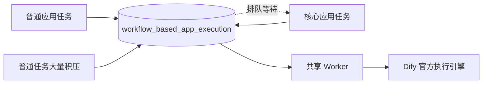
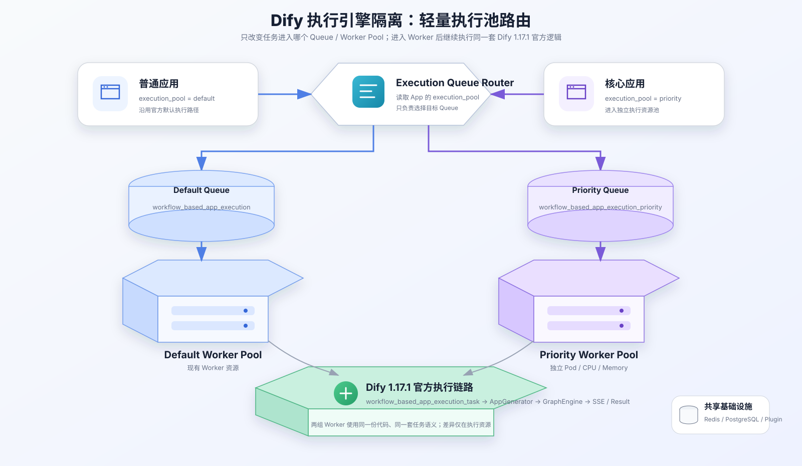
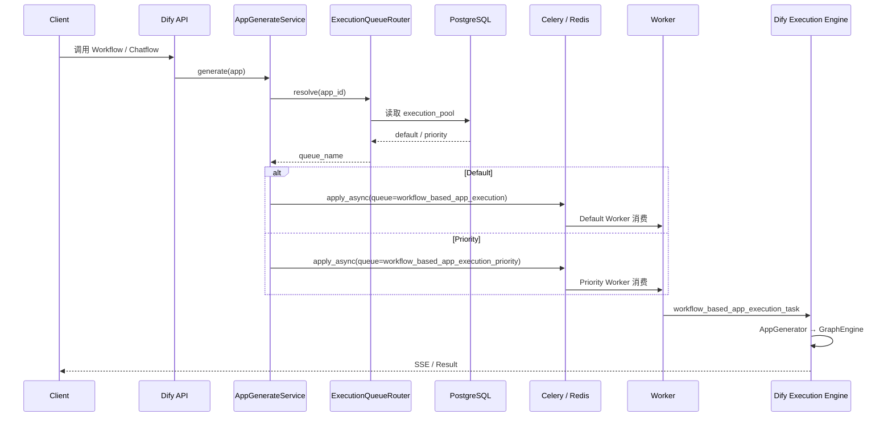
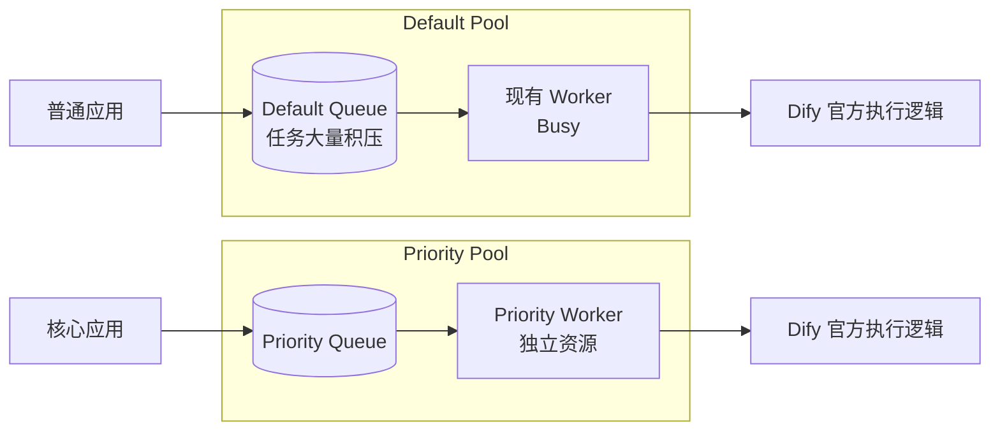
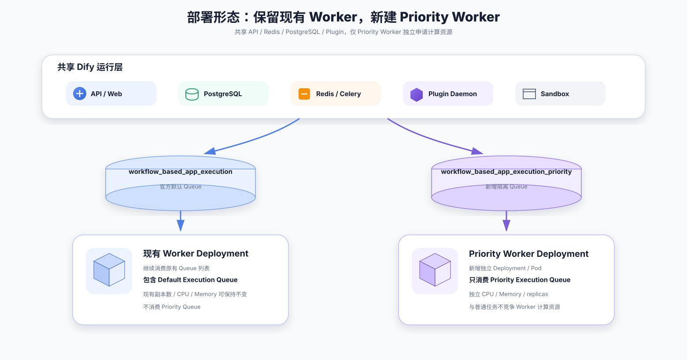

# Dify 执行引擎隔离方案

## 1. 背景与需求

### 1.1 当前问题

当前 Dify 1.17.1 的 Workflow / Chatflow 异步执行任务默认进入 `workflow_based_app_execution` Queue，由 Worker 消费并进入官方执行链路。普通应用与核心应用共享同一执行资源时，普通任务大量积压会占满 Worker，核心应用需要一起排队。



### 1.2 建设目标

| 目标 | 方案 |
| --- | --- |
| 核心任务隔离 | 核心应用进入独立 Priority Queue，由独立 Worker 消费 |
| 普通任务保持现状 | 未配置隔离的应用继续使用官方 Default Queue 和现有 Worker |
| 执行逻辑复用 | Worker 获取任务后继续使用 Dify 1.17.1 的 AppGenerator、GraphEngine、SSE 与任务状态逻辑 |
| 改造范围收敛 | 二开只负责 App 执行池配置和 Queue 路由，不重写 Workflow 执行引擎 |

---

## 2. 方案架构

### 2.1 整体架构



任务进入 Dify API 后，根据 App 的 `execution_pool` 选择执行 Queue。Default 与 Priority Worker 使用同一份 Dify 代码，区别只在消费的 Queue 和计算资源。

### 2.2 执行池

| 执行池 | App 配置 | Queue | Worker | 用途 |
| --- | --- | --- | --- | --- |
| Default | `default` | `workflow_based_app_execution` | 现有 Worker | 普通应用，保持官方默认路径 |
| Priority | `priority` | `workflow_based_app_execution_priority` | Priority Worker | 核心应用，独立执行资源 |

### 2.3 改造边界

| 公司二开负责 | Dify 1.17.1 继续负责 |
| --- | --- |
| App 绑定 Default / Priority 执行池 | Workflow / Chatflow 定义与解析 |
| 根据 App 选择 Celery Queue | `workflow_based_app_execution_task` 任务执行 |
| Priority Worker 独立部署和资源配置 | AppGenerator / GraphEngine |
| 两个执行池的运行监控 | WorkflowRun、暂停恢复、SSE、结果返回 |

---

## 3. 执行流程

### 3.1 请求执行时序



### 3.2 隔离效果



---

## 4. 具体实现

### 4.1 App 执行策略

第一版只提供两个固定执行池，在 `App` 增加一个执行策略字段。

| 字段 | 类型 | 默认值 | 说明 |
| --- | --- | --- | --- |
| `execution_pool` | Enum / String | `default` | 可选 `default`、`priority` |

未配置的历史 App 统一按 `default` 处理，不改变原有执行行为。

### 4.2 Queue Router

新增轻量 `ExecutionQueueRouter`，只做 App 执行池到 Queue 的映射。

```python
DEFAULT_QUEUE = "workflow_based_app_execution"
PRIORITY_QUEUE = "workflow_based_app_execution_priority"

def resolve_execution_queue(app):
    if app.execution_pool == "priority":
        return PRIORITY_QUEUE
    return DEFAULT_QUEUE
```

Dify 1.17.1 当前在 `AppGenerateService` 中通过 `workflow_based_app_execution_task.delay(payload_json)` 入队。改造后使用显式 Queue：

```python
queue = ExecutionQueueRouter.resolve_execution_queue(app_model)

workflow_based_app_execution_task.apply_async(
    args=[payload_json],
    queue=queue,
)
```

### 4.3 改造点

| 位置 | 当前 1.17.1 行为 | 修改 |
| --- | --- | --- |
| `models.model.App` | 无执行池字段 | 增加 `execution_pool` |
| `services/app_generate_service.py` | `.delay(payload_json)` 进入固定 Queue | 入队前调用 Router，改为 `apply_async(queue=...)` |
| Workflow 恢复 / Resume 入队入口 | 使用固定执行 Queue | 根据对应 App 再次选择同一执行池 |
| `workflow_execute_task.py` | 执行 AppRunner / AppGenerator / GraphEngine | 不修改任务执行逻辑 |
| Worker 启动配置 | 现有 Worker 消费官方 Queue 列表 | 新增 Priority Worker，只消费 Priority Queue |

### 4.4 路由规则

| 场景 | 处理 |
| --- | --- |
| `execution_pool=default` | 进入官方 `workflow_based_app_execution` |
| `execution_pool=priority` | 进入 `workflow_based_app_execution_priority` |
| 字段为空或历史数据 | 按 `default` 处理 |
| Priority Worker 暂时不可用 | 任务保留在 Priority Queue 等待，不转入 Default Pool |
| Workflow 暂停后恢复 | 按原 App 的 `execution_pool` 重新入队 |

### 4.5 验证

| 测试 | 预期 |
| --- | --- |
| 普通 App 执行 | 进入 Default Queue，由现有 Worker 执行 |
| Priority App 执行 | 进入 Priority Queue，由 Priority Worker 执行 |
| Default Queue 大量积压 | Priority App 仍可被 Priority Worker 正常消费 |
| Priority Queue 大量积压 | 不占用 Default Worker |
| Workflow / Chatflow 执行结果 | 与官方 1.17.1 行为一致 |
| Streaming / SSE | 路由变化不影响事件返回 |
| Pause / Resume | 恢复任务仍进入原 App 对应执行池 |

---

## 5. 部署方案

### 5.1 部署架构



### 5.2 组件调整

| 组件 | 处理 | Queue |
| --- | --- | --- |
| API | 沿用当前部署，增加执行池路由逻辑 | 负责选择 Queue |
| 现有 Worker | 保持当前部署和资源配置 | 继续消费原有 Queue，包含 `workflow_based_app_execution` |
| Priority Worker | 新增独立 Deployment / 容器实例 | 只消费 `workflow_based_app_execution_priority` |
| Redis / Celery Broker | 共享现有基础设施 | 两个 Queue 共用 Broker |
| PostgreSQL | 共享 | 保存 App 的 `execution_pool` |
| Plugin Daemon / Sandbox | 共享 | 无改动 |

### 5.3 Worker 启动

现有 Worker 不增加 Priority Queue，继续保持当前 Queue 列表。

Priority Worker 使用同一份 Dify API/Worker 制品，只修改消费 Queue：

```bash
cp .env.test .env && uv run celery -A app.celery worker -P gevent -c 1 --loglevel INFO -Q workflow_based_app_execution_priority
```

Priority Worker 在 DevOps 中使用独立实例配置 CPU、Memory 和副本数，实现真正的执行计算资源隔离。

---

## 6. 实施排期

| 阶段 | 工作内容 | 产出 | 预计 |
| --- | --- | --- | --- |
| 1 | 确认 1.17.1 App 执行、入队、Resume 链路 | 改造点清单 | 0.5 天 |
| 2 | 增加 `execution_pool`、ExecutionQueueRouter 和动态 Queue 入队 | 后端代码与 Migration | 1 天 |
| 3 | 新增 Priority Worker 部署和 Queue 配置 | 独立 Worker 实例 | 0.5 天 |
| 4 | Default / Priority 路由、积压隔离、SSE、Pause / Resume 测试 | 测试结果 | 1 天 |
| 5 | 测试环境灰度核心 App 并验证资源隔离 | 可上线版本 | 0.5 天 |
