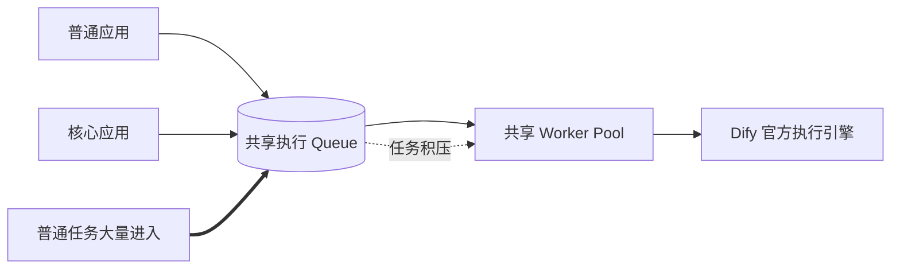
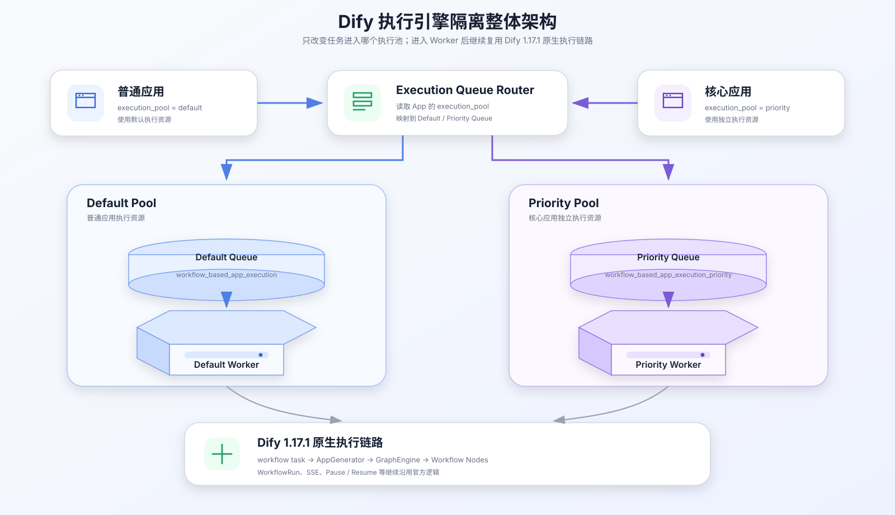
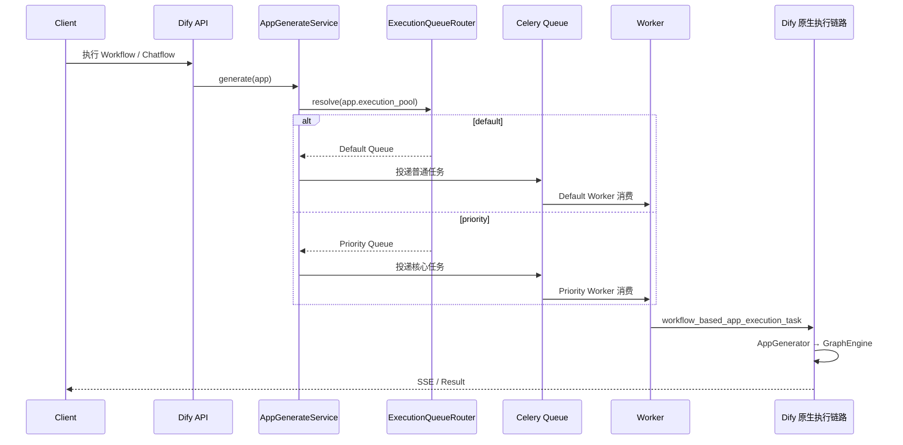
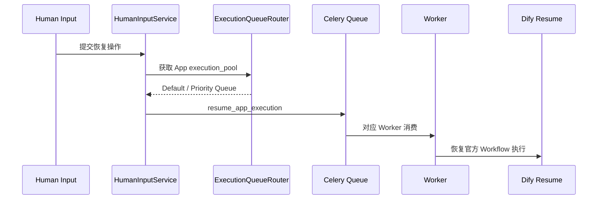
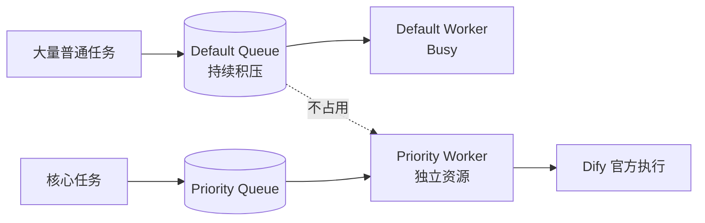
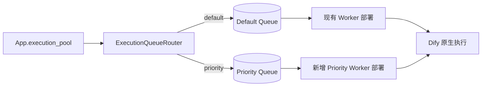
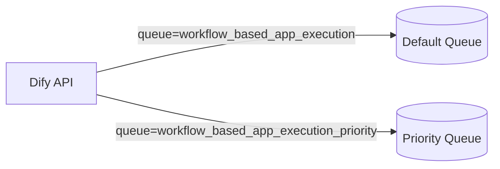
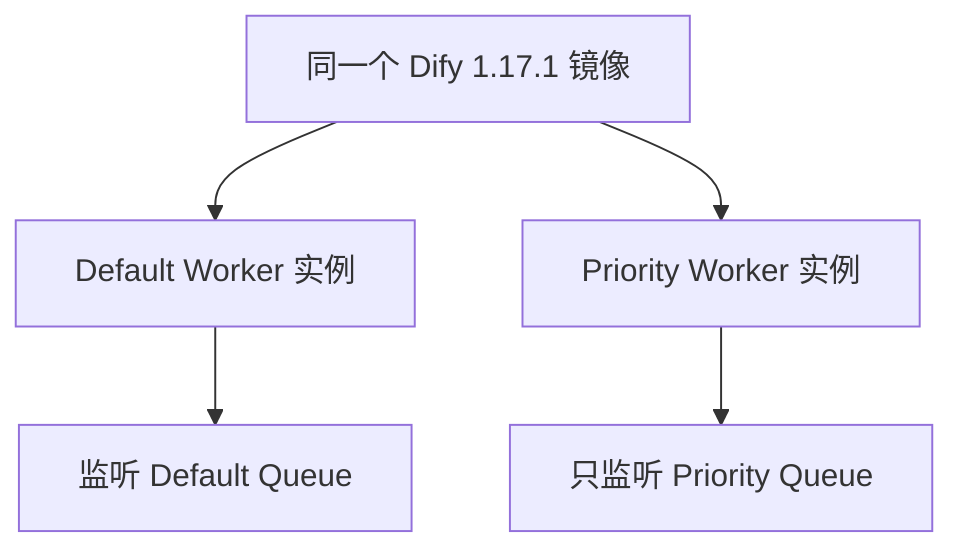
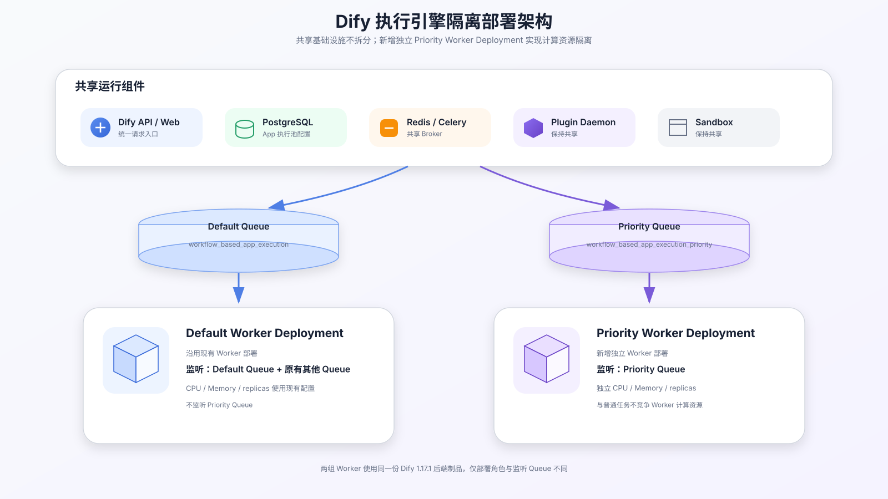
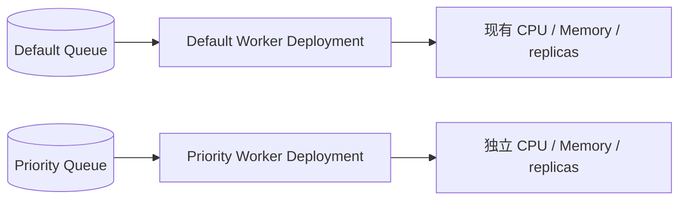

# Dify 执行引擎隔离方案

## 一、背景与建设目标

### 1.1 背景

当前 Dify 1.17.1 的 Workflow / Chatflow 异步执行任务统一进入 `workflow_based_app_execution` Queue，再由 Worker 消费并进入官方执行链路。普通应用和核心应用共享同一组 Worker，当普通任务集中提交或出现长任务时，核心应用也需要等待共享执行资源。

### 1.2 当前问题



| 问题 | 当前表现 |
| --- | --- |
| 执行资源共享 | 普通应用与核心应用竞争同一组 Worker |
| 队列相互影响 | 普通任务积压后，核心任务也需要排队 |
| 资源无法独立配置 | 无法单独为核心应用配置 Worker 数量、CPU 和内存 |
| 执行优先级难保证 | 重要任务与普通任务使用同一执行通道 |

### 1.3 建设目标

| 目标 | 建设内容 |
| --- | --- |
| 执行资源隔离 | 普通应用与核心应用进入不同 Queue 和 Worker Pool |
| 核心任务独立执行 | 核心应用使用独立 Priority Worker，不等待 Default Worker |
| 保持官方执行逻辑 | Worker 获取任务后继续使用 Dify 1.17.1 原生执行链路 |
| 控制二开范围 | 只增加 App 执行池配置、Queue 路由和 Priority Worker |

---

## 二、总体方案

### 2.1 整体架构



App 发起 Workflow / Chatflow 执行时，根据 `execution_pool` 选择 Default 或 Priority Queue。两组 Worker 使用同一份 Dify 1.17.1 后端代码，区别只在监听 Queue 和分配的计算资源。

### 2.2 核心模块

| 模块 | 作用 | 实现 |
| --- | --- | --- |
| App Execution Policy | 标识 App 使用哪个执行池 | `execution_pool = default / priority` |
| Execution Queue Router | 根据 App 选择目标 Queue | 固定映射 Default / Priority |
| Default Queue | 承接普通应用任务 | 沿用 `workflow_based_app_execution` |
| Priority Queue | 承接核心应用任务 | 新增 `workflow_based_app_execution_priority` |
| Default Worker | 执行普通任务 | 沿用现有 Worker |
| Priority Worker | 执行核心任务 | 独立部署，只监听 Priority Queue |
| Dify Execution Engine | 实际执行 Workflow / Chatflow | 完全复用 1.17.1 官方链路 |

### 2.3 执行池与隔离范围

| 内容 | Default Pool | Priority Pool |
| --- | --- | --- |
| 应用 | 普通应用 | 核心应用 |
| Queue | `workflow_based_app_execution` | `workflow_based_app_execution_priority` |
| Worker | 现有 Worker | 独立 Priority Worker |
| CPU / Memory | Default Worker 资源 | Priority Worker 独立资源 |
| replicas | Default Worker 副本 | Priority Worker 独立副本 |
| Dify 执行代码 | 共享 | 共享 |
| PostgreSQL / Redis / Plugin / Sandbox | 共享 | 共享 |

隔离对象是 **任务队列和 Worker 计算资源**，不是两套完整 Dify 环境。

---

## 三、执行流程

### 3.1 首次执行



### 3.2 暂停与恢复

Human Input 等场景恢复执行时，根据原 App 再次选择执行池，保证 Priority App 恢复后仍进入 Priority Pool。



### 3.3 隔离效果



---

## 四、具体实现

这一部分只做两类改动：**代码侧负责“任务进哪个 Queue”**，**部署侧负责“哪个 Worker 消费这个 Queue、给多少资源”**。Workflow / Chatflow 的实际执行代码不改。

### 4.1 改造总览

| 层次 | 要改什么 | 是否新增业务逻辑 |
| --- | --- | --- |
| App | 增加 `execution_pool` 字段 | 是，记录 `default / priority` |
| API 入队 | 根据 `execution_pool` 选择 Queue | 是，增加一层固定路由 |
| Celery Queue | 增加 `workflow_based_app_execution_priority` | 否，直接使用 Celery Queue |
| Worker | 新增一份 Priority Worker 部署 | 否，复用同一份 Dify Worker 代码 |
| Workflow 执行 | AppGenerator、GraphEngine、SSE、WorkflowRun | 不改 |
| Pause / Resume | 恢复任务重新按 App 选择 Queue | 是，复用同一个路由逻辑 |

整体改动关系：



### 4.2 第一步：给 App 增加执行池标记

在 App 上增加一个字段，用来表示这个应用应该走哪组执行资源。

| 字段 | 类型 | 默认值 | 可选值 |
| --- | --- | --- | --- |
| `apps.execution_pool` | `varchar(32)` | `default` | `default` / `priority` |

示例：

```text
普通 App
execution_pool = default

核心 App
execution_pool = priority
```

历史 App 默认都是 `default`，因此现有应用不会改变执行路径。

### 4.3 第二步：任务入队时选择 Queue

Dify 1.17.1 当前在 `AppGenerateService` 中直接：

```python
workflow_based_app_execution_task.delay(payload_json)
```

任务因此进入官方默认 Queue：

```text
workflow_based_app_execution
```

改造后，在投递任务前增加一个很薄的 Router：

```python
DEFAULT_QUEUE = "workflow_based_app_execution"
PRIORITY_QUEUE = "workflow_based_app_execution_priority"

class ExecutionQueueRouter:
    @staticmethod
    def resolve(app) -> str:
        if app.execution_pool == "priority":
            return PRIORITY_QUEUE
        return DEFAULT_QUEUE
```

然后把固定投递改成：

```python
queue = ExecutionQueueRouter.resolve(app_model)

workflow_based_app_execution_task.apply_async(
    args=[payload_json],
    queue=queue,
)
```

最终就是：

| App 配置 | 投递 Queue |
| --- | --- |
| `execution_pool=default` | `workflow_based_app_execution` |
| `execution_pool=priority` | `workflow_based_app_execution_priority` |

Router 只负责这个映射，不做任务调度、优先级计算和执行状态管理。

### 4.4 第三步：增加 Priority Queue

这里不需要在 Dify 里开发一个“Queue 模块”。

Dify 本身使用 Celery，现有 Worker 启动命令已经通过 `-Q` 同时监听多个 Queue，例如：

```bash
-Q dataset,...,workflow,workflow_based_app_execution,...
```

因此新增隔离队列只需要统一使用一个新的 Queue 名称：

```text
workflow_based_app_execution_priority
```

任务投递时指定这个名称，Priority Worker 启动时监听同一个名称即可。Queue 的传递、存储和消费仍由 Celery + Redis Broker 负责。



### 4.5 第四步：独立部署 Priority Worker

这里**不开发新的 Worker 类，也不复制 Dify Worker 代码**。

两组 Worker 都使用同一个 Dify 1.17.1 镜像，只是启动命令里的监听 Queue 不同。

**现有 Default Worker：**

继续使用当前启动命令，保留原有 Queue 列表，其中包含：

```text
workflow_based_app_execution
```

并且不要加入：

```text
workflow_based_app_execution_priority
```

**新增 Priority Worker：**

```bash
cp .env.test .env && uv run celery -A app.celery worker -P gevent -c 1 --loglevel INFO -Q workflow_based_app_execution_priority
```

因此代码关系是：



真正的 CPU、Memory、replicas 不在代码里配置，而是在 DevOps / K8s 部署 Priority Worker 时单独设置。

### 4.6 第五步：Pause / Resume 保持同一执行池

Dify 1.17.1 的 Human Input 恢复路径会再次投递 `resume_app_execution`。

如果只改首次执行，Priority App 暂停后恢复时可能重新进入默认 Queue，因此 Resume 入口也要复用同一个 Router：

```python
queue = ExecutionQueueRouter.resolve(app_model)

resume_app_execution.apply_async(
    kwargs={"payload": payload},
    queue=queue,
)
```

这样：

```text
Priority App 首次执行
→ Priority Queue
→ Pause

Human Input 恢复
→ 再读取 App.execution_pool
→ Priority Queue
→ Priority Worker
```

### 4.7 最终代码与部署改动

| 改动位置 | 具体修改 | 类型 |
| --- | --- | --- |
| App Model | 增加 `execution_pool` | 代码 / Migration |
| App 配置接口 | 支持读取、修改 `execution_pool` | 代码 |
| `services/app_generate_service.py` | `.delay()` 改为根据 Router `apply_async(queue=...)` | 代码 |
| `services/human_input_service.py` | Resume 时根据 Router 指定 Queue | 代码 |
| Celery | 增加 Priority Queue 名称 | 配置 |
| Default Worker | 保持现有部署，不监听 Priority Queue | 部署 |
| Priority Worker | 同一镜像新增一个部署，只监听 Priority Queue | 部署 |
| AppGenerator / GraphEngine | 不修改 | 无改动 |

### 4.8 测试验证

| 场景 | 验证方式 | 预期 |
| --- | --- | --- |
| 普通 App 执行 | 查看 routing key / Worker 日志 | 进入 Default Queue |
| 核心 App 执行 | 查看 Priority Worker 日志 | 进入 Priority Queue |
| Default Queue 积压 | 大量普通任务同时执行核心 App | 核心 App 正常执行 |
| Priority Queue 积压 | 连续提交核心任务 | 不占用 Default Worker |
| Workflow / Chatflow | 对比改造前后结果 | 执行结果一致 |
| Streaming / SSE | 流式执行 | 事件正常返回 |
| Human Input Resume | 暂停后恢复 Priority App | 仍进入 Priority Queue |

---

## 五、上线部署

### 5.1 部署架构



### 5.2 组件调整

| 组件 | 当前 | 改造后 |
| --- | --- | --- |
| Dify API | 执行任务进入默认 Queue | 增加 Queue 路由 |
| PostgreSQL | App 无执行池字段 | 保存 `execution_pool` |
| Redis / Celery | 官方 Queue | 新增 Priority Queue |
| Default Worker | 消费现有 Queue | 保持现状 |
| Priority Worker | 无 | 新增独立 Deployment |
| Plugin Daemon / Sandbox | 当前共享部署 | 保持共享 |
| Web / API 入口 | 当前部署 | 保持不变 |

### 5.3 Worker 资源配置



Priority Worker 在 DevOps 中作为独立部署实例配置资源，Redis、PostgreSQL、Plugin Daemon 等继续复用当前 1.17.1 环境。

---

## 六、实施计划

| 阶段 | 工作内容 | 产出 | 预计 | 状态 |
| --- | --- | --- | --- | --- |
| 第 1 阶段 | 梳理首次执行和 Resume 入队入口 | 改造点清单 | 0.5 天 | 待开展 |
| 第 2 阶段 | 增加 `execution_pool` 和 Queue Router | 后端代码、Migration | 1 天 | 待开展 |
| 第 3 阶段 | 首次执行与 Resume 接入 Queue 路由 | 完整路由链路 | 0.5 天 | 待开展 |
| 第 4 阶段 | 新增 Priority Worker 部署及资源配置 | Priority Worker 实例 | 0.5 天 | 待开展 |
| 第 5 阶段 | 完成隔离、Workflow / Chatflow、SSE、Resume 测试 | 测试结果 | 1 天 | 待开展 |
| 第 6 阶段 | 测试环境验证并上线 | 可上线版本 | 0.5 天 | 待开展 |
