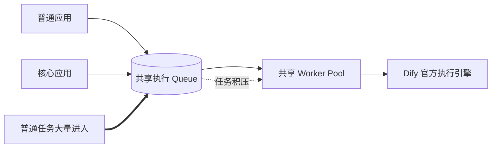
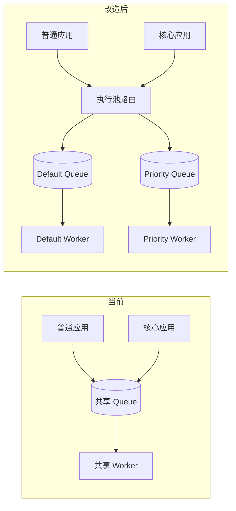
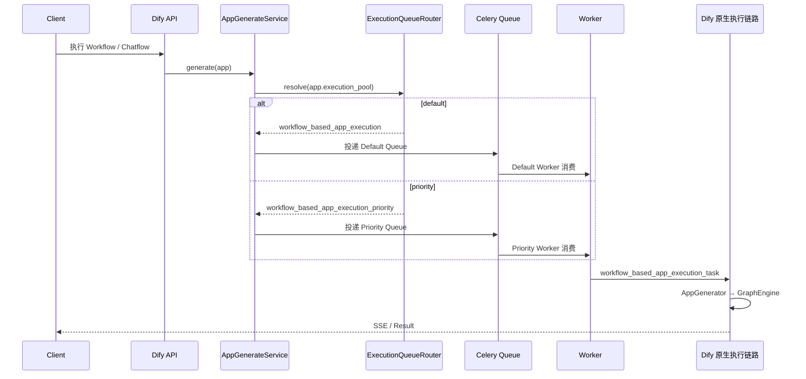
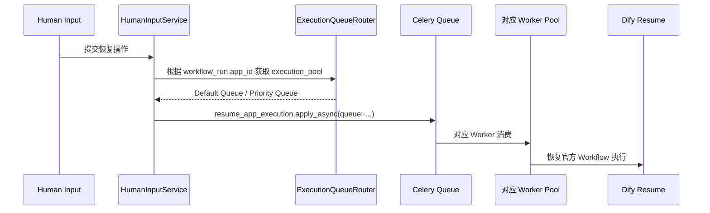
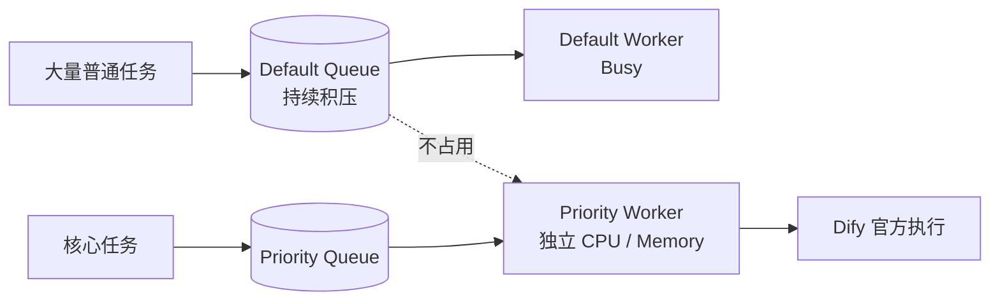
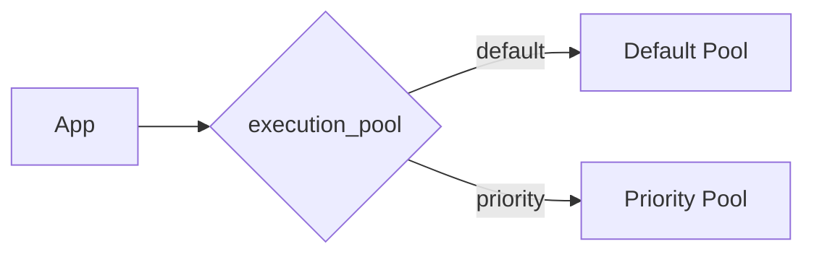
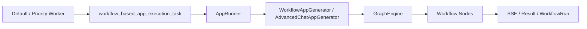
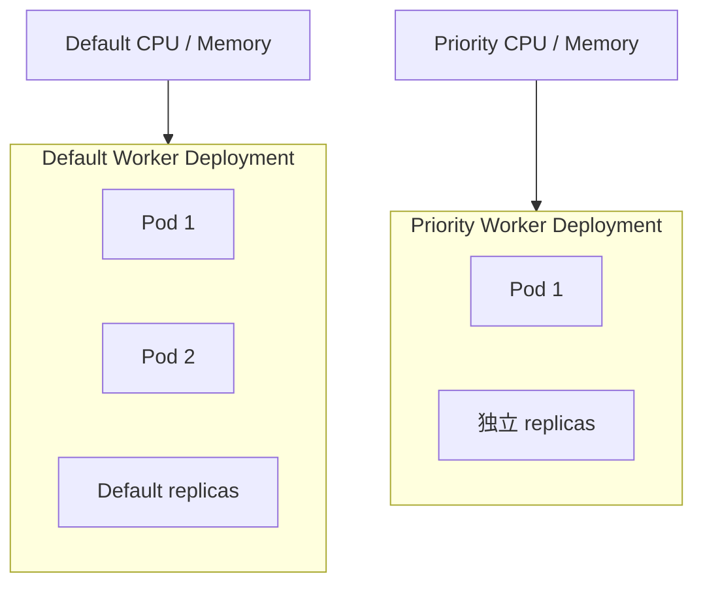

# Dify 执行引擎隔离方案

## 一、背景与建设目标

### 1.1 背景

当前 Dify 1.17.1 的 Workflow / Chatflow 异步执行任务统一进入 `workflow_based_app_execution` Queue，再由 Worker 消费并进入官方执行链路。普通应用和核心应用共享同一组 Worker，当普通任务集中提交或出现长任务时，核心应用也需要等待共享执行资源。

### 1.2 当前问题



| 问题 | 当前表现 |
| --- | --- |
| 执行资源共享 | 普通应用与核心应用竞争同一组 Worker |
| 队列相互影响 | 普通任务积压后，核心任务也需要排队 |
| 资源无法独立配置 | 无法单独为核心应用配置 Worker 数量、CPU 和内存 |
| 执行优先级难保证 | 重要任务与普通任务使用同一执行通道 |

### 1.3 建设目标

| 目标 | 建设内容 |
| --- | --- |
| 执行资源隔离 | 将普通应用与核心应用分配到不同 Queue 和 Worker Pool |
| 核心任务独立执行 | 核心应用使用独立 Priority Worker，不等待 Default Worker |
| 保持官方执行逻辑 | 任务进入 Worker 后继续使用 Dify 1.17.1 原生 AppGenerator、GraphEngine、SSE 和 WorkflowRun |
| 控制二开范围 | 只增加 App 执行池配置、Queue 路由和 Priority Worker，不增加独立调度中心 |

---

## 二、总体方案

### 2.1 方案概览



方案只增加一层“执行池路由”。App 发起 Workflow / Chatflow 执行时，根据自身的 `execution_pool` 选择 Queue；后续任务内容和执行方式对 Dify 来说保持一致。

### 2.2 执行池划分

| 执行池 | App 配置 | Queue | Worker | 使用场景 |
| --- | --- | --- | --- | --- |
| Default | `default` | `workflow_based_app_execution` | 现有 Worker | 普通应用 |
| Priority | `priority` | `workflow_based_app_execution_priority` | 独立 Priority Worker | 核心应用 |

这里的 Priority 表示独立执行资源池，不使用 Celery 单队列内部的任务优先级机制。

### 2.3 隔离范围

| 独立资源 | 继续共享 |
| --- | --- |
| Default / Priority Queue | Dify API / Web |
| Default / Priority Worker | PostgreSQL |
| Worker CPU / Memory | Redis / Celery Broker |
| Worker replicas | Plugin Daemon / Sandbox |
| 任务消费能力 | Dify Workflow / Chatflow 执行代码 |

执行隔离的核心是 **Queue 隔离 + Worker 计算资源隔离**，不是部署两套完整 Dify。

---

## 三、核心架构

### 3.1 整体架构


普通应用进入 Default Pool，核心应用进入 Priority Pool。两组 Worker 最终调用同一套 Dify 1.17.1 执行代码，因此二开只影响任务被哪组 Worker 消费，不改变 Workflow / Chatflow 的执行语义。

### 3.2 核心模块

| 模块 | 职责 | 实现方式 |
| --- | --- | --- |
| App Execution Policy | 记录 App 使用哪个执行池 | App 增加 `execution_pool` 字段 |
| Execution Queue Router | 将执行池映射到目标 Queue | `default → Default Queue`，`priority → Priority Queue` |
| Default Queue | 承接普通应用任务 | 沿用官方 `workflow_based_app_execution` |
| Priority Queue | 承接核心应用任务 | 新增 `workflow_based_app_execution_priority` |
| Default Worker | 执行普通任务 | 沿用现有 Worker |
| Priority Worker | 执行核心任务 | 使用同一 Dify 制品，独立部署并只监听 Priority Queue |
| Dify Execution Engine | 真正执行 Workflow / Chatflow | 完全复用 1.17.1 官方链路 |

---

## 四、执行流程

### 4.1 首次执行



### 4.2 暂停与恢复

Human Input 等场景恢复执行时，需要继续使用原 App 的执行池，避免 Priority 任务恢复后重新进入 Default Pool。



### 4.3 隔离效果



Default Pool 出现积压时，只影响普通应用；Priority Pool 仍由独立 Worker 消费核心任务。

---

## 五、具体实现

### 5.1 App 执行池配置

第一版固定两个执行池，不增加执行池管理表。

| 字段 | 类型 | 默认值 | 可选值 |
| --- | --- | --- | --- |
| `apps.execution_pool` | `varchar(32)` | `default` | `default` / `priority` |

历史 App 在 Migration 后统一使用 `default`，只有明确配置为核心应用的 App 才进入 Priority Pool。

管理员配置关系：



### 5.2 Queue 路由

Dify 1.17.1 当前在 `AppGenerateService` 中通过 `workflow_based_app_execution_task.delay(payload_json)` 投递任务。改造后在投递前解析 Queue，并使用 `apply_async` 显式指定。

```python
DEFAULT_QUEUE = "workflow_based_app_execution"
PRIORITY_QUEUE = "workflow_based_app_execution_priority"

class ExecutionQueueRouter:
    @staticmethod
    def resolve(app) -> str:
        if app.execution_pool == "priority":
            return PRIORITY_QUEUE
        return DEFAULT_QUEUE
```

投递逻辑：

```python
queue = ExecutionQueueRouter.resolve(app_model)

workflow_based_app_execution_task.apply_async(
    args=[payload_json],
    queue=queue,
)
```

Router 只做固定映射，不维护任务状态、不计算动态优先级，也不参与 Workflow 内部执行。

### 5.3 Worker 执行

两组 Worker 使用 **同一份 Dify 1.17.1 后端制品**，区别只在监听 Queue 和分配的计算资源。

| Worker | 监听 Queue | 执行代码 |
| --- | --- | --- |
| Default Worker | 原有 Queue 列表，其中包含 `workflow_based_app_execution` | Dify 1.17.1 |
| Priority Worker | `workflow_based_app_execution_priority` | Dify 1.17.1 |

Priority Worker：

```bash
cp .env.test .env && uv run celery -A app.celery worker -P gevent -c 1 --loglevel INFO -Q workflow_based_app_execution_priority
```

### 5.4 Dify 原生执行链路



这一段不做执行协议转换，两组 Worker 都直接进入官方 `workflow_based_app_execution_task`。

需要改动的代码位置集中在：

| 位置 | 修改内容 |
| --- | --- |
| App Model / Migration | 增加 `execution_pool` |
| App 配置接口 | 读取和修改 App 执行池 |
| `services/app_generate_service.py` | 首次执行入队时选择 Queue |
| `services/human_input_service.py` | `resume_app_execution` 恢复时选择 Queue |
| Worker 部署配置 | 新增 Priority Worker 和 Priority Queue |

### 5.5 测试验证

| 场景 | 验证方式 | 预期 |
| --- | --- | --- |
| 普通 App 执行 | 查看 Celery routing key / Worker 日志 | 只进入 Default Queue |
| 核心 App 执行 | 查看 Priority Worker 日志 | 只进入 Priority Queue |
| Default Queue 积压 | 连续提交大量普通任务，同时执行核心 App | 核心 App 仍由 Priority Worker 消费 |
| Priority Queue 积压 | 连续提交核心任务 | 不占用 Default Worker |
| Workflow / Chatflow | 对比改造前后输出 | 执行结果一致 |
| Streaming / SSE | 执行流式 Workflow | 事件正常返回 |
| Human Input Resume | 暂停后恢复 Priority App | 仍进入 Priority Queue |
| Worker 重启 | 重启 Priority Worker | Queue 中待执行任务继续被消费 |

---

## 六、上线部署

### 6.1 部署架构


### 6.2 组件调整

| 组件 | 当前 | 改造后 |
| --- | --- | --- |
| Dify API | 官方执行任务直接进入默认 Queue | 增加 Execution Queue Router |
| PostgreSQL | App 无执行池配置 | App 保存 `execution_pool` |
| Redis / Celery | 官方 Queue | 在同一 Broker 中新增 Priority Queue |
| Default Worker | 消费现有 Queue 列表 | 保持现状，不监听 Priority Queue |
| Priority Worker | 无 | 新增独立 Deployment，只监听 Priority Queue |
| Plugin Daemon / Sandbox | 当前共享部署 | 保持共享 |
| Web / API 入口 | 当前部署 | 保持不变 |

### 6.3 Worker 资源配置



Priority Worker 在 DevOps 中作为独立部署实例配置 CPU、Memory 和 replicas。Redis、PostgreSQL、Plugin Daemon 等基础设施继续复用当前 1.17.1 环境。

---

## 七、实施计划

| 阶段 | 工作内容 | 产出 | 预计 | 状态 |
| --- | --- | --- | --- | --- |
| 第 1 阶段 | 梳理首次执行、Human Input Resume 等执行入队入口 | 执行链路与改造点清单 | 0.5 天 | 待开展 |
| 第 2 阶段 | 增加 `execution_pool`、配置接口和 Execution Queue Router | 后端代码、Migration | 1 天 | 待开展 |
| 第 3 阶段 | 首次执行与 Resume 接入动态 Queue 路由 | Default / Priority 路由链路 | 0.5 天 | 待开展 |
| 第 4 阶段 | 新增 Priority Worker 部署及独立资源配置 | Priority Worker 实例 | 0.5 天 | 待开展 |
| 第 5 阶段 | 完成路由、积压隔离、Workflow / Chatflow、SSE、Resume 测试 | 测试结果 | 1 天 | 待开展 |
| 第 6 阶段 | 测试环境灰度核心 App 并完成上线验证 | 可上线版本 | 0.5 天 | 待开展 |
