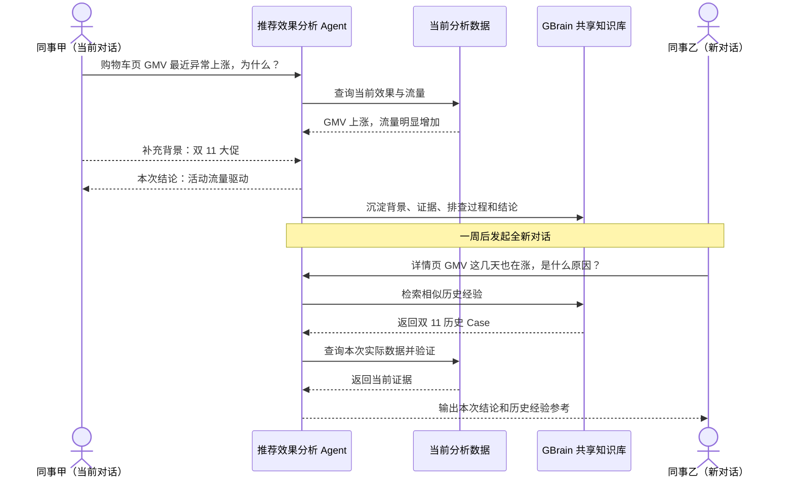
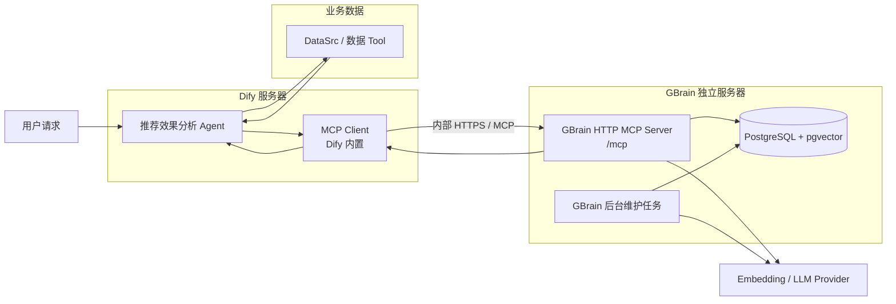
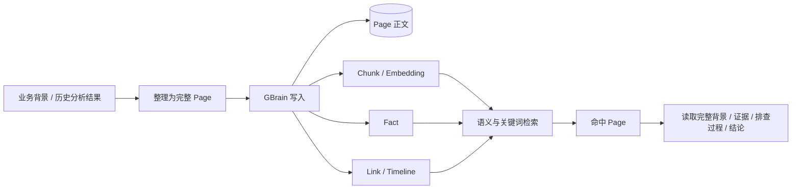
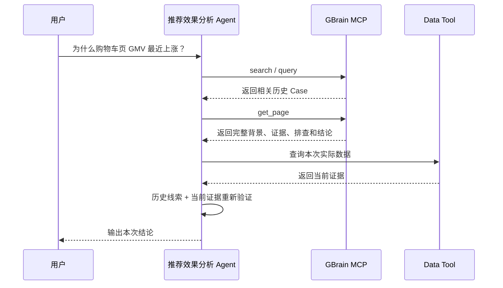

# GBrain 共享知识库 × Dify MCP 接入方案

## 一、背景

### 1.1 问题内容

目前，推荐效果分析 Agent 的上下文主要保存在单次对话中。对话结束后，用户补充的业务背景、Agent 已完成的排查过程以及形成的分析结论，无法在其他新对话中被自动发现和复用。

由此带来两个主要问题：

1. **背景信息被重复提供。** 不同同事分析同一时间段或同一业务事件时，需要反复向 Agent 补充相同的背景信息。
2. **相似问题被重复排查。** 历史异常即使已经完成分析，后续在新对话中仍需重新查询数据、排除原因并整理结论，已有经验无法在团队内持续复用。

### 1.2 建设目标

本期基于已选定的 GBrain 建设团队共享知识库，并接入 Dify 推荐效果分析 Agent。实现业务背景和历史分析经验的统一沉淀、跨对话检索和团队复用。

### 1.3 预期效果



---

## 二、共享知识方案调研与选型

| 项目 | 核心方式 | 与本场景的适配情况 | 结论 |
| --- | --- | --- | --- |
| **GBrain** | 以 Page 保存完整知识，通过 Chunk、Fact、Timeline、Link 等结构组织和检索；同时支持关键词与向量混合查询 | 能保留完整历史 Case，又能通过实验、页面、指标等精确标识和业务语义共同检索；面向团队共享 Brain，读写链路都比较直接 | **推荐，本期选型** |
| RAGFlow | 以文档和 Chunk 为核心，提供混合检索、Parent-Child、GraphRAG 等能力 | 传统 RAG 能力完整，适合大规模文档知识库；但本场景主要是短业务背景和历史 Case，共享部署组件较多 | 备选，不作为本期首选 |
| OpenViking | 将 Resource、Memory、Experience 等上下文按目录和 L0/L1/L2 分层组织 | 适合 Agent 长期上下文和分层读取，但查询和知识组织方式更偏上下文目录体系，与当前 Case 复用链路相比更复杂 | 备选 |
| SAG | 将内容抽取为 Event、Entity，并在查询时构建关系增强结果 | 适合需要事件关系扩展的知识场景，但本期核心需求是稳定找回完整历史 Case，关系加工会增加额外链路 | 备选 |
| LightRAG | 以实体、关系和原文 Chunk 形成图增强检索 | 对跨知识关联和图关系检索能力较强，但需要额外维护实体关系，写入和索引链路更重 | 后续图关系需求可考虑 |
| Mem0 | 将对话内容提炼为 Memory，并按用户、Agent、Run 等 Scope 管理 | 更适合个人或 Agent 长期记忆；自动提炼和合并会弱化完整 Case、精确标识和原始排查过程，不适合作为本期团队经验主库 | 不作为本期方案 |

---

## 三、整体架构

### 3.1 架构图



Dify 与 GBrain 物理分离部署。推荐效果分析 Agent 使用 Dify 原生 MCP Client，通过内网 HTTPS 连接 GBrain 独立服务器上的 MCP Server；GBrain 服务器独立负责共享知识的存储、检索、写入和后台维护。

### 3.2 模块职责

| 模块 | 主要职责 | 输出 |
| --- | --- | --- |
| 推荐效果分析 Agent | 理解用户问题，组织当前数据查询，并决定何时读取或写入历史经验 | 本次分析结论 |
| DataSrc / 数据 Tool | 查询当前时间、页面、实验和指标数据 | 当前事实与证据 |
| Dify MCP Client | 连接 GBrain MCP Server，发现并调用 GBrain 暴露的标准 MCP 能力 | MCP 调用结果 |
| GBrain HTTP MCP Server | 对外提供 `search`、`query`、`get_page`、`put_page` 等共享知识能力，并负责鉴权与调用审计 | 历史经验 / 写入结果 |
| PostgreSQL + pgvector | 保存 Page、Chunk、Fact、关系和向量索引 | 团队共享知识数据 |
| Embedding / LLM Provider | 为语义检索、抽取和后台知识加工提供模型能力 | 向量及加工结果 |

---

## 四、GBrain 知识组织

本期共享知识只保存两类内容：**业务背景**和**历史分析 Case**。完整内容统一以 Page 保存，GBrain 再基于 Page 组织用于检索的 Chunk、Fact 和关联信息。



一条历史 Case 主要包含：问题范围、业务背景、分析证据、已完成的排查过程、最终结论和来源信息。例如一次“购物车页 GMV 上涨”分析，会保存对应站点、页面和时间范围，大促背景，流量与转化证据，已排除的配置因素，以及最终原因结论。

**完整 Case 以 Page 为复用单位，Chunk、Fact、Link 和 Timeline 主要负责帮助检索和关联到对应 Page。**

---

## 五、独立服务器部署方案

本章按一台全新的 Linux 服务器从零开始，目标是让没有参与设计的人也可以按步骤完成部署。

本方案固定为：

```text
Dify Server
    │
    │ 内网 HTTPS :443
    ▼
GBrain Server
├── Nginx
│   └── 127.0.0.1:3131 → GBrain HTTP MCP
├── GBrain Service
├── PostgreSQL + pgvector
└── 日志 / 备份
```

### 5.1 部署前需要准备什么

开始前准备以下信息：

```text
1. 一台独立 Linux 服务器
2. sudo / root 权限
3. GBrain 服务器固定内网 IP
4. Dify 服务器内网 IP
5. 内部域名，例如 gbrain.internal.example.com
6. 内部 TLS 证书，或公司 Gateway 已能够提供 HTTPS
7. 至少一个 Embedding Provider Key
8. 如需 Fact 抽取 / Query Expansion，再准备 LLM Provider Key
```

本文命令按 **Ubuntu 22.04 / 24.04** 风格编写。公司已有统一服务器初始化、Docker、Nginx、证书管理规范时，以公司规范为准，下面命令用于说明最终必须得到的运行状态。

### 5.2 创建系统用户和目录

不要使用 root 长期运行 GBrain。

```bash
sudo useradd --create-home --shell /bin/bash gbrain
```

创建运行目录：

```bash
sudo mkdir -p /srv/gbrain/postgres
sudo mkdir -p /srv/gbrain/knowledge
sudo mkdir -p /srv/gbrain/backup
sudo mkdir -p /srv/gbrain/logs
sudo chown -R gbrain:gbrain /srv/gbrain
```

安装基础工具：

```bash
sudo apt update
sudo apt install -y curl git nginx openssl ca-certificates
```

### 5.3 安装 Docker

如果服务器已经按公司基线安装 Docker，可直接跳过本节。

Ubuntu 可先尝试发行版包：

```bash
sudo apt install -y docker.io docker-compose-v2
sudo systemctl enable --now docker
```

检查：

```bash
docker --version
docker compose version
sudo systemctl status docker
```

三项都正常再继续。

如果当前 Ubuntu 镜像没有 `docker-compose-v2` 包，则按 Docker 官方 Ubuntu 安装文档安装 Docker Engine 和 Compose Plugin，不使用已经停止维护的旧版 `docker-compose` Python 包。

### 5.4 部署 PostgreSQL + pgvector

GBrain 的团队共享 / 远程 HTTP MCP 场景使用真正的 PostgreSQL。本方案使用 pgvector 官方 Docker Image，避免在宿主机手工编译 pgvector。

先生成数据库密码：

```bash
openssl rand -hex 24
```

将输出保存为 `<GBRAIN_DB_PASSWORD>`。

创建：

```bash
sudo mkdir -p /opt/gbrain
sudo chown -R $USER:$USER /opt/gbrain
cd /opt/gbrain
```

新建 `.env`：

```bash
cat > .env <<'EOF'
GBRAIN_DB_PASSWORD=<替换成刚才生成的密码>
EOF
```

限制权限：

```bash
chmod 600 .env
```

新建 `docker-compose.yml`：

```yaml
services:
  postgres:
    image: pgvector/pgvector:pg16
    container_name: gbrain-postgres
    restart: unless-stopped
    environment:
      POSTGRES_USER: gbrain
      POSTGRES_PASSWORD: ${GBRAIN_DB_PASSWORD}
      POSTGRES_DB: gbrain
    ports:
      - "127.0.0.1:5432:5432"
    volumes:
      - gbrain_pgdata:/var/lib/postgresql/data
    healthcheck:
      test: ["CMD-SHELL", "pg_isready -U gbrain -d gbrain"]
      interval: 10s
      timeout: 5s
      retries: 10

volumes:
  gbrain_pgdata:
```

这里有一个非常重要的安全点：

```text
127.0.0.1:5432:5432
```

不能改成：

```text
0.0.0.0:5432:5432
```

PostgreSQL 只允许 GBrain 服务器本机访问，Dify 永远不直接连接数据库。

启动：

```bash
cd /opt/gbrain
docker compose up -d
```

检查：

```bash
docker compose ps
docker logs gbrain-postgres --tail 50
```

启用 pgvector：

```bash
docker exec -it gbrain-postgres \
  psql -U gbrain -d gbrain \
  -c "CREATE EXTENSION IF NOT EXISTS vector;"
```

确认：

```bash
docker exec -it gbrain-postgres \
  psql -U gbrain -d gbrain \
  -c "SELECT extversion FROM pg_extension WHERE extname = 'vector';"
```

能返回版本号即 pgvector 可用。

### 5.5 安装 Bun

切换到 GBrain 用户：

```bash
sudo -iu gbrain
```

安装 Bun：

```bash
curl -fsSL https://bun.sh/install | bash
```

重新加载 Shell：

```bash
source ~/.bashrc
```

检查：

```bash
bun --version
```

能输出版本号再继续。

### 5.6 安装 GBrain

仍然使用 `gbrain` 用户：

```bash
bun install -g github:garrytan/gbrain#latest-stable
```

检查：

```bash
gbrain --version
```

如果全局安装因为 Bun postinstall 限制失败，GBrain 官方给出的确定性兜底方式是从源码安装：

```bash
git clone https://github.com/garrytan/gbrain.git ~/gbrain-src
cd ~/gbrain-src
bun install
bun link
```

然后重新执行：

```bash
gbrain --version
```

### 5.7 让 GBrain 连接 PostgreSQL

先从 `/opt/gbrain/.env` 取得数据库密码，然后以 `gbrain` 用户初始化。

临时设置：

```bash
export DATABASE_URL='postgresql://gbrain:<GBRAIN_DB_PASSWORD>@127.0.0.1:5432/gbrain'
```

注意：如果数据库密码包含特殊字符，需要 URL Encode；前面使用 `openssl rand -hex 24` 可以避免这个问题。

初始化：

```bash
gbrain init --url "$DATABASE_URL"
```

检查 Engine：

```bash
gbrain engine status --probe
```

再执行：

```bash
gbrain doctor
gbrain stats
```

这里必须先处理完 `doctor` 的阻断性问题，再继续部署 MCP。

### 5.8 配置 Embedding / LLM Provider

GBrain 的关键词检索可以独立存在，但要获得语义检索能力，需要配置 Embedding Provider。

GBrain 官方支持通过环境变量提供模型 Key。例如：

```bash
export VOYAGE_API_KEY=<你的VoyageKey>
```

或者使用 OpenAI Embedding：

```bash
export OPENAI_API_KEY=<你的OpenAIKey>
```

如果还需要自动 Fact 抽取、Query Expansion、综合查询等能力，再配置支持的 Chat Model Key，例如：

```bash
export ANTHROPIC_API_KEY=<你的AnthropicKey>
```

检查模型配置：

```bash
gbrain models
gbrain models doctor
```

`models doctor` 会实际探测已配置模型。至少保证本期要使用的 Embedding 路径正常。

### 5.9 创建正式环境变量文件

退出临时 Shell 后，systemd 不会读取你的 `.bashrc`，因此数据库和 Provider 配置必须写进专用 EnvironmentFile。

由管理员创建：

```bash
sudo mkdir -p /etc/gbrain
sudo touch /etc/gbrain/gbrain.env
sudo chown root:gbrain /etc/gbrain/gbrain.env
sudo chmod 640 /etc/gbrain/gbrain.env
```

生成 Admin Bootstrap Token：

```bash
openssl rand -hex 32
```

编辑 `/etc/gbrain/gbrain.env`：

```text
DATABASE_URL=postgresql://gbrain:<GBRAIN_DB_PASSWORD>@127.0.0.1:5432/gbrain

# 至少配置一种 Embedding Provider
VOYAGE_API_KEY=<your-key>

# 如果使用 OpenAI / Anthropic，则按实际情况增加
# OPENAI_API_KEY=<your-key>
# ANTHROPIC_API_KEY=<your-key>

GBRAIN_ADMIN_BOOTSTRAP_TOKEN=<刚才生成的随机值>
```

这里禁止放进 Git。

### 5.10 配置 systemd 常驻运行 GBrain

先确认 GBrain 可执行文件位置：

```bash
sudo -iu gbrain which gbrain
```

通常为：

```text
/home/gbrain/.bun/bin/gbrain
```

创建 `/etc/systemd/system/gbrain.service`：

```ini
[Unit]
Description=GBrain HTTP MCP Server
After=network-online.target docker.service
Wants=network-online.target
Requires=docker.service

[Service]
Type=simple
User=gbrain
Group=gbrain
WorkingDirectory=/srv/gbrain/knowledge
EnvironmentFile=/etc/gbrain/gbrain.env
ExecStart=/home/gbrain/.bun/bin/gbrain serve --http --port 3131 --bind 127.0.0.1 --public-url https://gbrain.internal.example.com
Restart=on-failure
RestartSec=5

[Install]
WantedBy=multi-user.target
```

注意：如果 `which gbrain` 返回路径不同，`ExecStart` 必须使用实际路径。

加载并启动：

```bash
sudo systemctl daemon-reload
sudo systemctl enable --now gbrain
```

检查：

```bash
sudo systemctl status gbrain
sudo journalctl -u gbrain -n 100 --no-pager
```

本机健康检查：

```bash
curl http://127.0.0.1:3131/health
```

必须先看到：

```json
{"status":"ok"}
```

才继续配 Nginx。

### 5.11 配置 Nginx 内网 HTTPS

GBrain 原始 `3131` 只绑定 `127.0.0.1`，不直接跨机器访问。Nginx 负责对 Dify 提供 HTTPS。

假设公司已为：

```text
gbrain.internal.example.com
```

签发证书：

```text
/etc/nginx/certs/gbrain.crt
/etc/nginx/certs/gbrain.key
```

创建 `/etc/nginx/sites-available/gbrain`：

```nginx
server {
    listen 443 ssl;
    server_name gbrain.internal.example.com;

    ssl_certificate     /etc/nginx/certs/gbrain.crt;
    ssl_certificate_key /etc/nginx/certs/gbrain.key;

    client_max_body_size 2m;

    location / {
        proxy_pass http://127.0.0.1:3131;
        proxy_http_version 1.1;

        proxy_set_header Host $host;
        proxy_set_header X-Forwarded-Proto https;
        proxy_set_header X-Real-IP $remote_addr;
        proxy_set_header X-Forwarded-For $remote_addr;

        proxy_buffering off;
        proxy_read_timeout 300s;
        proxy_send_timeout 300s;
    }
}
```

启用：

```bash
sudo ln -s /etc/nginx/sites-available/gbrain /etc/nginx/sites-enabled/gbrain
sudo nginx -t
sudo systemctl reload nginx
```

如果 `nginx -t` 失败，不要 reload，先按错误信息修正证书路径或配置语法。

检查正式地址：

```bash
curl https://gbrain.internal.example.com/health
```

### 5.12 配置防火墙 / ACL

正式环境只需要：

```text
Dify Server → GBrain Server : 443
运维机器 → GBrain Server : 22
```

不允许：

```text
Dify Server → 3131
Dify Server → 5432
公网 → 3131
公网 → 5432
```

如果服务器使用 UFW，启用前先确认 SSH 规则，避免把自己锁在服务器外：

```bash
sudo ufw allow from <运维网段或运维IP> to any port 22 proto tcp
sudo ufw allow from <DIFY_SERVER_IP> to any port 443 proto tcp
sudo ufw default deny incoming
sudo ufw enable
sudo ufw status
```

公司使用安全组 / ACL 时，在公司网络层实现同样规则即可。

### 5.13 创建 Dify Token 并做服务端验收

进入 GBrain 用户：

```bash
sudo -iu gbrain
```

EnvironmentFile 只由 systemd 读取，因此当前 Shell 如果需要数据库配置，可先加载对应环境或确保 `~/.gbrain/config.json` 已由 `gbrain init` 保存 Engine 配置。

创建：

```bash
gbrain auth create "dify-rec-agent" --scopes read,write
```

保存 Token 后执行：

```bash
gbrain auth list
```

然后从可以访问 GBrain HTTPS 的机器测试：

```bash
gbrain auth test \
  https://gbrain.internal.example.com/mcp \
  --token <GBRAIN_TOKEN>
```

这一条成功后，服务器侧部署才算完成，然后按第 6.4 节配置 Dify。

### 5.14 完整部署验收顺序

不要跳着验收，严格按下面顺序：

```text
① docker compose ps
   PostgreSQL healthy
        ↓
② SELECT extversion ...
   pgvector 正常
        ↓
③ gbrain engine status --probe
   PostgreSQL Engine 正常
        ↓
④ gbrain doctor
   无阻断错误
        ↓
⑤ gbrain models doctor
   Embedding / LLM 正常
        ↓
⑥ curl 127.0.0.1:3131/health
   GBrain HTTP 正常
        ↓
⑦ curl https://gbrain.../health
   Nginx / TLS / 网络正常
        ↓
⑧ gbrain auth test .../mcp
   MCP + Token 正常
        ↓
⑨ Dify Add MCP Server
   Connected
        ↓
⑩ 新对话 put_page → search → get_page
   端到端闭环正常
```

任何一步失败，都只排查当前这一层，不要直接去改后面的 Agent Prompt。

### 5.15 数据备份

至少每天备份 PostgreSQL。

创建备份：

```bash
sudo mkdir -p /srv/gbrain/backup
sudo bash -c 'docker exec gbrain-postgres pg_dump -U gbrain -Fc gbrain > /srv/gbrain/backup/gbrain_$(date +%F).dump'
```

确认：

```bash
ls -lh /srv/gbrain/backup
```

建议由公司统一备份系统接管；如果先用 cron，至少增加保留周期，避免备份无限增长。

恢复前先停止 GBrain 写入，并在测试环境验证恢复流程。不要等真正故障时第一次尝试 `pg_restore`。

### 5.16 日志和审计

GBrain MCP 请求会记录审计信息。服务日志通过 systemd 查看：

```bash
sudo journalctl -u gbrain -f
```

Nginx 日志：

```bash
sudo tail -f /var/log/nginx/access.log
sudo tail -f /var/log/nginx/error.log
```

数据库容器：

```bash
docker logs -f gbrain-postgres
```

出现问题时先确认属于哪一层：

```text
Nginx 4xx / 5xx
GBrain MCP 鉴权 / Tool 错误
PostgreSQL 错误
Embedding / LLM Provider 错误
Dify 调用错误
```

不要把所有故障都归因到 Agent。

### 5.17 升级流程

正式升级前：

1. 先完成数据库备份；
2. 查看 GBrain Release / Migration 说明；
3. 在测试环境执行升级；
4. `gbrain doctor` 通过后再升级正式环境。

正式环境建议：

```bash
sudo systemctl stop gbrain
sudo -iu gbrain
```

执行 GBrain 官方升级流程：

```bash
gbrain upgrade
```

检查：

```bash
gbrain doctor
gbrain models doctor
```

退出后重新启动：

```bash
exit
sudo systemctl start gbrain
sudo systemctl status gbrain
```

最后重新执行：

```bash
curl https://gbrain.internal.example.com/health
```

并在 Dify MCP 页面刷新 Tool Catalog，确认线上使用的 `search`、`query`、`get_page`、`put_page` 没有发生不兼容变化。

### 5.18 官方参考文档

本部署方案主要对照以下官方文档整理，真正实施时以对应版本官方文档为最终准则：

- GBrain 安装：`https://github.com/garrytan/gbrain/blob/latest-stable/docs/INSTALL.md`
- GBrain Company Brain 教程：`https://github.com/garrytan/gbrain/blob/latest-stable/docs/tutorials/company-brain.md`
- GBrain Remote MCP 部署：`https://github.com/garrytan/gbrain/blob/latest-stable/docs/mcp/DEPLOY.md`
- GBrain Security：`https://github.com/garrytan/gbrain/blob/latest-stable/SECURITY.md`
- Dify MCP Tool 接入：`https://github.com/langgenius/dify-docs/blob/main/en/self-host/use-dify/workspace/tools.mdx`
- pgvector：`https://github.com/pgvector/pgvector`
- Bun：`https://bun.sh/`

---

## 六、MCP 接入实现

### 6.1 本期认证方式

本期只有一个受信任调用方——推荐效果分析 Dify，因此第一版不引入 Dynamic Client Registration（DCR）和浏览器 OAuth 跳转，直接使用 **GBrain scoped Bearer Token**。

```text
Dify MCP Client
    │
    │ Authorization: Bearer <GBRAIN_TOKEN>
    │ HTTPS
    ▼
GBrain /mcp
    │
    └── token scope = read + write
```

GBrain Token 只授予 `read + write`，不授予 `admin`。这样 Dify 可以查询和写入共享知识，但不能管理 OAuth Client、执行管理操作或获取数据库权限。

后续如果共享知识服务需要同时开放给多个系统，并且要求每个系统使用独立身份、独立 Source 权限，再升级为 GBrain OAuth 2.1；当前不把 OAuth 的 DCR、redirect URI、PKCE 等复杂度引入第一版。

### 6.2 GBrain MCP 服务准备

以下操作都在 **GBrain 独立服务器** 上执行。第五章完成安装后，先确认 GBrain 和 PostgreSQL 正常：

```bash
sudo -iu gbrain

gbrain engine status --probe
gbrain doctor
gbrain stats
```

预期结果：

- Engine 为 PostgreSQL；
- `gbrain doctor` 不存在阻断性错误；
- `gbrain stats` 能正常读取 Page / Chunk 统计；
- HTTP MCP 正式部署不使用 PGLite。

然后创建 Dify 专用 Token：

```bash
gbrain auth create "dify-rec-agent" --scopes read,write
```

命令会打印一段明文 Token。**该 Token 只显示一次，立即保存到公司的 Secret 管理位置，不要写入 Git、Markdown、聊天记录或普通配置文件。**

查看已创建 Token：

```bash
gbrain auth list
```

如果 Token 泄露，立即撤销：

```bash
gbrain auth revoke "dify-rec-agent"
```

然后重新创建一个新的 Token，并更新 Dify 配置。

### 6.3 启动并验证 GBrain HTTP MCP

正式环境由 systemd 常驻运行，第五章已经给出完整配置。部署完成后先检查服务状态：

```bash
sudo systemctl status gbrain
```

查看最近日志：

```bash
sudo journalctl -u gbrain -n 100 --no-pager
```

本机检查 GBrain 原始服务：

```bash
curl http://127.0.0.1:3131/health
```

应返回类似：

```json
{"status":"ok"}
```

再从 Dify 所在服务器或同一内网机器检查正式 HTTPS 地址：

```bash
curl https://gbrain.internal.example.com/health
```

最后直接验证 MCP 鉴权：

```bash
gbrain auth test \
  https://gbrain.internal.example.com/mcp \
  --token <刚才生成的Token>
```

只有这三层都成功，才进入 Dify 配置：

```text
127.0.0.1:3131 /health 成功
        ↓
内部 HTTPS /health 成功
        ↓
/mcp + Token 鉴权成功
        ↓
再配置 Dify
```

这样出现问题时能明确判断是 GBrain、Nginx / 网络、认证还是 Dify 配置问题。

### 6.4 在 Dify 中添加 GBrain MCP Server

进入 Dify 工作区：

```text
Integrations
→ Tools
→ MCP
→ Add MCP Server
```

填写：

```text
Name: GBrain Shared Knowledge
Server Identifier: gbrain-shared
URL: https://gbrain.internal.example.com/mcp
```

`Server Identifier` 一旦被应用引用后不要随意修改。Dify 应用是按 Identifier 引用 MCP Server 的，后续改 Identifier 会导致已经挂载的工具失效。

本期不使用自动 OAuth 注册。如果界面显示 **Dynamic Client Registration**，关闭它。

然后进入 **Advanced Options → Custom Headers**，增加：

```text
Header Name: Authorization
Header Value: Bearer <GBRAIN_TOKEN>
```

其中 `<GBRAIN_TOKEN>` 使用 6.2 创建的 `dify-rec-agent` Token。

保存后，Dify 会连接 GBrain MCP Server 并导入 Server 暴露的工具。如果 GBrain 后续升级新增或删除 MCP Tool，需要在 Dify MCP Server 页面执行工具列表刷新；生产环境升级前先检查 Tool 变化，避免已上线 Agent 引用的 Tool 被删除或重命名。

### 6.5 在推荐效果分析 Agent 中挂载能力

GBrain HTTP MCP 可以暴露较多操作，但本期不要把所有操作都开放给推荐效果分析 Agent。只挂载当前业务真正需要的能力：

```text
读取：
search
query
get_page

写入：
put_page
```

其中：

- `search`：默认入口，根据用户问题检索相关历史 Case 和业务背景；
- `query`：需要更复杂条件、时间或关系检索时使用；
- `get_page`：命中候选后读取完整 Page；
- `put_page`：将最终确认的业务背景或历史分析 Case 写入共享知识库。

推荐效果分析 Agent 的使用规则固定为：

1. 当前问题存在“为什么、原因、异常、发生了什么”等调查诉求时，先检索 GBrain 获取历史背景和类似 Case；
2. 历史 Case 只能作为调查线索，当前指标结论仍必须通过 Data Tool 查询；
3. Search 命中候选后，需要完整证据或排查过程时再调用 `get_page`；
4. 普通一次性指标查询不写入；
5. 只有形成明确背景、有证据的排查过程或可复用结论时才调用 `put_page`。

### 6.6 读取链路



默认链路为：

```text
search / query
→ 找到候选 Page
→ get_page
→ 获取完整历史经验
→ 当前 Data Tool 验证
→ 本次结论
```

历史结论不能直接复制为当前结论。例如历史 Case 认为 GMV 上涨由大促流量驱动，本次仍需要查询当前流量、CTR（点击率）、CTCVR（点击转化率）等数据重新确认。

### 6.7 写入链路与 Page 规范

本期写入两种 Page：

```text
业务背景
历史分析 Case
```

建议统一 Slug 约定：

```text
背景：background/<日期>/<事件名称>
Case：cases/<日期>/<站点>-<页面>-<问题关键词>
```

例如：

```text
background/2026-11-01/double11-promotion
cases/2026-11-07/ec20-cart-gmv-rise
```

历史 Case 的 Page 内容统一整理成：

```markdown
---
type: rec_analysis_case
site: EC20
scene: 5
start_date: 2026-11-01
end_date: 2026-11-07
metric: rec_gmv
status: confirmed
source: dify
---

# 问题
购物车页推荐引导 GMV 最近为什么上涨？

## 业务背景
双 11 大促开始。

## 关键证据
- 推荐请求量明显增加
- CTR 基本稳定
- CTCVR 基本稳定

## 排查过程
1. 对比活动前后推荐流量
2. 检查转化效率
3. 检查同期配置变化

## 排除项
未发现同期推荐策略切换。

## 结论
本次 GMV 上涨主要由活动带来的流量增长驱动。

## 来源
对应 Dify 分析任务及 Tool Evidence。
```

这里的 Front Matter 是本项目自己的知识组织约定，不要求 GBrain 理解每一个业务字段；它的作用是让 Page 有稳定、可读、可检索的业务结构。

写入流程：

```text
本次分析完成
→ 判断是否具有复用价值
→ 整理为标准 Page
→ MCP put_page
→ GBrain 保存并进入后续检索
```

禁止写入：

- 一次性指标查询；
- 未经数据验证的猜测；
- LLM 中间思考过程；
- Tool 原始参数和执行日志；
- 密钥、Token、数据库连接串等敏感配置。

### 6.8 Dify 端联调验收

第一轮不要直接拿真实业务 Case 测试，先做一个最小闭环。

**步骤 1：写入测试 Page。**

在推荐效果分析 Agent 中临时发起一条测试任务，让 Agent 调用 `put_page` 写入：

```text
slug: cases/mcp-smoke-test
content: 这是一条 GBrain MCP 联通测试知识。
```

**步骤 2：新开一个完全新的对话。**

询问：

```text
有没有 MCP 联通测试相关的历史知识？
```

Agent 应调用 `search` 并命中该 Page。

**步骤 3：读取完整 Page。**

让 Agent 继续读取详情，应调用 `get_page` 返回刚才写入的完整内容。

**步骤 4：删除测试数据。**

测试完成后由运维侧清理该测试 Page，避免测试数据进入正式知识。

真正验收标准不是“Dify 显示 Connected”，而是：

```text
Dify 能发现 Tool
→ Agent 能调用 search
→ Agent 能调用 get_page
→ Agent 能调用 put_page
→ 新对话能重新检索刚写入内容
```

### 6.9 MCP 常见问题排查

**Dify 显示连接失败：**

依次执行：

```bash
curl http://127.0.0.1:3131/health
curl https://gbrain.internal.example.com/health
gbrain auth test https://gbrain.internal.example.com/mcp --token <TOKEN>
```

第一条失败：查 GBrain Service；第二条失败：查 Nginx、证书和防火墙；前两条成功但第三条失败：查 Token；三条都成功再检查 Dify。

**返回 401 / 403：**

```bash
gbrain auth list
```

确认 Token 仍存在，并且包含 `read`、`write` scope；确认 Dify Custom Header 是：

```text
Authorization: Bearer <TOKEN>
```

**Dify 能连接但工具列表为空：**

确认 URL 是 `/mcp`，不是 `/health` 或服务器根路径；确认 Dify 使用的是 HTTP MCP；在 Dify MCP Server 页面刷新 Tool 列表。

**Search 能调用但检索不到内容：**

```bash
gbrain doctor
gbrain stats
gbrain models
gbrain models doctor
```

重点检查数据库、Embedding Provider 和索引是否正常。

**出现 429：**

GBrain HTTP MCP 自带 IP 和 Token 级 Rate Limit。先判断是否出现短时间大量 Agent 调用，再决定是否调整 GBrain 的 Rate Limit；不要一开始直接取消限制。

**长查询超时：**

先确认 GBrain 本身响应耗时，再调整 Dify MCP 的 request timeout / SSE read timeout，以及 Nginx 的 `proxy_read_timeout`，不要只在 Dify 端无限加大超时。

---

## 七、实施计划

| 时间 | 工作内容 | 产出 |
| --- | --- | --- |
| 9.7—9.8 | 准备 GBrain 独立服务器；完成 Docker、PostgreSQL + pgvector、Bun、GBrain 和 Provider 安装；跑通 `doctor` | GBrain 独立服务基础环境可用 |
| 9.9 | 配置 systemd、内部 HTTPS、网络 ACL；创建 scoped Bearer Token；完成 `/health` 和 `auth test` | GBrain HTTP MCP 可被 Dify 安全访问 |
| 9.10—9.11 | 在 Dify 注册 MCP Server，挂载 `search / query / get_page`；完成历史 Case 读取与当前 DataSrc 联合验证 | 历史经验可参与新对话分析 |
| 9.14—9.15 | 挂载 `put_page`；确定 Page / Slug 规范、写入条件和测试 Case；完成跨对话写入—检索闭环 | 有效分析结果可沉淀到 GBrain |
| 9.16—9.18 | 完成端到端联调、故障演练、备份恢复验证、日志审计和权限检查 | 形成可上线的共享知识闭环 |