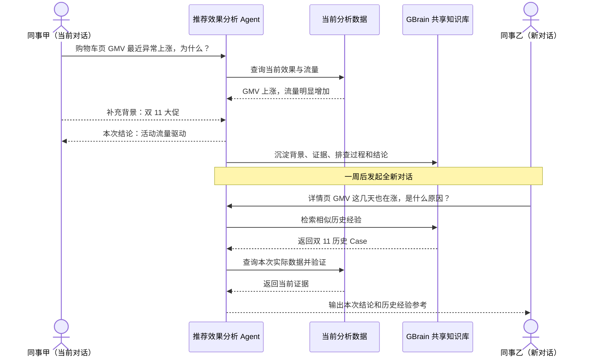
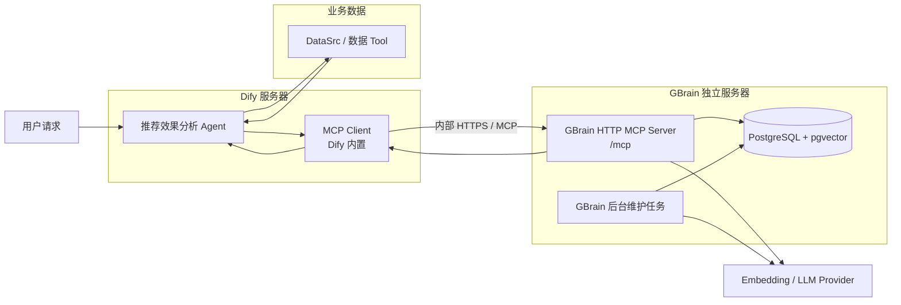
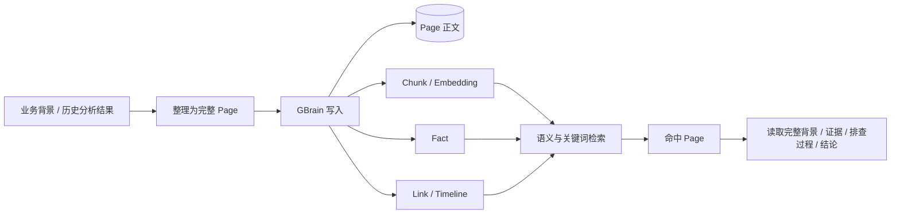
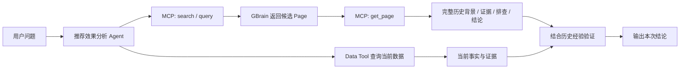
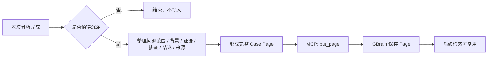
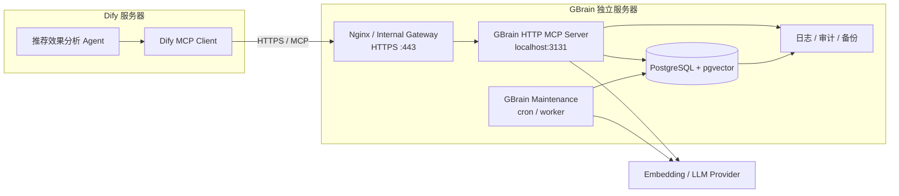

# GBrain 共享知识库 × Dify MCP 接入方案

## 一、背景

### 1.1 问题内容

目前，推荐效果分析 Agent 的上下文主要保存在单次对话中。对话结束后，用户补充的业务背景、Agent 已完成的排查过程以及形成的分析结论，无法在其他新对话中被自动发现和复用。

由此带来两个主要问题：

1. **背景信息被重复提供。** 不同同事分析同一时间段或同一业务事件时，需要反复向 Agent 补充相同的背景信息。
2. **相似问题被重复排查。** 历史异常即使已经完成分析，后续在新对话中仍需重新查询数据、排除原因并整理结论，已有经验无法在团队内持续复用。

### 1.2 建设目标

本期基于已选定的 GBrain 建设团队共享知识库，并接入 Dify 推荐效果分析 Agent。实现业务背景和历史分析经验的统一沉淀、跨对话检索和团队复用。

### 1.3 预期效果



---

## 二、共享知识方案调研与选型

| 项目 | 核心方式 | 与本场景的适配情况 | 结论 |
| --- | --- | --- | --- |
| **GBrain** | 以 Page 保存完整知识，通过 Chunk、Fact、Timeline、Link 等结构组织和检索；同时支持关键词与向量混合查询 | 能保留完整历史 Case，又能通过实验、页面、指标等精确标识和业务语义共同检索；面向团队共享 Brain，读写链路都比较直接 | **推荐，本期选型** |
| RAGFlow | 以文档和 Chunk 为核心，提供混合检索、Parent-Child、GraphRAG 等能力 | 传统 RAG 能力完整，适合大规模文档知识库；但本场景主要是短业务背景和历史 Case，共享部署组件较多 | 备选，不作为本期首选 |
| OpenViking | 将 Resource、Memory、Experience 等上下文按目录和 L0/L1/L2 分层组织 | 适合 Agent 长期上下文和分层读取，但查询和知识组织方式更偏上下文目录体系，与当前 Case 复用链路相比更复杂 | 备选 |
| SAG | 将内容抽取为 Event、Entity，并在查询时构建关系增强结果 | 适合需要事件关系扩展的知识场景，但本期核心需求是稳定找回完整历史 Case，关系加工会增加额外链路 | 备选 |
| LightRAG | 以实体、关系和原文 Chunk 形成图增强检索 | 对跨知识关联和图关系检索能力较强，但需要额外维护实体关系，写入和索引链路更重 | 后续图关系需求可考虑 |
| Mem0 | 将对话内容提炼为 Memory，并按用户、Agent、Run 等 Scope 管理 | 更适合个人或 Agent 长期记忆；自动提炼和合并会弱化完整 Case、精确标识和原始排查过程，不适合作为本期团队经验主库 | 不作为本期方案 |

---

## 三、整体架构

### 3.1 架构图



Dify 与 GBrain 物理分离部署。推荐效果分析 Agent 使用 Dify 原生 MCP Client，通过内网 HTTPS 连接 GBrain 独立服务器上的 MCP Server；GBrain 服务器独立负责共享知识的存储、检索、写入和后台维护。

### 3.2 模块职责

| 模块 | 主要职责 | 输出 |
| --- | --- | --- |
| 推荐效果分析 Agent | 理解用户问题，组织当前数据查询，并决定何时读取或写入历史经验 | 本次分析结论 |
| DataSrc / 数据 Tool | 查询当前时间、页面、实验和指标数据 | 当前事实与证据 |
| Dify MCP Client | 连接 GBrain MCP Server，发现并调用 GBrain 暴露的标准 MCP 能力 | MCP 调用结果 |
| GBrain HTTP MCP Server | 对外提供 `search`、`query`、`get_page`、`put_page` 等共享知识能力，并负责鉴权与调用审计 | 历史经验 / 写入结果 |
| PostgreSQL + pgvector | 保存 Page、Chunk、Fact、关系和向量索引 | 团队共享知识数据 |
| Embedding / LLM Provider | 为语义检索、抽取和后台知识加工提供模型能力 | 向量及加工结果 |

---

## 四、GBrain 知识组织

本期共享知识只保存两类内容：**业务背景**和**历史分析 Case**。完整内容统一以 Page 保存，GBrain 再基于 Page 组织用于检索的 Chunk、Fact 和关联信息。



一条历史 Case 主要包含：问题范围、业务背景、分析证据、已完成的排查过程、最终结论和来源信息。例如一次“购物车页 GMV 上涨”分析，会保存对应站点、页面和时间范围，大促背景，流量与转化证据，已排除的配置因素，以及最终原因结论。

**完整 Case 以 Page 为复用单位，Chunk、Fact、Link 和 Timeline 主要负责帮助检索和关联到对应 Page。**

---

## 五、MCP 接入与使用流程

GBrain 原生提供 MCP Server，Dify 也已支持直接连接 HTTP MCP Server，因此本方案不再开发 GBrain Tool / Plugin，而是直接使用标准 MCP 链路。

### 5.1 MCP 接入实现

GBrain 在独立服务器上以长期进程启动 HTTP MCP：

```bash
gbrain serve --http --port 3131
```

GBrain MCP 进程只监听服务器内部端口 `3131`，前面通过 Nginx / Gateway 提供内网 HTTPS 入口，例如：

```text
https://gbrain.internal.example.com/mcp
```

Dify 在 **Tools → MCP → Add MCP Server** 中配置该内部地址。Dify 与 GBrain 之间只通过这一条 MCP 网络入口通信，不直接访问 GBrain 数据库，也不需要手工重新定义每个 Tool Schema。


GBrain 的远程 MCP 支持 OAuth 2.1 和 `read / write / admin` 权限划分。本期为 Dify 创建独立客户端，只授予 `read + write`，不授予 `admin`：

```bash
gbrain auth register-client dify-rec-agent \
  --grant-types client_credentials \
  --scopes "read write"
```

数据库连接、Embedding Key、LLM Key 均只保存在 GBrain 独立服务器；Dify 只保存访问 MCP 所需的地址和客户端凭据。

### 5.2 历史经验读取

读取历史经验时，Agent 先通过 MCP 查询相关 Case，再结合当前业务 Tool 重新验证。历史 Case 只提供背景和排查方向，不直接替代当前数据。



默认路径是 `search / query → get_page`：先用关键词、语义和业务条件找到相关 Case，再读取完整 Page。对于已经知道 Page 标识的情况，可直接调用 `get_page`。

### 5.3 历史经验写入

写入不放在每一次普通查询后执行，而是在形成明确业务背景或完成一次有复用价值的分析后触发。



本期写入规则保持简单：一次性指标查询、未验证猜测和内部执行日志不进入共享知识库；已确认业务背景、有证据的排查过程和最终结论可以通过 `put_page` 写入。

### 5.4 MCP 与后台任务边界

Dify 只通过 MCP 调用在线知识能力，例如 `search`、`query`、`get_page`、`put_page`。`sync`、`embed`、`extract`、`dream`、`enrich` 等需要本地引擎或文件系统的维护能力不由 Dify 远程调用，而是在 GBrain 独立服务器上按需执行或调度。

因此运行时边界保持为：**Dify 负责使用知识，GBrain 独立服务器负责管理知识。**

---

## 六、部署方案

### 6.1 部署原则

GBrain 与 Dify **直接采用物理分离部署**。Dify 保持现有服务器不变，新增一台 GBrain 独立服务器，专门承载共享知识服务、数据库和后台维护任务，两侧仅通过内网 MCP 接口通信。

正式环境统一使用 PostgreSQL + pgvector，不与 Dify 共用数据库实例。这样 GBrain 的服务生命周期、数据库升级、Embedding / LLM 任务和资源消耗都不会影响 Dify，后续其他 Agent 也可以直接复用同一套共享知识服务。

### 6.2 部署拓扑



部署关系固定为：

```text
Dify Server
└── 推荐效果分析 Agent
    └── Dify MCP Client
             │
             │ 内网 HTTPS / MCP
             ▼
GBrain Server
├── Nginx / Internal Gateway :443
│   └── GBrain MCP Server :3131
├── GBrain Maintenance Worker / Cron
├── PostgreSQL + pgvector
└── Log / Audit / Backup
```

GBrain 的 `3131` 不直接对 Dify 或公网开放，只监听本机或容器内部网络；Dify 统一访问内部 HTTPS 地址 `https://gbrain.internal.example.com/mcp`。

### 6.3 服务部署步骤

**第一步：准备独立服务器。** 为 GBrain 分配独立主机，并配置固定内网地址 / 内部域名。网络 ACL 只允许 Dify 服务器访问 GBrain 的 HTTPS 入口，不开放 PostgreSQL 端口给 Dify。

**第二步：部署 PostgreSQL + pgvector。** PostgreSQL 部署在 GBrain 服务器上，创建独立 `gbrain` Database 和账号并启用 pgvector。数据库只监听本机或 GBrain 内部容器网络。

**第三步：部署 GBrain Service。** 使用 Bun 安装或 GBrain 编译二进制，配置 `DATABASE_URL`、Embedding Provider 和需要的 LLM Provider，执行 `gbrain doctor` 检查数据库、Schema 和模型连接。

**第四步：启动 MCP Service。** 长期运行：

```bash
gbrain serve --http --port 3131
```

通过 systemd / Docker restart policy 保证进程异常后自动拉起。

**第五步：配置内部 HTTPS。** 使用 Nginx / Internal Gateway 将内部域名的 `/mcp` 转发到 `127.0.0.1:3131/mcp`，TLS 证书使用公司内部证书体系；外部只暴露 HTTPS 入口，不直接暴露 GBrain 原始端口。

**第六步：创建 Dify 专用 MCP 身份。** 在 GBrain 侧创建 `read + write` OAuth Client，不授予 `admin`。客户端凭据只保存在 Dify MCP 配置中。

**第七步：Dify 接入。** 在 Dify 添加：

```text
https://gbrain.internal.example.com/mcp
```

完成授权后确认能够发现 `search`、`query`、`get_page`、`put_page`，再挂载到推荐效果分析 Agent。

**第八步：联调读写闭环。** 验证“写入测试 Page → 新会话 Search 命中 → get_page 读取完整内容 → 与当前 Data Tool 联合分析”的完整链路。

### 6.4 网络与权限

系统之间只保留一条业务访问链路：

```text
Dify Server
    ↓ HTTPS / MCP
GBrain Gateway
    ↓ localhost
GBrain MCP Server
    ↓
PostgreSQL + pgvector
```

Dify 无权直接访问 PostgreSQL，也不持有数据库密码、Embedding Key 或 LLM Key。GBrain 数据库、模型密钥和后台维护权限全部留在独立服务器内部。

权限按最小范围配置：Dify 仅授予 `read + write`；`admin`、数据库迁移、后台索引和知识维护命令仅允许 GBrain 运维侧执行。网络侧只允许 Dify 服务器访问 GBrain HTTPS 入口，PostgreSQL 端口不跨机器开放。

### 6.5 运行维护

GBrain 独立服务器统一承担三类运行职责：

1. **在线服务：** MCP 查询与写入，保证 Dify 能稳定读取和沉淀知识。
2. **后台加工：** `sync`、`embed`、`extract`、`dream`、`enrich` 等任务按需由本机 cron / worker 执行，避免占用 Dify 资源。
3. **数据维护：** PostgreSQL 定期备份，MCP 调用记录审计日志，并对数据库容量、磁盘、CPU、内存和服务存活状态做监控。

Markdown / Git 如需保留，可用于知识导出、人工审查和版本归档，不放在在线 MCP 查询主链路中。

---

## 七、实施计划

| 时间 | 工作内容 | 产出 |
| --- | --- | --- |
| 9.7—9.8 | 准备 GBrain 独立服务器，部署 PostgreSQL + pgvector、GBrain Service 和 Provider | GBrain 独立服务与存储可用 |
| 9.9 | 配置内部 HTTPS、启动 HTTP MCP、创建 Dify 专用 OAuth Client | GBrain MCP 可被 Dify 安全访问 |
| 9.10—9.11 | Dify 接入 MCP，接入 `search / query / get_page`，完成历史 Case 读取与当前 DataSrc 联合验证 | 历史经验可参与新对话分析 |
| 9.14—9.15 | 接入 `put_page`，实现 Case 整理、写入条件和写入闭环 | 有效分析结果可沉淀到 GBrain |
| 9.16—9.18 | 完成端到端联调、权限审计、备份、监控和异常场景验证 | 形成可上线的共享知识闭环 |
