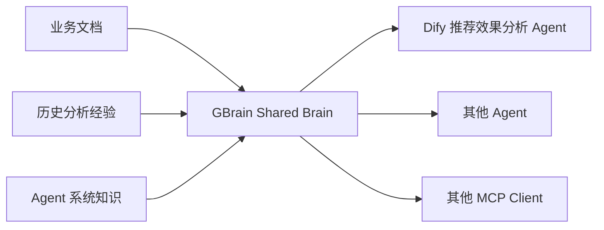
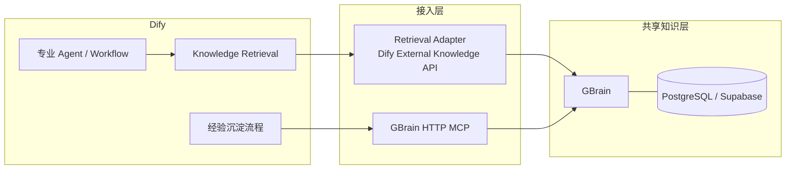
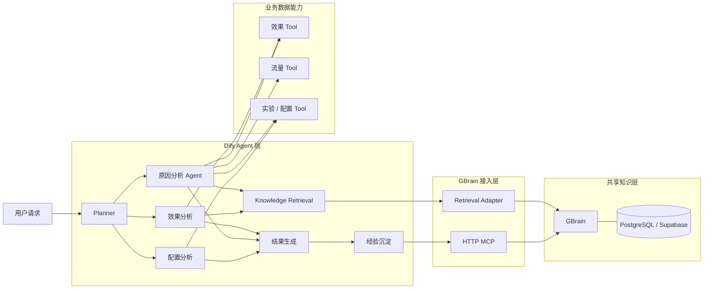
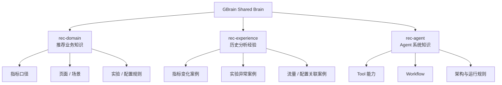
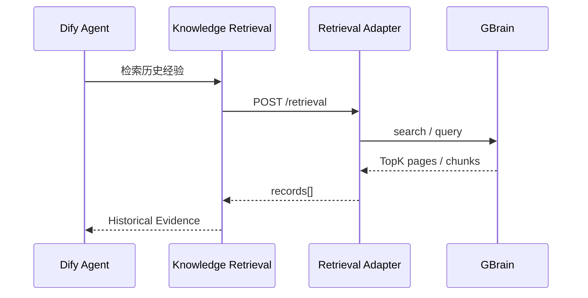
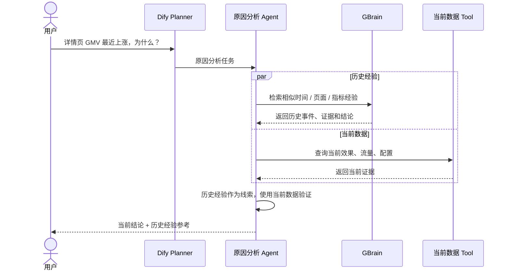
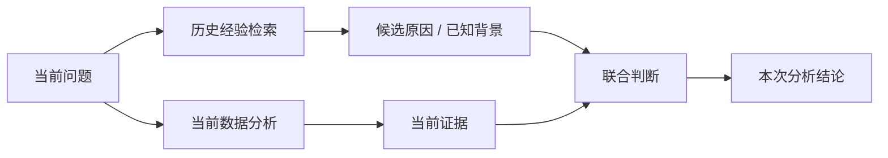
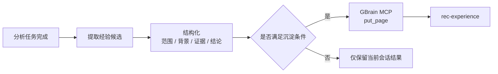
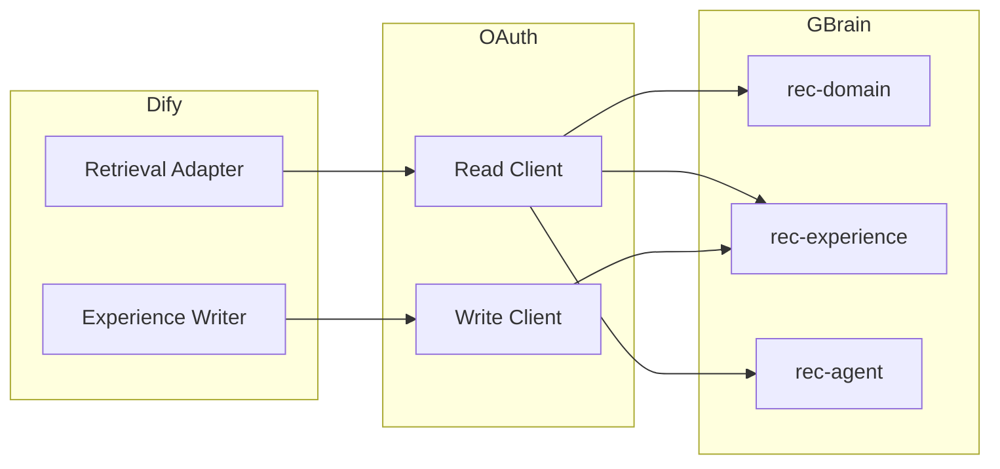
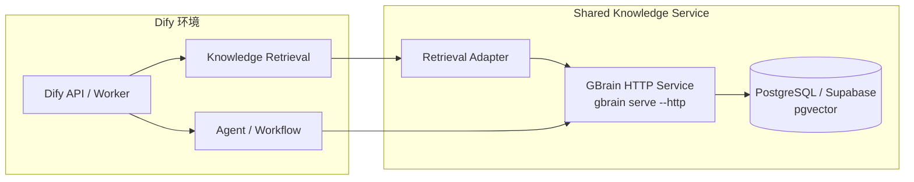

# GBrain 共享知识库 × Dify 接入方案

## 1. 建设目标

当前推荐效果分析 Agent 的业务背景、排查过程和分析结论主要停留在单次会话内。本方案使用 **GBrain 作为共享知识层，Dify 作为 Agent 编排与业务执行层**，让不同用户、不同会话能够复用已经形成的业务知识和历史分析经验。

| 目标 | 当前方式 | 建设后 |
| --- | --- | --- |
| 业务知识复用 | 分散在文档和个人经验中 | 统一进入 GBrain |
| 历史经验复用 | 新会话重新排查 | 检索相似历史经验后验证当前数据 |
| 多 Agent 共享 | 各自维护上下文 | 多 Agent 访问同一 Brain |
| 知识更新 | 人工零散维护 | 文档同步 + 分析经验沉淀 |
| Dify 接入 | 无统一共享知识入口 | External Knowledge + MCP |



---

## 2. 共享知识方案调研与选型

### 2.1 接入方式对比

| 方案 | 知识存储 | Dify 读取 | 知识写入 | 适用性 |
| --- | --- | --- | --- | --- |
| Dify 内置知识库 | Dify | 原生 Knowledge Retrieval | 导入 / API | 知识会形成 Dify 独立副本 |
| GBrain MCP 直连 | GBrain | Agent 主动调用 MCP Tool | MCP | 适合主动检索、写入和高级操作 |
| **GBrain + External Knowledge Adapter** | **GBrain** | **Dify Knowledge Retrieval** | MCP | **适合作为统一共享知识层** |

### 2.2 最终方案



| 场景 | 接入方式 | 原因 |
| --- | --- | --- |
| 普通知识检索 | External Knowledge Adapter | 作为标准检索上下文进入 Dify |
| 历史经验检索 | External Knowledge Adapter | 按问题统一召回相似经验 |
| 写入分析经验 | GBrain MCP | 使用 `put_page` 等写操作 |
| 页面查询 / 图谱 / 高级操作 | GBrain MCP | 直接使用 GBrain 原生能力 |

**原则：GBrain 保存唯一知识副本，Dify 只负责使用知识。**

---

## 3. 总体架构



### 3.1 职责边界

| 模块 | 职责 |
| --- | --- |
| Dify Planner | 理解用户目标、拆分任务、选择分析能力 |
| 专业 Agent / Workflow | 查询当前数据、执行分析、使用历史经验 |
| Knowledge Retrieval | 发起标准知识检索 |
| Retrieval Adapter | 将 Dify 检索协议转换为 GBrain 查询 |
| GBrain MCP | 提供经验写入和高级知识操作 |
| GBrain | 统一存储、索引、检索和维护共享知识 |

---

## 4. GBrain 知识组织

GBrain 使用一个共享 Brain，通过 Source 区分不同知识域。



### 4.1 Source 设计

| Source | 内容 | 主要使用方 | 更新方式 |
| --- | --- | --- | --- |
| `rec-domain` | 指标、页面、实验、业务定义 | Planner / 专业 Agent | 文档同步 |
| `rec-experience` | 历史分析背景、证据和结论 | 原因分析 Agent | 分析结束后沉淀 |
| `rec-agent` | Tool、Workflow、Agent 架构和能力说明 | Planner / 开发排查 | Git 同步 |

### 4.2 历史经验结构

| 字段 | 内容示例 | 用途 |
| --- | --- | --- |
| `knowledge_type` | `metric_change_case` | 经验类型 |
| `site` | `EC20` | 站点过滤 |
| `scene` | `5` | 页面范围 |
| `merchant_id` | `merchant_1001` | 店铺范围 |
| `metrics` | `rec_gmv, rec_ctr` | 涉及指标 |
| `start_day / end_day` | `20261101 / 20261107` | 事件时间 |
| `background` | 双 11 大促 | 业务背景 |
| `evidence` | 流量上涨、转化稳定 | 已验证证据 |
| `conclusion` | 大促流量驱动 GMV 上涨 | 历史结论 |
| `source_refs` | Tool Result / 文档来源 | 证据来源 |
| `created_at` | `2026-11-08` | 经验形成时间 |

推荐页面组织：

```text
rec-experience/
├── metric-change/
│   └── EC20/2026/20261108-cart-gmv-promotion.md
├── experiment/
│   └── EC10/2026/...
└── traffic-config/
    └── EC20/2026/...
```

---

## 5. Dify 读取链路

### 5.1 External Knowledge Adapter

Dify External Knowledge 使用固定 `/retrieval` 协议；Adapter 负责参数映射和结果转换。

| Dify 输入 | Adapter 处理 | GBrain |
| --- | --- | --- |
| `knowledge_id` | 映射 Source / 检索域 | `rec-domain` / `rec-experience` / `rec-agent` |
| `query` | 生成 GBrain 检索请求 | `search / query` |
| `top_k` | 控制召回数量 | TopK |
| `score_threshold` | 过滤低相关结果 | Score Filter |
| `metadata_condition` | 转换业务范围过滤 | site / scene / metric / time 等 |

返回统一映射：

| Dify `records` | GBrain 内容 |
| --- | --- |
| `content` | 命中的知识正文 / chunk |
| `score` | 检索相关度 |
| `title` | page title / slug |
| `metadata` | source、site、scene、时间、来源等 |



### 5.2 Agent 使用位置

| Agent 环节 | 是否检索 | 主要知识 |
| --- | --- | --- |
| Planner | 按需 | 业务定义、能力知识 |
| 普通指标查询 | 默认不检索 | 当前数据直接回答 |
| 效果综合分析 | 按需 | 业务口径、历史背景 |
| 原因分析 | 默认检索 | 相似异常、历史事件、已知配置背景 |
| 配置查询 | 按需 | 配置定义和关联规则 |

---

## 6. 历史经验复用流程



### 6.1 经验参与方式



---

## 7. 历史经验写入流程

分析结果先形成结构化经验，再写入 `rec-experience`。



### 7.1 沉淀内容

| 内容 | 是否进入经验 | 示例 |
| --- | --- | --- |
| 用户补充的关键业务背景 | 是 | 大促、改版、运营活动 |
| Tool 验证后的关键证据 | 是 | 流量上涨 35%、CTCVR 稳定 |
| 最终原因结论 | 是 | GMV 上涨主要由流量增长驱动 |
| 查询中间过程 | 否 | 每一次 Tool 调用参数 |
| 普通一次性指标查询 | 否 | 昨天 CTR 是多少 |
| 未验证猜测 | 否 | 可能是某策略调整 |

### 7.2 写入结构

```text
标题：EC20 购物车页 GMV 双11期间上涨

分析范围
- site: EC20
- scene: 5
- period: 2026-11-01 ~ 2026-11-07
- metrics: rec_gmv, rec_ctr, rec_ctcvr

业务背景
- 双11活动期间

证据
- 推荐流量明显上涨
- CTR / CTCVR 无明显变化

结论
- 本次 GMV 上涨主要由活动期间流量增长驱动

来源
- 当前分析 Tool Result
- 用户确认的业务背景
```

---

## 8. 权限与访问

GBrain 统一对外提供 HTTP MCP，通过 OAuth Client 和 Source Scope 控制读写范围。



| Client | Scope | 用途 |
| --- | --- | --- |
| Retrieval Adapter | `read` | 查询共享知识 |
| Experience Writer | `read,write` | 写入历史分析经验 |
| 运维 / 管理 | `admin` | Source、客户端和知识治理 |

---

## 9. 部署方案

共享部署使用 PostgreSQL / Supabase，GBrain 以长期 HTTP 服务运行。



### 9.1 部署组件

| 组件 | 部署内容 | 作用 |
| --- | --- | --- |
| GBrain | 独立 Service / Container | 共享知识核心服务 |
| PostgreSQL / Supabase | 持久化数据库 | Page、Chunk、Embedding、Index |
| Retrieval Adapter | FastAPI / 轻量 HTTP Service | 适配 Dify External Knowledge API |
| Dify | 现有部署 | Agent、Workflow、Knowledge Retrieval |
| Git Sync / Import | 定时任务 | 同步业务文档和 Agent 文档 |

---

## 10. 实施计划

| 阶段 | 工作 | 产出 |
| --- | --- | --- |
| Phase 1：知识可读 | 部署 GBrain + PostgreSQL；创建 Source；完成 Retrieval Adapter | Dify 能检索 GBrain |
| Phase 2：经验复用 | 建立 `rec-experience` 结构；原因分析接入历史经验 | 新会话可复用历史案例 |
| Phase 3：经验沉淀 | 接入 MCP 写入；形成经验候选和写入规则 | 分析结果自动沉淀 |
| Phase 4：持续治理 | Git 同步、权限、质量检查、过期与冲突处理 | 共享知识持续维护 |

### 10.1 Phase 1 最小链路


---

## 11. 验收

| 验收项 | 验收方式 |
| --- | --- |
| 跨会话复用 | 新对话能够检索上一轮已沉淀经验 |
| 多用户共享 | 不同 Dify 用户命中同一共享经验 |
| Source 路由 | 业务知识、历史经验、Agent 知识能够按域检索 |
| 检索相关性 | 相似站点 / 页面 / 指标案例优先返回 |
| 当前数据验证 | 历史经验与当前 Tool 结果能够同时进入原因分析 |
| 写入闭环 | 符合条件的分析结果可写入 `rec-experience` |
| 权限 | 读取 Client 不能执行经验写入 |

---

## 12. 设计依据

| 能力 | 采用设计 |
| --- | --- |
| Dify 外部知识接入 | External Knowledge API：`POST /retrieval` |
| GBrain 共享部署 | PostgreSQL / Supabase + HTTP MCP |
| 多知识域 | 一个 Brain 下按 Source 管理 |
| 多 Agent 访问 | HTTP MCP + OAuth Scope |
| 知识读取 | External Knowledge Adapter |
| 知识写入 | GBrain MCP |

参考：

- Dify External Knowledge API：https://docs.dify.ai/en/cloud/use-dify/knowledge/external-knowledge-api
- GBrain Company Brain：https://github.com/garrytan/gbrain/blob/master/docs/tutorials/company-brain.md
- GBrain Agent Access：https://github.com/garrytan/gbrain/blob/master/docs/guides/agent-to-gbrain.md
- GBrain Brains and Sources：https://github.com/garrytan/gbrain/blob/master/docs/architecture/brains-and-sources.md
