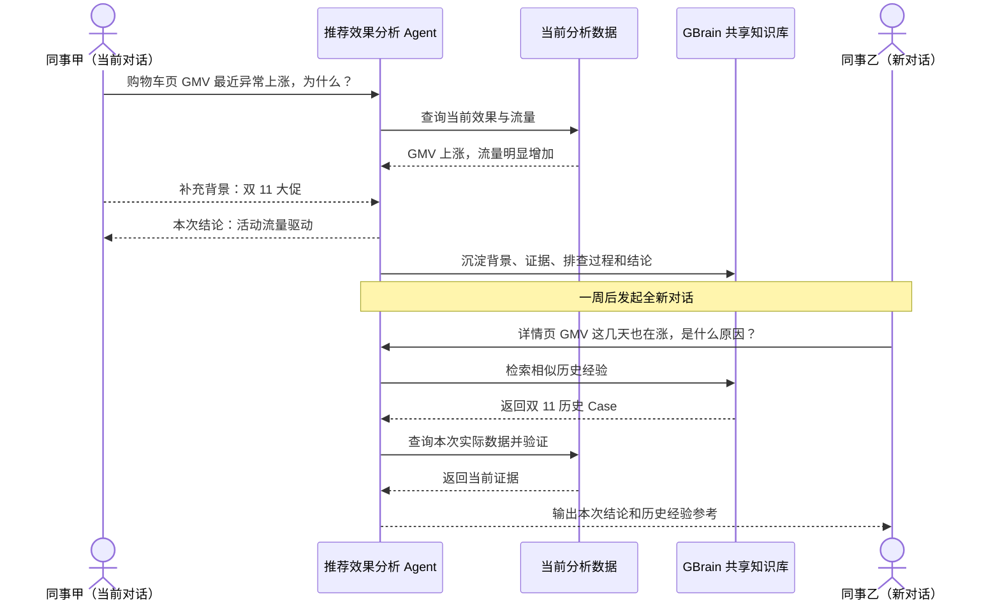
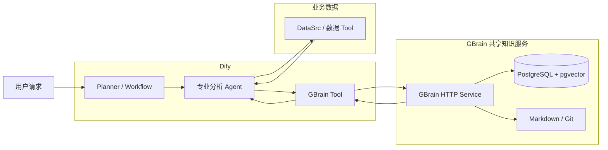
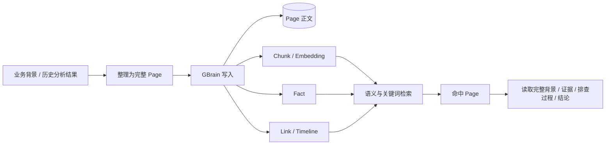
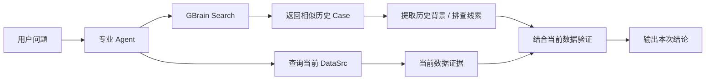
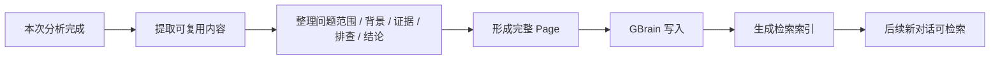
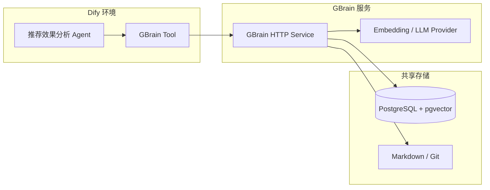

# GBrain 共享知识库 × Dify 接入方案

## 一、背景

### 1.1 问题内容

目前，推荐效果分析 Agent 的上下文主要保存在单次对话中。对话结束后，用户补充的业务背景、Agent 已完成的排查过程以及形成的分析结论，无法在其他新对话中被自动发现和复用。

由此带来两个主要问题：

1. **背景信息被重复提供。** 不同同事分析同一时间段或同一业务事件时，需要反复向 Agent 补充相同的背景信息。
2. **相似问题被重复排查。** 历史异常即使已经完成分析，后续在新对话中仍需重新查询数据、排除原因并整理结论，已有经验无法在团队内持续复用。

### 1.2 建设目标

本期基于已选定的 GBrain 建设团队共享知识库，并接入 Dify 推荐效果分析 Agent。实现业务背景和历史分析经验的统一沉淀、跨对话检索和团队复用。

### 1.3 预期效果

---

## 二、共享知识方案调研与选型

| 项目 | 核心方式 | 与本场景的适配情况 | 结论 |
| --- | --- | --- | --- |
| **GBrain** | 以 Page 保存完整知识，通过 Chunk、Fact、Timeline、Link 等结构组织和检索；同时支持关键词与向量混合查询 | 能保留完整历史 Case，又能通过实验、页面、指标等精确标识和业务语义共同检索；面向团队共享 Brain，读写链路都比较直接 | **推荐，本期选型** |
| RAGFlow | 以文档和 Chunk 为核心，提供混合检索、Parent-Child、GraphRAG 等能力 | 传统 RAG 能力完整，适合大规模文档知识库；但本场景主要是短业务背景和历史 Case，共享部署组件较多 | 备选，不作为本期首选 |
| OpenViking | 将 Resource、Memory、Experience 等上下文按目录和 L0/L1/L2 分层组织 | 适合 Agent 长期上下文和分层读取，但查询和知识组织方式更偏上下文目录体系，与当前 Case 复用链路相比更复杂 | 备选 |
| SAG | 将内容抽取为 Event、Entity，并在查询时构建关系增强结果 | 适合需要事件关系扩展的知识场景，但本期核心需求是稳定找回完整历史 Case，关系加工会增加额外链路 | 备选 |
| LightRAG | 以实体、关系和原文 Chunk 形成图增强检索 | 对跨知识关联和图关系检索能力较强，但需要额外维护实体关系，写入和索引链路更重 | 后续图关系需求可考虑 |
| Mem0 | 将对话内容提炼为 Memory，并按用户、Agent、Run 等 Scope 管理 | 更适合个人或 Agent 长期记忆；自动提炼和合并会弱化完整 Case、精确标识和原始排查过程，不适合作为本期团队经验主库 | 不作为本期方案 |

---

## 三、总体方案

### 3.1 模块职责

| 模块 | 主要职责 | 输出 |
| --- | --- | --- |
| Dify Planner / Workflow | 判断分析目标并组织执行 | 分析任务 |
| 专业分析 Agent | 综合当前数据和历史经验进行分析 | 本次结论 |
| DataSrc / 数据 Tool | 查询当前时间、页面、实验和指标数据 | 当前事实与证据 |
| GBrain Tool | 在 Dify 与 GBrain HTTP API 之间完成查询和写入 | 历史经验 / 写入结果 |
| GBrain | 保存、索引和检索团队共享经验 | Page、Chunk、Fact、Graph 等 |
| PostgreSQL + pgvector | 团队共享存储和检索索引 | Page、Chunk、Embedding、运行状态 |
| Markdown / Git | 保存可审查、可版本化的知识内容 | 经验真源与版本记录 |

---

## 四、GBrain 知识组织

本期共享知识只保存两类内容：**业务背景**和**历史分析 Case**。完整内容统一以 Page 保存，GBrain 再基于 Page 生成用于检索的 Chunk、Fact 和关联信息。

一条历史 Case 主要包含：问题范围、业务背景、分析证据、已完成的排查过程、最终结论和来源信息。例如一次“购物车页 GMV 上涨”分析，会保存对应站点、页面和时间范围，大促背景，流量与转化证据，已排除的配置因素，以及最终原因结论。

**完整 Case 以 Page 为复用单位，Chunk、Fact、Link 和 Timeline 只负责帮助找到对应 Page。**

---

## 五、Dify 接入与使用流程

Dify 不直接维护第二套共享知识，而是通过 GBrain Tool 调用 GBrain HTTP 服务。专业 Agent 在需要历史背景或相似 Case 时主动查询；本次分析完成后，再将值得复用的结果写回 GBrain。

### 5.1 历史经验读取

默认使用 GBrain `Search balanced` 检索相似经验；如果已知具体 Page，则直接读取完整 Page。历史经验只作为背景和排查线索，最终原因仍以本次 DataSrc 查询结果为准。

### 5.2 历史经验写入

普通一次性指标查询不沉淀；只有包含明确业务背景、有效排查过程或可复用分析结论的结果进入共享知识库。

---

## 六、部署方案

GBrain 作为独立的团队共享知识服务部署，Dify 只通过 GBrain Tool 访问，不直接连接底层数据库。正式环境使用 PostgreSQL + pgvector 保存 Page、Chunk 和向量索引，并保留 Markdown / Git 作为可审查、可版本化的知识内容。

本地开发可继续使用 PGLite；联调和正式部署切换到 PostgreSQL + pgvector。GBrain Service 与数据库独立于 Dify 部署，后续其他 Agent 也可以复用同一套共享知识服务。

---

## 七、实施计划

| 时间 | 工作内容 | 产出 |
| --- | --- | --- |
| 9.7—9.8 | 部署 PostgreSQL + pgvector、GBrain Service，完成模型 Provider 配置 | GBrain 团队服务可用 |
| 9.9—9.10 | 在 Dify 实现 GBrain Tool，接入 Search 和 Page 查询 | Dify 可读取历史经验 |
| 9.11—9.13 | 原因分析 Agent 接入历史 Case，与当前 DataSrc 联合验证 | 跨对话历史经验可参与分析 |
| 9.14—9.15 | 接入经验写入，整理 Page 写入内容和沉淀条件 | 分析结果可写回 GBrain |
| 9.16—9.18 | 完成端到端联调、检索质量验证和问题修正 | 形成可上线的共享知识闭环 |
