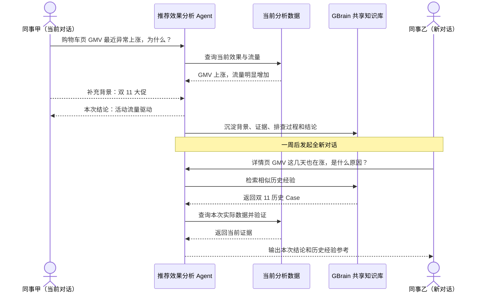
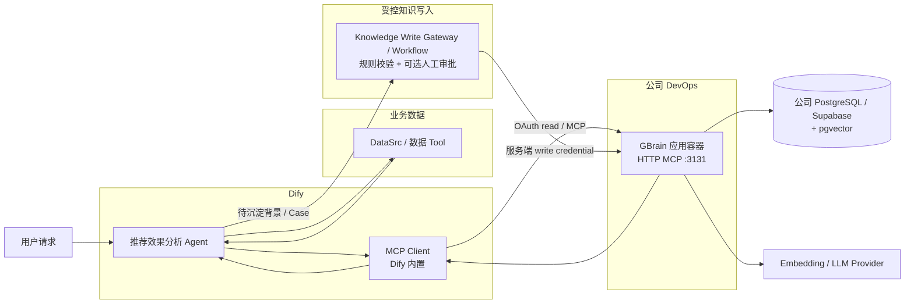
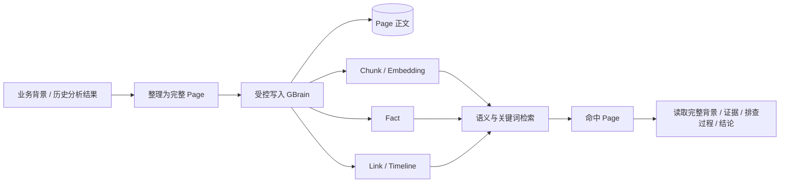
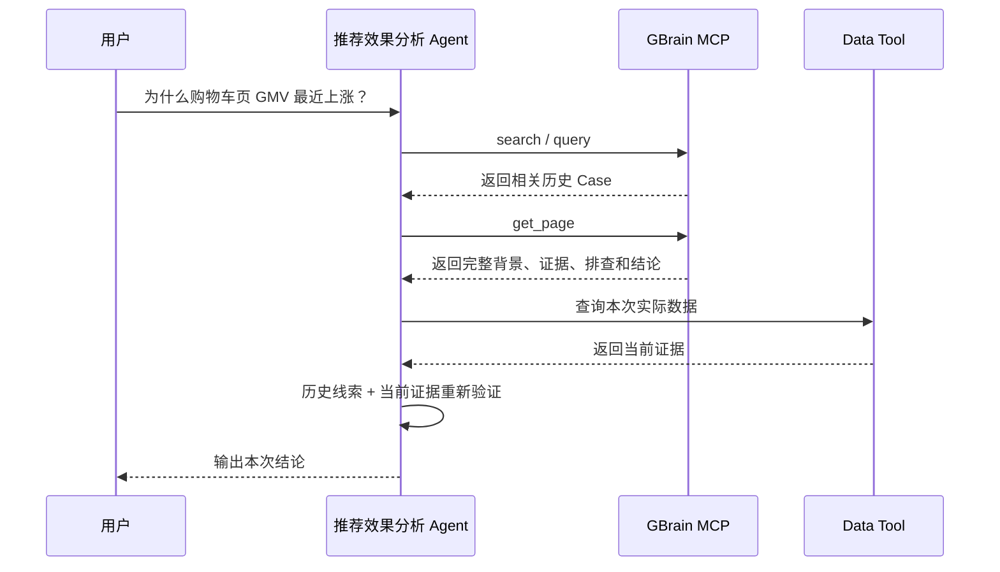

# GBrain 共享知识库 × Dify MCP 接入方案

## 一、背景

### 1.1 问题内容

目前，推荐效果分析 Agent 的上下文主要保存在单次对话中。对话结束后，用户补充的业务背景、Agent 已完成的排查过程以及形成的分析结论，无法在其他新对话中被自动发现和复用。

由此带来两个主要问题：

1. **背景信息被重复提供。** 不同同事分析同一时间段或同一业务事件时，需要反复向 Agent 补充相同的背景信息。
2. **相似问题被重复排查。** 历史异常即使已经完成分析，后续在新对话中仍需重新查询数据、排除原因并整理结论，已有经验无法在团队内持续复用。

### 1.2 建设目标

本期基于已选定的 GBrain 建设团队共享知识库，并接入 Dify 推荐效果分析 Agent。实现业务背景和历史分析经验的统一沉淀、跨对话检索和团队复用。

### 1.3 预期效果



---

## 二、共享知识方案调研与选型

| 项目 | 核心方式 | 与本场景的适配情况 | 结论 |
| --- | --- | --- | --- |
| **GBrain** | 以 Page 保存完整知识，通过 Chunk、Fact、Timeline、Link 等结构组织和检索；同时支持关键词与向量混合查询 | 能保留完整历史 Case，又能通过实验、页面、指标等精确标识和业务语义共同检索；面向团队共享 Brain，读写链路都比较直接 | **推荐，本期选型** |
| RAGFlow | 以文档和 Chunk 为核心，提供混合检索、Parent-Child、GraphRAG 等能力 | 传统 RAG 能力完整，适合大规模文档知识库；但本场景主要是短业务背景和历史 Case，共享部署组件较多 | 备选，不作为本期首选 |
| OpenViking | 将 Resource、Memory、Experience 等上下文按目录和 L0/L1/L2 分层组织 | 适合 Agent 长期上下文和分层读取，但查询和知识组织方式更偏上下文目录体系，与当前 Case 复用链路相比更复杂 | 备选 |
| SAG | 将内容抽取为 Event、Entity，并在查询时构建关系增强结果 | 适合需要事件关系扩展的知识场景，但本期核心需求是稳定找回完整历史 Case，关系加工会增加额外链路 | 备选 |
| LightRAG | 以实体、关系和原文 Chunk 形成图增强检索 | 对跨知识关联和图关系检索能力较强，但需要额外维护实体关系，写入和索引链路更重 | 后续图关系需求可考虑 |
| Mem0 | 将对话内容提炼为 Memory，并按用户、Agent、Run 等 Scope 管理 | 更适合个人或 Agent 长期记忆；自动提炼和合并会弱化完整 Case、精确标识和原始排查过程，不适合作为本期团队经验主库 | 不作为本期方案 |

---

## 三、整体架构

### 3.1 架构图



GBrain 作为一个独立的 DevOps 应用容器常驻运行，Dify 通过公司内网服务地址访问其 HTTP MCP。PostgreSQL / Supabase 作为独立持久化服务，不与 GBrain 进程一起放在应用容器中。Dify Agent 的 MCP 连接默认只授予读取权限；知识写入通过独立受控链路完成，不把写凭证直接暴露给 LLM。

### 3.2 模块职责

| 模块 | 主要职责 | 输出 |
| --- | --- | --- |
| 推荐效果分析 Agent | 理解用户问题，组织当前数据查询，并决定何时检索历史经验、何时形成待沉淀知识 | 本次分析结论 / 待沉淀内容 |
| DataSrc / 数据 Tool | 查询当前时间、页面、实验和指标数据 | 当前事实与证据 |
| Dify MCP Client | 使用只读 OAuth 身份连接 GBrain，调用历史知识检索能力 | 历史 Case / 业务背景 |
| Knowledge Write Gateway / Workflow | 接收 Agent 形成的待沉淀内容，执行规则校验、可选审批，再使用服务端写凭证写入 GBrain | 受控写入结果 |
| GBrain 应用容器 | 常驻运行 `gbrain serve --http`，提供 MCP、OAuth、检索和知识管理能力 | MCP / 写入调用结果 |
| PostgreSQL / Supabase + pgvector | 作为 GBrain 的独立持久化数据库和向量查询后端 | GBrain 运行数据与索引 |
| Embedding / LLM Provider | 为语义检索、抽取和知识加工提供模型能力 | 向量及加工结果 |

---

## 四、GBrain 知识组织

本期共享知识只保存两类内容：**业务背景**和**历史分析 Case**。完整内容统一以 Page 保存，GBrain 再基于 Page 组织用于检索的 Chunk、Fact 和关联信息。



一条历史 Case 主要包含：问题范围、业务背景、分析证据、已完成的排查过程、最终结论和来源信息。例如一次“购物车页 GMV 上涨”分析，会保存对应站点、页面和时间范围，大促背景，流量与转化证据，已排除的配置因素，以及最终原因结论。

**完整 Case 以 Page 为复用单位，Chunk、Fact、Link 和 Timeline 主要负责帮助检索和关联到对应 Page。**

---

## 五、公司 DevOps 容器部署方案

以下部署以公司 **Ubuntu 22.04.1 LTS** 基础容器为例。

```text
公司 DevOps
│
├── GBrain 应用容器
│   ├── build.sh
│   ├── start.sh
│   └── gbrain serve --http :3131
│
├── 内网 Service / Gateway
│   └── https://<gbrain-service>/mcp
│
└── Secret / 环境变量
    ├── GBRAIN_DATABASE_URL
    ├── GBRAIN_PUBLIC_URL
    └── Embedding / LLM Provider Key

GBrain 应用容器
        │
        │ PostgreSQL connection string
        ▼
公司 PostgreSQL / Supabase + pgvector
```

### 5.1 部署前准备

需要先准备以下资源：

```text
1. 一个公司 DevOps 应用容器
2. 容器开放服务端口 3131
3. 一个独立 PostgreSQL / Supabase 数据库
4. 数据库已启用 pgvector
5. GBrain 数据库连接串
6. 至少一个 Embedding Provider Key
7. GBrain 对 Dify 暴露的内网 Service URL
```

GBrain HTTP MCP 使用独立 PostgreSQL / Supabase，不在应用容器里再启动一套 PostgreSQL。这样容器重建、扩缩容或重新发布时，GBrain 数据不会跟随容器生命周期丢失。

数据库侧需要创建 `gbrain` 数据库并启用 pgvector，例如由 DBA 执行：

```sql
CREATE EXTENSION IF NOT EXISTS vector;
```

最终拿到类似下面的数据库连接串：

```text
postgresql://gbrain:<password>@<postgres-host>:5432/gbrain
```

在 DevOps Secret 中保存为：

```text
GBRAIN_DATABASE_URL=postgresql://gbrain:<password>@<postgres-host>:5432/gbrain
```

这里使用 `GBRAIN_DATABASE_URL`，避免与同一容器或平台中其他应用可能存在的通用 `DATABASE_URL` 混淆。

### 5.2 项目部署文件

GBrain 服务只需要保留两个部署脚本：

```text
gbrain-service/
├── build.sh
└── start.sh
```

`build.sh` 负责准备 Bun 和 GBrain；`start.sh` 负责初始化数据库配置、健康检查并以前台进程启动 HTTP MCP Server。真正的运行逻辑集中在 `start.sh` 中，不再依赖 systemd。

### 5.3 构建脚本 `build.sh`

```bash
#!/bin/bash
set -e
set -x

ROOT_DIR="$(cd "$(dirname "$0")" && pwd)"
OUTPUT_DIR="$ROOT_DIR/output"

mkdir -p "$OUTPUT_DIR"

# 将 Bun 和 GBrain 一起放进构建产物，避免容器每次启动重新下载
export BUN_INSTALL="$OUTPUT_DIR/.bun"

if [ ! -x "$BUN_INSTALL/bin/bun" ]; then
  curl -fsSL https://bun.sh/install | bash
fi

export PATH="$BUN_INSTALL/bin:$PATH"

# 初期可使用 latest-stable；上线后建议固定已验证版本
GBRAIN_VERSION="${GBRAIN_VERSION:-latest-stable}"
bun install -g "github:garrytan/gbrain#$GBRAIN_VERSION"

cp "$ROOT_DIR/start.sh" "$OUTPUT_DIR/start.sh"
chmod +x "$OUTPUT_DIR/start.sh"

gbrain --version
```

构建成功后，`output/` 中已经包含运行 GBrain 所需的 Bun 环境和启动脚本。

### 5.4 启动脚本 `start.sh`

```bash
#!/bin/bash
set -euo pipefail

SCRIPT_DIR="$(cd "$(dirname "$0")" && pwd)"
cd "$SCRIPT_DIR"

export BUN_INSTALL="$SCRIPT_DIR/.bun"
export PATH="$BUN_INSTALL/bin:$PATH"

# GBrain 本地配置属于容器运行态；真正的数据保存在外部 PostgreSQL
export GBRAIN_HOME="${GBRAIN_HOME:-/tmp/gbrain-runtime}"

: "${GBRAIN_DATABASE_URL:?GBRAIN_DATABASE_URL 未配置}"
: "${GBRAIN_PUBLIC_URL:?GBRAIN_PUBLIC_URL 未配置}"

GBRAIN_PORT="${GBRAIN_PORT:-3131}"

if [ -z "${VOYAGE_API_KEY:-}" ] && [ -z "${OPENAI_API_KEY:-}" ]; then
  echo "缺少 Embedding Provider Key：请配置 VOYAGE_API_KEY 或 OPENAI_API_KEY" >&2
  exit 1
fi

# 容器是可替换的，因此每次启动都根据外部数据库重新生成本地配置。
# --force 用于非交互容器启动；数据库仍使用同一个外部持久化实例。
gbrain init --force --url "$GBRAIN_DATABASE_URL"

# 检查数据库连接和 GBrain 基础状态
gbrain engine status --probe
gbrain doctor

# 前台运行，交给 DevOps 平台负责进程保活、重启和日志采集
exec gbrain serve \
  --http \
  --port "$GBRAIN_PORT" \
  --bind 0.0.0.0 \
  --public-url "$GBRAIN_PUBLIC_URL"
```

GBrain 官方已经提供 `gbrain init` 和 `gbrain serve --http`，因此容器部署不需要自己再开发 HTTP Server，也不需要在容器里配置 systemd 服务。

### 5.5 DevOps 应用配置

在公司 DevOps 平台配置：

```text
构建命令：bash build.sh
启动命令：bash start.sh
容器端口：3131
健康检查：GET /health
```

如果平台实际从 `output/` 作为发布目录启动，则启动命令使用：

```text
bash output/start.sh
```

环境变量 / Secret：

```text
GBRAIN_DATABASE_URL=<公司 PostgreSQL / Supabase 连接串>
GBRAIN_PUBLIC_URL=https://<公司分配给 GBrain 的内网域名或 Gateway 地址>
GBRAIN_PORT=3131

VOYAGE_API_KEY=<Embedding Key>
# 或 OPENAI_API_KEY=<Embedding Key>

# 如需 Fact 抽取 / Query Expansion，再配置：
# ANTHROPIC_API_KEY=<LLM Key>
# 或 OPENAI_API_KEY=<LLM Key>
```

`GBRAIN_DATABASE_URL` 和模型 Key 都使用 DevOps Secret 管理，不写入 Git、脚本或普通环境配置文件。

### 5.6 Service / Gateway 配置

GBrain 容器自身监听：

```text
0.0.0.0:3131
```

由公司 DevOps Service / Gateway 将它暴露给 Dify：

```text
http://<gbrain-service>:3131
```

或统一 HTTPS：

```text
https://<gbrain-domain>
```

最终 MCP 地址为：

```text
https://<gbrain-domain>/mcp
```

如果 Dify 和 GBrain 位于同一公司内网，可直接使用内部 Service；不需要在 GBrain 容器内再安装 Nginx。TLS、域名和转发由公司 Gateway 统一处理即可。

### 5.7 部署检查

服务启动后先在 GBrain 容器中检查：

```bash
gbrain --version
gbrain engine status --probe
gbrain doctor
gbrain models
gbrain models doctor
```

检查本地 HTTP 服务：

```bash
curl http://127.0.0.1:3131/health
```

应返回：

```json
{"status":"ok"}
```

再从 Dify 所在网络检查公司 Service / Gateway：

```bash
curl https://<gbrain-domain>/health
```

本地成功、Dify 侧失败时，优先检查 DevOps Service、端口映射、Gateway 和网络 ACL，而不是检查 GBrain 本身。

### 5.8 日志

不再使用 `journalctl`。GBrain 以前台进程运行，stdout / stderr 直接由公司 DevOps 平台采集。

主要查看：

```text
DevOps 应用日志
→ GBrain 启动日志
→ gbrain doctor 输出
→ MCP 请求错误 / OAuth 错误
```

PostgreSQL 日志由公司数据库服务单独维护。

### 5.9 可选：数据备份

GBrain 数据保存在独立 PostgreSQL / Supabase 中，因此应用容器不负责数据库文件备份。

正式环境需要备份时，直接将 `gbrain` 数据库纳入公司 PostgreSQL / Supabase 的备份、快照或恢复机制。容器本身只需要重新构建和发布，不需要备份应用容器文件系统。

### 5.10 升级

升级 GBrain 不在运行中的容器里执行 `gbrain upgrade` 后长期保留，而是修改构建版本后重新发布容器。

例如：

```bash
GBRAIN_VERSION=<已验证版本> bash build.sh
```

发布新容器后重新检查：

```bash
gbrain engine status --probe
gbrain doctor
curl http://127.0.0.1:3131/health
```

数据库继续使用原来的外部 PostgreSQL / Supabase。

---

## 六、MCP 接入实现

### 6.1 权限设计

Dify 的 MCP 连接默认只负责**读取共享知识**，不直接持有 GBrain 写权限。

```text
Dify Agent
    │
    │ OAuth 2.1 / scope=read
    ▼
GBrain HTTP MCP
    ├── search
    ├── query
    └── get_page

待沉淀知识
    │
    ▼
Knowledge Write Gateway / Workflow
    │ 服务端 write credential
    ▼
GBrain 写入能力
```

本方案不使用 DCR 自动注册 Dify 身份，而是在 GBrain 侧预注册专用 OAuth Client。这样 Dify 的权限由 GBrain 服务端固定为 `read`，即使 Agent 尝试调用写操作，也会在服务端被拒绝。

### 6.2 在 GBrain 注册 Dify 只读 OAuth Client

GBrain 容器第一次部署成功后，在 DevOps 控制台进入运行容器，执行一次：

```bash
gbrain auth register-client dify-rec-agent \
  --grant-types client_credentials \
  --scopes "read"
```

命令会返回：

```text
Client ID
Client Secret
```

保存到公司 Secret 管理中。该操作只需要执行一次，不放进 `start.sh`，否则每次容器发布都会重新生成一套 Dify 凭证。

### 6.3 在 Dify 中添加 GBrain MCP Server

进入：

```text
Integrations
→ Tools
→ MCP
→ Add MCP Server
```

填写：

```text
Name: GBrain Shared Knowledge
Server Identifier: gbrain-shared
URL: https://<gbrain-domain>/mcp
```

如果公司内网直接使用 Service：

```text
URL: http://<gbrain-service>:3131/mcp
```

Dify 当前只接入 HTTP Transport 的 MCP Server，GBrain 的 `gbrain serve --http` 正好提供该接口。

#### 方式 A：Dify 当前版本支持预注册 OAuth Client

关闭 **Dynamic Client Registration**，填写 GBrain 生成的 Client ID / Client Secret，并使用 Dify 当前版本提供的 OAuth 配置完成授权。

Dify 不需要也不应该拿到数据库密码、Embedding Key 等 GBrain 服务端 Secret。

#### 方式 B：当前 Dify 不能直接使用 `client_credentials`

先通过 GBrain `/token` 换取只读 access token：

```bash
curl -s -X POST https://<gbrain-domain>/token \
  -H "Content-Type: application/x-www-form-urlencoded" \
  -d "grant_type=client_credentials&client_id=<CLIENT_ID>&client_secret=<CLIENT_SECRET>&scope=read"
```

得到 `access_token` 后，在 Dify：

```text
Advanced Options
→ Custom Headers

Authorization: Bearer <ACCESS_TOKEN>
```

这种方式的 access token 有过期时间，因此只能作为兼容方案。正式使用前需要确认当前 Dify 版本能否自动完成 OAuth token 获取 / 刷新；如果只能保存固定 Header，则需要同步设计 token 更新机制。

### 6.4 Agent 挂载的 GBrain 能力

推荐效果分析 Agent 只挂载读取能力：

```text
search
query
get_page
```

- `search`：搜索相关历史 Case 和业务背景；
- `query`：执行更复杂的语义 / 条件检索；
- `get_page`：读取命中 Page 的完整背景、证据、排查过程和结论。

`put_page` 等写能力不直接挂到 Agent。

### 6.5 读取链路



```text
用户原因类问题
→ GBrain search / query
→ 找到候选 Page
→ get_page 获取完整历史经验
→ 当前 Data Tool 查询
→ 使用当前事实重新验证历史线索
→ 输出本次结论
```

历史 Case 只作为调查线索，不能替代当前数据查询。

### 6.6 验证只读权限

先获取 `scope=read` 的 access token，然后验证读取调用能够成功：

```bash
curl -s -X POST https://<gbrain-domain>/mcp \
  -H "Authorization: Bearer <ACCESS_TOKEN>" \
  -H "Content-Type: application/json" \
  -d '{"jsonrpc":"2.0","id":1,"method":"tools/call","params":{"name":"query","arguments":{"query":"测试查询"}}}'
```

再尝试写入：

```bash
curl -s -X POST https://<gbrain-domain>/mcp \
  -H "Authorization: Bearer <ACCESS_TOKEN>" \
  -H "Content-Type: application/json" \
  -d '{"jsonrpc":"2.0","id":2,"method":"tools/call","params":{"name":"put_page","arguments":{"slug":"test/x","content":"test"}}}'
```

第二个请求必须被 GBrain 拒绝。如果只读 Client 可以成功执行 `put_page`，说明权限配置有问题，不能继续接入 Agent。

### 6.7 受控写入链路

历史分析结果仍然需要沉淀，但写权限不直接交给 LLM。写入通过独立的 Knowledge Write Gateway / Workflow 完成。

实现链路：

```text
推荐效果分析完成
→ Agent 输出待沉淀内容
→ Code / Workflow 做 Schema 与字段校验
→ 判断是否满足写入条件
→ 可选人工审批
→ Knowledge Write Gateway
→ 使用服务端 write credential
→ GBrain put_page
→ 返回写入结果
```

写入凭证只保存在 Gateway / Workflow 的服务端 Secret 中，不作为 MCP Tool Credential 暴露给推荐效果分析 Agent。

可为写入服务单独注册一个 OAuth Client：

```bash
gbrain auth register-client dify-knowledge-writer \
  --grant-types client_credentials \
  --scopes "read write"
```

该 Client 只供受控写入服务使用。

### 6.8 Page 与 Slug 规范

本期写入两种 Page：

```text
业务背景
历史分析 Case
```

Slug 约定：

```text
背景：background/<日期>/<事件名称>
Case：cases/<日期>/<站点>-<页面>-<问题关键词>
```

例如：

```text
background/2026-11-01/double11-promotion
cases/2026-11-07/ec20-cart-gmv-rise
```

历史 Case 示例：

```markdown
---
type: rec_analysis_case
site: EC20
scene: 5
start_date: 2026-11-01
end_date: 2026-11-07
metric: rec_gmv
status: confirmed
source: dify
---

# 问题
购物车页推荐引导 GMV 最近为什么上涨？

## 业务背景
双 11 大促开始。

## 关键证据
- 推荐请求量明显增加
- CTR 基本稳定
- CTCVR 基本稳定

## 排查过程
1. 对比活动前后推荐流量
2. 检查转化效率
3. 检查同期配置变化

## 排除项
未发现同期推荐策略切换。

## 结论
本次 GMV 上涨主要由活动带来的流量增长驱动。

## 来源
对应 Dify 分析任务及 Tool Evidence。
```

禁止写入：

- 一次性指标查询；
- 未经数据验证的猜测；
- LLM 中间思考过程；
- Tool 原始参数和执行日志；
- 密钥、Token、数据库连接串等敏感配置。

### 6.9 联调验证

先验证读取链路：

```text
Dify 能连接 GBrain MCP
→ Agent 能调用 search / query
→ Agent 能调用 get_page
→ Agent 直接调用 put_page 被拒绝
```

再单独验证受控写入链路：

```text
生成一条测试 Case
→ Write Gateway / Workflow 校验
→ 使用写入 Client 写入 GBrain
→ 新开 Dify 对话
→ search 命中刚写入的测试 Case
→ get_page 返回完整内容
```

这样同时验证了两件事：Dify Agent 本身只有读取权限，受控写入链路又能够完成跨对话知识沉淀。

### 6.10 常见问题排查

**GBrain 容器启动失败：**

```bash
gbrain engine status --probe
gbrain doctor
```

优先检查 `GBRAIN_DATABASE_URL`、数据库网络和模型 Key。

**容器内 `/health` 成功，但 Dify 访问失败：**

检查 DevOps Service、3131 端口映射、Gateway、域名和网络 ACL。

**返回 401 / 403：**

检查 OAuth Client、scope 和 access token。Dify 读取 Client 应只有 `read`。

**Dify 能连接但工具列表为空：**

确认 MCP URL 使用 `/mcp`，并在 Dify 中刷新 MCP Tool Catalog。

**Search / Query 能调用但检索不到内容：**

```bash
gbrain stats
gbrain models
gbrain models doctor
```

检查当前数据库、Embedding Provider 和已有知识数据。

**Access Token 过期：**

如果使用 6.3 的固定 Bearer Header 兼容方式，需要重新获取 access token；正式环境优先让 Dify 使用完整 OAuth 流程，避免人工维护短期 token。

---

## 七、实施计划

| 时间 | 工作内容 | 产出 |
| --- | --- | --- |
| 9.7—9.8 | 申请 GBrain DevOps 应用容器和独立 PostgreSQL / Supabase；完成 pgvector、`build.sh`、`start.sh`、Secret 和 3131 Service 配置 | GBrain 容器服务可持续运行 |
| 9.9 | 跑通 `gbrain init`、`doctor`、`/health`；注册 Dify 只读 OAuth Client；完成 Dify 到 GBrain 的网络连通 | GBrain HTTP MCP 可被 Dify 安全读取 |
| 9.10—9.11 | 在 Dify 注册 MCP Server，挂载 `search / query / get_page`；验证 `put_page` 被只读身份拒绝；完成历史 Case 与当前 DataSrc 联合分析 | 历史经验可安全参与新对话分析 |
| 9.14—9.15 | 实现 Knowledge Write Gateway / Workflow；确定 Page / Slug、写入条件和审批规则；完成受控写入—新对话检索闭环 | 有效分析结果可受控沉淀到 GBrain |
| 9.16—9.18 | 完成容器重启 / 重新发布验证、OAuth 失效演练、数据库恢复验证、日志与权限检查 | 形成可上线的共享知识闭环 |