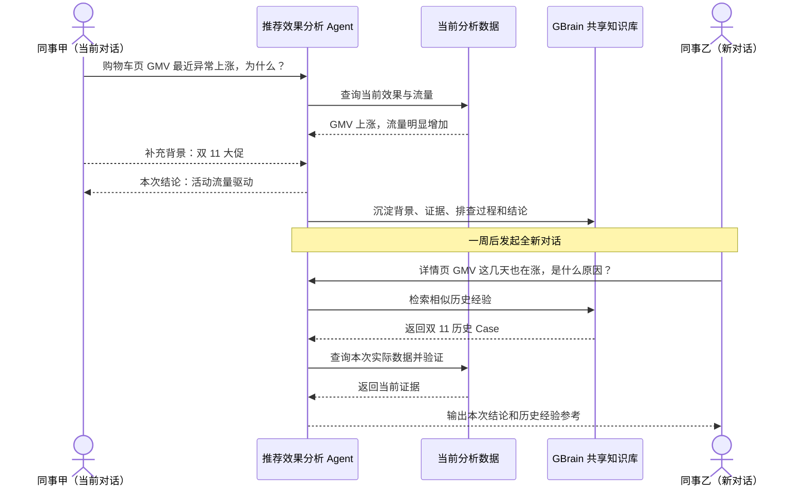
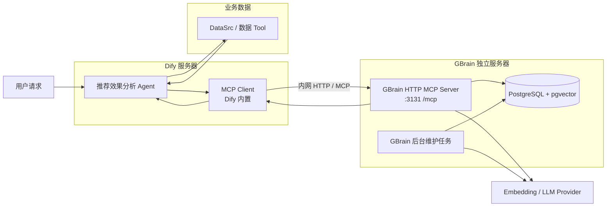
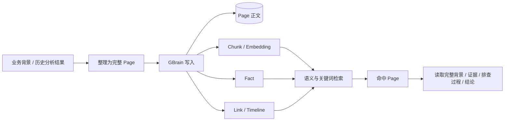
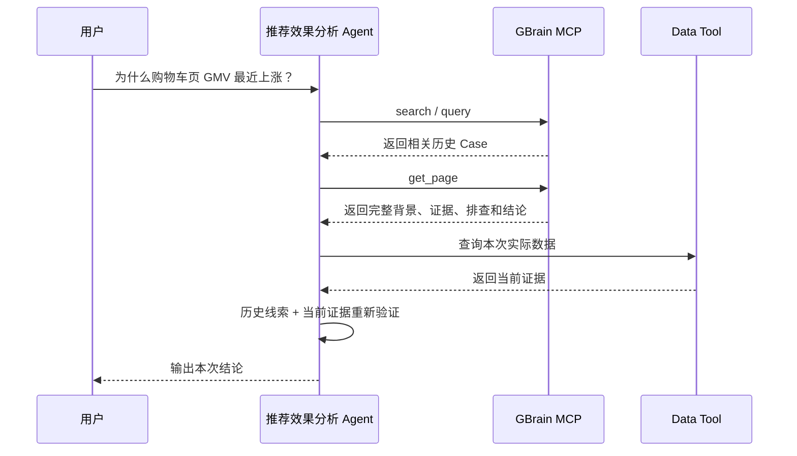

# GBrain 共享知识库 × Dify MCP 接入方案

## 一、背景

### 1.1 问题内容

目前，推荐效果分析 Agent 的上下文主要保存在单次对话中。对话结束后，用户补充的业务背景、Agent 已完成的排查过程以及形成的分析结论，无法在其他新对话中被自动发现和复用。

由此带来两个主要问题：

1. **背景信息被重复提供。** 不同同事分析同一时间段或同一业务事件时，需要反复向 Agent 补充相同的背景信息。
2. **相似问题被重复排查。** 历史异常即使已经完成分析，后续在新对话中仍需重新查询数据、排除原因并整理结论，已有经验无法在团队内持续复用。

### 1.2 建设目标

本期基于已选定的 GBrain 建设团队共享知识库，并接入 Dify 推荐效果分析 Agent。实现业务背景和历史分析经验的统一沉淀、跨对话检索和团队复用。

### 1.3 预期效果



---

## 二、共享知识方案调研与选型

| 项目 | 核心方式 | 与本场景的适配情况 | 结论 |
| --- | --- | --- | --- |
| **GBrain** | 以 Page 保存完整知识，通过 Chunk、Fact、Timeline、Link 等结构组织和检索；同时支持关键词与向量混合查询 | 能保留完整历史 Case，又能通过实验、页面、指标等精确标识和业务语义共同检索；面向团队共享 Brain，读写链路都比较直接 | **推荐，本期选型** |
| RAGFlow | 以文档和 Chunk 为核心，提供混合检索、Parent-Child、GraphRAG 等能力 | 传统 RAG 能力完整，适合大规模文档知识库；但本场景主要是短业务背景和历史 Case，共享部署组件较多 | 备选，不作为本期首选 |
| OpenViking | 将 Resource、Memory、Experience 等上下文按目录和 L0/L1/L2 分层组织 | 适合 Agent 长期上下文和分层读取，但查询和知识组织方式更偏上下文目录体系，与当前 Case 复用链路相比更复杂 | 备选 |
| SAG | 将内容抽取为 Event、Entity，并在查询时构建关系增强结果 | 适合需要事件关系扩展的知识场景，但本期核心需求是稳定找回完整历史 Case，关系加工会增加额外链路 | 备选 |
| LightRAG | 以实体、关系和原文 Chunk 形成图增强检索 | 对跨知识关联和图关系检索能力较强，但需要额外维护实体关系，写入和索引链路更重 | 后续图关系需求可考虑 |
| Mem0 | 将对话内容提炼为 Memory，并按用户、Agent、Run 等 Scope 管理 | 更适合个人或 Agent 长期记忆；自动提炼和合并会弱化完整 Case、精确标识和原始排查过程，不适合作为本期团队经验主库 | 不作为本期方案 |

---

## 三、整体架构

### 3.1 架构图



Dify 与 GBrain 物理分离部署。推荐效果分析 Agent 使用 Dify 原生 MCP Client，通过内网直接访问 GBrain 独立服务器上的 HTTP MCP Server；GBrain 服务器独立负责共享知识的存储、检索、写入和后台维护。需要统一 HTTPS 域名时，再在 GBrain 前增加 Nginx / Gateway。

### 3.2 模块职责

| 模块 | 主要职责 | 输出 |
| --- | --- | --- |
| 推荐效果分析 Agent | 理解用户问题，组织当前数据查询，并决定何时读取或写入历史经验 | 本次分析结论 |
| DataSrc / 数据 Tool | 查询当前时间、页面、实验和指标数据 | 当前事实与证据 |
| Dify MCP Client | 连接 GBrain MCP Server，发现并调用 GBrain 暴露的标准 MCP 能力 | MCP 调用结果 |
| GBrain HTTP MCP Server | 对外提供 `search`、`query`、`get_page`、`put_page` 等共享知识能力，并负责鉴权与调用审计 | 历史经验 / 写入结果 |
| PostgreSQL + pgvector | 保存 Page、Chunk、Fact、关系和向量索引 | 团队共享知识数据 |
| Embedding / LLM Provider | 为语义检索、抽取和后台知识加工提供模型能力 | 向量及加工结果 |

---

## 四、GBrain 知识组织

本期共享知识只保存两类内容：**业务背景**和**历史分析 Case**。完整内容统一以 Page 保存，GBrain 再基于 Page 组织用于检索的 Chunk、Fact 和关联信息。



一条历史 Case 主要包含：问题范围、业务背景、分析证据、已完成的排查过程、最终结论和来源信息。例如一次“购物车页 GMV 上涨”分析，会保存对应站点、页面和时间范围，大促背景，流量与转化证据，已排除的配置因素，以及最终原因结论。

**完整 Case 以 Page 为复用单位，Chunk、Fact、Link 和 Timeline 主要负责帮助检索和关联到对应 Page。**

---

## 五、独立服务器部署方案

默认环境固定为 **Ubuntu 22.04.1 LTS（Jammy Jellyfish）**。

```text
Dify Server
    │
    │ 内网 HTTP :3131
    ▼
GBrain Server（Ubuntu 22.04.1 LTS）
├── GBrain HTTP MCP Server :3131
├── PostgreSQL 16 + pgvector :5432（仅本机）
└── systemd / 日志 / 运维
```

### 5.1 部署前准备

```text
1. Ubuntu 22.04.1 LTS 独立服务器
2. sudo / root 权限
3. GBrain 服务器固定内网 IP
4. Dify 服务器内网 IP
5. 至少一个 Embedding Provider Key
6. 如需 Fact 抽取 / Query Expansion，再准备 LLM Provider Key
```

先确认系统：

```bash
cat /etc/os-release
```

应看到：

```text
PRETTY_NAME="Ubuntu 22.04.1 LTS"
VERSION_CODENAME=jammy
```

### 5.2 创建 GBrain 系统用户和目录

创建独立运行用户：

```bash
sudo useradd --create-home --shell /bin/bash gbrain
```

创建目录：

```bash
sudo mkdir -p /srv/gbrain/knowledge
sudo mkdir -p /srv/gbrain/logs
sudo chown -R gbrain:gbrain /srv/gbrain
```

安装后续需要的基础工具：

```bash
sudo apt update
sudo apt install -y curl git openssl ca-certificates postgresql-common
```

### 5.3 配置 PostgreSQL 官方 APT 仓库

本方案统一采用 **PostgreSQL 16 + pgvector** 作为部署基线。GBrain 本身不强制 PostgreSQL 16，这里固定 16 主要是为了统一部署和运维版本，并直接使用 Ubuntu 22.04 上 PGDG 提供的 `postgresql-16`、`postgresql-16-pgvector` 软件包，因此先接入 PostgreSQL 官方 PGDG APT 仓库。

执行：

```bash
sudo /usr/share/postgresql-common/pgdg/apt.postgresql.org.sh
```

脚本会根据当前系统自动配置 `jammy-pgdg` 软件源。

完成后更新软件索引：

```bash
sudo apt update
```

确认 PostgreSQL 16 软件包可用：

```bash
apt-cache policy postgresql-16
```

输出中应能看到可安装版本。

### 5.4 安装 PostgreSQL 16 和 pgvector

安装 PostgreSQL 16、客户端和对应 pgvector 扩展包：

```bash
sudo apt install -y \
  postgresql-16 \
  postgresql-client-16 \
  postgresql-16-pgvector
```

检查 PostgreSQL 客户端版本：

```bash
psql --version
```

应显示 PostgreSQL 16.x。

查看数据库 Cluster：

```bash
sudo pg_lsclusters
```

正常情况下会看到类似：

```text
Ver Cluster Port Status Owner    Data directory              Log file
16  main    5432 online postgres /var/lib/postgresql/16/main /var/log/postgresql/postgresql-16-main.log
```

如果 `Status` 不是 `online`，启动并设为开机自启：

```bash
sudo systemctl enable postgresql
sudo systemctl start postgresql
sudo pg_lsclusters
```

### 5.5 创建 GBrain 数据库和账号

生成数据库密码：

```bash
openssl rand -hex 24
```

保存输出，后文记为：

```text
<GBRAIN_DB_PASSWORD>
```

进入 PostgreSQL：

```bash
sudo -u postgres psql
```

依次执行：

```sql
CREATE ROLE gbrain LOGIN PASSWORD '<GBRAIN_DB_PASSWORD>';
CREATE DATABASE gbrain OWNER gbrain;
\c gbrain
CREATE EXTENSION IF NOT EXISTS vector;
SELECT extversion FROM pg_extension WHERE extname = 'vector';
\q
```

`SELECT extversion ...` 能返回 pgvector 版本号即可。

验证 GBrain 账号能够从本机连接：

```bash
PGPASSWORD='<GBRAIN_DB_PASSWORD>' \
psql -h 127.0.0.1 -U gbrain -d gbrain \
-c "SELECT current_database(), current_user;"
```

应返回：

```text
current_database | current_user
-----------------+-------------
gbrain           | gbrain
```

### 5.6 确认 PostgreSQL 只供本机访问

GBrain 和 PostgreSQL 部署在同一台服务器，因此 PostgreSQL 不需要向 Dify 开放。

检查监听地址：

```bash
sudo ss -lntp | grep 5432
```

数据库只需要监听本机地址。Dify 只访问 GBrain 的 `3131`，不直接访问 `5432`。

如果服务器 PostgreSQL 被配置为对外监听，应检查：

```text
/etc/postgresql/16/main/postgresql.conf
/etc/postgresql/16/main/pg_hba.conf
```

本方案不需要为 Dify 增加任何 PostgreSQL 网络访问规则。

### 5.7 安装 Bun

切换到 GBrain 用户：

```bash
sudo -iu gbrain
```

安装 Bun：

```bash
curl -fsSL https://bun.sh/install | bash
source ~/.bashrc
```

检查：

```bash
bun --version
```

### 5.8 安装 GBrain

安装稳定版本：

```bash
bun install -g github:garrytan/gbrain#latest-stable
```

检查：

```bash
gbrain --version
```

如果全局安装失败，可从源码安装：

```bash
git clone https://github.com/garrytan/gbrain.git ~/gbrain-src
cd ~/gbrain-src
bun install
bun link
gbrain --version
```

### 5.9 让 GBrain 连接 PostgreSQL

仍然在 `gbrain` 用户下执行：

```bash
export DATABASE_URL='postgresql://gbrain:<GBRAIN_DB_PASSWORD>@127.0.0.1:5432/gbrain'
```

初始化 GBrain：

```bash
gbrain init --url "$DATABASE_URL"
```

检查数据库 Engine：

```bash
gbrain engine status --probe
```

再执行：

```bash
gbrain doctor
gbrain stats
```

`engine status --probe` 应确认使用 PostgreSQL，`doctor` 无阻断错误后继续。

### 5.10 配置 Embedding / LLM Provider

至少配置一个 Embedding Provider，例如：

```bash
export VOYAGE_API_KEY=<你的VoyageKey>
```

或：

```bash
export OPENAI_API_KEY=<你的OpenAIKey>
```

如需 Fact 抽取、Query Expansion 等能力，再配置 Chat Model，例如：

```bash
export ANTHROPIC_API_KEY=<你的AnthropicKey>
```

检查：

```bash
gbrain models
gbrain models doctor
```

### 5.11 创建正式环境变量文件

先退出 `gbrain` Shell：

```bash
exit
```

创建环境变量目录和文件：

```bash
sudo mkdir -p /etc/gbrain
sudo touch /etc/gbrain/gbrain.env
sudo chown root:gbrain /etc/gbrain/gbrain.env
sudo chmod 640 /etc/gbrain/gbrain.env
```

编辑：

```bash
sudo nano /etc/gbrain/gbrain.env
```

填写：

```text
DATABASE_URL=postgresql://gbrain:<GBRAIN_DB_PASSWORD>@127.0.0.1:5432/gbrain
VOYAGE_API_KEY=<your-key>
# OPENAI_API_KEY=<your-key>
# ANTHROPIC_API_KEY=<your-key>
```

实际使用哪种 Provider，就保留对应 Key。该文件不提交 Git。

### 5.12 配置 systemd 并开放 GBrain 端口

先确认 GBrain 可执行文件路径：

```bash
sudo -iu gbrain which gbrain
```

假设返回：

```text
/home/gbrain/.bun/bin/gbrain
```

创建：

```bash
sudo nano /etc/systemd/system/gbrain.service
```

填写：

```ini
[Unit]
Description=GBrain HTTP MCP Server
After=network-online.target postgresql.service
Wants=network-online.target postgresql.service

[Service]
Type=simple
User=gbrain
Group=gbrain
WorkingDirectory=/srv/gbrain/knowledge
EnvironmentFile=/etc/gbrain/gbrain.env
ExecStart=/home/gbrain/.bun/bin/gbrain serve --http --port 3131 --bind 0.0.0.0 --public-url http://<GBRAIN_SERVER_IP>:3131
Restart=on-failure
RestartSec=5

[Install]
WantedBy=multi-user.target
```

将 `<GBRAIN_SERVER_IP>` 替换为 GBrain 服务器真实内网 IP。如果 `which gbrain` 返回其他路径，则同步修改 `ExecStart`。

加载并启动：

```bash
sudo systemctl daemon-reload
sudo systemctl enable --now gbrain
```

检查：

```bash
sudo systemctl status gbrain
sudo journalctl -u gbrain -n 100 --no-pager
```

服务器本机检查：

```bash
curl http://127.0.0.1:3131/health
```

从 Dify 服务器检查：

```bash
curl http://<GBRAIN_SERVER_IP>:3131/health
```

两边都返回：

```json
{"status":"ok"}
```

即可直接使用 GBrain HTTP MCP，不需要 Nginx。

### 5.13 配置防火墙 / ACL

只允许 Dify 服务器访问 GBrain 的 `3131`：

```text
Dify Server → GBrain Server : 3131
运维机器 → GBrain Server : 22
```

不开放：

```text
公网 → 3131
Dify Server → 5432
公网 → 5432
```

使用 UFW 时：

```bash
sudo ufw allow from <运维网段或运维IP> to any port 22 proto tcp
sudo ufw allow from <DIFY_SERVER_IP> to any port 3131 proto tcp
sudo ufw default deny incoming
sudo ufw enable
sudo ufw status
```

### 5.14 可选：使用 Nginx / Gateway 提供 HTTPS

Nginx 不是 GBrain MCP 的必需组件。只有需要统一域名、TLS 证书或公司 Gateway 管理时才增加这一层。

此时将 GBrain 改为只监听本机：

```text
127.0.0.1:3131
```

然后由 Nginx / Gateway 对外提供：

```text
https://gbrain.internal.example.com/mcp
```

使用 Nginx 时安装：

```bash
sudo apt install -y nginx
```

示例配置：

```nginx
server {
    listen 443 ssl;
    server_name gbrain.internal.example.com;

    ssl_certificate     /etc/nginx/certs/gbrain.crt;
    ssl_certificate_key /etc/nginx/certs/gbrain.key;

    location / {
        proxy_pass http://127.0.0.1:3131;
        proxy_http_version 1.1;
        proxy_set_header Host $host;
        proxy_set_header X-Forwarded-Proto https;
        proxy_set_header X-Real-IP $remote_addr;
        proxy_set_header X-Forwarded-For $remote_addr;
        proxy_buffering off;
        proxy_read_timeout 300s;
    }
}
```

如果采用 HTTPS 代理，需要同步把 GBrain `--public-url` 和 Dify MCP URL 改为对应 HTTPS 地址。

### 5.15 创建 Dify Token 并验收服务端

```bash
sudo -iu gbrain
gbrain auth create "dify-rec-agent" --scopes read,write
gbrain auth list
```

保存创建时返回的 Token。

测试：

```bash
gbrain auth test \
  http://<GBRAIN_SERVER_IP>:3131/mcp \
  --token <GBRAIN_TOKEN>
```

如果启用了 Nginx / Gateway，则测试对应 HTTPS URL。

### 5.16 完整部署验收顺序

```text
① sudo pg_lsclusters
   PostgreSQL 16 main 为 online
        ↓
② SELECT extversion ...
   pgvector 正常
        ↓
③ gbrain engine status --probe
   PostgreSQL Engine 正常
        ↓
④ gbrain doctor
   无阻断错误
        ↓
⑤ gbrain models doctor
   Embedding / LLM 正常
        ↓
⑥ curl 127.0.0.1:3131/health
   GBrain 本机服务正常
        ↓
⑦ 从 Dify Server curl <GBRAIN_SERVER_IP>:3131/health
   内网连接正常
        ↓
⑧ gbrain auth test .../mcp
   MCP + Token 正常
        ↓
⑨ Dify Add MCP Server
   Connected
        ↓
⑩ 新对话 put_page → search → get_page
   端到端闭环正常
```

### 5.17 数据备份

GBrain 的 Page、Chunk、Fact 等共享知识数据保存在 PostgreSQL 中。生产环境应将 `gbrain` 数据库纳入公司现有 PostgreSQL、磁盘快照或服务器备份机制。

数据库原生数据目录默认位于：

```text
/var/lib/postgresql/16/main
```

不要直接复制正在运行中的数据库目录作为逻辑备份；具体备份方式按公司现有 PostgreSQL 运维规范执行。

### 5.18 日志和审计

GBrain 服务日志：

```bash
sudo journalctl -u gbrain -f
```

PostgreSQL 日志：

```bash
sudo journalctl -u postgresql@16-main -f
```

也可以查看：

```bash
sudo tail -f /var/log/postgresql/postgresql-16-main.log
```

如果启用了 Nginx，再查看：

```bash
sudo tail -f /var/log/nginx/access.log
sudo tail -f /var/log/nginx/error.log
```

### 5.19 升级流程

升级 GBrain 前先按现有备份机制完成数据保护，再执行：

```bash
sudo systemctl stop gbrain
sudo -iu gbrain
gbrain upgrade
gbrain doctor
gbrain models doctor
exit
sudo systemctl start gbrain
sudo systemctl status gbrain
```

重新检查：

```bash
curl http://<GBRAIN_SERVER_IP>:3131/health
```

然后在 Dify MCP 页面刷新 Tool Catalog，确认 `search`、`query`、`get_page`、`put_page` 仍可用。

---

## 六、MCP 接入实现

### 6.1 认证方式

Dify 使用 GBrain scoped Bearer Token：

```text
Dify MCP Client
    │
    │ Authorization: Bearer <GBRAIN_TOKEN>
    │ HTTP / 内网
    ▼
GBrain :3131/mcp
    │
    └── token scope = read + write
```

GBrain Token 只授予 `read + write`，不授予 `admin`。

创建：

```bash
sudo -iu gbrain
gbrain auth create "dify-rec-agent" --scopes read,write
```

查看：

```bash
gbrain auth list
```

撤销：

```bash
gbrain auth revoke "dify-rec-agent"
```

### 6.2 验证 MCP 地址

直接端口模式：

```bash
curl http://<GBRAIN_SERVER_IP>:3131/health

gbrain auth test \
  http://<GBRAIN_SERVER_IP>:3131/mcp \
  --token <GBRAIN_TOKEN>
```

如果采用 Nginx / Gateway，则将地址替换为对应 HTTPS 地址。

### 6.3 在 Dify 中添加 GBrain MCP Server

进入：

```text
Integrations
→ Tools
→ MCP
→ Add MCP Server
```

填写：

```text
Name: GBrain Shared Knowledge
Server Identifier: gbrain-shared
URL: http://<GBRAIN_SERVER_IP>:3131/mcp
```

如果前面启用了 Nginx / Gateway，则 URL 改为：

```text
https://gbrain.internal.example.com/mcp
```

本期不使用自动 OAuth 注册。如果界面显示 **Dynamic Client Registration**，关闭。

进入 **Advanced Options → Custom Headers**：

```text
Header Name: Authorization
Header Value: Bearer <GBRAIN_TOKEN>
```

保存后检查 Dify 是否能够发现 GBrain MCP Tools。

### 6.4 在推荐效果分析 Agent 中挂载能力

只挂载本期需要的能力：

```text
读取：
search
query
get_page

写入：
put_page
```

- `search`：根据用户问题检索相关历史 Case 和业务背景；
- `query`：需要更复杂条件、时间或关系检索时使用；
- `get_page`：读取完整 Page；
- `put_page`：写入最终确认的业务背景或历史分析 Case。

### 6.5 Agent 使用规则

1. “为什么、原因、异常、发生了什么”等调查问题，先检索 GBrain 获取历史背景和类似 Case；
2. 历史 Case 只作为调查线索，当前指标结论仍通过 Data Tool 查询；
3. Search 命中候选后，需要完整证据或排查过程时调用 `get_page`；
4. 普通一次性指标查询不写入；
5. 形成明确背景、有证据的排查过程或可复用结论时才调用 `put_page`。

### 6.6 读取链路



```text
search / query
→ 找到候选 Page
→ get_page
→ 获取完整历史经验
→ 当前 Data Tool 验证
→ 本次结论
```

### 6.7 写入链路与 Page 规范

本期写入两种 Page：

```text
业务背景
历史分析 Case
```

Slug 约定：

```text
背景：background/<日期>/<事件名称>
Case：cases/<日期>/<站点>-<页面>-<问题关键词>
```

例如：

```text
background/2026-11-01/double11-promotion
cases/2026-11-07/ec20-cart-gmv-rise
```

历史 Case 示例：

```markdown
---
type: rec_analysis_case
site: EC20
scene: 5
start_date: 2026-11-01
end_date: 2026-11-07
metric: rec_gmv
status: confirmed
source: dify
---

# 问题
购物车页推荐引导 GMV 最近为什么上涨？

## 业务背景
双 11 大促开始。

## 关键证据
- 推荐请求量明显增加
- CTR 基本稳定
- CTCVR 基本稳定

## 排查过程
1. 对比活动前后推荐流量
2. 检查转化效率
3. 检查同期配置变化

## 排除项
未发现同期推荐策略切换。

## 结论
本次 GMV 上涨主要由活动带来的流量增长驱动。

## 来源
对应 Dify 分析任务及 Tool Evidence。
```

写入流程：

```text
本次分析完成
→ 判断是否具有复用价值
→ 整理为标准 Page
→ MCP put_page
→ GBrain 保存并进入后续检索
```

禁止写入：

- 一次性指标查询；
- 未经数据验证的猜测；
- LLM 中间思考过程；
- Tool 原始参数和执行日志；
- 密钥、Token、数据库连接串等敏感配置。

### 6.8 Dify 端联调验收

**步骤 1：写入测试 Page。**

让 Agent 调用 `put_page`：

```text
slug: cases/mcp-smoke-test
content: 这是一条 GBrain MCP 联通测试知识。
```

**步骤 2：新开一个对话。**

询问：

```text
有没有 MCP 联通测试相关的历史知识？
```

Agent 应调用 `search` 并命中该 Page。

**步骤 3：读取完整 Page。**

继续读取详情，应调用 `get_page` 返回刚才写入的内容。

**步骤 4：清理测试数据。**

测试完成后删除测试 Page。

验收链路：

```text
Dify 能发现 Tool
→ Agent 能调用 search
→ Agent 能调用 get_page
→ Agent 能调用 put_page
→ 新对话能重新检索刚写入内容
```

### 6.9 MCP 常见问题排查

**Dify 连接失败：**

```bash
curl http://127.0.0.1:3131/health
curl http://<GBRAIN_SERVER_IP>:3131/health
gbrain auth test http://<GBRAIN_SERVER_IP>:3131/mcp --token <TOKEN>
```

第一条失败：检查 GBrain Service；第二条失败：检查防火墙 / ACL；前两条成功但第三条失败：检查 Token；三条都成功再检查 Dify 配置。

**返回 401 / 403：**

```bash
gbrain auth list
```

确认 Token 包含 `read`、`write` scope，并检查 Dify Header：

```text
Authorization: Bearer <TOKEN>
```

**Dify 能连接但工具列表为空：**

确认 URL 是 `/mcp`，不是 `/health`；刷新 Dify MCP Tool 列表。

**Search 能调用但检索不到内容：**

```bash
gbrain doctor
gbrain stats
gbrain models
gbrain models doctor
```

检查 PostgreSQL、Embedding Provider 和索引。

**出现 429：**

检查是否出现短时间大量调用，再按实际需要调整 GBrain Rate Limit。

**长查询超时：**

先检查 GBrain 本身响应耗时，再调整 Dify MCP request timeout / SSE read timeout；如果使用 Nginx，再检查 `proxy_read_timeout`。

---

## 七、实施计划

| 时间 | 工作内容 | 产出 |
| --- | --- | --- |
| 9.7—9.8 | 准备 Ubuntu 22.04.1 LTS GBrain 独立服务器；原生安装 PostgreSQL 16 + pgvector、Bun、GBrain 和 Provider；跑通 `doctor` | GBrain 独立服务基础环境可用 |
| 9.9 | 配置 systemd、3131 内网访问和网络 ACL；创建 scoped Bearer Token；完成 `/health` 和 `auth test` | GBrain HTTP MCP 可被 Dify 访问 |
| 9.10—9.11 | 在 Dify 注册 MCP Server，挂载 `search / query / get_page`；完成历史 Case 读取与当前 DataSrc 联合验证 | 历史经验可参与新对话分析 |
| 9.14—9.15 | 挂载 `put_page`；确定 Page / Slug 规范、写入条件和测试 Case；完成跨对话写入—检索闭环 | 有效分析结果可沉淀到 GBrain |
| 9.16—9.18 | 完成端到端联调、故障演练、日志审计和权限检查 | 形成可上线的共享知识闭环 |