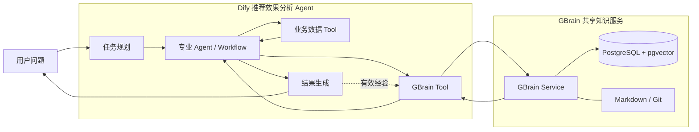
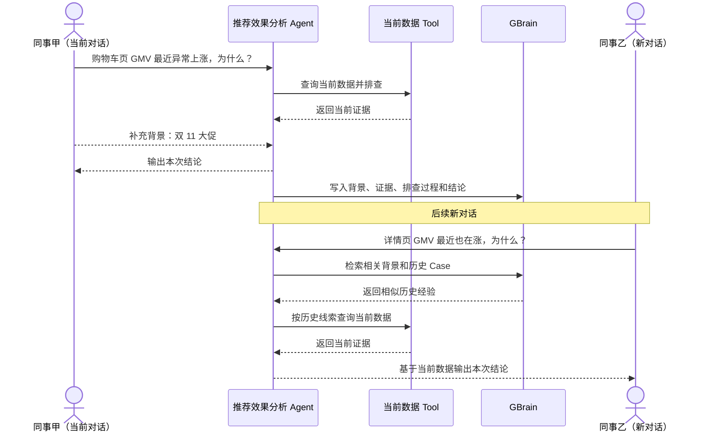

# GBrain 共享知识库 × Dify 接入方案

## 一、背景

目前推荐效果分析 Agent 的上下文主要保存在单次对话中。对话结束后，用户补充的业务背景、Agent 已完成的排查过程以及形成的分析结论，无法在其他新对话中被自动发现和复用。

### 1.1 建设目标

| 当前问题 | 具体表现 | 建设目标 |
| --- | --- | --- |
| 背景信息重复提供 | 大促、改版、运营活动等背景需要不同同事反复补充 | 已确认业务背景能够跨对话共享 |
| 相似问题重复排查 | 历史异常在新对话中仍需要重新查询和排除原因 | 优先复用相似历史 Case 的排查经验 |
| 分析经验随会话结束流失 | 已验证证据、排除项和最终结论只存在当前会话 | 将有效分析经验持续沉淀到共享知识库 |
| 新会话无法主动发现历史信息 | 当前分析只依赖本轮上下文和实时数据 | Agent 分析时主动检索历史背景和经验 |

### 1.2 建设内容

| 能力 | 建设内容 |
| --- | --- |
| 共享业务背景 | 保存活动、改版、运营事件和已确认业务变化 |
| 共享历史 Case | 保存分析范围、排查过程、证据、排除项和结论 |
| 跨对话检索 | 新问题分析时主动检索相关历史经验 |
| 当前数据验证 | 历史经验只作为线索，结合当前数据重新验证 |
| 经验持续沉淀 | 有复用价值的分析结果写回共享知识库 |

---

## 二、共享知识方案调研与选型

| 方案 | 核心方式 | 对当前场景的特点 | 结论 |
| --- | --- | --- | --- |
| **GBrain** | Page + Fact + 混合检索 + 关系能力，面向 Agent Brain 和团队 Context | 能同时保留完整历史 Case、精确业务标识和语义信息；查询链路轻，支持后续关系与时间信息扩展 | **选用** |
| RAGFlow | 文档切块 + 向量 / 关键词检索 + RAG | 文档知识库能力完整，适合大规模文档问答；部署组件较多，历史 Case 仍主要按文档片段处理 | 备选 |
| OpenViking | 分层 Context + Memory / Experience + 语义检索 | Agent Context 组织能力较强，但检索和内容组织更偏分层上下文体系 | 备选 |
| SAG | Event / Entity + 关系增强检索 | 关系表达丰富，适合事件关联场景；查询链路和模型处理更重 | 不作为首选 |
| LightRAG | Entity / Relationship 图增强 RAG | 图关系查询能力较强，但写入时需要持续构建和维护实体关系 | 图关系增强备选 |
| Mem0 | Memory 抽取、合并和 Scope 检索 | 更适合用户长期记忆；自动提炼会弱化完整历史 Case 和精确业务约束 | 不适合作为主共享知识库 |

**最终选择 GBrain：共享知识以完整业务背景和历史 Case 为主体，同时保留精确业务标识和语义检索能力，整体与推荐效果分析 Agent 的历史经验复用场景更匹配。**

---

## 三、总体方案

### 3.1 模块职责

| 模块 | 主要职责 |
| --- | --- |
| Dify Planner | 理解用户目标，决定当前任务和是否需要历史经验 |
| 专业 Agent / Workflow | 结合当前数据和历史经验完成分析 |
| 业务数据 Tool | 查询当前效果、流量、配置等事实证据 |
| GBrain Tool | 封装 GBrain 查询、读取和写入能力 |
| GBrain | 统一保存、索引、检索团队共享背景和历史 Case |
| PostgreSQL + pgvector | 保存 Page、Chunk、Embedding 和检索索引 |
| Markdown / Git | 保存可维护、可追踪的知识原文 |

---

## 四、共享知识设计

本期共享知识只覆盖两类内容：**业务背景**和**历史分析 Case**。

### 4.1 知识内容

| 类型 | 保存内容 | 示例 | 主要用途 |
| --- | --- | --- | --- |
| 业务背景 | 时间、站点、页面、活动、改版、运营事件、已知系统变化 | 双 11 大促、页面改版、流量扩量 | 补充当前问题的历史背景 |
| 历史分析 Case | 问题范围、分析证据、排查过程、排除项、最终结论 | 某页面 GMV 上涨主要由流量增长驱动 | 复用历史排查方向和已验证经验 |

### 4.2 GBrain 对象使用

| GBrain 对象 | 本方案用途 |
| --- | --- |
| `Source` | 区分团队或业务知识范围 |
| `Page` | 保存一条完整业务背景或历史分析 Case |
| `Chunk` | Page 切分后的检索单元 |
| `Fact` | 保存从内容中提取的关键短事实 |
| `Link / Graph` | 关联页面、指标、事件和其他历史 Case |
| `Timeline` | 记录同一知识对象随时间发生的变化 |

**完整 Case 以 Page 为主体保存，Chunk、Fact 和关系信息用于帮助检索和关联。**

### 4.3 历史 Case 结构

| 内容 | 说明 |
| --- | --- |
| 分析范围 | 时间、站点、页面、店铺、指标及相关业务对象 |
| 分析问题 | 当时需要解释的指标变化或业务问题 |
| 业务背景 | 用户确认或共享知识中已有的背景信息 |
| 关键证据 | 业务 Tool 查询后验证成立的数据证据 |
| 排查过程 | 已检查的主要方向及对应结果 |
| 排除项 | 已确认没有明显变化或无法解释当前问题的方向 |
| 最终结论 | 本次分析形成的主要判断 |
| 来源信息 | 用户补充、Tool Result、配置记录等来源 |

### 4.4 写入范围

| 内容 | 是否沉淀 |
| --- | --- |
| 已确认的重要业务背景 | 是 |
| Tool 验证后的关键证据 | 是 |
| 有复用价值的排查过程和排除项 | 是 |
| 已形成的分析结论 | 是 |
| 普通一次性指标查询 | 否 |
| 未验证猜测 | 否 |
| Tool 调用参数和内部执行日志 | 否 |

---

## 五、Dify 接入与使用流程

### 5.1 GBrain Tool 能力

| 使用场景 | GBrain 能力 | 作用 |
| --- | --- | --- |
| 相似历史经验检索 | `Search` | 使用混合检索寻找相关背景和 Case |
| 复杂历史信息查询 | `Query` | 按时间、关系等条件扩展查询 |
| 已知知识精确读取 | `Page` | 获取完整 Page 内容 |
| 关键事实查询 | `Fact` | 查询结构化短事实 |
| 关联经验扩展 | `Graph` | 从当前命中继续查找相关 Case |
| 经验沉淀 | Page 写入 | 写入完整业务背景或历史分析 Case |

### 5.2 历史经验复用流程

### 5.3 知识使用规则

| 信息 | 使用方式 |
| --- | --- |
| 当前指标和业务数据 | 作为本次分析事实依据 |
| 历史业务背景 | 补充当前分析上下文 |
| 历史分析 Case | 提供候选排查方向和历史参考 |
| 历史结论 | 结合本次数据重新验证后再使用 |

---

## 六、部署方案

### 6.1 部署组件

| 组件 | 部署方式 | 作用 |
| --- | --- | --- |
| Dify | 现有 Agent / Workflow 环境 | 用户交互、任务规划和分析执行 |
| GBrain Tool | Dify Tool / Plugin | 封装 GBrain HTTP 查询和写入 |
| GBrain | 独立长期服务 | 团队共享知识服务 |
| PostgreSQL + pgvector | 独立数据库 | Page、Chunk、Embedding 和检索索引 |
| Markdown / Git | 独立知识仓库 | Page 原文和版本管理 |
| Embedding Provider | GBrain 配置 | 语义检索向量生成 |
| LLM Provider | 按需配置 | Fact 抽取、综合查询和后台加工 |

### 6.2 环境划分

| 环境 | GBrain 存储 | 数据内容 |
| --- | --- | --- |
| 本地开发 | PGLite | 脱敏测试数据 |
| 联调 / 测试 | PostgreSQL + pgvector | 测试背景和历史 Case |
| 团队部署 | PostgreSQL + pgvector + Markdown / Git | 正式共享知识 |

---

## 七、实施计划

| 阶段 | 工作内容 | 产出 |
| --- | --- | --- |
| 第 1 阶段：服务部署 | 部署 PostgreSQL、GBrain 和模型 Provider | GBrain 团队服务可用 |
| 第 2 阶段：Dify 接入 | 实现 GBrain Tool，接入 Search / Page 查询 | Dify 能读取共享知识 |
| 第 3 阶段：历史复用 | 原因分析链路接入业务背景和历史 Case | 新对话能够复用历史排查经验 |
| 第 4 阶段：经验沉淀 | 将背景、证据、排查过程和结论写入 GBrain | 形成读取—分析—沉淀闭环 |
| 第 5 阶段：质量验证 | 持续验证检索准确性、耗时和知识质量 | 共享知识能力稳定可用 |

### 7.1 验收内容

| 验收项 | 验收要求 |
| --- | --- |
| 跨对话复用 | 新对话能够主动命中相关业务背景和历史 Case |
| 跨用户共享 | 不同用户能够访问同一团队共享经验 |
| 当前数据验证 | 历史经验能够与当前业务 Tool 结果联合使用 |
| 经验沉淀 | 符合条件的分析结果能够写回 GBrain |
| 来源回溯 | 命中的经验能够追溯到原始 Page 和来源信息 |
| 知识维护 | 已更新或失效的经验能够持续维护和修正 |
