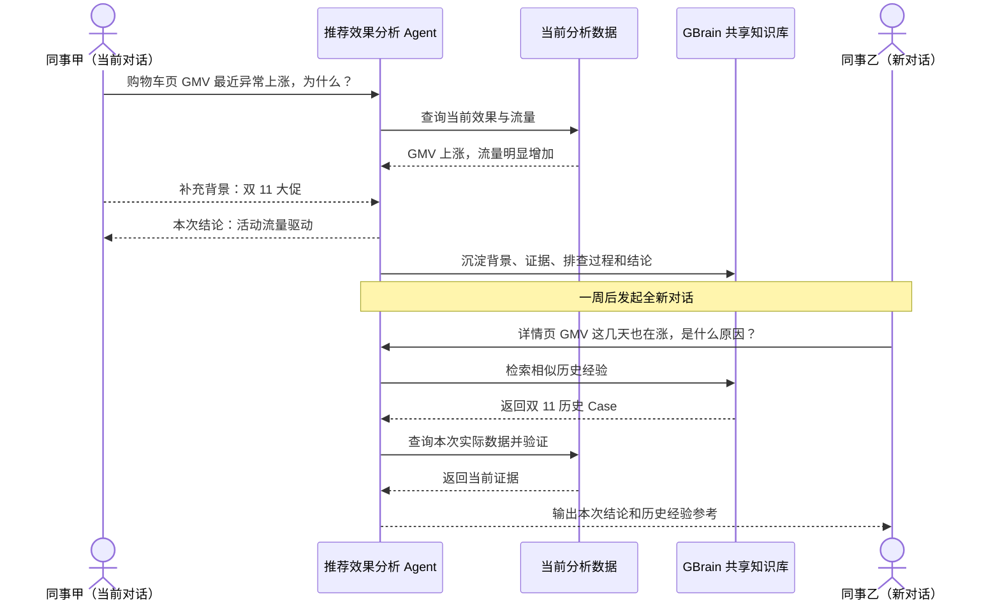
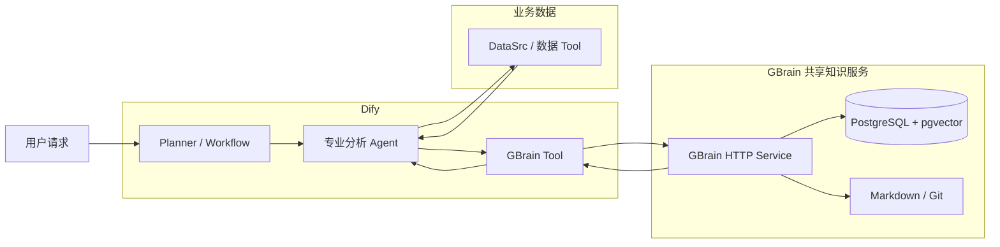
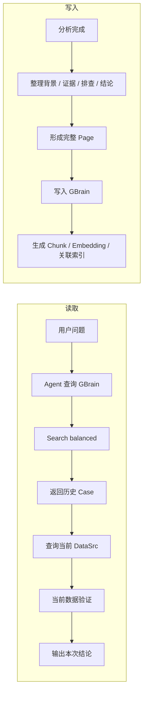

# GBrain 共享知识库 × Dify 接入方案

## 一、背景与目标

目前推荐效果分析 Agent 的上下文主要保存在单次对话中。对话结束后，用户补充的业务背景、已完成的排查过程和分析结论，无法在其他新对话中被主动发现和复用。

| 当前问题 | 具体表现 | 建设目标 |
| --- | --- | --- |
| 业务背景重复提供 | 大促、活动、改版等背景需要不同同事反复补充 | 跨用户共享已确认业务背景 |
| 相似问题重复排查 | 已分析过的异常在新对话中仍从零开始 | 复用历史分析 Case 和排查方向 |
| 排查经验随会话结束流失 | 已验证证据、排除项和结论没有统一沉淀 | 将完整分析经验持续写入共享知识库 |
| 历史经验无法主动发现 | 新对话只能依赖当前上下文 | Agent 分析时主动检索相似历史经验 |

### 1.1 预期效果

---

## 二、共享知识方案调研与选型

本次使用同一批 100 条知识和统一问题集，对 GBrain、RAGFlow、OpenViking、SAG、LightRAG、Mem0 进行检索质量、查询耗时和模型成本对比。

### 2.1 实验设置

| 项目 | 设置 |
| --- | --- |
| 知识规模 | 100 条独立原始文本 |
| 目标知识 | 30 条：14 条业务背景 + 16 条历史分析 Case |
| 干扰知识 | 70 条相似或无关内容 |
| 正式问题 | 3 类：直接背景、约束检索、关联经验 |
| 返回数量 | Top 5 |
| 质量指标 | 首位命中率、Top5 命中率、MRR、上下文召回率、上下文相关性 |
| 性能指标 | P50、P95、模型 Token、模型调用次数、索引耗时、内存和磁盘占用 |

### 2.2 实验结果

| 项目 | MRR | P95 | 单次查询平均 Token | 查询模式 | 结果 |
| --- | ---: | ---: | ---: | --- | --- |
| **GBrain** | **1.000** | **2.850 s** | **38.7** | `search:balanced` | **三题均排第一** |
| RAGFlow | 0.667 | 3.294 s | 38.7 | `vector` | 两题排第一，一题未进入前五 |
| OpenViking | 0.667 | 4.531 s | 38.7 | `find` | 两题排第一，一题未进入前五 |
| SAG | 1.000 | 7.769 s | 625.3 | `vector` | 三题均排第一，但查询成本最高 |
| LightRAG | 0.833 | 3.500 s | 67.0 | `local` | 三题均进入前五 |
| Mem0 | 0.333 | 2.817 s | 38.7 | `native` | 查询快，但正式题排序效果较弱 |

| GBrain 额外结果 | 实验结果 |
| --- | --- |
| 首位命中率 | `1.00` |
| Top5 命中率 | `1.00` |
| MRR | `1.00` |
| 100 条知识写入与索引模型调用 | `271` 次，六个项目最低 |
| 索引磁盘增量 | `3.55 MB`，六个项目最低 |

### 2.3 选型结论

| 选择 | 原因 |
| --- | --- |
| **GBrain** | 检索准确性最高，同时查询速度和模型成本较低 |
| 默认查询 | `search:balanced`，同时利用关键词和向量结果 |
| 经验载体 | 完整历史 Case 使用 `Page` 保存，Chunk、Embedding 和 Graph 用于检索 |
| 团队部署 | 独立 GBrain Service + PostgreSQL / pgvector + Markdown / Git |
| Dify 接入 | 通过 GBrain HTTP API Tool 调用查询和写入能力 |

---

## 三、总体方案

### 3.1 模块职责

| 模块 | 主要职责 | 输出 |
| --- | --- | --- |
| Dify Planner / Workflow | 判断分析目标并组织执行 | 分析任务 |
| 专业分析 Agent | 综合当前数据和历史经验进行分析 | 本次结论 |
| DataSrc / 数据 Tool | 查询当前时间、页面、实验和指标数据 | 当前事实与证据 |
| GBrain Tool | 在 Dify 与 GBrain HTTP API 之间完成查询和写入 | 历史经验 / 写入结果 |
| GBrain | 保存、索引和检索团队共享经验 | Page、Chunk、Fact、Graph 等 |
| PostgreSQL + pgvector | 团队共享存储和检索索引 | Page、Chunk、Embedding、运行状态 |
| Markdown / Git | 保存可审查、可版本化的知识内容 | 经验真源与版本记录 |

---

## 四、GBrain 知识组织

本期只沉淀与推荐效果分析直接相关的 **业务背景和历史分析 Case**。

### 4.1 知识内容

| 内容 | 具体信息 | 主要用途 |
| --- | --- | --- |
| 问题范围 | 问题描述、日期、站点、页面、指标、相关实验 | 约束检索范围 |
| 业务背景 | 大促、节假日、平台活动、维护、临时操作 | 补充历史背景 |
| 分析证据 | 效果变化、维度贡献、实验变化、流量变化 | 支撑历史结论 |
| 排查过程 | 已调查方向、查询结果、排除项 | 复用排查方法 |
| 分析结论 | 主要原因、未解释部分、后续结论 | 提供历史 Case |
| 来源信息 | 原始会话 / 报告、写入时间、写入主体 | 来源回溯 |

### 4.2 GBrain 对象使用

| GBrain 对象 | 本方案用途 |
| --- | --- |
| `Source` | 区分团队或业务知识范围 |
| `Page` | 保存一条完整业务背景或历史分析 Case |
| `Chunk` | Page 切分后的检索单元 |
| `Fact` | 从内容中提取的短事实，用于辅助查询 |
| `Link / Graph` | 关联页面、指标、实验、事件和其他 Case |
| `Timeline` | 保存同一 Page 相关的时间变化信息 |

**核心原则：完整 Case 保存在 Page，检索命中后回到完整经验内容。**

### 4.3 历史 Case 示例结构

| 组成 | 示例 |
| --- | --- |
| 问题 | 购物车页推荐引导 GMV 异常上涨 |
| 范围 | EC20 / scene=5 / 2026-11-01～2026-11-07 |
| 背景 | 双 11 大促 |
| 证据 | 推荐流量上涨；CTR、CTCVR 无明显变化 |
| 排查 | 对比活动前后流量和转化效率；检查同期配置变化 |
| 结论 | GMV 上涨主要由活动流量驱动 |
| 来源 | 当前分析任务及对应 Tool Evidence |

---

## 五、Dify 接入与使用流程

### 5.1 GBrain Tool 能力

| Dify 调用场景 | GBrain 能力 | 使用方式 |
| --- | --- | --- |
| 相似历史经验检索 | `Search` | 默认使用 `balanced` 混合检索 |
| 更复杂的历史条件查询 | `Query` | 按时间、关系等继续扩展 |
| 已知经验精确读取 | `Page` | 根据 Source + Slug 获取完整 Page |
| 结构化事实查询 | `Fact` | 按属性或文本条件查询事实 |
| 关联经验扩展 | `Graph` | 从命中 Page 扩展相关历史 Case |
| 历史经验写入 | Page 写入 | 将完整分析经验写入 GBrain |

### 5.2 读写主链路

### 5.3 使用边界

| 信息 | 使用方式 |
| --- | --- |
| 当前指标与效果数据 | 以本次 DataSrc 查询为准 |
| 历史业务背景 | 作为当前分析背景 |
| 历史分析 Case | 作为排查方向和历史参考 |
| 历史结论 | 需要结合本次数据重新验证 |

---

## 六、部署方案

### 6.1 部署关系

| 组件 | 部署方式 | 作用 |
| --- | --- | --- |
| Dify | 现有 Agent / Workflow 环境 | 用户交互、规划和分析执行 |
| GBrain Tool | Dify Tool / Plugin | 封装 GBrain HTTP 查询和写入 |
| GBrain | 独立长期服务 | 团队共享知识服务 |
| PostgreSQL + pgvector | 独立数据库 | 共享数据、全文和向量索引 |
| Markdown / Git | 独立知识仓库 | Page 内容和版本管理 |
| Embedding Provider | GBrain 配置 | 语义检索向量生成 |
| LLM Provider | GBrain 按需配置 | Fact 抽取、综合查询和后台加工 |

### 6.2 环境配置

| 环境 | GBrain | 数据 |
| --- | --- | --- |
| 本地开发 | PGLite | 脱敏测试数据 |
| 联调 / 测试 | PostgreSQL + pgvector | 测试 Source / Case |
| 团队部署 | PostgreSQL + pgvector + Markdown / Git | 正式共享经验 |

---

## 七、实施计划

| 阶段 | 工作内容 | 产出 |
| --- | --- | --- |
| 第 1 阶段：服务部署 | 部署 PostgreSQL、GBrain 和模型 Provider | GBrain 团队服务可用 |
| 第 2 阶段：Dify 接入 | 实现 GBrain Tool，接入 Search / Page 查询 | Dify 可读取历史经验 |
| 第 3 阶段：经验复用 | 原因分析 Agent 接入历史 Case，并与 DataSrc 联合验证 | 新对话可复用历史排查经验 |
| 第 4 阶段：经验沉淀 | 将分析背景、证据、排查过程和结论写入 Page | 形成读取—分析—沉淀闭环 |
| 第 5 阶段：质量验证 | 使用调研中的统一测试方法持续评测检索质量与性能 | 共享知识检索质量可持续验证 |

### 7.1 验收内容

| 验收项 | 验收结果要求 |
| --- | --- |
| 跨对话复用 | 新对话能够主动命中历史业务背景和 Case |
| 多用户共享 | 不同用户能够访问同一团队共享经验 |
| 当前数据验证 | 历史 Case 不替代当前 DataSrc 查询 |
| 经验完整性 | 能回到完整背景、证据、排查过程、结论和来源 |
| 检索质量 | 使用固定测试集持续统计 Top1、Top5、MRR 和延迟 |
| 写入闭环 | 新分析 Case 可以沉淀并被后续新对话检索 |
