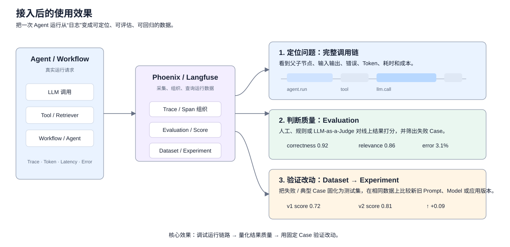
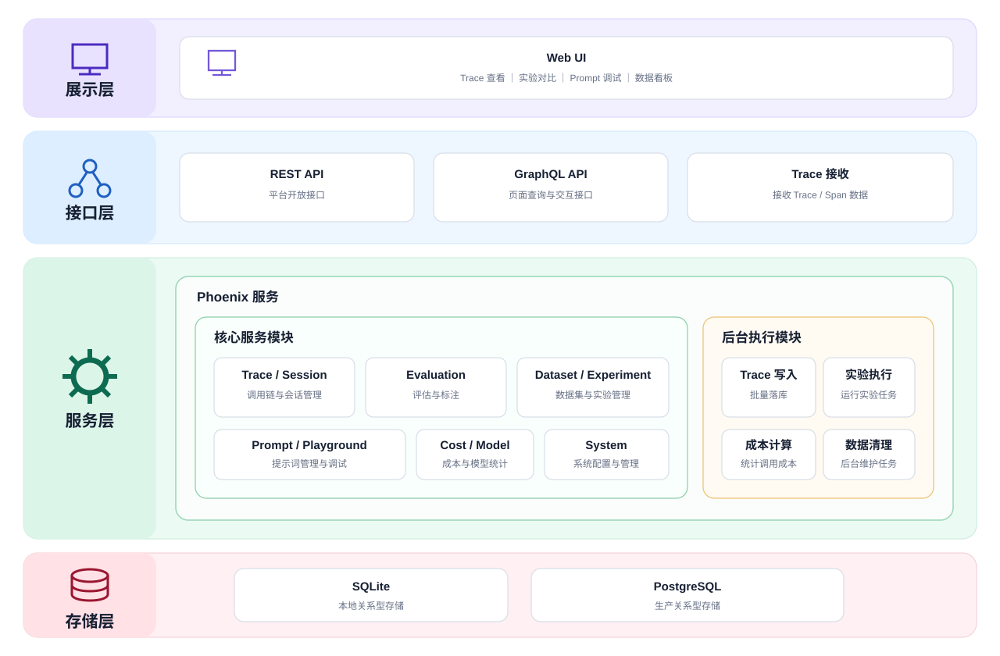
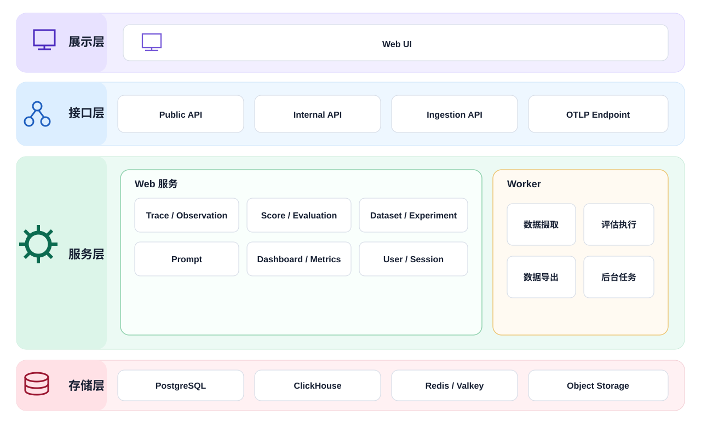
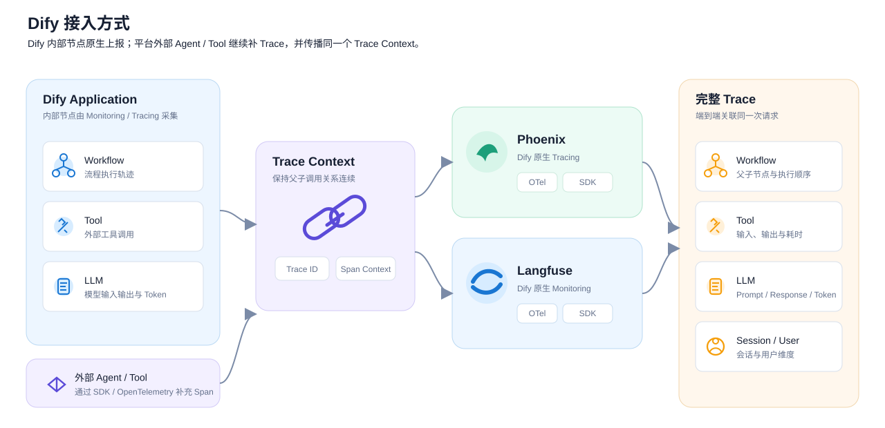
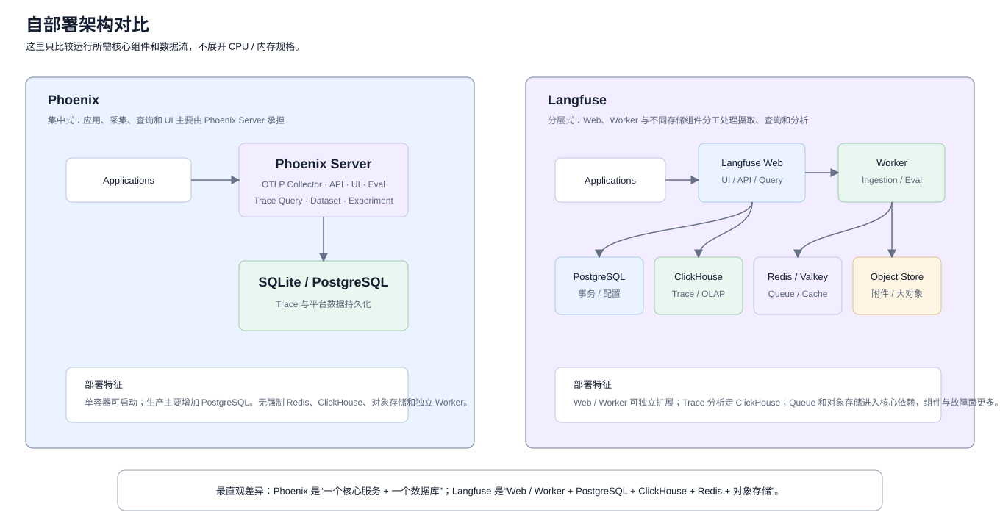

# Phoenix 与 Langfuse 调研

## 一、调研介绍

### 1.1 背景

随着 Agent 应用逐渐从单次 LLM 调用扩展到 Workflow、Tool、RAG、多 Agent 和外部服务组合，一次请求通常会经过多个执行节点。链路复杂后，主要出现三个问题：

1. **调用链难以完整还原。** 出现错误或结果异常时，需要确认问题发生在哪个 Agent、Workflow、Tool、Retriever 或 LLM 调用。
2. **运行质量缺少统一统计。** 模型输入输出、Token、耗时、错误、调用次数和成本需要统一观察和分析。
3. **Agent 改动缺少评估闭环。** Prompt、模型、Workflow 或 Agent 逻辑调整后，需要通过统一 Dataset 和 Evaluation 判断效果是否提升，以及是否产生回归。

### 1.2 调研目的

本次调研对 Phoenix 和 Langfuse 两个开源 LLM / Agent Observability 与 Evaluation 平台进行比较，重点分析以下内容：

- Trace 与 Agent 可观测能力
- Evaluation、Dataset 与 Experiment
- Prompt 管理与数据分析能力
- Dify 与通用 Agent 应用接入方式
- 自部署架构、资源和运维成本
- 开源成熟度与二次开发能力

### 1.3 使用方式与效果

接入 Evaluation 平台后，不改变 Agent 原有业务逻辑，平台主要采集运行 Trace，并把一次 Agent 请求转化为可查看、可分析、可评估的数据。

| 使用场景 | 能直接看到什么 | 主要作用 |
| --- | --- | --- |
| 单次请求调试 | Agent、Workflow、Tool、Retriever、LLM 的父子调用链及输入输出 | 快速确认问题发生在哪个节点 |
| 运行质量分析 | Token、Cost、Latency、Error、模型、Session 等统计 | 找出高成本、慢调用和高错误环节 |
| 质量评估 | 人工、代码或 LLM-as-a-Judge 评分 | 判断回答、检索或 Agent 执行质量 |
| 版本验证 | 同一 Dataset 上的新旧 Prompt、Model、Workflow 运行结果 | 判断改动是否提升以及是否产生回归 |

---

## 二、架构对比

本章基于两个 GitHub 项目当前代码，从接口层、核心服务层、业务模块层、数据访问层和存储层整理项目内部架构。

### 2.1 Phoenix 架构

### 2.2 Langfuse 架构

### 2.3 架构差异总结

| 架构层面 | Phoenix | Langfuse |
| --- | --- | --- |
| 代码组织 | 前端位于 `js/app`；后端主要集中在 `src/phoenix/server` 与 `src/phoenix/db` | Monorepo 明确拆成 `web`、`worker`、`packages/shared` 等主要包 |
| 接口层 | React Web UI、REST API、GraphQL API，以及 OTLP HTTP / gRPC Trace 接收入口 | Next.js Web UI、tRPC、Public REST API，以及 Ingestion / OTLP 接收入口 |
| 核心服务 | FastAPI App 与 gRPC Server 都由 Phoenix Server 统一启动和管理 | Web 与 Worker 是两个独立运行组件，公共业务逻辑通过 `@langfuse/shared` 复用 |
| 后台处理 | BulkInserter、DML Event Handler、Experiment Runner、各类 Daemon 随 Phoenix Server 生命周期运行 | BullMQ Queue 与独立 Worker 负责异步摄取、Evaluation 和后台任务 |
| 业务模块 | Trace / Session、Annotation / Evaluation、Dataset / Experiment、Prompt / Playground、Cost / Model 等集中在 Phoenix 服务内部 | Trace / Observation、Score / Evaluation、Dataset / Experiment、Prompt、Dashboard、User / Session 等按功能模块组织 |
| 数据访问层 | Async SQLAlchemy + DB Models / Insertion，Alembic 管理数据库 Schema | `@langfuse/shared` 提供 Repository、Prisma、ClickHouse、Redis 与 Blob Storage 等服务端访问能力 |
| 存储层 | SQLite 或 PostgreSQL | PostgreSQL、ClickHouse、Redis / Valkey、Object Storage |
| 总体形态 | 单核心服务为主，后台任务和数据访问也集中在同一平台代码体系内 | Web、Worker、共享服务和多类存储分工更明确，整体更偏分布式组件化架构 |

---

## 三、功能对比

### 3.1 功能总览

这里把 **Web 页面能直接查看、配置或操作的功能** 当作平台能力窗口，从使用者视角比较，不在这一节展开底层字段和协议。

> 标记说明：**🟦 Phoenix 更突出 / 更直接**；**🟧 Langfuse 更完整 / 更产品化**；`—` 表示两者都有且差异不明显。

| 功能分类 | 功能点 | Phoenix | Langfuse | 差异 |
| --- | --- | --- | --- | --- |
| 运行与调试 | 项目管理 | 支持按项目查看和隔离运行数据 | 支持按项目管理运行数据与配置 | — |
| 运行与调试 | 运行记录 | 支持查看历史请求与运行记录 | 支持查看历史请求与运行记录 | — |
| 运行与调试 | 调用链 | 支持查看 Agent、Tool、Retriever、LLM 等完整执行链 | 支持查看 Agent、Tool、LLM 等完整执行链 | — |
| 运行与调试 | 节点详情 | 可逐节点查看执行状态和上下游关系 | 可逐节点查看执行状态和上下游关系 | — |
| 运行与调试 | 输入 / 输出 | 可查看每一步的输入、输出和模型调用内容 | 可查看每一步的输入、输出和模型调用内容 | — |
| 运行与调试 | 搜索 / 筛选 | 支持按运行属性、错误、评估结果等筛选 | 支持按运行属性、标签、用户、评分等筛选 | — |
| 运行与调试 | 错误定位 | 可快速定位失败节点和错误信息 | 可定位失败节点，并结合筛选 / 看板观察错误分布 | — |
| 运行与调试 | 耗时分析 | 可查看请求和各节点耗时 | 可查看请求和各节点耗时 | — |
| 运行与调试 | Token 统计 | 支持查看 Token 使用情况 | 支持查看 Token 使用情况 | — |
| 运行与调试 | 成本统计 | 支持查看模型调用成本和趋势 | 支持查看模型调用成本并按更多维度聚合 | 🟧 Langfuse 分析维度更多 |
| 运行与调试 | 模型调用统计 | 可查看模型调用量、错误和成本 | 可查看模型调用量、错误、成本和趋势 | — |
| 运行与调试 | 会话管理 | 支持按 Session 聚合多轮请求 | 支持按 Session 聚合多轮请求 | — |
| 运行与调试 | 用户分析 | 可记录用户信息并作为运行属性查看 / 筛选 | 可直接按用户查看调用、成本和质量表现 | 🟧 Langfuse 用户维度更直接 |
| 可视化分析 | 项目看板 | 提供项目级运行看板 | 提供项目级运行与质量看板 | — |
| 可视化分析 | 自定义看板 | 以内置项目看板和 Trace 查询为主 | 支持自定义 Dashboard、指标、维度和过滤条件 | 🟧 Langfuse 更灵活 |
| 可视化分析 | 质量趋势 | 可查看评估 / Annotation 随时间变化 | 可查看 Score 趋势，并与自定义看板结合 | 🟧 Langfuse 更适合持续分析 |
| 可视化分析 | 成本 / 耗时趋势 | 支持项目级成本、Token、Latency 分析 | 支持按用户、Session、模型、Prompt 等维度拆分 | 🟧 Langfuse 维度更多 |
| 可视化分析 | 模型维度分析 | 支持查看不同模型的调用、Token 和成本 | 支持按模型聚合质量、成本、Latency 等指标 | — |
| 可视化分析 | 用户 / 会话维度分析 | Session 分析较直接，用户更多依赖运行属性 | User / Session 都可作为主要分析维度 | 🟧 Langfuse 更完整 |
| 可视化分析 | 指标告警 | Phoenix OSS 更偏查看与分析，不以告警配置为核心入口 | 可针对指标阈值配置告警 | 🟧 Langfuse 更完整 |
| 质量评估 | 人工评分 | 支持在运行数据上人工打分和标注 | 支持在运行数据上人工打分和评论 | — |
| 质量评估 | LLM 自动评估 | 支持使用 LLM-as-a-Judge 评价结果质量 | 支持使用 LLM-as-a-Judge 评价线上和实验结果 | — |
| 质量评估 | 代码规则评估 | 支持自定义代码规则评估 | 支持 Python / TypeScript Code Evaluator | — |
| 质量评估 | 线上持续评估 | 支持对线上运行结果执行评估，通常需要额外组织执行流程 | 可在平台内配置 Evaluator 与规则，按条件 / 采样自动评估线上数据 | 🟧 Langfuse 自动化入口更完整 |
| 质量评估 | 评估结果分析 | 可按评分 / 标签筛选运行记录并查看趋势 | 支持 Score Analytics，并可进入自定义 Dashboard | 🟧 Langfuse 分析能力更强 |
| 质量评估 | 人工审核队列 | 支持直接人工标注、筛选 Case 和沉淀 Dataset | 提供 Annotation Queue，可组织待审核样本和连续审核流程 | 🟧 Langfuse 审核流程更完整 |
| 质量评估 | 用户反馈 | 可通过 Annotation 记录点赞、评分等反馈 | 支持将终端用户反馈直接记录为 Score 并分析 | 🟧 Langfuse 更产品化 |
| 数据集与实验 | 从运行记录建 Dataset | 可直接把失败 / 典型 Trace 加入 Dataset | 可把 Trace / Observation 加入 Dataset | — |
| 数据集与实验 | Dataset 管理 | 支持创建、维护和重复使用评测数据集 | 支持创建、维护和重复使用评测数据集 | — |
| 数据集与实验 | 样本输入 / 期望结果 | 支持保存输入、期望结果和样本信息 | 支持保存输入、期望结果和样本信息 | — |
| 数据集与实验 | 批量 Experiment | 可在固定 Dataset 上批量运行 Prompt / Model / 应用版本 | 可在固定 Dataset 上批量运行 Prompt / Model / 应用版本 | — |
| 数据集与实验 | 新旧版本对比 | 支持比较不同 Experiment 的结果 | 支持并排比较不同 Dataset Run / Experiment | — |
| 数据集与实验 | Experiment 自动评分 | 可给实验结果挂 Evaluator / Annotation | 可给实验结果挂 Evaluator / Score | — |
| 数据集与实验 | Experiment 人工复核 | 支持在实验结果中查看和补充标注 | 支持在 Experiment Compare 中直接人工评分 | — |
| Prompt | Prompt 管理 | 支持集中保存和管理 Prompt | 支持集中保存和管理 Prompt | — |
| Prompt | Prompt 版本 | 支持保存历史版本 | 每次修改形成版本并保留历史记录 | — |
| Prompt | 生产 / 测试版本切换 | 可通过 Tag 指向要使用的版本 | 可通过 Label 指向生产、测试或自定义版本 | — |
| Prompt | Playground | 支持在 Web 中直接测试 Prompt 和模型 | 支持在 Web 中直接测试 Prompt 和模型 | — |
| Prompt | 模型参数调试 | 可在 Playground 调整模型、参数、工具和输出格式 | 可在 Playground 调整模型和调用参数 | — |
| Prompt | 多 Prompt 对比 | 支持多个 Prompt 变体并排测试 | 支持不同 Prompt / Model 版本对比 | — |
| Prompt | Dataset 批量测试 | 可直接把 Dataset 加载到 Playground 批量运行 | 可通过 Prompt Experiment / Dataset 批量运行 | — |
| Prompt | 真实调用重放 | 可从真实 LLM Span 直接 Replay 到 Playground 再调试 | 可从 Trace 进入 Playground 做调试和复现 | 🟦 Phoenix Replay 路径更直接 |
| Prompt | Prompt 效果分析 | 可结合 Trace、Experiment 和评估结果判断 Prompt 表现 | 可直接查看 Prompt 版本对应的成本、Latency、评分等 Metrics | 🟧 Langfuse 版本分析更完整 |

整体上，两者的基础闭环都很完整：**运行观测 → 问题定位 → 质量评估 → Dataset → Experiment → Prompt / 版本迭代**。真正需要重点比较的不是“有没有”，而是几个明显差异：**线上持续评估、人工审核、用户 / 会话分析、自定义看板，以及 Prompt 调试与版本管理方式。**

### 3.2 关键功能差异与实现方式

这一节只分析 3.1 中真正存在明显差异的功能，并解释为什么使用体验会不同。

#### 3.2.1 线上持续评估

| | Phoenix | Langfuse |
| --- | --- | --- |
| 用户看到的功能 | 可以给线上 Trace / Span 做自动评估并回看结果 | 可以直接配置 Evaluator，对符合条件的线上数据持续评分 |
| 底层组织方式 | 评估结果主要以 Annotation 形式挂回运行数据；持续执行通常由应用、任务或评估工作流触发 | 以 Score 统一保存评估结果，并提供 Evaluation Rule 定义过滤条件、采样比例和自动触发 |
| 实际影响 | 能完成线上评估，但自动化调度需要多组织一层 | 🟧 更适合直接做长期、持续的线上质量监控 |

这里的区别不是 Phoenix “不能在线评估”，而是 **Langfuse 把持续评估的规则和调度入口做进了平台本身**。

#### 3.2.2 人工审核与标注

| | Phoenix | Langfuse |
| --- | --- | --- |
| 用户看到的功能 | 在 Trace、Span、Session 或实验结果上直接打分 / 标注 | 可以逐条评分，也可以把一批样本加入 Annotation Queue |
| 底层组织方式 | Annotation 直接绑定运行对象，常见路径是“筛选问题 Case → 标注 → 加入 Dataset” | Score Config 定义评分项，Annotation Queue 负责组织样本、审核人员和连续处理流程 |
| 实际影响 | 适合研发调试过程中顺手标注 | 🟧 更适合多人、批量、持续的人审流程 |

#### 3.2.3 用户与会话分析

| | Phoenix | Langfuse |
| --- | --- | --- |
| Session | 原生支持多轮 Session 查看 | 原生支持多轮 Session 查看 |
| User | 用户信息更多作为运行属性记录和筛选 | User 是明确的分析维度，可直接按用户聚合调用、成本和质量 |
| 实际影响 | Session 调试足够直接 | 🟧 如果产品需要长期看“某类用户 / 某个用户”的使用与质量，Langfuse 更省事 |

底层原因是 Langfuse 的数据模型里 **User / Session 本身就是平台级对象和指标维度**；Phoenix 的主轴更偏 Trace / Session，用户信息通常作为属性参与查询。

#### 3.2.4 Dashboard 与数据分析

| | Phoenix | Langfuse |
| --- | --- | --- |
| 默认看板 | Project Dashboard 直接展示 Trace 量、Latency、Error、Annotation、Token、Cost、Model、Tool 等常用指标 | 默认提供运行和质量分析，并可继续自定义 |
| 自定义分析 | 以内置看板、Trace 查询和导出为主 | Custom Dashboard 可组合 Metric、Dimension、Filter 和图表，并配合 Metrics API / Alert |
| 实际影响 | 🟦 常见研发排障指标开箱即用，结构更直接 | 🟧 适合把质量、成本和用户维度长期做成运营 / 监控看板 |

这也是两者平台定位差异最明显的地方之一：Phoenix 更偏 **“调试一条链路并验证改动”**，Langfuse 更偏 **“持续观察整个 LLM 应用的运行和质量”**。

#### 3.2.5 Prompt 调试与版本管理

| | Phoenix | Langfuse |
| --- | --- | --- |
| 从问题到调试 | 🟦 可以从真实 LLM Span 直接 Replay 到 Playground，修改 Prompt / Model / 参数后重跑 | 可以从 Trace 关联到 Prompt / Playground，再进行测试 |
| Prompt 版本 | Version + Tag | Version + Label |
| 版本效果 | 主要通过 Trace、Dataset、Experiment 和 Evaluation 比较 | Prompt Version 可直接关联运行 Metrics，查看成本、Latency 和评分表现 |
| 实际影响 | 🟦 从“发现问题 → 重放真实调用 → 修改验证”路径更直接 | 🟧 从“Prompt 资产 → 发布版本 → 运行指标 → 评估结果”管理得更完整 |

因此这一项不是简单判断谁更强：**Phoenix 更偏调试工作台，Langfuse 更偏 Prompt 生命周期管理。**

---

## 四、接入与部署对比

### 4.1 Dify 接入

两个项目都已经有 Dify 原生 Monitoring / Tracing 集成，因此**基础接入都不需要改 Dify 源码**。

| 对比内容 | Phoenix | Langfuse |
| --- | --- | --- |
| Dify 原生集成 | 有 | 有 |
| 基础接入是否修改源码 | 不需要 | 不需要 |
| 认证 | Phoenix Endpoint + API Key | Public Key + Secret Key + Host |
| 标准协议 | OTLP / OpenTelemetry；OpenInference 为核心语义 | OpenTelemetry / Langfuse SDK / Ingestion API |
| Session | 可记录会话与 Trace | `conversation_id` 映射 `sessionId` |
| User | 可作为 Trace Attribute / Metadata | 映射 `userId` |
| Workflow / Tool | 可进入 Span Tree | 可进入 Observation Tree |
| 外部自定义 Agent | 使用 OpenTelemetry / OpenInference 手工补 Span | 使用 OpenTelemetry / SDK 手工补 Observation |
| 跨服务 Trace | 需要继续传播 W3C Trace Context | 需要继续传播 OpenTelemetry Context |

对于多 Agent 或跨服务应用，需要区分两个层次：Dify 内部节点由原生 Monitoring / Instrumentation 采集；平台外部 Agent、Service 或 Tool 需要显式接 OpenTelemetry / SDK，并继续传播同一个 Trace Context，才能形成端到端调用树。

### 4.2 部署架构

这张图只看部署结构就能看到明显差异：

- **Phoenix：** 一个 Phoenix Server 承担采集、API、UI、Trace 查询和大部分平台能力，数据落 SQLite 或 PostgreSQL。
- **Langfuse：** Web 与 Worker 分开，PostgreSQL、ClickHouse、Redis / Valkey、对象存储分别承担事务数据、Trace 分析、队列 / 缓存和大对象存储。

### 4.3 基础组件与资源要求

| 项目 | Phoenix | Langfuse |
| --- | --- | --- |
| Web / API | Phoenix Server | Langfuse Web |
| Trace Collector | Phoenix Server 内置 OTLP | Langfuse Web / Ingestion API |
| 后台 Worker | 无强制独立 Worker | Langfuse Worker |
| 主数据库 | SQLite 或 PostgreSQL 14+ | PostgreSQL |
| Trace 分析数据库 | 与主库共用 | ClickHouse 25.12+ |
| Redis / Queue | 不强制 | Redis / Valkey |
| 对象存储 | 不强制 | S3 / Blob；本地 Compose 使用 MinIO |
| Prometheus | 可选 | 可按运维体系接入 |
| 最小部署形态 | 1 个 Phoenix Container + Volume | Web + Worker + PostgreSQL + ClickHouse + Redis + 对象存储 |
| 官方最低 CPU / 内存 | 官方未给统一单机最低值，需按 Trace 量实测 | 官方按组件给出最低资源，Web / Worker 各 2 CPU / 4 GiB，ClickHouse 2 CPU / 8 GiB 等 |
| Kubernetes | 支持 Helm / K8s | 支持 Helm，官方生产部署优先方式之一 |
| 横向扩展 | 可结合外部 PostgreSQL 和 K8s 部署 | Web / Worker 和存储层分别扩展 |

### 4.4 运维复杂度

| 对比内容 | Phoenix | Langfuse |
| --- | --- | --- |
| 首次部署 | 单容器即可启动；生产增加 PostgreSQL | 需要同时准备 Web、Worker 和多类基础存储 |
| 版本升级 | 主要升级 Phoenix 应用与数据库 Schema | Web / Worker 同版本升级，同时关注 PostgreSQL / ClickHouse Schema 和组件版本要求 |
| 数据备份 | SQLite Volume 或 PostgreSQL | PostgreSQL + ClickHouse + 对象存储分别制定备份策略 |
| Trace 存储扩容 | 主要扩 PostgreSQL / 磁盘 | ClickHouse 与对象存储是主要 Trace 扩容点 |
| 队列运维 | 无强制外部队列 | Redis / Valkey |
| 故障面 | 核心服务与数据库 | Web、Worker、PostgreSQL、ClickHouse、Redis、S3 / MinIO |
| 高可用 | 应用副本 + 外部 PostgreSQL | Web / Worker 多副本 + 各存储组件自身 HA |
| 生产部署复杂度 | 组件少，架构简单 | 组件多，但为高吞吐分析和异步任务提供了更明确的扩展路径 |

这里的复杂度只描述架构组件数量和依赖关系，不代替实际资源测试。最终运维成本仍要结合真实 Trace 量、保留周期和现有基础设施计算。

---

## 五、成本对比

### 5.1 软件成本

| 项目 | Phoenix | Langfuse |
| --- | --- | --- |
| 开源 License | Elastic License 2.0 | 核心 MIT，Enterprise 目录单独商业 License |
| 公司内部自部署 | 可以 | 可以 |
| 自部署核心功能 | Tracing、Eval、Dataset、Experiment、Prompt、Dashboard 等可自部署 | Tracing、Prompt、Eval、Dataset、Experiment、Dashboard 等核心能力可自部署 |
| 主要 License 限制 | 不能把 Phoenix 的主要功能作为第三方托管 / Managed Service 提供 | Enterprise 目录中的功能需要商业许可证 |
| 官方托管服务 | Phoenix / Arize 托管产品可选 | Langfuse Cloud 可选 |

如果用于公司内部 Agent 观测平台，软件成本的重点不是 Cloud 套餐价格，而是**自部署 License 是否满足内部使用，以及目标能力是否依赖 Enterprise 功能**。

### 5.2 基础设施成本

这部分只确认静态架构成本，实际 CPU、内存、磁盘增长由后续实测填写。

| 成本项 | Phoenix | Langfuse |
| --- | --- | --- |
| 应用实例 | Phoenix Server | Web + Worker |
| 事务数据库 | SQLite / PostgreSQL | PostgreSQL |
| OLAP 数据库 | 不强制 | ClickHouse |
| Queue | 不强制 | Redis / Valkey |
| 对象存储 | 不强制 | S3 / Blob / MinIO |
| CPU 实际占用 | 待实测 | 待实测 |
| 内存实际占用 | 待实测 | 待实测 |
| 每日 Trace 磁盘增长 | 待实测 | 待实测 |
| 保留 30 / 90 天存储量 | 待实测 | 待实测 |

从静态部署结构看，Phoenix 的基础资源项更少；Langfuse 需要额外维护 ClickHouse、Redis 和对象存储，但这些组件也提供了更明确的异步摄取和 OLAP 分析能力。最终成本需要结合真实数据量实测。

### 5.3 使用成本

| 成本项 | Phoenix | Langfuse |
| --- | --- | --- |
| 仅 Trace 上报是否额外调用 LLM | 否 | 否 |
| Trace Token 成本 | 不增加模型调用，只保存原应用 Token 信息 | 不增加模型调用，只保存原应用 Token 信息 |
| LLM-as-a-Judge | 开启 Evaluator 时产生额外模型调用 | 开启 Evaluator 时产生额外模型调用 |
| Code Evaluator | 不需要 LLM，按执行环境消耗计算资源 | 不需要 LLM；自部署 Code Evaluator 还需配置对应执行 / Dispatcher 能力 |
| 在线 Evaluation 成本控制 | 由调用侧 / Eval 工作流控制评估范围 | Rule 支持 Filter 与 Sample Rate，可直接限制评估比例 |
| 长期数据成本 | 主要是 SQLite / PostgreSQL Trace 数据 | PostgreSQL + ClickHouse + 对象存储 |
| 日常维护成本 | 主要维护 Phoenix 与数据库 | 需要同时维护 Web、Worker 和多类存储组件 |

---

## 六、项目成熟度与扩展能力

### 6.1 开源与社区

| 项目 | Phoenix | Langfuse |
| --- | --- | --- |
| GitHub Stars | 11,366 | 34,314 |
| GitHub Forks | 1,110 | 3,722 |
| 创建时间 | 2022-11 | 2023-05 |
| 主要维护方 | Arize AI | Langfuse / ClickHouse |
| 当前版本 | `v20.8.0` | `v4.30.0` |
| 最近正式版本 | 2026-09-04 | 2026-09-04 |
| 最近代码更新 | 2026-09-08 | 2026-09-07 |
| 主要语言 | Python | TypeScript |
| License | ELv2 | MIT Core + Enterprise License |
| 文档 | 完整，官方文档与 GitHub Docs 同步维护 | 完整，覆盖 SDK、部署、Eval、Prompt、Dashboard、API |
| 社区状态 | 持续高频发布 | 持续高频发布 |

两个项目当前都处于持续活跃开发状态，不能仅根据 Stars 判断成熟度。Langfuse 社区体量更大；Phoenix 在 OpenTelemetry / OpenInference 及 Python AI 生态中的集成深度更突出。

### 6.2 集成生态

| 集成 | Phoenix | Langfuse |
| --- | --- | --- |
| OpenTelemetry | 原生 | 原生支持 |
| OpenInference | 核心语义标准，由 Arize 维护 OpenInference 项目 | 可以通过 OpenTelemetry 接入 OpenInference Instrumentation |
| Dify | 原生 Tracing 集成 | 原生 Monitoring 集成 |
| LangChain / LangGraph | 支持 | 支持 |
| LlamaIndex | 支持 | 支持 |
| OpenAI / OpenAI Agents | 支持 | 支持 |
| Anthropic / Claude | 支持 | 支持 |
| LiteLLM | 支持 | 支持 |
| CrewAI | 支持 | 支持 |
| Vercel AI SDK | 支持 | 支持 |
| Mastra | 支持 | 支持 |
| 自定义 Agent Framework | OpenTelemetry / OpenInference 手工 Instrument | OpenTelemetry / SDK 手工 Instrument |
| MCP | Phoenix 自带 Remote MCP 查询平台数据 | 平台 / API 具备 MCP 与 Agent 集成能力 |

Phoenix 的生态入口更强调“任何框架最后统一成 OpenTelemetry / OpenInference”；Langfuse 则同时维护原生 SDK、框架 Integration 和 OpenTelemetry 接入。

### 6.3 二次开发能力

| 对比内容 | Phoenix | Langfuse |
| --- | --- | --- |
| REST API | 支持 | 支持，OpenAPI 完整 |
| GraphQL | Phoenix UI / Client 大量使用 GraphQL | 核心外部接口以 Public API / OpenAPI 为主 |
| Python SDK | 支持 | 支持 |
| JS / TS SDK | 支持 | 支持 |
| OTLP | 支持 HTTP / gRPC | 支持 OpenTelemetry |
| Trace 数据查询 | Span / Trace Query、API、Client | Public API、Metrics API、SDK |
| 数据导出 | Trace / Experiment 等支持 API / 下载 | API、批量导出、对象存储导出等 |
| 自定义 Evaluator | 支持 LLM / Code / 自定义 Eval | 支持 LLM / Code / API 自定义 Eval |
| 自定义 Metadata | OpenTelemetry Attributes / OpenInference Attributes | Metadata / Tags / OTel Attributes |
| 自定义 Dashboard | 平台内以内置 Dashboard 为主，复杂分析适合接外部 BI | 原生 Custom Dashboard + Metrics API |
| 内部平台接入 | 通过 OTLP、REST / GraphQL、Client | 通过 OTLP、OpenAPI、SDK、Metrics API |

两者都不要求业务逻辑绑定到自己的 Agent Framework。核心区别是二次开发时选择哪一层作为标准：Phoenix 更自然地以 OpenTelemetry / OpenInference 为中心；Langfuse 可以以 OpenTelemetry 为采集标准，同时继续使用平台自己的 Prompt、Score、Dataset、Metrics API 等能力。

---

## 七、实际场景验证

> 本章由实际测试补充。当前不提前写测试数据、结果或结论，避免把官方能力说明和真实使用效果混在一起。

### 7.1 测试环境

> 待补充。

### 7.2 测试场景

> 待补充。

### 7.3 测试指标

> 待补充。

### 7.4 测试结果

> 待补充。

---

## 八、综合对比与选型建议

> 本章在完成实际场景验证后补充。当前不根据功能数量提前选型。

### 8.1 综合对比

| 维度 | Phoenix | Langfuse | 最终判断 |
| --- | --- | --- | --- |
| Agent Trace | 待结合实测 | 待结合实测 | 待补充 |
| 调试体验 | 待结合实测 | 待结合实测 | 待补充 |
| Evaluation | 待结合实测 | 待结合实测 | 待补充 |
| Dataset / Experiment | 待结合实测 | 待结合实测 | 待补充 |
| Prompt 管理 | 待结合实际需求 | 待结合实际需求 | 待补充 |
| 数据分析 | 待结合实测 | 待结合实测 | 待补充 |
| Dify 接入 | 待结合实测 | 待结合实测 | 待补充 |
| 部署复杂度 | 已完成静态架构调研 | 已完成静态架构调研 | 待结合公司环境 |
| 运维成本 | 待结合部署环境 | 待结合部署环境 | 待补充 |
| 资源成本 | 待实测 | 待实测 | 待补充 |
| 二次开发 | 待结合实际改造 | 待结合实际改造 | 待补充 |

### 8.2 选型原则

最终选型建议基于六个一级维度，不按“功能数量”简单计分：

| 一级维度 | 重点判断内容 |
| --- | --- |
| 可观测能力 | Trace 是否完整，Agent / Tool / LLM 节点是否容易定位 |
| 评估与改进闭环 | Evaluation、Dataset、Experiment 是否顺畅 |
| 接入能力 | Dify、OpenTelemetry、跨服务 Trace Context 与改造量 |
| 部署与运维 | 组件数量、扩容、备份、升级和故障面 |
| 成本 | 资源、评估模型调用和数据保留成本 |
| 成熟度与扩展能力 | 社区、API、SDK、Integration 与二次开发便利性 |

### 8.3 最终建议

> 待实际测试完成后补充最终选型与部署方案。
