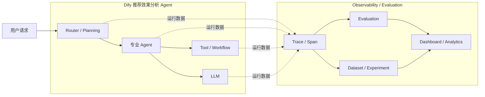
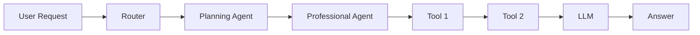
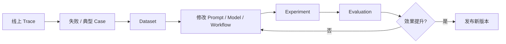
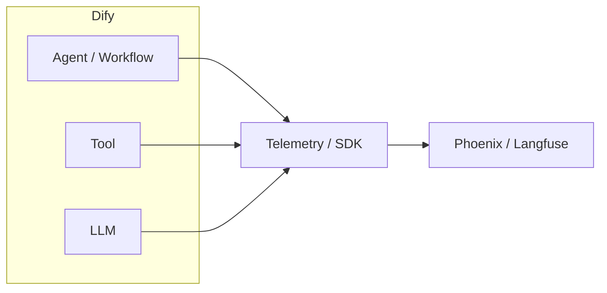

# Phoenix 与 Langfuse 调研

## 一、调研介绍

### 1.1 背景

当前推荐效果分析 Agent 已形成多 Agent + Workflow 的执行架构。一次用户请求可能经过任务识别、Planning Agent、专业分析 Agent、数据 Tool、回答生成等多个环节。

随着链路逐渐复杂，当前主要缺少统一的可观测、调试和评估能力：

1. **调用链难以完整还原。** 出现错误或结果异常时，需要逐个节点排查，难以快速确认问题发生在哪个 Agent、Workflow、Tool 或 LLM 调用。
2. **运行质量缺少统一统计。** 模型输入输出、Token、耗时、错误、调用次数和成本没有形成统一的分析视图。
3. **Agent 改动缺少统一评估闭环。** Prompt、模型、Workflow 或 Agent 逻辑调整后，缺少统一 Dataset 和 Evaluation 判断改动是否真正提升效果，以及是否引入回归问题。

### 1.2 调研目的

本次调研对 Phoenix 和 Langfuse 两个开源 LLM / Agent Observability 与 Evaluation 平台进行比较，重点分析其在推荐效果分析 Agent 中的可观测能力、评估能力、Dify 接入方式、部署成本和长期维护成本，为后续平台选型提供依据。

### 1.3 预期效果



---

## 二、候选项目介绍

### 2.1 Phoenix

#### 2.1.1 项目介绍

| 项目 | 内容 |
| --- | --- |
| 项目定位 | 待调研 |
| 开源与维护 | 待调研 |
| GitHub | 待调研 |
| License | 待调研 |
| 核心能力 | 待调研 |

#### 2.1.2 核心架构

> 待补充 Phoenix 的系统架构图，重点说明 Trace 数据如何采集、存储、查询和进入 Evaluation / Dataset / Experiment。

#### 2.1.3 核心概念

| 概念 | 简明含义 |
| --- | --- |
| Trace | 待调研 |
| Span | 待调研 |
| Session | 待调研 |
| Dataset | 待调研 |
| Experiment | 待调研 |
| Evaluator | 待调研 |
| Prompt | 待调研 |

#### 2.1.4 功能能力

重点分析：

- Trace / Span 可观测
- Agent / Tool / LLM 调用链
- Token、Latency、Error、Cost
- Dataset
- Evaluation
- Experiment
- Prompt 管理
- Dashboard / Analytics

#### 2.1.5 Dify 接入方式

> 待调研 Dify 是否可以通过 OpenTelemetry / OpenInference / SDK 直接接入，以及多 Agent Trace 上下文如何传递。

#### 2.1.6 部署架构

> 待补充 Phoenix 自部署架构、依赖组件、最低资源和高可用方式。

---

### 2.2 Langfuse

#### 2.2.1 项目介绍

| 项目 | 内容 |
| --- | --- |
| 项目定位 | 待调研 |
| 开源与维护 | 待调研 |
| GitHub | 待调研 |
| License | 待调研 |
| 核心能力 | 待调研 |

#### 2.2.2 核心架构

> 待补充 Langfuse 的系统架构图，重点说明 Trace 数据如何采集、存储、查询和进入 Evaluation / Dataset / Experiment。

#### 2.2.3 核心概念

| 概念 | 简明含义 |
| --- | --- |
| Trace | 待调研 |
| Span / Observation | 待调研 |
| Session | 待调研 |
| Dataset | 待调研 |
| Experiment | 待调研 |
| Score / Evaluator | 待调研 |
| Prompt | 待调研 |

#### 2.2.4 功能能力

重点分析：

- Trace / Observation 可观测
- Agent / Tool / LLM 调用链
- Token、Latency、Error、Cost
- Dataset
- Evaluation
- Experiment
- Prompt 管理
- Dashboard / Analytics

#### 2.2.5 Dify 接入方式

> 待调研 Dify 原生或 OpenTelemetry 接入方式，以及多 Agent Trace 上下文如何传递。

#### 2.2.6 部署架构

> 待补充 Langfuse 自部署架构、依赖组件、最低资源和高可用方式。

---

## 三、核心能力对比

### 3.1 能力总览

先用统一表格判断两个项目“能不能做”，后续小节再分析“怎么做、做到什么程度”。

| 对比维度 | Phoenix | Langfuse |
| --- | --- | --- |
| Trace 可观测 | 待调研 | 待调研 |
| 多 Agent / Workflow 调试 | 待调研 | 待调研 |
| Tool / LLM 调用定位 | 待调研 | 待调研 |
| Session / User 分析 | 待调研 | 待调研 |
| Token / Cost 统计 | 待调研 | 待调研 |
| Evaluation | 待调研 | 待调研 |
| Dataset | 待调研 | 待调研 |
| Experiment | 待调研 | 待调研 |
| Prompt 管理 | 待调研 | 待调研 |
| Dashboard / Analytics | 待调研 | 待调研 |
| OpenTelemetry | 待调研 | 待调研 |
| API / SDK | 待调研 | 待调研 |

### 3.2 Trace 与 Agent 可观测

重点比较一次推荐效果分析请求能否完整还原为统一调用链：



| 对比内容 | Phoenix | Langfuse |
| --- | --- | --- |
| Trace / Span 数据模型 | 待调研 | 待调研 |
| 多 Agent 父子关系 | 待调研 | 待调研 |
| Workflow 节点展示 | 待调研 | 待调研 |
| Tool 调用输入输出 | 待调研 | 待调研 |
| LLM Prompt / Response | 待调研 | 待调研 |
| Error 定位 | 待调研 | 待调研 |
| Token / Cost | 待调研 | 待调研 |
| Latency | 待调研 | 待调研 |
| Metadata / Tag | 待调研 | 待调研 |
| Session / User 聚合 | 待调研 | 待调研 |

### 3.3 Evaluation

| 对比内容 | Phoenix | Langfuse |
| --- | --- | --- |
| 人工评分 | 待调研 | 待调研 |
| 自定义 Score | 待调研 | 待调研 |
| LLM-as-a-Judge | 待调研 | 待调研 |
| 在线 Evaluation | 待调研 | 待调研 |
| 离线 Evaluation | 待调研 | 待调研 |
| Evaluator 管理 | 待调研 | 待调研 |
| Trace 自动评估 | 待调研 | 待调研 |
| 评估结果筛选与分析 | 待调研 | 待调研 |

### 3.4 Dataset 与 Experiment

重点判断能否形成下面的 Agent 改进闭环：



| 对比内容 | Phoenix | Langfuse |
| --- | --- | --- |
| Dataset 管理 | 待调研 | 待调研 |
| Trace → Dataset | 待调研 | 待调研 |
| Dataset 版本管理 | 待调研 | 待调研 |
| 批量 Experiment | 待调研 | 待调研 |
| Prompt / Model 版本对比 | 待调研 | 待调研 |
| Experiment 结果对比 | 待调研 | 待调研 |
| 回归测试 | 待调研 | 待调研 |
| CI / 自动化能力 | 待调研 | 待调研 |

### 3.5 Prompt 管理

Prompt 管理作为辅助能力，不单独作为最终选型的一级维度，重点判断其是否能和 Trace、Dataset、Experiment 形成关联。

| 对比内容 | Phoenix | Langfuse |
| --- | --- | --- |
| Prompt 存储 | 待调研 | 待调研 |
| Prompt Version | 待调研 | 待调研 |
| Label / Environment | 待调研 | 待调研 |
| Prompt 发布 | 待调研 | 待调研 |
| Playground | 待调研 | 待调研 |
| Trace 关联 | 待调研 | 待调研 |
| Experiment 关联 | 待调研 | 待调研 |

### 3.6 数据分析与可视化

重点比较平台是否可以直接从运行数据回答：

- 哪个 Agent / Workflow 最慢？
- 哪个模型 Token 消耗最高？
- 哪类问题失败最多？
- 新版本的评分是否高于旧版本？
- 一段时间内调用量、错误率和成本如何变化？

| 分析维度 | Phoenix | Langfuse |
| --- | --- | --- |
| 请求量 | 待调研 | 待调研 |
| Token | 待调研 | 待调研 |
| Cost | 待调研 | 待调研 |
| Latency | 待调研 | 待调研 |
| Error | 待调研 | 待调研 |
| Score | 待调研 | 待调研 |
| Model | 待调研 | 待调研 |
| Agent / Workflow | 待调研 | 待调研 |
| User / Session | 待调研 | 待调研 |
| 自定义 Dashboard | 待调研 | 待调研 |

---

## 四、Dify 接入与部署对比

### 4.1 Dify 接入方案

统一按下面链路分析两个项目，而不是只判断“有没有 Dify 插件”。



重点确认：

1. 是否支持 Dify 原生接入。
2. 是否支持 OpenTelemetry / OpenInference 等标准协议。
3. 是否需要修改 Dify 源码。
4. 自定义 Agent / Tool Span 如何记录。
5. 多 Agent 之间 Trace ID / Context 如何传递。
6. Trace 上报失败是否影响主业务请求。

### 4.2 部署架构

分别绘制 Phoenix 和 Langfuse 的最小自部署架构，并标出：

- 应用服务
- 数据库
- 分析数据库
- 对象存储
- Cache / Queue
- Worker
- 外部模型服务

### 4.3 基础组件与资源要求

| 项目 | Phoenix | Langfuse |
| --- | --- | --- |
| 应用服务 | 待调研 | 待调研 |
| 主数据库 | 待调研 | 待调研 |
| 分析数据库 | 待调研 | 待调研 |
| 对象存储 | 待调研 | 待调研 |
| Redis / Queue | 待调研 | 待调研 |
| Worker | 待调研 | 待调研 |
| 最低 CPU | 待调研 | 待调研 |
| 最低内存 | 待调研 | 待调研 |
| 高可用方式 | 待调研 | 待调研 |
| 部署复杂度 | 待调研 | 待调研 |

### 4.4 运维复杂度

| 对比内容 | Phoenix | Langfuse |
| --- | --- | --- |
| 首次部署 | 待调研 | 待调研 |
| 版本升级 | 待调研 | 待调研 |
| 数据备份 | 待调研 | 待调研 |
| 数据迁移 | 待调研 | 待调研 |
| Trace 数据清理 | 待调研 | 待调研 |
| 横向扩容 | 待调研 | 待调研 |
| 故障组件数量 | 待调研 | 待调研 |

---

## 五、成本对比

### 5.1 软件成本

| 项目 | Phoenix | Langfuse |
| --- | --- | --- |
| 开源 License | 待调研 | 待调研 |
| 自部署核心功能 | 待调研 | 待调研 |
| 企业功能限制 | 待调研 | 待调研 |
| 官方 Cloud | 待调研 | 待调研 |

### 5.2 基础设施成本

对于公司内部自部署，重点比较实际资源占用，而不是只比较软件价格。

| 成本项 | Phoenix | Langfuse |
| --- | --- | --- |
| CPU | 待实测 | 待实测 |
| 内存 | 待实测 | 待实测 |
| Trace 磁盘增长 | 待实测 | 待实测 |
| 数据库资源 | 待实测 | 待实测 |
| 对象存储 | 待实测 | 待实测 |

### 5.3 使用成本

| 成本项 | Phoenix | Langfuse |
| --- | --- | --- |
| Trace 上报额外模型调用 | 待调研 | 待调研 |
| Evaluation 模型调用 | 待调研 | 待调研 |
| 单次 Evaluation Token | 待实测 | 待实测 |
| 数据长期保留成本 | 待调研 | 待调研 |
| 日常维护工作量 | 待评估 | 待评估 |

---

## 六、项目成熟度与扩展能力

### 6.1 开源与社区

| 项目 | Phoenix | Langfuse |
| --- | --- | --- |
| GitHub Stars | 待调研 | 待调研 |
| Contributors | 待调研 | 待调研 |
| Release 活跃度 | 待调研 | 待调研 |
| 文档完整度 | 待调研 | 待调研 |
| 社区活跃度 | 待调研 | 待调研 |

### 6.2 集成生态

| 集成 | Phoenix | Langfuse |
| --- | --- | --- |
| OpenTelemetry | 待调研 | 待调研 |
| OpenInference | 待调研 | 待调研 |
| LangChain | 待调研 | 待调研 |
| LlamaIndex | 待调研 | 待调研 |
| OpenAI | 待调研 | 待调研 |
| Anthropic | 待调研 | 待调研 |
| Dify | 待调研 | 待调研 |
| 自定义 Agent Framework | 待调研 | 待调研 |

### 6.3 二次开发能力

| 对比内容 | Phoenix | Langfuse |
| --- | --- | --- |
| API 完整度 | 待调研 | 待调研 |
| SDK | 待调研 | 待调研 |
| 数据导出 | 待调研 | 待调研 |
| 自定义 Dashboard | 待调研 | 待调研 |
| 自定义 Evaluator | 待调研 | 待调研 |
| 自定义 Metadata | 待调研 | 待调研 |
| 与内部平台集成 | 待调研 | 待调研 |

---

## 七、实际场景验证

### 7.1 测试环境

| 项目 | 配置 |
| --- | --- |
| Dify 版本 | 待补充 |
| Phoenix 版本 | 待补充 |
| Langfuse 版本 | 待补充 |
| CPU / 内存 | 待补充 |
| 测试 Agent | 推荐效果分析 Agent |
| 测试模型 | 待补充 |

### 7.2 测试场景

#### 7.2.1 普通效果查询

```text
用户
→ Router
→ Planning Agent
→ Tool
→ Answer
```

验证 Trace 是否能够完整还原基础调用链。

#### 7.2.2 原因分析 Agent

```text
用户
→ Planning Agent
→ Root Cause Agent
→ Tool 1
→ Tool 2
→ LLM 判断
→ Tool 3
→ Answer
```

重点验证复杂 ReAct、多 Tool 和多层 Agent 调用链是否清晰。

#### 7.2.3 Agent 版本评估

```text
统一 Dataset
     │
     ├── 旧 Prompt / Workflow
     │
     └── 新 Prompt / Workflow
             │
             ▼
         Evaluation
             │
             ▼
       结果对比 / 回归判断
```

验证平台是否能够支撑 Agent 持续改进闭环。

### 7.3 测试指标

| 指标 | 说明 |
| --- | --- |
| Trace 完整性 | 能否完整还原 Router、Agent、Workflow、Tool、LLM 调用链 |
| 调试效率 | 出现错误后定位问题所需的操作和时间 |
| 接入改造量 | Dify 和现有 Agent 需要增加多少改造 |
| Trace 写入开销 | 上报对原业务请求延迟和资源占用的影响 |
| 查询体验 | Trace 检索、筛选和聚合是否方便 |
| Evaluation 能力 | 是否满足线上与离线自动评测 |
| Experiment 能力 | 是否方便比较 Agent 不同版本 |
| 资源占用 | CPU、内存和磁盘占用 |

### 7.4 测试结果

> 待实测后补充图表和结论。

---

## 八、综合对比与选型建议

### 8.1 综合对比

最终不按功能数量简单计分，而是结合推荐效果分析 Agent 的实际需求进行判断。

| 维度 | Phoenix | Langfuse | 更适合 |
| --- | --- | --- | --- |
| Agent Trace | 待调研 | 待调研 | 待判断 |
| 调试体验 | 待调研 | 待调研 | 待判断 |
| Evaluation | 待调研 | 待调研 | 待判断 |
| Dataset / Experiment | 待调研 | 待调研 | 待判断 |
| Prompt 管理 | 待调研 | 待调研 | 待判断 |
| 数据分析 | 待调研 | 待调研 | 待判断 |
| Dify 接入 | 待调研 | 待调研 | 待判断 |
| 部署复杂度 | 待调研 | 待调研 | 待判断 |
| 运维成本 | 待调研 | 待调研 | 待判断 |
| 资源成本 | 待调研 | 待调研 | 待判断 |
| 二次开发 | 待调研 | 待调研 | 待判断 |

### 8.2 选型原则

本次选型重点关注六个一级维度：


### 8.3 最终建议

> 待完成项目调研和实际验证后给出最终推荐方案及部署架构。
