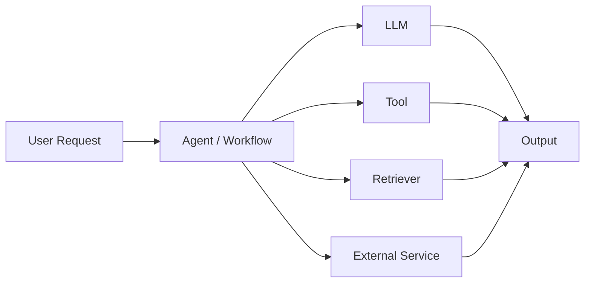
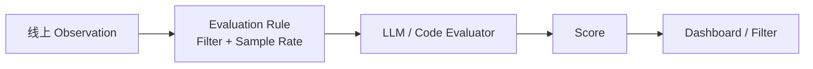
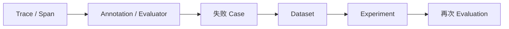
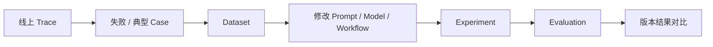
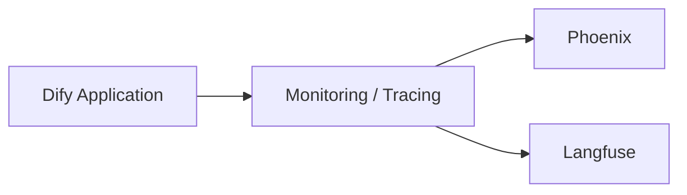
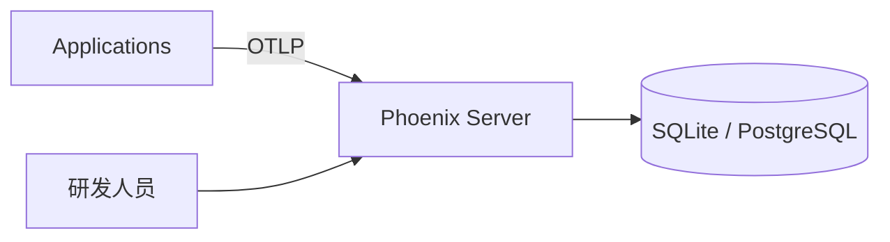
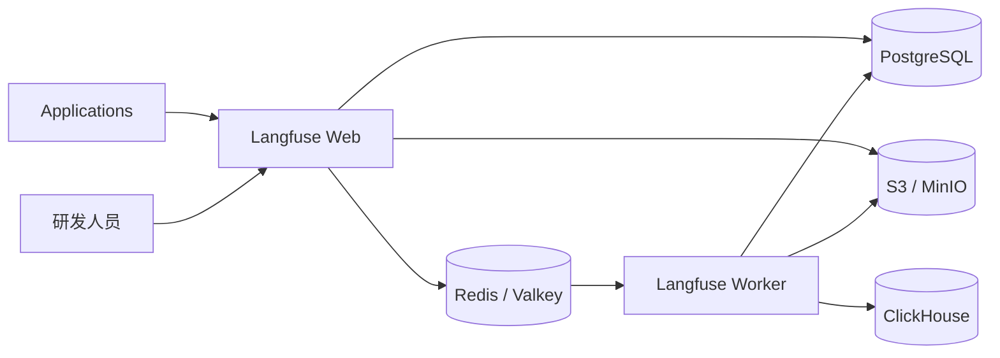
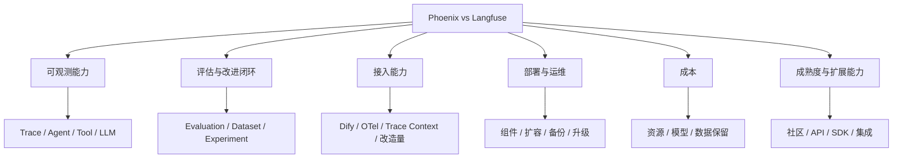

# Phoenix 与 Langfuse 调研

## 一、调研介绍

### 1.1 背景

随着 Agent 应用逐渐从单次 LLM 调用扩展到 Workflow、Tool、RAG、多 Agent 和外部服务组合，一次请求通常会经过多个执行节点。链路复杂后，主要出现三个问题：

1. **调用链难以完整还原。** 出现错误或结果异常时，需要确认问题发生在哪个 Agent、Workflow、Tool、Retriever 或 LLM 调用。
2. **运行质量缺少统一统计。** 模型输入输出、Token、耗时、错误、调用次数和成本需要统一观察和分析。
3. **Agent 改动缺少评估闭环。** Prompt、模型、Workflow 或 Agent 逻辑调整后，需要通过统一 Dataset 和 Evaluation 判断效果是否提升，以及是否产生回归。

### 1.2 调研目的

本次调研对 Phoenix 和 Langfuse 两个开源 LLM / Agent Observability 与 Evaluation 平台进行比较，重点分析以下内容：

- Trace 与 Agent 可观测能力
- Evaluation、Dataset 与 Experiment
- Prompt 管理与数据分析能力
- Dify 与通用 Agent 应用接入方式
- 自部署架构、资源和运维成本
- 开源成熟度与二次开发能力

### 1.3 使用方式与效果

接入 Phoenix 或 Langfuse 后，不改变 Agent 原有业务执行逻辑，平台主要从运行链路中采集 Trace，并围绕 Trace 提供调试、分析、评估和版本验证能力。


| 使用场景 | 能直接看到什么 | 主要作用 |
| --- | --- | --- |
| 单次请求调试 | Agent、Workflow、Tool、Retriever、LLM 的父子调用链及输入输出 | 快速确认问题发生在哪个节点 |
| 运行质量分析 | Token、Cost、Latency、Error、模型、Session 等统计 | 找出高成本、慢调用和高错误环节 |
| 质量评估 | 人工、代码或 LLM-as-a-Judge 评分 | 判断回答、检索或 Agent 执行质量 |
| 版本验证 | 同一 Dataset 上的新旧 Prompt、Model、Workflow 运行结果 | 判断改动是否提升以及是否产生回归 |

### 1.4 整体架构


---

## 二、候选项目介绍

### 2.1 Phoenix

#### 2.1.1 项目介绍

| 项目 | 内容 |
| --- | --- |
| 项目定位 | 开源 AI Observability 与 Evaluation 平台，面向 LLM / Agent 的追踪、调试、评估和实验 |
| 开源与维护 | Arize AI |
| GitHub | [Arize-ai/phoenix](https://github.com/Arize-ai/phoenix) |
| GitHub Stars | 11,366（2026-09-08） |
| 主要语言 | Python |
| 当前版本 | `arize-phoenix-v20.8.0`（2026-09-04 发布） |
| License | Elastic License 2.0（ELv2） |

这里的 Phoenix 指 **Arize Phoenix**。`phoenixframework/phoenix` 是 Elixir Web Framework，与本次 LLM / Agent Observability 调研不是同一个项目。

Phoenix 的核心设计建立在 **OpenTelemetry + OpenInference** 上。应用侧通过 OpenTelemetry / OpenInference Instrumentation 采集 Agent、LLM、Tool、Retriever 等调用，再由 Phoenix 按 Trace / Span 组织运行数据。

#### 2.1.2 核心架构


Phoenix 以 OpenTelemetry 的 Trace / Span 作为基础调用链模型，并通过 OpenInference 补充 Agent、LLM、Tool、Retriever 等 AI 语义。

#### 2.1.3 核心概念

| 概念 | 简明含义 |
| --- | --- |
| Project | Trace 的逻辑隔离单位，一个项目下保存一组应用运行数据 |
| Trace | 一次完整请求或任务的调用链，由多个父子 Span 组成 |
| Span | Trace 中的一次具体操作，可表示 Agent、LLM、Tool、Retriever、Embedding 等 |
| Span Kind | OpenInference 对 Span 的语义分类，例如 `LLM`、`TOOL`、`RETRIEVER`、`AGENT` |
| Session | 将多次 Trace 归并成一次连续会话 |
| Annotation | 对 Span、Trace、Session 等对象添加人工、LLM 或代码评分与标签 |
| Dataset | 用于重复测试的一组输入、期望输出和元数据，支持版本化 |
| Experiment | 在固定 Dataset 上运行一版 Prompt、Model 或应用逻辑，并保存输出和评估结果 |
| Prompt | 可版本化管理的 Prompt，可在 Playground 中调试并通过 Tag 控制使用版本 |

---

### 2.2 Langfuse

#### 2.2.1 项目介绍

| 项目 | 内容 |
| --- | --- |
| 项目定位 | 开源 LLM Engineering 平台，覆盖开发、观测、评估、Prompt 和实验管理 |
| 开源与维护 | Langfuse；2026 年 1 月起成为 ClickHouse 的一部分 |
| GitHub | [langfuse/langfuse](https://github.com/langfuse/langfuse) |
| GitHub Stars | 34,314（2026-09-08） |
| 主要语言 | TypeScript |
| 当前版本 | `v4.30.0`（2026-09-04 发布） |
| License | Open Core：核心 MIT；`ee/`、`web/src/ee/`、`worker/src/ee/` 为 Enterprise License |

Langfuse 的定位偏完整 LLM Engineering 平台。运行数据以 Trace / Observation 组织，同时围绕 User、Session、Score、Prompt、Dataset、Experiment 等对象提供开发和评估能力。

#### 2.2.2 核心架构


Langfuse 以 Trace 表示一次高层请求，Trace 内部再通过 Observation 表示 Generation、Span、Event、Tool、Agent 等具体执行节点，并使用 User / Session 等对象跨 Trace 聚合。

#### 2.2.3 核心概念

| 概念 | 简明含义 |
| --- | --- |
| Project | Langfuse 中应用与运行数据的基本隔离单位 |
| Trace | 一次请求或高层任务的完整调用链 |
| Observation | Trace 中的具体执行节点，可表示 Generation、Span、Event、Agent、Tool 等 |
| Generation | 一次 LLM 调用，保存模型、Prompt、Response、Token、Cost、Latency 等 |
| Session | 将多条 Trace 归并成同一连续会话 |
| User | 用户标识，可跨 Trace / Session 聚合调用、成本和质量信息 |
| Score | 通用评估对象，可保存 Numeric、Categorical、Boolean、Text 等结果 |
| Evaluator | 评分逻辑，可以是 LLM-as-a-Judge、Code Evaluator、人工或外部程序 |
| Evaluation Rule | 对线上 Observation 定义过滤条件、采样率和 Evaluator，实现持续在线评估 |
| Dataset | 可版本化测试集，保存输入、期望输出和 Metadata |
| Experiment / Dataset Run | 固定 Dataset 上的一次应用版本执行与评分结果 |
| Prompt | 中央管理的 Text / Chat Prompt，版本不可变，通过 Label 选择生产或测试版本 |

---

## 三、核心能力对比

### 3.1 能力总览

| 对比维度 | Phoenix | Langfuse |
| --- | --- | --- |
| Trace 可观测 | 支持；OpenTelemetry + OpenInference 为核心模型 | 支持；OpenTelemetry / SDK 采集，平台内使用 Trace / Observation 模型 |
| 多 Agent / Workflow 调试 | 支持父子 Span、Agent / Tool / LLM 等语义类型 | 支持层级 Observation、Agent / Tool / Generation |
| Tool / LLM 调用定位 | 支持输入、输出、状态、Latency、Token 等 | 支持输入、输出、状态、Latency、Token、Cost 等 |
| Session | 原生 Session，可聚合多轮 Trace | 原生 Session，可聚合多轮 Trace |
| User 分析 | 可通过 OpenTelemetry / Metadata 记录用户属性，主要以 Project / Session / Trace 分析为主 | 原生 `userId`，支持按用户聚合 |
| Token / Cost | 支持自动 Token / Cost 计算和聚合 | 支持自动 Token / Cost 计算和聚合 |
| Evaluation | LLM、Code、Human Annotation；可用于 Trace、Dataset、Experiment | LLM、Code、Human、API；支持线上 Rule 自动触发 |
| Dataset | 支持版本化 Dataset | 支持版本化 Dataset |
| Experiment | 支持 | 支持 |
| Prompt 管理 | Version + Tag + Playground + Span Replay | Immutable Version + Label + Cache + Playground |
| Dashboard / Analytics | 内置 Project Dashboard；支持筛选、查询和导出 | Custom Dashboard + Metrics API，分析维度更开放 |
| OpenTelemetry | 原生基础标准 | 原生支持 |
| OpenInference | 核心语义标准 | 可通过 OpenTelemetry 接入 OpenInference Instrumentation |
| API / SDK | Python / TypeScript Client、REST / GraphQL、OTLP | Python / JS/TS SDK、OpenAPI、OTLP |
| Dify 原生接入 | 有 | 有 |

### 3.2 Trace 与 Agent 可观测

一个完整的 Agent 请求需要能够还原为调用树，而不是只有单独的 LLM 日志：



| 对比内容 | Phoenix | Langfuse |
| --- | --- | --- |
| 基础模型 | OpenTelemetry Trace / Span | Trace / Observation，底层支持 OpenTelemetry |
| Agent / Tool 类型 | OpenInference Span Kind 显式表示 `AGENT`、`TOOL`、`LLM` 等 | Observation 类型与 Metadata 表示 Agent、Tool、Generation 等 |
| 父子调用关系 | OpenTelemetry 原生 Parent Span | Observation Parent / Child |
| Workflow 节点 | 可作为 Span 进入 Trace Tree | 可作为 Observation 进入 Trace Tree |
| Tool 输入输出 | 支持 | 支持 |
| LLM Prompt / Response | 支持 | 支持 |
| Model 参数 | 支持 | 支持 |
| Error / Status | 支持状态和错误过滤 | 支持状态和错误分析 |
| Token | 支持 | 支持 |
| Cost | 支持模型价格和自定义价格 | 支持模型价格与 Cost 聚合 |
| Latency | Span / Trace / Session 级 | Observation / Trace / Session 级 |
| Metadata / Tag | Span Attribute / Project / Metadata | Metadata / Tag |
| Session | 原生支持 | 原生支持 |
| User | 通过 Attributes / Metadata 表示 | 原生 `userId` |

**关键差异：** Phoenix 更贴近 OpenTelemetry / OpenInference 标准 Trace；Langfuse 在标准 Trace 之上增加了更强的平台级 User、Score、Prompt、Dashboard 等对象。复杂 ReAct、多 Workflow 和跨服务 Trace Context 的实际完整性需要通过实测判断。

### 3.3 Evaluation

两个项目都不只是“给 Trace 打一个分数”，都能够把评分结果回写并用于筛选失败 Case。差异主要在持续在线评估的组织方式。

| 对比内容 | Phoenix | Langfuse |
| --- | --- | --- |
| 人工评分 | Annotation，可在 UI 对 Trace / Span / Session 等打分或标签 | Manual Score + Annotation Queue |
| 自定义 Score | 支持 Annotation / Programmatic Eval | Score 是平台一级对象 |
| LLM-as-a-Judge | 支持 `phoenix-evals` 和平台 Evaluator | 支持 UI Evaluator，直接配置模型和 Prompt |
| Code Evaluator | 支持代码规则 / 自定义 Eval | 支持 Python / TypeScript Code Evaluator |
| 线上 Evaluation | 可对 Trace 执行 Evaluator 并回写 Annotation；持续自动执行通常通过应用、任务或 Evaluator 工作流组织 | Evaluator + Rule 原生支持过滤、采样和自动执行线上评估 |
| 离线 Evaluation | Dataset + Experiment + Evaluator | Dataset Run / Experiment + Evaluator |
| 人工审核队列 | 主要通过 Annotation / Dataset 工作流 | 原生 Annotation Queue |
| 结果筛选 | 按 Annotation / Score / Error 等筛选 Trace | Score Analytics、Trace Filter、Dashboard |
| 评估结果与 Trace 关联 | Annotation 直接挂到对应对象 | Score 直接挂到 Trace / Observation / Session |

Langfuse 的线上评估链路：



Phoenix 的常见闭环：



这不代表 Phoenix 不能做在线评估，而是两个项目当前产品化入口不同。后续实测重点应放在自动触发、采样、Evaluator 管理和结果回查的操作成本。

### 3.4 Dataset 与 Experiment

两者都能够形成 Agent 改动前后的回归闭环：



| 对比内容 | Phoenix | Langfuse |
| --- | --- | --- |
| Dataset 管理 | 支持 | 支持 |
| Dataset 版本 | 支持版本化 Dataset | 支持版本化 Dataset，可指定历史版本运行 |
| Trace → Dataset | 支持从生产 Trace / Span 沉淀 Case | 支持从 Trace / Observation 沉淀 Dataset Item |
| Expected Output | 支持 | 支持 |
| 批量 Experiment | 支持 | 支持 |
| Prompt / Model 版本比较 | 支持在固定 Dataset 上比较 | 支持 Dataset Run 比较 |
| Experiment 评分 | Evaluator / Annotation | Score / Evaluator |
| 结果对比 | Experiment UI / 下载结果 | Experiment Results Grid / Score Matrix |
| 自动化接口 | SDK / API | SDK / API / OpenTelemetry Attributes |
| CI 回归 | pytest、Vitest/Jest 等测试集成 | 可在 CI 中通过 SDK / API 运行 Dataset Experiment |

### 3.5 Prompt 管理

Prompt 管理不是本次最终选型的一级维度，但它决定 Trace → Prompt 调试 → Experiment 是否能够在同一平台闭环。

| 对比内容 | Phoenix | Langfuse |
| --- | --- | --- |
| Prompt 存储 | 支持 | 支持 |
| Prompt Version | 支持版本历史 | 每次修改形成不可变 Version |
| 生产版本控制 | 使用 Tag 区分和切换版本 | 使用 `production` / 自定义 Label 指向版本 |
| 开发 / 生产区分 | Tag | Label |
| Prompt 获取 | Client / API | SDK / API，客户端有本地缓存 |
| Playground | 支持 | 支持 |
| Trace 回放 | Span Replay，可从真实 LLM 调用继续调 Prompt | 可以从 Trace 进入 Playground 调试 |
| Trace 关联 | Trace / Span 与 Prompt 调试流程可关联 | Prompt Version 可直接关联 Trace，并查看该版本运行 Metrics |
| Experiment 关联 | 可将 Prompt Version 用于 Dataset Experiment | 可将 Prompt Version 用于 Dataset Run / Experiment |
| 回滚 | 将 Tag 切回旧版本 | 将 Label 指回旧 Version |

Langfuse 还提供客户端 Prompt Cache，运行时获取 Prompt 时可以降低对平台可用性的依赖。部分受保护 Label 等治理能力属于 Enterprise 功能。

### 3.6 数据分析与可视化

| 分析维度 | Phoenix | Langfuse |
| --- | --- | --- |
| 请求量 | Project Dashboard / Trace 查询 | Dashboard / Metrics API |
| Token | 支持 | 支持 |
| Cost | 支持 Cost Trend、Model Cost 等 | 支持 Cost Metric、Model / User / Tag 等分组 |
| Latency | Trace / Span / Session 统计 | Observation / Trace / Session 统计 |
| Error | 支持错误状态和过滤 | 支持错误和状态分析 |
| Score / Annotation | 支持 Annotation 图表和筛选 | 支持 Score Analytics / Dashboard |
| Model | 支持按模型统计 Token / Cost | 支持 Model 维度聚合 |
| Agent / Workflow | 通过 Span Kind / Name / Metadata 分析 | 通过 Observation Name / Type / Metadata 分析 |
| User | 主要通过 Metadata / Attribute | 原生 `userId` 维度 |
| Session | 支持 | 支持 |
| 自定义 Dashboard | 以预置 Project Dashboard 和 Trace Query 为主；复杂自定义报表可通过 API / 导出接 BI | 原生 Custom Dashboard，可配置 Metric、Dimension、Filter 和图表 |
| 指标 API | Trace / Span Query、REST / GraphQL | Metrics API，可直接做聚合查询 |

Langfuse 在平台内自由做运营和质量分析的能力更完整；Phoenix 的重点更偏 Trace 调试、评估和内置项目分析。是否需要额外接 Grafana / BI，取决于最终的数据分析需求。

---

## 四、接入与部署对比

### 4.1 Dify 接入

两个项目都已经有 Dify 原生 Monitoring / Tracing 集成，因此**基础接入都不需要改 Dify 源码**。



| 对比内容 | Phoenix | Langfuse |
| --- | --- | --- |
| Dify 原生集成 | 有 | 有 |
| 基础接入是否修改源码 | 不需要 | 不需要 |
| 认证 | Phoenix Endpoint + API Key | Public Key + Secret Key + Host |
| 标准协议 | OTLP / OpenTelemetry；OpenInference 为核心语义 | OpenTelemetry / Langfuse SDK / Ingestion API |
| Session | 可记录会话与 Trace | `conversation_id` 映射 `sessionId` |
| User | 可作为 Trace Attribute / Metadata | 映射 `userId` |
| Workflow / Tool | 可进入 Span Tree | 可进入 Observation Tree |
| 外部自定义 Agent | 使用 OpenTelemetry / OpenInference 手工补 Span | 使用 OpenTelemetry / SDK 手工补 Observation |
| 跨服务 Trace | 需要继续传播 W3C Trace Context | 需要继续传播 OpenTelemetry Context |

对于多 Agent 或跨服务应用，需要区分两个层次：

```text
平台内部节点
→ 原生 Monitoring / Instrumentation 负责采集

平台外部 Agent / Service / Tool
→ 显式接 OpenTelemetry / SDK
→ 继续传播同一个 Trace Context
→ 才能形成端到端调用树
```

因此“是否有 Dify 集成”只是基础接入条件，真正需要实测的是复杂 Workflow、多 Agent 和跨服务场景下 Trace 父子关系是否完整。

### 4.2 部署架构

#### Phoenix



Phoenix 可以从一个容器开始。团队环境通常只需要把 SQLite 换成独立 PostgreSQL，即可把应用和数据生命周期拆开。

#### Langfuse



Langfuse 的 Web / Worker 可以独立横向扩展，但高吞吐 Trace 摄取依赖 ClickHouse、Redis 和对象存储这套异步链路。

### 4.3 基础组件与资源要求

| 项目 | Phoenix | Langfuse |
| --- | --- | --- |
| Web / API | Phoenix Server | Langfuse Web |
| Trace Collector | Phoenix Server 内置 OTLP | Langfuse Web / Ingestion API |
| 后台 Worker | 无强制独立 Worker | Langfuse Worker |
| 主数据库 | SQLite 或 PostgreSQL 14+ | PostgreSQL |
| Trace 分析数据库 | 与主库共用 | ClickHouse 25.12+ |
| Redis / Queue | 不强制 | Redis / Valkey |
| 对象存储 | 不强制 | S3 / Blob；本地 Compose 使用 MinIO |
| Prometheus | 可选 | 可按运维体系接入 |
| 最小部署形态 | 1 个 Phoenix Container + Volume | Web + Worker + PostgreSQL + ClickHouse + Redis + 对象存储 |
| 官方最低 CPU / 内存 | 官方未给统一单机最低值，需按 Trace 量实测 | 官方按组件给出最低资源，Web / Worker 各 2 CPU / 4 GiB，ClickHouse 2 CPU / 8 GiB 等 |
| Kubernetes | 支持 Helm / K8s | 支持 Helm，官方生产部署优先方式之一 |
| 横向扩展 | 可结合外部 PostgreSQL 和 K8s 部署 | Web / Worker 和存储层分别扩展 |

### 4.4 运维复杂度

| 对比内容 | Phoenix | Langfuse |
| --- | --- | --- |
| 首次部署 | 单容器即可启动；生产增加 PostgreSQL | 需要同时准备 Web、Worker 和四类基础存储 |
| 版本升级 | 主要升级 Phoenix 应用与数据库 Schema | Web / Worker 同版本升级，同时关注 PostgreSQL / ClickHouse Schema 和组件版本要求 |
| 数据备份 | SQLite Volume 或 PostgreSQL | PostgreSQL + ClickHouse + 对象存储分别制定备份策略 |
| Trace 存储扩容 | 主要扩 PostgreSQL / 磁盘 | ClickHouse 与对象存储是主要 Trace 扩容点 |
| 队列运维 | 无强制外部队列 | Redis / Valkey |
| 故障面 | 核心服务与数据库 | Web、Worker、PostgreSQL、ClickHouse、Redis、S3 / MinIO |
| 高可用 | 应用副本 + 外部 PostgreSQL | Web / Worker 多副本 + 各存储组件自身 HA |
| 生产部署复杂度 | 组件少，架构简单 | 组件多，但为高吞吐分析和异步任务提供了更明确的扩展路径 |

这里的复杂度只描述架构组件数量和依赖关系，不代替实际资源测试。最终运维成本仍要结合真实 Trace 量、保留周期和现有基础设施计算。

---

## 五、成本对比

### 5.1 软件成本

| 项目 | Phoenix | Langfuse |
| --- | --- | --- |
| 开源 License | Elastic License 2.0 | 核心 MIT，Enterprise 目录单独商业 License |
| 公司内部自部署 | 可以 | 可以 |
| 自部署核心功能 | Tracing、Eval、Dataset、Experiment、Prompt、Dashboard 等可自部署 | Tracing、Prompt、Eval、Dataset、Experiment、Dashboard 等核心能力可自部署 |
| 主要 License 限制 | 不能把 Phoenix 的主要功能作为第三方托管 / Managed Service 提供 | Enterprise 目录中的功能需要商业许可证 |
| 官方托管服务 | Phoenix / Arize 托管产品可选 | Langfuse Cloud 可选 |

如果用于公司内部 Agent 观测平台，软件成本的重点不是 Cloud 套餐价格，而是**自部署 License 是否满足内部使用，以及目标能力是否依赖 Enterprise 功能**。

### 5.2 基础设施成本

这部分只确认静态架构成本，实际 CPU、内存、磁盘增长由后续实测填写。

| 成本项 | Phoenix | Langfuse |
| --- | --- | --- |
| 应用实例 | Phoenix Server | Web + Worker |
| 事务数据库 | SQLite / PostgreSQL | PostgreSQL |
| OLAP 数据库 | 不强制 | ClickHouse |
| Queue | 不强制 | Redis / Valkey |
| 对象存储 | 不强制 | S3 / Blob / MinIO |
| CPU 实际占用 | 待实测 | 待实测 |
| 内存实际占用 | 待实测 | 待实测 |
| 每日 Trace 磁盘增长 | 待实测 | 待实测 |
| 保留 30 / 90 天存储量 | 待实测 | 待实测 |

从静态部署结构看，Phoenix 的基础资源项更少；Langfuse 需要额外维护 ClickHouse、Redis 和对象存储，但这些组件也提供了更明确的异步摄取和 OLAP 分析能力。最终成本需要结合真实数据量实测。

### 5.3 使用成本

| 成本项 | Phoenix | Langfuse |
| --- | --- | --- |
| 仅 Trace 上报是否额外调用 LLM | 否 | 否 |
| Trace Token 成本 | 不增加模型调用，只保存原应用 Token 信息 | 不增加模型调用，只保存原应用 Token 信息 |
| LLM-as-a-Judge | 开启 Evaluator 时产生额外模型调用 | 开启 Evaluator 时产生额外模型调用 |
| Code Evaluator | 不需要 LLM，按执行环境消耗计算资源 | 不需要 LLM；自部署 Code Evaluator 还需配置对应执行 / Dispatcher 能力 |
| 在线 Evaluation 成本控制 | 由调用侧 / Eval 工作流控制评估范围 | Rule 支持 Filter 与 Sample Rate，可直接限制评估比例 |
| 长期数据成本 | 主要是 SQLite / PostgreSQL Trace 数据 | PostgreSQL + ClickHouse + 对象存储 |
| 日常维护成本 | 主要维护 Phoenix 与数据库 | 需要同时维护 Web、Worker 和多类存储组件 |

---

## 六、项目成熟度与扩展能力

### 6.1 开源与社区

| 项目 | Phoenix | Langfuse |
| --- | --- | --- |
| GitHub Stars | 11,366 | 34,314 |
| GitHub Forks | 1,110 | 3,722 |
| 创建时间 | 2022-11 | 2023-05 |
| 主要维护方 | Arize AI | Langfuse / ClickHouse |
| 当前版本 | `v20.8.0` | `v4.30.0` |
| 最近正式版本 | 2026-09-04 | 2026-09-04 |
| 最近代码更新 | 2026-09-08 | 2026-09-07 |
| 主要语言 | Python | TypeScript |
| License | ELv2 | MIT Core + Enterprise License |
| 文档 | 完整，官方文档与 GitHub Docs 同步维护 | 完整，覆盖 SDK、部署、Eval、Prompt、Dashboard、API |
| 社区状态 | 持续高频发布 | 持续高频发布 |

两个项目当前都处于持续活跃开发状态，不能仅根据 Stars 判断成熟度。Langfuse 社区体量更大；Phoenix 在 OpenTelemetry / OpenInference 及 Python AI 生态中的集成深度更突出。

### 6.2 集成生态

| 集成 | Phoenix | Langfuse |
| --- | --- | --- |
| OpenTelemetry | 原生 | 原生支持 |
| OpenInference | 核心语义标准，由 Arize 维护 OpenInference 项目 | 可以通过 OpenTelemetry 接入 OpenInference Instrumentation |
| Dify | 原生 Tracing 集成 | 原生 Monitoring 集成 |
| LangChain / LangGraph | 支持 | 支持 |
| LlamaIndex | 支持 | 支持 |
| OpenAI / OpenAI Agents | 支持 | 支持 |
| Anthropic / Claude | 支持 | 支持 |
| LiteLLM | 支持 | 支持 |
| CrewAI | 支持 | 支持 |
| Vercel AI SDK | 支持 | 支持 |
| Mastra | 支持 | 支持 |
| 自定义 Agent Framework | OpenTelemetry / OpenInference 手工 Instrument | OpenTelemetry / SDK 手工 Instrument |
| MCP | Phoenix 自带 Remote MCP 查询平台数据 | 平台 / API 具备 MCP 与 Agent 集成能力 |

Phoenix 的生态入口更强调“任何框架最后统一成 OpenTelemetry / OpenInference”；Langfuse 则同时维护原生 SDK、框架 Integration 和 OpenTelemetry 接入。

### 6.3 二次开发能力

| 对比内容 | Phoenix | Langfuse |
| --- | --- | --- |
| REST API | 支持 | 支持，OpenAPI 完整 |
| GraphQL | Phoenix UI / Client 大量使用 GraphQL | 核心外部接口以 Public API / OpenAPI 为主 |
| Python SDK | 支持 | 支持 |
| JS / TS SDK | 支持 | 支持 |
| OTLP | 支持 HTTP / gRPC | 支持 OpenTelemetry |
| Trace 数据查询 | Span / Trace Query、API、Client | Public API、Metrics API、SDK |
| 数据导出 | Trace / Experiment 等支持 API / 下载 | API、批量导出、对象存储导出等 |
| 自定义 Evaluator | 支持 LLM / Code / 自定义 Eval | 支持 LLM / Code / API 自定义 Eval |
| 自定义 Metadata | OpenTelemetry Attributes / OpenInference Attributes | Metadata / Tags / OTel Attributes |
| 自定义 Dashboard | 平台内以内置 Dashboard 为主，复杂分析适合接外部 BI | 原生 Custom Dashboard + Metrics API |
| 内部平台接入 | 通过 OTLP、REST / GraphQL、Client | 通过 OTLP、OpenAPI、SDK、Metrics API |

两者都不要求业务逻辑绑定到自己的 Agent Framework。核心区别是二次开发时选择哪一层作为标准：Phoenix 更自然地以 OpenTelemetry / OpenInference 为中心；Langfuse 可以以 OpenTelemetry 为采集标准，同时继续使用平台自己的 Prompt、Score、Dataset、Metrics API 等能力。

---

## 七、实际场景验证

> 本章由实际测试补充。当前不提前写测试数据、结果或结论，避免把官方能力说明和真实使用效果混在一起。

### 7.1 测试环境

> 待补充。

### 7.2 测试场景

> 待补充。

### 7.3 测试指标

> 待补充。

### 7.4 测试结果

> 待补充。

---

## 八、综合对比与选型建议

> 本章在完成实际场景验证后补充。当前不根据功能数量提前选型。

### 8.1 综合对比

| 维度 | Phoenix | Langfuse | 最终判断 |
| --- | --- | --- | --- |
| Agent Trace | 待结合实测 | 待结合实测 | 待补充 |
| 调试体验 | 待结合实测 | 待结合实测 | 待补充 |
| Evaluation | 待结合实测 | 待结合实测 | 待补充 |
| Dataset / Experiment | 待结合实测 | 待结合实测 | 待补充 |
| Prompt 管理 | 待结合实际需求 | 待结合实际需求 | 待补充 |
| 数据分析 | 待结合实测 | 待结合实测 | 待补充 |
| Dify 接入 | 待结合实测 | 待结合实测 | 待补充 |
| 部署复杂度 | 已完成静态架构调研 | 已完成静态架构调研 | 待结合公司环境 |
| 运维成本 | 待结合部署环境 | 待结合部署环境 | 待补充 |
| 资源成本 | 待实测 | 待实测 | 待补充 |
| 二次开发 | 待结合实际改造 | 待结合实际改造 | 待补充 |

### 8.2 选型原则

最终选型建议基于以下六个一级维度，不按“功能数量”简单计分：



### 8.3 最终建议

> 待实际测试完成后补充最终选型与部署方案。
