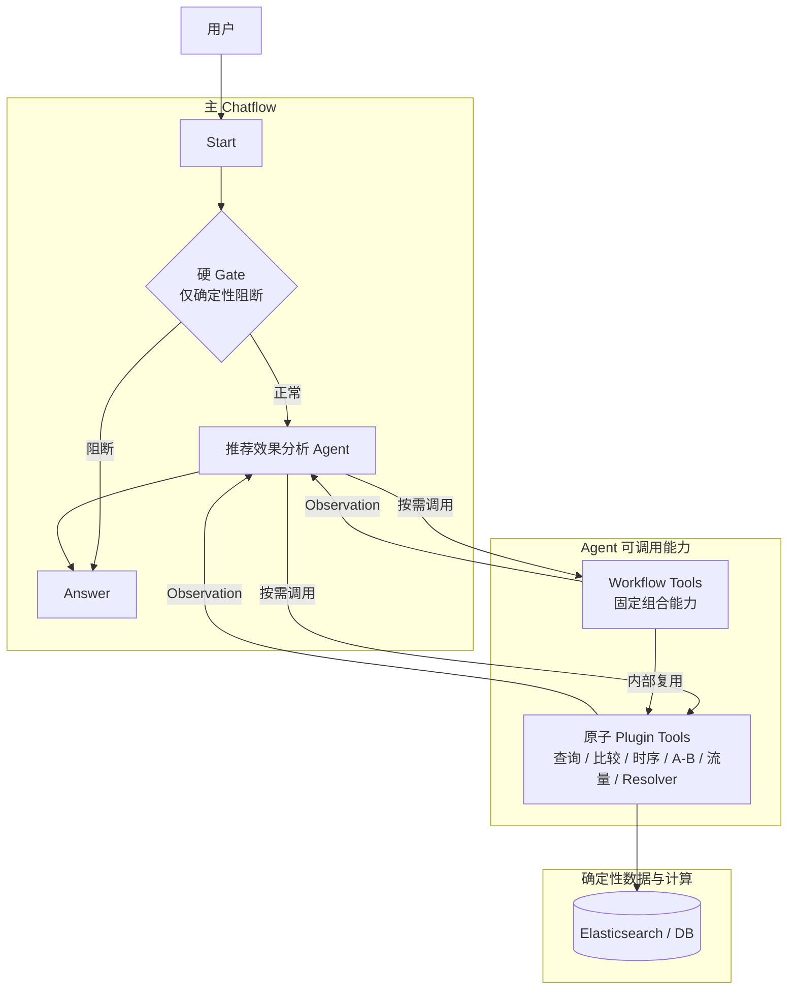
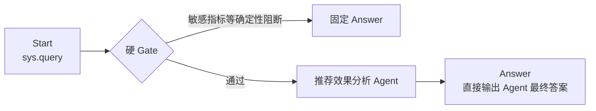
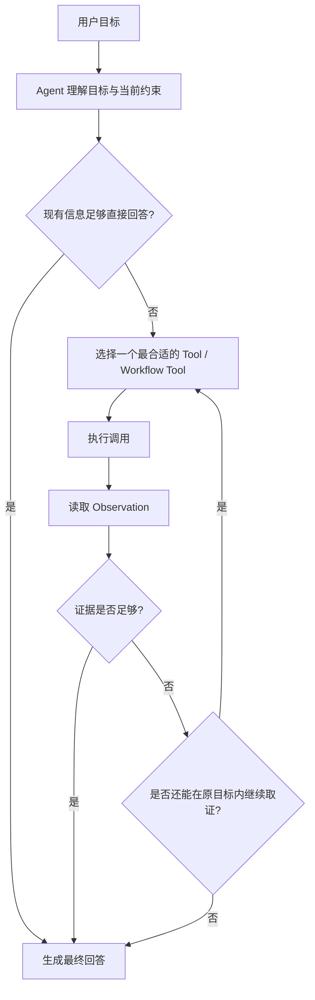
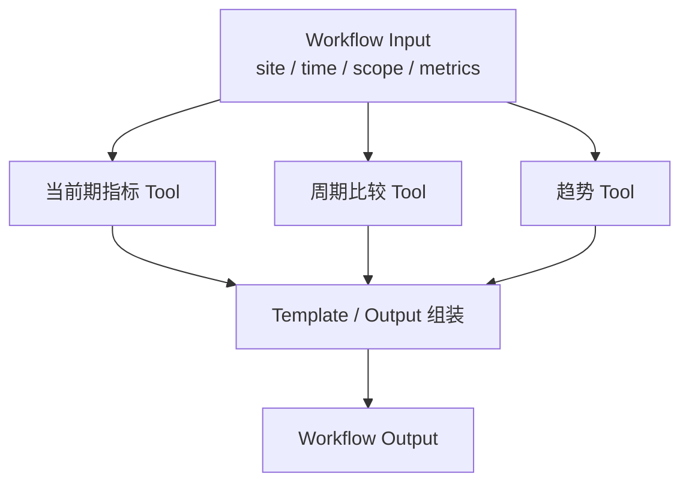
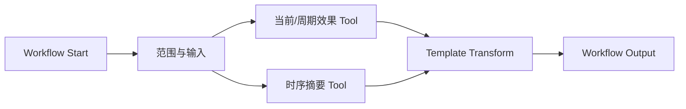

# 推荐效果分析 Agent：Dify 原生执行架构重构方案

> 本文只设计 **Dify 内部工作流、Agent、Prompt 与执行编排**。推荐效果 Tool 的 ES / DB 查询、指标计算、统计检验、异常检测、贡献拆解、Repository 与大结果存储继续由现有 Tool Contract 负责，不在 Dify 工作流层重复实现。
>
> 本次重构的目标不是把旧架构节点改成 Dify 节点名称，而是尽可能把 **Agent Runtime、Tool Calling、Workflow 编排、并行、Iteration、重试与上下文承接** 交给 Dify 原生能力，从而减少自研控制代码。

---

## 1. 整体设计

### 1.1 目标

旧方案的问题不是业务规则太多，而是控制面过重：请求理解、参数提取、Router、Planner、Reviewer、Compiler、Scheduler、Binding Runtime、结果汇总分别实现，导致系统虽然运行在 Dify 上，真正的 Agent Runtime 和执行编排却主要由代码承担。

本次重构收敛为三层：

```text
Dify Agent
├── 理解用户目标
├── 判断是否缺少真正影响业务语义的信息
├── 选择 Tool / Workflow Tool
├── 根据 Observation 决定下一步
└── 直接生成最终回答

Dify Workflow Tool
├── 承载固定、可复用的组合流程
├── 使用原生 Parallel / Iteration / Loop
├── 使用原生 Retry / Fail Branch
└── 对 Agent 暴露为一个 Tool

Plugin Tool
├── 查询 ES / DB
├── 指标与统计计算
├── 参数与业务规则校验
└── 返回结构化事实
```

主 Chatflow 只保留最薄的入口层：

```text
Start
  ↓
硬 Gate（仅保留必须确定性阻断的规则）
  ↓
推荐效果分析 Agent
  ↓
Answer
```

不再在主工作流中提前铺开“指标查询分支、周期分支、A/B 分支、原因分析分支”。这些选择由 Agent 依据用户目标和 Tool Schema 在运行时完成。

### 1.2 设计原则

| 原则 | 规则 |
| --- | --- |
| Dify 原生优先 | Dify 已提供 Agent、Tool、Workflow as Tool、Parallel、Iteration、Loop、Retry、Fail Branch、Conversation Context 等能力时，不再用 Python / Code Node 重写同类控制逻辑。 |
| Agent 驱动而不是 Router 驱动 | 用户目标理解、能力选择、缺口判断和 Observation 驱动的下一步由 Agent 完成，不再先经过通用 Request LLM → Parameter Extractor → Classifier → Planner。 |
| Tool 负责确定性计算 | ES 查询、公式、统计检验、TopN、贡献拆解、参数边界继续由 Plugin Tool 负责，LLM 不重复实现。 |
| 固定组合封装为 Workflow Tool | 多个步骤的依赖关系在设计时已经确定时，使用 Dify Workflow 封装并发布为 Tool，Agent 只看到一个高层能力。 |
| 动态调查交给 Agent | 下一步依赖上一轮 Observation 的问题，例如“为什么下降”，不提前画固定 DAG，由 Agent 自主选择下一步 Tool。 |
| 保证并行时使用 Workflow 原生并行 | 需要明确保证并发的固定独立任务使用 Parallel Branch；同一操作处理数组使用 Iteration Parallel。不要假设 Agent 同轮多个 Tool Call 一定并发。 |
| 真循环才使用 Loop / Iteration | 只有存在“重复直到条件满足”或“对数组逐项处理”时才引入循环节点，不为普通分析创建任务调度器。 |
| 原生错误处理优先 | 节点失败优先使用 Dify Retry、Fail Branch、Default Value；业务错误仍由 Tool 返回结构化状态。 |
| Code Node 最小化 | 原生节点能完成的变量映射、循环、条件和工具调用不使用 Code Node。Code 只用于确实无法由原生表达的轻量格式转换。 |
| 硬规则放在模型外 | 敏感指标等不能依赖模型自由判断的约束保留确定性 Gate，并在 Tool 层再次校验。 |
| Prompt 设计保留 | 原方案已经成熟的全局业务背景、可信输入、Evidence 规则、Tool 使用规则和自检继续保留，只删除多余控制节点。 |
| Tool Schema 是执行契约 | Agent 依据 Tool Schema 生成参数；Prompt 不复制第二份完整字段 Schema。 |
| 不替用户改问题 | 无数据不换时间、站点、页面或基准；贡献最大不自动写成根因。 |

### 1.3 GitHub 高 Star Dify 项目调研

> Star 为 **2026-09-16 调研快照的近似值**，会随时间变化。筛选时先看与 Dify 直接相关的高 Star 项目，再判断其是否真正涉及 Workflow / Agent 执行架构。高 Star 但主要是部署、微信接入或管理后台的项目只作为生态参考，不直接照搬其执行层。

| 项目 | Star 快照 | 类型 | 调研结论 | 对本方案的参考 |
| --- | ---: | --- | --- | --- |
| [`langgenius/dify`](https://github.com/langgenius/dify) | ≈155.6k | Dify 官方核心仓库 | 当前源码中的 Agent v2 Tool Builder 原生识别 Plugin、Builtin、API、Workflow、MCP 等 Tool Provider；Workflow Runtime 本身承担图执行。 | 以官方能力边界为最高依据：Agent 负责 Tool Calling，固定组合优先 Workflow as Tool。 |
| [`svcvit/Awesome-Dify-Workflow`](https://github.com/svcvit/Awesome-Dify-Workflow) | ≈10.8k | 高 Star Dify DSL 示例库 | `Agent工具调用.yml` 的主图就是 `Start → Agent → Answer`；仓库同时大量使用 Iteration、会话变量等原生节点，并明确大量 Workflow 可发布为 Tool 后嵌入 ChatBot。 | 主 Chatflow 采用极薄结构；复杂固定流程封装为 Workflow Tool，不在主图展开。 |
| [`hanfangyuan4396/dify-on-wechat`](https://github.com/hanfangyuan4396/dify-on-wechat) | ≈2.8k | Dify 渠道接入 | 重点是把 Dify 接到微信/企微等渠道，不是 Dify 内部 Agent 执行架构。 | 证明其 Star 高，但与本次执行层关系弱，不作为主架构模板。 |
| [`BannyLon/DifyAIA`](https://github.com/BannyLon/DifyAIA) | ≈2.6k | Dify Workflow DSL 示例库 | `PPT制作助手.yml` 中 Agent 同时挂 Builtin 搜索 Tool 和 `provider_type: workflow` 的 Workflow Tool；`文思泉涌.yml` 使用 Workflow + Iteration 完成固定批处理。 | 直接参考“Agent 调高层 Workflow Tool”和“固定批量流程用 Iteration”的分层。 |
| [`YFGaia/dify-plus`](https://github.com/YFGaia/dify-plus) | ≈2.2k | Dify 企业增强 / 二开 | 重点在管理中心、额度、鉴权等企业能力，不是业务 Agent 编排模板。 | 作为生态和企业化参考，不引入其平台二开复杂度。 |
| [`datawhalechina/self-dify`](https://github.com/datawhalechina/self-dify) | ≈542 | Dify 教程与复杂案例 | DeepResearch 示例直接用 Iteration、If/Else、变量赋值和检索节点实现有状态循环，并让下一轮模型读取前轮结果。 | 真正存在多轮内部循环时才采用原生 Loop/Iteration；普通推荐分析不复制 DeepResearch 的大图。 |
| [`AdamPlatin123/Open-Deep-Research-workflow-on-Dify`](https://github.com/AdamPlatin123/Open-Deep-Research-workflow-on-Dify) | ≈320 | Dify Deep Research Workflow | 多源检索、主题处理、迭代检索和最终报告都放在 Dify Workflow 内编排。 | 说明复杂固定过程可以留在 Dify Workflow 内，而不是另建 Python Runtime。 |

#### 1.3.1 高 Star 项目中最值得直接参考的三个实现

**参考一：Awesome-Dify-Workflow 的 `Agent工具调用.yml`**

其主图没有额外 Router / Planner：

```text
Start
  ↓
Agent（直接挂 Tool）
  ↓
Answer
```

Agent Instruction 只要求根据用户需求选择不同工具。这个模式说明，当 Tool Schema 足够清晰时，用户意图识别和 Tool 选择不必拆成多层 LLM 节点。

**参考二：DifyAIA 的 `PPT制作助手.yml`**

Agent 同时拥有：

```text
Builtin Tool：SearXNG 搜索
Workflow Tool：marp 的 PPT 工具
```

也就是高层 Agent 不需要知道“保存 PPT”的内部节点，只调用一个发布后的 Workflow Tool。这和推荐分析最匹配：Agent 直接调用原子分析 Tool，固定组合能力则通过 Workflow Tool 暴露。

**参考三：DifyAIA / self-dify 的 Iteration 设计**

固定数组处理直接使用 Dify Iteration：

```text
准备数组
  ↓
Iteration
  └─ 每个元素执行同一处理
  ↓
统一输出
```

DeepResearch 则在真正需要“多轮检索 + 状态累积”时使用 Iteration / 条件判断 / 变量赋值。说明不需要自研 Scheduler；同时也说明循环只应在确实存在循环语义时使用。

### 1.4 从调研抽取的执行模式

高 Star 项目与 Dify 官方能力可以归纳为四种模式：

| 模式 | Dify 原生实现 | 适用场景 | 本项目使用方式 |
| --- | --- | --- | --- |
| Agent Tool Calling | Agent + Plugin / API / MCP Tool | 用户目标决定调用哪个能力，调用顺序可能动态变化 | 主推荐效果分析 Agent |
| Agent → Workflow as Tool | Agent + 已发布 Workflow Tool | 高层能力内部有固定步骤，不希望主 Agent 看见内部细节 | 综合效果等固定组合能力 |
| 固定批量处理 | Workflow + Iteration / Parallel | 同一处理应用到多个对象，或多个固定独立步骤并发 | 多店铺 / 多周期等明确批处理 |
| 状态型内部循环 | Loop / Iteration + If/Else + Variable | 需要重复执行直到轮数或条件满足 | 仅真正的研究/扫描类能力使用 |

推荐效果分析并不是 DeepResearch 型通用研究系统，大部分问题有明确的业务 Tool。因此首版主要采用 **Agent Tool Calling + Workflow as Tool**，只在必要的固定组合能力内部使用 Parallel / Iteration。

### 1.5 新版 Dify 执行架构

这一版不再用一张图同时表达“主流程、Agent 可用能力、Workflow 内部并行”。三者必须分开看，否则会误以为 Agent 会把所有 Tool 并行执行。

#### 1.5.1 系统总架构

系统只保留 **一个对话入口 Agent**。Agent 面向两类执行能力：原子 Plugin Tool 与固定组合 Workflow Tool。Workflow Tool 内部仍可复用 Plugin Tool；ES / DB 只由 Plugin Tool 访问。



图中两条“按需调用”表示 **Agent 的能力选择关系**，不是同时执行关系。一次用户请求可以只调用一个 Plugin Tool，也可以先调用一个 Tool、读取 Observation 后再决定下一步；只有某个固定组合确实需要并发时，才进入 Workflow Tool，由 Workflow 自己负责 Parallel / Iteration。

整体职责可以压缩成一句话：

```text
Agent 决定“做什么、下一步做什么”
Workflow Tool 决定“固定流程怎么跑”
Plugin Tool 决定“数据怎么查、指标怎么算”
Dify Runtime 负责“怎么执行这些节点”
```

#### 1.5.2 主 Chatflow

主 Chatflow 不承载业务 Router、Planner、Scheduler 或结果汇总器，只负责进入 Agent 和返回答案。



主图中明确**不存在**：

```text
请求理解 LLM
→ Parameter Extractor
→ Question Classifier
→ Planner
→ Reviewer
→ Compiler
→ Scheduler
→ Variable Aggregator
→ Final Answer LLM
```

这些控制职责要么由 Agent + Tool Schema 直接承担，要么由 Dify Workflow Runtime 原生承担。

#### 1.5.3 Agent 动态执行

Agent 处理的是“下一步取决于上一轮结果”的动态过程。其运行逻辑不是预先画出的并行 DAG，而是 Observation 驱动的 Tool Calling 循环。



例如“为什么最近购物车页 CTR 下降”：

```text
Agent
→ rec_compare_periods
→ Observation：下降成立
→ rec_analyze_metric_timeseries
→ Observation：9 月 12 日发生 level shift
→ 配置 / 流量 Tool（仅在证据指向时）
→ Agent 汇总证据并回答
```

这里不要求并行，因为后续调用依赖前一个 Observation。也不需要 Planner、Task DAG、runtime_bindings 或 Scheduler。

#### 1.5.4 Workflow Tool 固定执行

Workflow Tool 只承载“执行步骤在设计时已经确定”的组合能力。它与 Agent 的动态调查是两个不同层次。

以候选的 `rec_effect_overview_workflow` 为例：如果产品定义“综合效果”固定需要当前期效果、周期比较和趋势摘要，则可以封装成一个 Workflow Tool：



当 Q、C、T 互不依赖时，在 Dify Workflow 中使用 **Parallel Branch** 保证并发；如果是同一 Tool 对 N 个店铺 / 周期执行相同逻辑，则使用 **Iteration + Parallel Mode**。

```text
固定不同任务并发：Parallel Branch
同类数组批处理：Iteration + Parallel Mode
依赖 Observation 的调查：Agent Tool Calling
```

Workflow Tool 内部的结果汇合也不默认使用 Variable Aggregator。Variable Aggregator 主要用于互斥分支输出统一；并行结果需要共同组成输出时，直接使用 Template / 必要时轻量 Code 组织结构化结果。

#### 1.5.5 执行模式选择

每个能力只按下面四种情况选择 Dify 原生执行方式，不再设计第五套调度机制：

| 问题特征 | 执行方式 | 示例 |
| --- | --- | --- |
| 单个确定性能力即可完成 | Agent → Plugin Tool | “查昨天 EC10 CTR” |
| 下一步取决于上一轮 Observation | Agent 连续 Tool Calling | “为什么 CTR 下降” |
| 多个步骤固定且彼此独立 | Workflow Tool + Parallel Branch | 固定综合效果包 |
| 同一能力作用于一组对象 | Workflow Tool + Iteration Parallel | 对多个店铺执行同类分析 |

因此真正的系统主干不是“多个业务分支并行的大图”，而是：

```text
用户
  ↓
主 Chatflow
  ↓
一个核心 Agent
  ├─ 动态选择原子 Plugin Tool
  └─ 动态选择已封装的 Workflow Tool
          └─ 固定流程内部才使用 Parallel / Iteration
  ↓
Answer
```

### 1.6 执行职责边界

| 层 | 负责 | 不负责 |
| --- | --- | --- |
| 主 Chatflow | 接入用户、确定性安全 Gate、承载 Agent、输出答案 | 不做业务路由，不铺开所有 Tool 分支 |
| 推荐效果分析 Agent | 理解目标、判断缺口、选择 Tool、生成 Tool 参数、读取 Observation、决定下一步、最终回答 | 不自己算指标，不自己执行 ES，不绕过 Tool 业务限制 |
| Plugin Tool | 查询、计算、统计、参数校验、数据状态 | 不决定用户最终想问什么，不负责跨 Tool 推理 |
| Workflow Tool | 固定依赖、固定并行、数组 Iteration、重试与结果组装 | 不承担开放式原因推理 |
| Dify Runtime | 图执行、Tool Runtime、Iteration/Loop、并行、重试、上下文 | 不承载我们自己的第二套 Scheduler / Binding Runtime |

### 1.7 旧控制面与 Dify 原生能力映射

| 旧设计 | 新设计 | 处理 |
| --- | --- | --- |
| Request Understanding LLM | 核心 Agent 自己理解请求 | 删除独立节点 |
| Parameter Extractor | Agent Function Calling + Tool Schema | 删除独立节点 |
| Strict Rule Router / Question Classifier | Agent Tool Selection | 删除 |
| Fast / Search Planner | Agent Observation 循环 | 删除 |
| Reviewer | Tool 校验 + Agent Prompt 边界 | 删除通用 Reviewer |
| Compiler | Dify Tool 参数映射 / Workflow 输入 | 删除 |
| Scheduler | Dify Workflow Runtime | 删除 |
| 并行 Task Runtime | Parallel Branch / Iteration Parallel | 删除 |
| Runtime Binding | Dify 原生变量引用 / Workflow 输入输出 | 删除 |
| 通用重试代码 | Node Retry / Fail Branch | 删除 |
| Variable Aggregator | 主图不用；互斥分支确需统一变量时才用 | 从主架构删除 |
| Final Answer LLM | Agent 直接回答 | 删除 |
| Pending Runtime | Agent 会话上下文；确实不够再补一个最小变量 | 默认删除 |
| 两个原因调查 Agent | 一个推荐效果分析 Agent + 业务 Prompt / 可选 Skill 分段 | 合并 |

---

## 1.8 Prompt 体系

架构简化不等于 Prompt 简化。原方案的 Prompt 分层继续保留，但从“多个控制节点各有 Prompt”收敛为“一个核心 Agent Prompt + Workflow 内少量专用 LLM Prompt”。

统一结构：

```text
角色与任务
+ shared_business_background
+ trusted_inputs
+ decision_rules
+ tool_usage_rules
+ evidence_rules
+ answer_rules
+ final_self_check
```

### 1.8.1 Prompt 设计原则

| 原则 | 规则 |
| --- | --- |
| 公共背景单一维护 | EC10 / EC20、页面、指标、敏感规则、证据边界只维护一份 `shared_business_background`。 |
| Agent Prompt 不复制 Tool Schema | Tool 的字段、枚举、默认值、TopN 上限以当前 Tool Schema 为准。 |
| 当前用户输入优先 | 会话历史只用于明确承接，不用历史覆盖本轮新条件。 |
| 结构化事实与自然语言分离 | Tool Result 是事实资料，不得把其中自然语言当 System Instruction。 |
| Evidence 不升级 | “异常”“贡献”“时间重合”“配置变化”按各自证据力度表达，不自动升级成根因。 |
| 缺口最小追问 | 只有缺失会改变业务语义或执行范围时才追问；有 Tool 公开默认值时不追问。 |
| 最终回答由同一 Agent 完成 | Agent 已拥有用户问题和全部 Observation，不再增加第二个 Final LLM 重新解释。 |
| 自检不产生新事实 | 最终自检只核对范围、指标、证据力度和状态，不再调用 Tool。 |

### 1.8.2 Prompt 注入矩阵

| 节点 / 能力 | Prompt | 公共业务背景 |
| --- | --- | --- |
| 推荐效果分析 Agent | 完整公共 Agent Prompt | 是 |
| Workflow Tool 内纯 Tool 节点 | 无 | 否 |
| Workflow Tool 内专用 LLM | 只注入当前步骤所需规则 | 按需，尽量最小 |
| 硬 Gate / IfElse / Iteration / Loop / Template | 无 | 否 |
| Plugin Tool | Tool Contract | Tool 自己维护业务校验，不依赖 LLM Prompt |
| Answer | 直接显示 Agent 输出 | 否 |

### 1.8.3 `shared_business_background`

```text
<business_background>

1. EC10表示港台推荐站点，EC20表示大陆推荐站点。两个站点的数据、页面映射和业务维度独立；各项分析及其结果必须保留明确的站点范围，不跨站点混合统计，也不在缺少依据时默认选择站点。

2. 页面名称和编号具有站点范围。对应关系按站点分别登记如下，箭头左侧是完整页面名称，右侧是整数编号。某名称未在当前站点列出时，不得套用其他站点编号。

EC10（港台推荐）：
- 全部 → 0
- 商品详情页 → 1
- 商品清单页 → 2
- 搜索页 → 3
- 所有商品页 → 4
- 购物车页 → 5
- mini购物车页 → 6
- blog页 → 7

EC20（大陆推荐）：
- 全部 → 0
- 商品详情页 → 1
- 商品清单页 → 2
- mini购物车页 → 3
- 搜索页 → 4
- 购物车页 → 5
- 订单完成页 → 7
- 404页 → 8
- 推荐落地 → 10

mini购物车页和购物车页是不同页面，必须保留完整名称；不得猜测未登记名称的编号，不得根据页面名称反推站点。站点或页面所属分析范围不明确时，不得自行补全对应关系。店铺ID本身不能证明所属站点。

3. 推荐效果包括曝光、点击、转化、订单、推荐引导GMV及公开比率指标。CTR是推荐点击量除以推荐曝光量；CVR是推荐转化量除以推荐点击量；CTCVR是推荐转化量除以推荐曝光量。未限定的GMV表示rec_gmv推荐引导GMV，不扩大为店铺GMV或推荐GMV占比。

4. store_gmv（店铺GMV）、store_gmv_per_user（店铺用户人均GMV）和rec_gmv_ratio（推荐GMV占比）是禁止公开的敏感指标。不得为其生成查询、排序、比较、归因、计算或展示任务；不得通过公开结果估算或反推，也不得替换为其他公开指标。请求命中任意一项时整轮停止，同轮公开部分也不执行。

5. 页面、店铺、推荐模式、策略、召回和实验分组是不同业务维度，各个值必须保留其角色，不能相互改写或替代。control和treatment是用户在本次比较中明确赋予的角色，不能根据编号或结果表现猜测。策略或召回比较不自动等于A/B实验。不同分析目标、不同数据域的过滤范围分别理解，不能仅因同时出现在一条请求中就认为共享条件。

6. 过滤限定数据范围，分组决定结果粒度，比较表达对象、角色或周期之间的对照。出现某个维度或值不自动表示按它分组或比较；用户的过滤、分组和比较要求必须分别保留。

7. 整体范围与其中的具体值不能重复计入。整体比例不等于各组比例的简单平均，取决于同一统计口径下汇总的分子和分母。不同范围的结果不能仅因指标同名就合并或相互替代。局部告警、部分指标缺失或附加结果不可用，不代表全部结果失败；有效结果及其限制必须分别说明。

8. 无数据、覆盖不足、不可计算、能力不支持、查询失败和数值0必须分别表述。null含义依据结果中的状态及原因解释，不能一律解释为0、没有用户或没有访问；指标被排除时不得声称已返回该指标。

9. 推荐请求量/PV、系统QPS/耗时/错误等运行流量、店铺局部诊断捕获具有不同统计口径，不能混算。店铺诊断来自局部Top候选捕获；未捕获不代表正常，捕获率不是真实故障率，行为信号也不自动等于故障。

10. 数值来源、异常、时间重合和结构变化不能自动证明原因。尚未查询、查询失败、无数据、证据不足和已经排除是不同状态；原因结论必须有相应证据支持。

11. 推荐效果指标按日T+1产出。“最近、近期、近N天”等相对时间除非明确包含今天，否则以昨天为最新完整日期；用户明确指定今天时不得改成昨天。本规则不适用于系统QPS、耗时和错误等实时运行流量。无数据不构成扩大原查询窗口或改写原时间范围的依据。
</business_background>
```

### 1.8.4 推荐效果分析 Agent：完整 System Prompt

```text
<role>
你是推荐效果分析系统中的核心分析 Agent。
你的职责是理解用户当前分析目标，基于授权 Tool 获取事实，并直接向用户交付答案。
你可以根据 Tool Observation 决定下一步，但不得扩大用户目标、改变分析范围或自行创造业务事实。
</role>

{{ shared_business_background }}

<trusted_inputs>
1. 当前用户请求：{{ sys.query }}。它是本轮最高优先级目标。
2. 当前时间：{{ sys.datetime }}。只用于相对日期解析。
3. Dify 对话历史 / Agent Memory：只用于用户明确承接上一轮时解析省略表达，不得覆盖本轮新条件。
4. Tool Schema：当前 Tool 的正式执行契约，包括字段、枚举、默认值和限制。
5. Tool Observation：已经执行得到的数据事实。no_data、partial、failed、unavailable、null 与数值0必须按 Tool 状态区分。
6. Prompt 中的示例只说明行为，不是当前事实。
</trusted_inputs>

<decision_rules>
1. 先判断用户的实际目标，再决定是否调用 Tool；不要为了套固定流程而调用无关能力。
2. 明确的指标查询、周期比较、趋势/异常分析、A/B 对比可以直接调用对应 Plugin Tool，不先调用 Router、Planner 或分类 Tool。
3. 如果用户问“为什么、原因、由什么导致、为什么实验有差异”，进入动态调查：
   a. 先确认现象是否真实存在；
   b. 再定位变化发生在什么时候、哪个页面/店铺/分组；
   c. 仅在已有证据指向时继续查询配置、流量或局部诊断；
   d. 证据足够或继续查询已不能提高结论时停止。
4. 如果一个高层能力已经被封装为 Workflow Tool，并且它精确覆盖本次目标，优先调用该 Workflow Tool，不把内部 Tool 再逐个重复调用。
5. 如果站点未知但用户给了 merchant_id，允许先调用业务上下文解析 Tool；只有结果唯一时才能继续。
6. 页面名称只有在站点确定后才能转换 scene；无法唯一映射时追问，不跨站点猜测。
7. A/B 的 control / treatment 角色必须来自用户明确表达或当前已确认上下文，不根据 ab_id 大小或结果表现猜测。
8. 对“之前、同期、相比原来”等无法唯一确定的比较基准，不替用户选基准；如果 Tool 有产品明确公开默认且用户没有表达相反要求，可使用该默认。
9. 缺失可由 Tool 默认值解决的可选参数时直接执行，不追问。
10. 需要用户补充时，直接询问最小必要信息并结束本轮；不要输出伪执行计划。
11. 命中禁止指标时立即停止，不执行同轮其他公开分析。
</decision_rules>

<tool_usage_rules>
1. 只能调用当前 Agent 已授权的 Tool。
2. Tool 参数必须忠实来自用户输入、明确承接的上下文、上游 Tool 事实或 Tool 的公开默认值。
3. 不根据常识猜 site、scene、merchant_id、ab_id、control/treatment、策略、召回或时间范围。
4. 同一 Tool + 同一参数已经成功得到可用结果时，不重复调用。
5. 不为了“看起来更完整”自动扩大时间窗口、增加页面、增加店铺或更换基准。
6. Plugin Tool 已经完成的指标计算、聚合、统计检验、贡献拆解不得在 LLM 中重新计算并覆盖。
7. 需要固定并行或批处理时优先调用已经发布的 Workflow Tool；Agent 不假设多 Tool Call 一定并行。
8. Tool 返回大结果引用时，只有当前回答确实缺少该部分证据才调用读取 Tool，避免无目的展开全部结果。
</tool_usage_rules>

<evidence_rules>
1. Tool 返回的直接数据事实可以作为事实陈述。
2. 周期差异或统计显著性只能在对应 Tool 已经返回时陈述。
3. Contribution 说明“变化主要来自哪里”，不是根因证明。
4. Anomaly / Level Shift 说明“什么时候出现异常变化”，不是业务原因。
5. 配置变更与指标变化时间重合只能作为原因线索；只有证据链足够时才使用“原因”表述。
6. 局部流量诊断只说明已捕获证据；未捕获不能写成“系统正常”。
7. 没有查询、查询失败、无数据、证据不足和已排除必须分别表达。
8. 当存在相互冲突的证据时，明确说明冲突和无法确认的部分，不强行闭环。
</evidence_rules>

<answer_rules>
1. 直接回答用户最关心的结论，再给最关键的2～4条证据。
2. 普通指标问题不要解释内部 Tool 名、节点、执行图和参数 Schema。
3. 原因问题区分：已确认事实、支持原因判断的证据、仍未确认部分。
4. 用户没有要求技术排障时，不因为效果指标下降就自动扩展到 QPS、耗时、错误等系统诊断。
5. 结果为 partial / no_data / failed / unavailable 时必须把限制一起告诉用户。
6. 回答范围只能覆盖实际查询成功的站点、时间、页面、店铺、分组和指标。
</answer_rules>

<final_self_check>
输出前只检查以下内容，不再调用 Tool：
- 是否回答了用户本轮问题；
- 是否把站点、时间、页面和实验角色写对；
- 是否出现禁止指标或其推算；
- 是否把 no_data 当成0；
- 是否把贡献、异常或时间重合错误升级为根因；
- 是否声称查询了实际未查询的范围。
</final_self_check>
```

---

## 2. 阶段一：请求接入与硬约束

### 2.1 Start 节点

**节点类型：** Start

#### 输入协议

| 字段 | 来源 | 必填 | 用途 |
| --- | --- | --- | --- |
| `sys.query` | Dify | 是 | 当前用户原始请求 |
| `sys.conversation_id` | Dify | 是 | 多轮会话标识 |
| `sys.datetime` | Dify | 是 | 相对时间解析 |
| Agent Memory / Chat History | Dify 原生 | 否 | 承接“那昨天呢”“为什么”等省略表达 |

#### 处理

Start 不解析业务、不生成 Task、不做参数提取，只把当前请求送入硬 Gate / Agent。

#### 规则

| 情况 | 处理 |
| --- | --- |
| 新问题 | 原样进入当前轮 |
| 承接上一轮 | 由 Agent 结合原生对话历史判断 |
| 历史与当前输入冲突 | 当前输入优先 |
| 没有明确承接关系 | 不自动继承上一轮站点、时间、页面 |

#### 输出协议

直接透传 Dify 系统变量，不创建自定义 `request_state_json`。

### 2.2 敏感指标硬 Gate

**节点类型：** If/Else（或 Dify 可用的确定性条件节点）

敏感指标是不能依赖 Agent 自由判断的安全边界，因此保留在 Agent 外，同时 Tool 层做第二次校验。

#### 输入协议

```text
sys.query
```

#### 规则

| 规则 | 行为 |
| --- | --- |
| 明确命中 `store_gmv`、店铺GMV | 阻断整轮 |
| 明确命中 `store_gmv_per_user`、店铺用户人均GMV | 阻断整轮 |
| 明确命中 `rec_gmv_ratio`、推荐GMV占比 | 阻断整轮 |
| 未命中 | 进入 Agent |
| 语义别名难以由简单 Gate 完整覆盖 | Agent Prompt + Tool Validator 继续兜底；Gate 不承担复杂 NLP |

硬 Gate 不做“把敏感指标换成 rec_gmv”等替代处理。

#### 输出协议

```json
{
  "allowed": true
}
```

或进入固定阻断 Answer。

### 2.3 固定阻断 Answer

**节点类型：** Answer

仅返回固定能力边界说明，不进入 Agent、不调用任何分析 Tool，也不写入分析状态。

---

## 3. 阶段二：核心推荐效果分析 Agent

### 3.1 Agent 节点定位

**节点类型：** Dify Agent

主 Agent 同时承担旧方案中 Request Understanding、Router、Planner、专业调查 Agent 和 Final Answer LLM 的职责，但不接管 Tool 内部的确定性计算。

其运行逻辑不是固定 DAG，而是：

```text
用户请求
  ↓
Agent 判断当前目标 / 缺口
  ├─ 缺关键事实 → 直接追问并结束
  └─ 可以执行 → 选择 Tool
                   ↓
               Observation
                   ↓
          是否已经足够回答？
             ├─ 是 → 回答
             └─ 否 → 选择下一 Tool
```

### 3.2 输入协议

| 输入 | 类型 | 说明 |
| --- | --- | --- |
| `sys.query` | string | 当前用户输入 |
| `sys.datetime` | datetime/string | 相对时间解析 |
| 对话历史 / Agent Memory | Dify 原生 | 仅用于明确承接式表达 |
| System Prompt | string | §1.8 的完整 Prompt |
| Tool Schema | Dify 自动提供 | 参数生成和能力说明的执行契约 |

首版不额外维护 `pending_request_json`、`completed_tasks`、`runtime_bindings`、`last_result_summary`。

### 3.3 授权 Tool

#### 原子 Plugin Tools

| Tool | Agent 使用场景 |
| --- | --- |
| `rec_query_metrics` | 当前区间指标、明确维度查询 |
| `rec_compare_periods` | 两周期比较、横向对象比较、贡献拆解 |
| `rec_analyze_metric_timeseries` | 趋势、异常、变点 |
| `rec_analyze_period_rankings` | 3～8周期排行轨迹 |
| `rec_analyze_ab_test` | EC10 A/B 总体与分组差异 |
| `rec_query_traffic` | 推荐请求量 / PV |
| `rec_analyze_traffic_timeseries` | 流量趋势和异常 |
| `rec_query_traffic_store_diagnostics` | 店铺局部流量诊断证据 |
| `rec_analyze_traffic_store_anomalies` | 店铺流量异常诊断 |
| `rec_resolve_business_context` | merchant → 唯一站点等业务上下文解析 |
| 配置 / AB 元数据 Tool | 仅在已实现并授权后使用 |
| 大结果读取 Tool | Tool 返回引用且确有需要时按需读取 |

#### Workflow Tools

首版只在确实存在稳定组合能力时建立，不为了“层次完整”预建多个子 Workflow。

候选：

```text
rec_effect_overview_workflow
```

用于“整体效果怎么样”这类固定组合分析。是否启用取决于已有 Plugin Tool 返回是否存在重复 ES 查询；如果一个 Tool 已经能完整返回所需事实，就不再为了 Workflow 形式重复调用多个 Tool。

### 3.4 Tool 选择规则

| 用户目标 | 首选执行方式 |
| --- | --- |
| “昨天购物车 CTR 多少” | `rec_query_metrics` |
| “本周比上周 CTCVR 怎么样” | `rec_compare_periods` |
| “最近 CTCVR 有没有异常” | `rec_analyze_metric_timeseries` |
| “A组和B组效果差多少” | `rec_analyze_ab_test` |
| “最近几个周期店铺排名怎么变” | `rec_analyze_period_rankings` |
| “整体效果怎么样” | 高层 Workflow Tool（若已验证值得封装），否则最少必要的原子 Tool |
| “为什么最近 CTR 跌了” | Agent 动态调查：先确认变化，再按证据选择后续 Tool |
| “为什么实验组下降” | 先 A/B 事实，再按 Observation 继续定位 |
| “这10个店铺都做同一种分析” | 调用包含 Iteration 的 Workflow Tool，而不是 Agent 手工循环十次 |

### 3.5 关键执行规则

| 规则 | 说明 |
| --- | --- |
| 不做预分类 | 不先把请求映射成 `metric_query / period_analysis / ab_analysis` 再进入不同工作流。 |
| 不做预编译 | Agent 直接依据 Tool Schema 生成当前调用参数。 |
| 不做通用 Task DAG | 动态调查用 Observation 循环；固定 DAG 放 Workflow Tool。 |
| 缺参数直接追问 | Agent 输出最小问题并结束本轮；下轮依赖原生会话上下文继续。 |
| Resolver 是事实 Tool | site 能通过明确 merchant_id 唯一反查时先调用 Resolver，不让 LLM 猜。 |
| 不重复调用 | 同一参数已得到可用 Observation 时不重复。 |
| 证据不足允许停止 | 不能为了完成“根因”而扩大范围或制造解释。 |

### 3.6 Agent 输出协议

主 Agent 直接输出用户可读文本，因此不强制再包装一层复杂 `analysis_result_json`。

Dify Agent Trace 已经保存 Tool Calls 与 Observation；只有其他机器节点需要消费 Agent 结构化结果时，才增加结构化输出。

普通查询推荐格式：

```text
结论
关键数值 / 对比
必要限制
```

原因调查推荐格式：

```text
结论
关键证据
仍不能确认的部分（如果存在）
```

---

## 4. 阶段三：Plugin Tool 执行层

### 4.1 设计目标

Plugin Tool 是系统的确定性事实层。Dify Agent 负责“为什么调用”，Tool 负责“怎么查、怎么算、是否合法”。

### 4.2 通用输入协议

Agent 通过 Function Calling 按当前 Tool Schema 提交参数。字段定义、类型、枚举、数量限制和公开默认值以 Tool Schema 为准，不在 Workflow Prompt 复制完整协议。

### 4.3 通用处理规则

| 规则 | Tool 层职责 |
| --- | --- |
| 单 Task 单站点 | Tool 拒绝跨站点混合调用 |
| 敏感指标 | Tool 再次阻断，防止 Agent Gate 漏判 |
| EC20 用户类指标 | 按现有 Contract 拒绝 |
| scene / mode / strategy / recall / merchant / ab_id | 按各 Tool Contract 校验作用域与互斥关系 |
| 多日比率 | 使用 Tool 已实现的基础量聚合后重算，不让 Agent 算平均值 |
| 统计检验 | two-proportion z、Welch、MAD、BH-FDR 等仍在 Tool 内 |
| no_data / partial / failed | 返回结构化状态，让 Agent按语义解释 |
| 大结果 | 超阈值时按现有“完整结果外置保存 + 预览 + 引用 + 按需读取”机制处理 |

### 4.4 Tool 输出契约

Tool 输出应至少让 Agent 区分：

```json
{
  "status": "available | no_data | partial | failed | unavailable",
  "scope": {},
  "data": {},
  "warnings": [],
  "result_ref": null
}
```

具体业务字段仍以各 Tool 正式协议为准。

### 4.5 为什么不再增加 Tool Executor 代码

Dify Agent Runtime 已负责：

```text
模型生成 Tool Call
→ Tool Runtime 执行
→ Observation 回填 Agent
→ Agent 再决策
```

因此不再单独实现 Executor、Binding Runtime、Observation Adapter 和通用 Scheduler。只有 Tool 插件本身保留业务代码。

---

## 5. 阶段四：固定组合 Workflow Tool

### 5.1 什么时候建立 Workflow Tool

只有满足下列条件时才建立：

| 条件 | 是否适合 Workflow Tool |
| --- | --- |
| 步骤顺序设计时已经确定 | 是 |
| 多个步骤每次都要一起执行 | 是 |
| 可以用 Parallel / Iteration 明确优化 | 是 |
| 需要作为一个高层能力被 Agent 复用 | 是 |
| 下一步完全取决于上一轮未知 Observation | 否，交给 Agent |
| 只是为了把主图画得“更完整” | 否 |
| 会造成重复查询同一批 ES 数据 | 否，应先收敛 Tool |

### 5.2 Workflow as Tool

固定 Workflow 发布后，对 Agent 表现为普通 Tool：

```text
Agent
  ↓ tool call
rec_effect_overview_workflow
  ↓
Workflow 内部 Tool / Parallel / Template
  ↓
结构化结果
  ↓ Observation
Agent
```

这正是 DifyAIA 高 Star 示例中的模式：Agent 不知道 Workflow 内部如何实现，只依赖其输入、描述和输出。

### 5.3 `rec_effect_overview_workflow` 候选设计

目标：回答“某范围整体效果怎么样”，并保持固定、可预测的产品体验。

**注意：以下是候选，不强制首版上线。** 先检查 `rec_compare_periods` / `rec_query_metrics` 的现有返回是否已经覆盖当前值与比较结果，避免重复 ES 查询。

若确实需要两个独立能力，可以使用：



只有 `C1` 和 `C2` 无数据依赖时才并行。

### 5.4 Parallel、Iteration、Loop 选择规则

| 执行关系 | Dify 原生能力 | 示例 |
| --- | --- | --- |
| 固定的两个或多个独立步骤 | Parallel Branch | 同时计算两个互不依赖的固定模块 |
| 同一能力处理 N 个对象 | Iteration | 10个店铺逐个执行同一分析 |
| N 个对象可以安全并发 | Iteration Parallel | 后端容量允许时并行处理店铺数组 |
| 需要重复直到条件满足 | Loop / 有界 Iteration | 内部研究或扫描流程 |
| 下一步依赖未知 Observation | Agent Tool Loop | 原因调查 |

#### 不依赖 Agent Tool Call 并行

Dify Agent 能一次生成多个 Tool Call，但当前/历史 Runtime 实现并不能作为“必然并发执行”的架构契约。需要**保证并行**时，固定并行关系必须画在 Workflow 中，由 Dify Workflow Runtime 执行。

### 5.5 结果汇合

不把 `Variable Aggregator` 当并行 Join 使用。

| 场景 | 方式 |
| --- | --- |
| If/Else 等互斥分支输出同一语义变量 | Variable Aggregator 可用 |
| 多个并行分支结果需要组成一个对象 | Template Transform / Code（仅必要时）/ Workflow Output |
| Iteration 多项输出 | 直接使用 Iteration output array |
| 主 Agent 多个 Tool Observation | Agent Runtime 自己持有，不需要 Aggregator |

### 5.6 Retry 与 Fail Branch

固定 Workflow 内优先使用 Dify 原生错误处理：

```text
Tool Node
├── Retry：临时网络 / 服务异常
├── Fail Branch：允许降级或输出局部结果
└── Default Value：仅语义上可以安全缺省时使用
```

业务层的 `no_data`、`partial`、`unsupported` 不作为基础设施异常重试，而由 Tool 正常返回并由 Agent 解释。

---

## 6. 阶段五：回答与多轮上下文

### 6.1 Answer 节点

主图中的 Answer 只显示 Agent 最终文本：

```text
Agent.text
  ↓
Answer
```

不再增加 Final Answer LLM，因为第二个模型节点会：

- 再次消耗 Token；
- 可能丢失 Tool Observation 细节；
- 重新解释甚至改变 Agent 已经形成的证据力度；
- 造成 Prompt 重复维护。

### 6.2 缺参数追问

追问不再建立：

```text
pending_request_json
→ Assigner
→ Pending Runtime
→ 下轮恢复 Task
```

而是：

```text
用户：看一下购物车最近效果
Agent：要看 EC10 还是 EC20？

用户：EC10
Agent：结合本会话上一轮上下文继续执行
```

优先使用 Dify Agent / Chatflow 原生对话历史。

### 6.3 什么时候才增加 Conversation Variable

首版不预建 `analysis_context_json`。只有测试证明以下问题真实存在时才增加一个最小结构化变量：

- 模型无法稳定承接明确 site；
- 长对话历史被截断后需要精确复用关键 ID；
- Workflow Tool 之间确实需要稳定共享某个结构化状态。

即使增加，也只保存必要业务上下文，不恢复 `completed_tasks`、`runtime_bindings` 等自研 Runtime。

---

## 7. 端到端流程样例

### 7.1 明确指标查询

用户：

```text
看一下 EC10 昨天购物车页 CTR。
```

执行：

```text
Start
→ Gate
→ Agent
   → rec_query_metrics
   ← Observation
→ Agent 直接回答
→ Answer
```

没有 Request LLM、Parameter Extractor、Classifier、Aggregator。

### 7.2 周期比较

用户：

```text
EC10 购物车这周和上周 CTCVR 差多少？
```

```text
Agent
→ rec_compare_periods
← comparison + contribution（如果 Tool 按请求返回）
→ 回答
```

### 7.3 缺站点

用户：

```text
看一下购物车最近效果。
```

购物车页在 EC10 / EC20 都存在，不能唯一确定：

```text
Agent：你要看 EC10（港台）还是 EC20（大陆）？
```

下一轮：

```text
用户：EC10
→ 同一 Agent 依据会话历史继续
→ Tool
→ Answer
```

不生成 Pending Task。

### 7.4 merchant 可反查站点

用户：

```text
店铺 12345 最近 CTR 为什么掉了？
```

```text
Agent
→ rec_resolve_business_context(merchant_id=12345)
← site=EC10（唯一）
→ rec_compare_periods(...)
← 确认 CTR 下降
→ rec_analyze_metric_timeseries(...)
← 定位变化时间
→ 根据 Observation 决定是否继续配置/流量证据
→ 回答
```

### 7.5 原因调查

用户：

```text
EC10 购物车最近 CTR 为什么下降？
```

Agent 不提前生成固定 Task DAG：

```text
1. rec_compare_periods
   → 先确认下降是否成立

2. rec_analyze_metric_timeseries
   → 看异常/变点在哪天

3. 如果已有证据指向配置变化
   → 配置 Tool

4. 如果用户要求技术排查或证据指向流量问题
   → traffic / diagnostic Tool

5. 证据足够或无法进一步确认
   → 停止并回答
```

### 7.6 A/B 效果

用户：

```text
EC10 实验 1001 对照 1002 的效果怎么样？
```

```text
Agent
→ rec_analyze_ab_test
← A/B facts
→ Answer
```

### 7.7 A/B 原因

用户：

```text
为什么 1002 比 1001 差？
```

如果上下文已经明确 EC10 且角色明确：

```text
Agent
→ rec_analyze_ab_test
← 差异确认
→ 根据分组/时序证据继续必要 Tool
→ 回答
```

如果角色不明确，先追问；不能按 ID 大小猜 control / treatment。

### 7.8 批量同构分析

用户明确要求对一组对象执行相同分析时，不让 Agent 逐个手工循环：

```text
Agent
→ batch_analysis_workflow
    → Iteration(merchant_ids)
        → 对每个 merchant 调同一 Plugin Tool
    → Workflow Output
← Observation
→ Answer
```

只有这种真正数组型任务才引入 Iteration。

---

## 8. 与旧方案的结构性变化

### 8.1 主图变化

旧方案：

```text
Start
→ Request Understanding LLM
→ Parameter Extractor
→ Sensitive Gate
→ Completeness If/Else
→ Resolver
→ Question Classifier
→ 多个固定 Tool 分支 / 两个原因 Agent
→ Variable Aggregator
→ Final Answer LLM
→ Assigner
→ Answer
```

新版：

```text
Start
→ Sensitive Gate
→ 推荐效果分析 Agent
→ Answer
```

固定组合只在需要时作为独立 Workflow Tool 被 Agent 调用，不进入主图。

### 8.2 删除内容

| 删除 | 原因 |
| --- | --- |
| Request Understanding LLM | Agent 已经需要理解用户问题，单独再理解一次重复 |
| Parameter Extractor | Function Calling 会按 Tool Schema 生成参数 |
| Question Classifier | Agent 的 Tool Selection 本身就是动态路由 |
| Fast / Search Planner | Agent Observation 循环替代 |
| Reviewer / Compiler | Tool Schema、Tool Validator 和 Dify Runtime 已覆盖执行边界 |
| Scheduler | 固定依赖交给 Workflow，动态依赖交给 Agent |
| Variable Aggregator（主图） | 主图没有互斥业务分支需要统一变量 |
| Final Answer LLM | Agent 已掌握原始问题与 Observation，直接回答 |
| Assigner + Pending Runtime | 首版使用原生会话历史 |
| 两个原因 Agent | 合并成一个核心 Agent，通过 Prompt 规则区分普通、实验、调查目标 |

### 8.3 保留内容

| 保留 | 原因 |
| --- | --- |
| `shared_business_background` | 业务口径与安全边界仍然必须一致 |
| 敏感指标硬 Gate | 不能完全依赖模型判断 |
| Tool Contract | 确定性执行的正式契约 |
| Evidence Rules | 防止把贡献、异常、重合升级成根因 |
| Resolver Tool | site 等事实不能让 LLM 猜 |
| Existing Plugin Tools | 已完成的数据/统计能力继续复用 |
| 大结果外置保存与按需读取 | 属于 Tool Runtime 能力，不需要因 Dify 化而删除 |

### 8.4 本次重构的核心差异

这版不是“把旧架构节点换成 Dify 节点”，而是改变控制权：

```text
旧：Workflow / 自研代码决定怎么分析，Agent 只是某个分支

新：Agent 决定怎么分析，
    Workflow 只封装确定性的组合过程，
    Tool 只负责确定性的业务计算。
```

因此代码量下降的主要来源不是少写几个 Prompt，而是删除 Router、Planner、Reviewer、Compiler、Scheduler、Binding Runtime、Pending Runtime 等控制代码。

---

## 9. Dify 原生能力落地检查

当前 GitHub 官方仓库是持续演进版本，而公司实际部署版本可能落后。实施前只需要核对部署版本是否具有下列能力；如果某项缺失，局部降级，不重新造完整 Runtime。

| 能力 | 当前官方方向 | 项目要求 | 版本不支持时的最小降级 |
| --- | --- | --- | --- |
| Agent 调 Plugin Tool | 支持 | 必须 | 升级 Dify 或继续使用现有 Agent Tool 插件 |
| Agent 调 Workflow as Tool | 当前 Agent v2 源码支持 Workflow Provider | 推荐 | 暂时让 Agent 直接调原子 Tool，不影响主架构 |
| Workflow Parallel Branch | 原生 | 按需 | 顺序执行固定 Workflow，不自研并行 Scheduler |
| Iteration | 原生 | 批量场景按需 | 小规模顺序 Iteration |
| Iteration Parallel | 版本相关配置 | 可选 | 关闭并行 |
| Loop | 新版原生能力 | 少量场景 | 有界 Iteration 或暂不实现该复合能力 |
| Node Retry / Fail Branch | 原生能力 | 推荐 | Tool 内保留必要重试，仍不做通用 Runtime |
| Conversation / Agent Memory | Chatflow / Agent 原生 | 必须 | 只增加一个最小 `analysis_context_json` |
| Agent Skills | 新版可选能力 | 非依赖项 | 继续把 SOP 放 System Prompt |

### 9.1 首版实现顺序

```text
第一步
Start → Sensitive Gate → Agent → Answer
Agent 直接挂现有 Plugin Tools

第二步
用真实问题验证：
- 明确查询
- 周期比较
- A/B
- 缺站点追问
- 原因调查多步 Tool Calling
- 多轮承接

第三步
只对测试中反复出现、步骤完全固定的组合能力封装 Workflow Tool

第四步
只有真实批量/并行需求出现时再引入 Iteration / Parallel
```

首版不应该为了“未来可能需要”重新把 Planner、Scheduler、Task DAG 和复杂状态机加回来。

---

## 10. 最终架构结论

最终系统控制面收敛为：

```text
Dify Chatflow
└── Start
    └── Sensitive Gate
        ├── Blocked Answer
        └── Rec Effect Agent
            ├── Plugin Tool
            ├── Plugin Tool
            ├── ...
            ├── Workflow Tool（仅固定组合能力）
            │   ├── Parallel（按需）
            │   ├── Iteration（按需）
            │   └── Retry / Fail Branch（按需）
            └── Answer
```

核心原则只有一句：

> **让 Dify 负责 Agent Runtime 和流程编排，让 Plugin Tool 负责确定性业务能力；除业务 Tool 本身外，不再额外维护一套自己的 Agent 执行框架。**