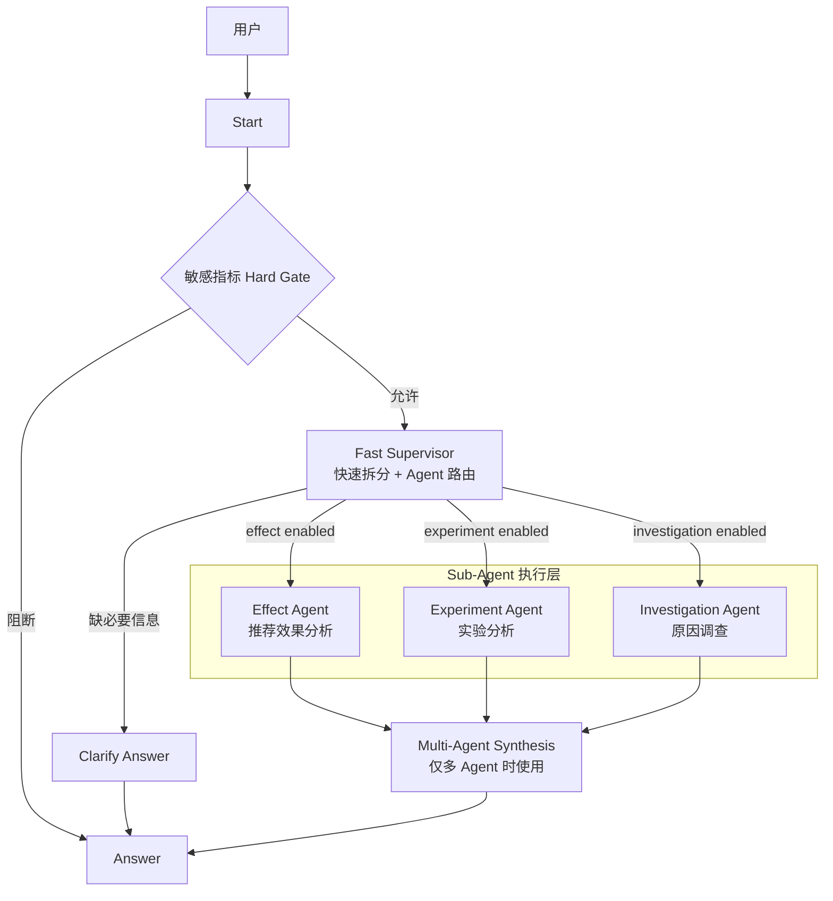
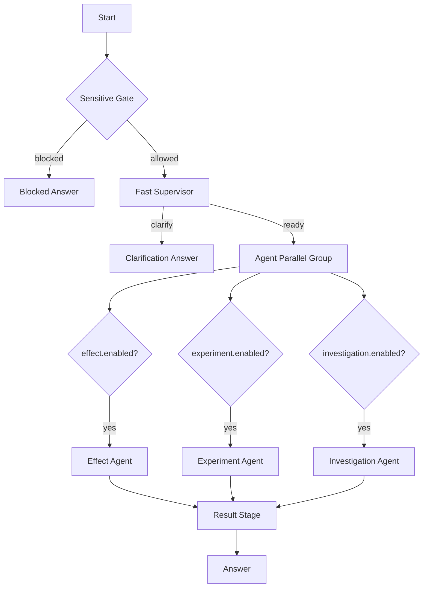

# 推荐效果分析 Agent：Dify 多 Agent 执行架构重构方案

> 本文只设计 **Dify 内部的请求路由、Sub-Agent 分工、并行执行、Prompt 与结果汇总**。推荐效果 Tool 的 ES / DB 查询、指标计算、统计检验、异常检测、贡献拆解、Repository 与大结果存储继续由现有 Tool Contract 负责，不在 Dify 层重复实现。
>
> 本版采用 **Fast Supervisor + 多个专业 Sub-Agent**。Fast 只做快速拆分与路由；Tool 选择、参数生成、Observation 驱动的下一步由 Sub-Agent 自己完成。多个互不依赖的 Sub-Agent 由 Dify Workflow 并行执行。

---

## 1. 最终架构

### 1.1 核心思路

系统分为四层：

```text
Fast Supervisor
├── 识别本轮需要哪些专业 Agent
├── 将用户请求拆成彼此独立的 Agent Objective
├── 判断 single / parallel / clarify
└── 不调用 Tool、不生成 Tool DAG、不处理 Observation

Professional Sub-Agent
├── 理解自己的 Objective
├── 根据 Tool Schema 选择 Tool
├── 生成 Tool 参数
├── 根据 Observation 决定是否继续调用 Tool
└── 生成本 Agent 的结果

Plugin Tool
├── 查询 ES / DB
├── 指标与统计计算
├── 参数与业务规则校验
└── 返回结构化事实

Dify Workflow Runtime
├── 承载 Fast Supervisor
├── 并行启动多个 Sub-Agent
├── 承担节点错误处理与上下文传递
└── 多 Agent 时汇总结果
```

核心边界：

```text
Fast 决定“交给谁”
Agent 决定“调用什么 Tool、下一步做什么”
Tool 决定“数据怎么查、指标怎么算”
Dify 决定“这些 Agent 怎么并行执行”
```

### 1.2 系统总图



实际执行时只有 Fast 选中的 Agent 会运行。Fast 同时选择两个或三个 Agent 时，三个 Agent 节点位于 Dify Parallel Branch 中并行执行。

### 1.3 为什么只在 Agent 之间并行

本版不再让 Fast 规划 Tool DAG。Fast 只判断专业 Agent 的归属，因此路由空间固定为三个专业域，不会随着 Tool 数量增加而膨胀。

```text
Tool 从 10 个增加到 30 个：
Fast 的路由类别仍然只有 3 个 Agent

Effect Agent 内部 Tool 增加：
只修改 Effect Agent 的 Tool 白名单 / Prompt

Experiment Agent 内部 Tool 增加：
只修改 Experiment Agent
```

Fast 不需要知道 Tool 的完整 Schema，也不需要判断 Tool 之间的依赖关系。

### 1.4 并行的前提

只有 **Agent Objective 彼此独立** 时才拆成多个 Agent 并行执行。

| 情况 | Fast 处理 |
| --- | --- |
| 两个目标可以独立完成，结果最后再汇总 | 拆到多个 Agent，并行执行 |
| B 必须读取 A 的 Observation 才能开始 | 不跨 Agent 拆分，整条交给一个 Agent |
| 原因调查需要先确认指标下降是否成立 | 交给 Investigation Agent 自己完成，不先跑 Effect Agent |
| 实验原因调查需要先确认 A/B 差异 | 交给 Investigation Agent，自行调用 A/B Tool |
| 同一专业域出现多个要求 | 合并为该 Agent 的一个 Objective，首版不生成多个同类 Agent 实例 |

因此本版没有跨 Agent `depends_on`、runtime binding 或动态 DAG。

---

## 2. 主 Chatflow

### 2.1 主流程



主 Chatflow 不再包含：

```text
通用 Planner
Reviewer
Compiler
Scheduler
Task DAG
Runtime Binding
Tool 级 Router
Tool 级 Question Classifier
```

### 2.2 Dify 落地

专业 Agent 建议创建为可复用的 **Roster Agent**，主 Workflow 中引用三个 Agent 节点。Dify 当前 Agent v2 的 Workflow Agent Binding 原生区分 `roster_agent` 与 `inline_agent`，因此三个专业 Agent 的 Prompt、Tool 白名单和版本可以独立维护。

主 Workflow 只维护：

```text
Start
→ Gate
→ Fast Supervisor
→ Parallel Branch
   ├─ Effect Agent
   ├─ Experiment Agent
   └─ Investigation Agent
→ Result Stage
→ Answer
```

### 2.3 单 Agent 与多 Agent 输出

为减少额外模型调用：

```text
只命中 1 个 Agent
→ 直接使用该 Agent 最终答案

命中 2～3 个 Agent
→ 各 Agent 并行完成
→ Multi-Agent Synthesis LLM 汇总
→ Answer
```

`Multi-Agent Synthesis` 不调用 Tool、不补新事实，只负责把多个 Agent 的独立结果组织成一份回答。

---

## 3. Fast Supervisor

### 3.1 定位

Fast 是 **一次性快速路由器**，不是 Planner，也不是 ReAct Agent。

它只回答三个问题：

```text
1. 当前请求是否缺少必须由用户补充的信息？
2. 当前请求需要 Effect / Experiment / Investigation 中的哪些 Agent？
3. 每个 Agent 本轮具体负责哪一部分目标？
```

Fast 不回答：

```text
调用哪个 Tool？
Tool 参数是什么？
Tool A 和 Tool B 谁先执行？
上一轮 Tool Observation 说明了什么？
```

这些全部属于 Sub-Agent。

### 3.2 输入

| 输入 | 用途 |
| --- | --- |
| `sys.query` | 当前用户原始请求 |
| `sys.datetime` | 相对时间理解 |
| 当前对话历史 | 只用于明确承接式表达 |
| `agent_catalog` | 三个 Sub-Agent 的职责说明 |
| 少量公共业务规则 | 站点、实验和原因类问题的路由边界 |

Fast **不读取完整 Tool Catalog / Tool Schema**。

### 3.3 Agent Catalog

```text
effect
- 指标查询、周期比较、趋势、异常、排名、普通流量效果分析
- 回答“发生了什么、表现怎么样、差多少、趋势如何”

experiment
- EC10 A/B 实验效果、control/treatment 对比、实验构成与差异
- 回答“实验表现怎么样、两组差多少”

investigation
- 指标下降/上涨原因、异常原因、实验差异原因、业务/流量/配置证据调查
- 回答“为什么、什么导致、原因是什么”
```

### 3.4 Fast 输出协议

Fast 只输出最多三个 Agent Request：

```json
{
  "status": "ready",
  "clarification_question": null,
  "effect": {
    "enabled": true,
    "objective": "分析 EC10 最近7天购物车页 CTR、CTCVR 的当前表现和周期变化"
  },
  "experiment": {
    "enabled": true,
    "objective": "比较 EC10 实验 1001 与 1002 的效果"
  },
  "investigation": {
    "enabled": false,
    "objective": null
  }
}
```

追问时：

```json
{
  "status": "clarify",
  "clarification_question": "你要看 EC10（港台）还是 EC20（大陆）？",
  "effect": {"enabled": false, "objective": null},
  "experiment": {"enabled": false, "objective": null},
  "investigation": {"enabled": false, "objective": null}
}
```

Fast 不生成结构化 Tool arguments。每个 Sub-Agent 同时读取原始 `sys.query` 与自己的 `objective`，避免路由阶段丢失原文信息。

### 3.5 拆分规则

Fast 的拆分目标是 **Agent 级拆分**，不是句子级拆分。

| 规则 | 处理 |
| --- | --- |
| 一个请求只属于一个专业域 | 只启用一个 Agent |
| 同时存在多个独立专业目标 | 启用多个 Agent |
| 同一专业域有多个子要求 | 合并到同一个 Objective |
| 某要求只是原因调查的前置证据 | 不额外启用 Effect / Experiment，由 Investigation 自己完成 |
| 无法判断内容属于哪个 Agent | `clarify`，不猜测 |
| 某片段无法被任何 Objective 解释 | 不强行拆分，优先 `clarify` |

#### 原因类优先收敛

例如：

```text
“EC10 最近 CTR 掉了多少，为什么掉？”
```

不要拆成：

```text
Effect Agent：CTR 掉了多少
Investigation Agent：为什么掉
```

因为 Investigation 必须先验证下降是否成立，两边会重复查询。

正确路由：

```text
Investigation Agent：
确认 CTR 变化幅度，并调查下降原因。
```

只有真正独立的附加交付才并行，例如：

```text
“看一下 EC10 最近整体效果；另外比较实验 1001 和 1002。”
```

拆为：

```text
Effect Agent      ─┐
                   ├─ 并行
Experiment Agent  ─┘
```

### 3.6 Fast Prompt 骨架

```text
<role>
你是推荐分析系统的 Fast Supervisor。
你只负责把当前请求路由到 Effect、Experiment、Investigation 三个专业 Agent。
你不调用 Tool，不规划 Tool 顺序，不生成 Tool 参数，不分析 Observation。
</role>

<inputs>
raw_query = {{ sys.query }}
request_time = {{ sys.datetime }}
conversation_context = {{ conversation context }}
agent_catalog = {{ agent_catalog }}
</inputs>

<rules>
1. 只在多个目标可以彼此独立完成时拆到多个 Agent。
2. 如果一个目标依赖另一个目标的结果，不跨 Agent 拆分，把完整链路交给能够完成它的 Agent。
3. 原因类目标优先交给 Investigation；原因调查所需的指标确认、A/B差异确认属于 Investigation 内部取证，不重复分给其他 Agent。
4. 同一 Agent 的多个要求合并成一个 objective，保留用户要求的范围、顺序和交付内容。
5. 站点等真正影响业务语义且无法确定时输出 clarify；可由 Sub-Agent Tool 查询确定的事实不在 Fast 阶段追问。
6. 不因为出现多个指标、多个页面或多个店铺就自动拆成多个 Agent。
7. 输出必须完整覆盖用户请求；存在无法解释的内容时不要强行路由。
</rules>
```

---

## 4. Sub-Agent 并行执行

### 4.1 并行方式

Fast 输出三个 `enabled` 标志后，主 Workflow 启动三个并行分支：

```text
Fast Supervisor
      │
      ├───────────────┬──────────────────┐
      ↓               ↓                  ↓
 effect branch   experiment branch   investigation branch
      │               │                  │
 enabled?          enabled?             enabled?
      │               │                  │
 Effect Agent    Experiment Agent   Investigation Agent
      │               │                  │
      └───────────────┴──────────────────┘
                      ↓
                  Result Stage
```

未启用的分支直接返回 `skipped`，不执行 Agent。

### 4.2 并行解决什么

并行只优化 **同一用户请求里多个独立专业任务的总耗时**：

```text
串行：Effect 8s + Experiment 10s = 18s
并行：max(8s, 10s) ≈ 10s
```

并行不解决单个 Investigation Agent 内部的 ReAct 多轮时延。单 Agent 内是否连续调用多个 Tool，由该 Agent 自己依据 Observation 决定。

### 4.3 禁止跨 Agent 依赖

首版不支持：

```text
Effect Agent 输出
        ↓
Investigation Agent 输入
```

也不支持：

```text
Experiment Agent 输出
        ↓
Effect Agent 继续执行
```

出现这种语义时，Fast 必须把完整任务交给一个 Agent，避免重新引入 DAG、Binding 和 Scheduler。

---

## 5. Professional Sub-Agent

### 5.1 Effect Agent

#### 职责

回答推荐效果的描述性与比较性问题：

```text
当前表现
周期比较
维度比较
趋势 / 异常 / 变点
多周期排名
推荐请求量 / PV 的普通分析
```

不主动扩展到原因调查。

#### 主要 Tool

| Tool | 用途 |
| --- | --- |
| `rec_query_metrics` | 当前区间指标、分组查询 |
| `rec_compare_periods` | 周期 / 对象比较、贡献拆解 |
| `rec_analyze_metric_timeseries` | 趋势、异常、变点 |
| `rec_analyze_period_rankings` | 多周期排名轨迹 |
| `rec_query_traffic` | 推荐请求量 / PV |
| `rec_analyze_traffic_timeseries` | 流量趋势 / 异常 |
| `rec_resolve_business_context` | merchant 等上下文解析 |
| 大结果读取 Tool | 按需读取外置结果 |

#### 停止条件

用户要求的事实已经得到，或 Tool 明确返回 no_data / unsupported / failed 且继续调用不能改善结果时停止。

### 5.2 Experiment Agent

#### 职责

处理 EC10 实验相关的效果分析：

```text
control / treatment 对比
实验总体差异
页面 / 店铺差异
差异榜与构成榜
实验元数据理解
```

不根据 ab_id 大小或表现猜 control / treatment。

#### 主要 Tool

| Tool | 用途 |
| --- | --- |
| `rec_analyze_ab_test` | A/B 主分析 |
| `rec_list_ab_groups` | 实验组发现，按需 |
| `rec_get_ab_meta` | 实验元数据，按需 |
| `rec_query_metrics` | 明确需要补充实验维度事实时 |
| `rec_analyze_metric_timeseries` | 实验时序证据，能力允许时 |
| `rec_resolve_business_context` | 上下文解析 |
| 大结果读取 Tool | 按需读取 |

EC20 不支持 `ab_id`，Tool / Prompt 双层限制。

### 5.3 Investigation Agent

#### 职责

处理所有原因类问题：

```text
为什么指标上涨 / 下跌
为什么出现异常
为什么实验组比对照组差
是不是某页面 / 店铺 / 配置 / 流量造成
```

Investigation 是真正的动态调查 Agent。其下一步可以依赖上一轮 Observation。

```text
确认现象
   ↓
Observation
   ↓
定位时间 / 结构来源
   ↓
Observation
   ↓
必要时继续配置 / 流量 / 局部诊断
   ↓
证据足够 / 无法继续
```

#### 主要 Tool

| Tool | 用途 |
| --- | --- |
| `rec_compare_periods` | 先确认变化、贡献线索 |
| `rec_analyze_metric_timeseries` | 异常、变点、时间定位 |
| `rec_query_metrics` | 补充维度事实 |
| `rec_analyze_ab_test` | 实验差异确认 |
| `rec_query_traffic` | 推荐流量事实 |
| `rec_analyze_traffic_timeseries` | 流量趋势 / 异常 |
| `rec_query_traffic_store_diagnostics` | 店铺局部诊断证据 |
| `rec_analyze_traffic_store_anomalies` | 店铺流量异常诊断 |
| 配置 / AB 元数据 Tool | 证据指向时使用 |
| `rec_resolve_business_context` | 上下文解析 |
| 大结果读取 Tool | 按需展开证据 |

#### 调查规则

```text
1. 先确认用户描述的变化 / 差异是否成立。
2. 再定位变化发生在何时、哪个页面 / 店铺 / 分组。
3. Contribution 只表示“变化主要来自哪里”，不能直接写成根因。
4. Anomaly / Level Shift 只表示“什么时候发生异常变化”。
5. 配置变化与指标变化时间重合只是原因线索。
6. 技术流量诊断只在用户要求或已有证据指向时进入。
7. 证据不足时明确写“尚不能确认原因”，不强行闭环。
```

---

## 6. Sub-Agent 公共输入与 Prompt

### 6.1 AgentInput

每个 Agent 都接收：

```json
{
  "objective": "Fast 分配给本 Agent 的当前目标",
  "raw_query": "用户本轮完整原文",
  "request_datetime": "当前时间"
}
```

再由 Dify 提供：

```text
Conversation Context / Agent Memory
Tool Schema
Tool Observation
Agent System Prompt
```

Fast 不把 Tool arguments 提前算好；Sub-Agent 直接依据用户原文、objective、Tool Schema 和已确认上下文生成参数。

### 6.2 公共 Prompt 骨架

```text
<role>
你是推荐分析系统中的专业 Sub-Agent。
你只完成 Fast Supervisor 分配给你的 objective。
你可以调用授权 Tool，并根据 Observation 决定下一步；不得扩大到其他 Agent 的独立业务目标。
{{ role_policy }}
</role>

{{ shared_business_background }}

<trusted_inputs>
- objective：当前已批准目标，是本 Agent 的执行边界。
- raw_query：用户完整原文，用于保留参数、角色和表达细节。
- request_datetime：用于解析相对时间。
- conversation context：只用于明确承接，不覆盖当前输入。
- Tool Schema：正式执行契约。
- Tool Observation：已获得的数据事实。
</trusted_inputs>

<tool_usage_rules>
1. 只调用当前 Agent 白名单内 Tool。
2. 参数只能来自用户原文、明确上下文、上游 Observation 或 Tool 公开默认值。
3. 不猜 site、scene、merchant_id、ab_id、control/treatment、策略、召回或比较基准。
4. 同一 Tool + 同一参数已有可用结果时不重复调用。
5. 不扩大时间、页面、店铺、指标或实验范围。
6. Tool 已完成的指标计算、统计检验、贡献拆解不由 LLM 重算。
7. Tool 返回大结果引用时，只在回答确实缺证据时调用读取 Tool。
</tool_usage_rules>

<completion_rules>
- complete：objective 已满足，输出结果。
- continue：仍存在可由授权 Tool 补齐的关键证据。
- blocked：缺少必须由用户补充的事实，或当前能力无法继续。
</completion_rules>
```

### 6.3 公共业务背景

业务背景继续使用现有 canonical 规则，不因多 Agent 拆分而复制多份独立口径。至少统一包含：

- EC10 / EC20 数据域独立，单个分析目标只能使用唯一站点；
- 页面编号具有站点范围，不能跨站点复用；
- CTR = 点击 / 曝光，CVR = 转化 / 点击，CTCVR = 转化 / 曝光；
- 未限定 GMV 表示 `rec_gmv`；
- `store_gmv`、`store_gmv_per_user`、`rec_gmv_ratio` 禁止查询、计算和展示；
- 过滤、分组、比较是不同语义；
- `no_data`、`partial`、`failed`、`unavailable`、`null` 与数值 0 分开解释；
- 推荐效果数据按日 T+1；相对时间默认以昨天为最新完整日期；
- 异常、贡献、时间重合和结构变化不能自动升级成原因。

Tool 具体参数、枚举、TopN 与统计实现继续以 Tool Contract 为准，Prompt 不复制第二份 Schema。

---

## 7. Result Stage

### 7.1 单 Agent

只运行一个 Agent 时直接输出该 Agent 的最终文本：

```text
Fast
→ Effect Agent
→ Answer
```

不增加 Final Answer LLM。

### 7.2 多 Agent

多个 Agent 并行完成后，进入一次轻量 Synthesis：

```text
Effect Result ───────┐
Experiment Result ───┼→ Synthesis LLM → Answer
Investigation Result ┘
```

Synthesis 只负责：

```text
1. 按用户原问题顺序组织多个 Agent 结果。
2. 去掉重复背景描述。
3. 保留每个 Agent 的范围、状态和限制。
4. 不重新计算指标。
5. 不调用 Tool。
6. 不提升证据强度。
```

### 7.3 Sub-Agent 输出协议

为便于多 Agent 汇总，每个 Agent 除最终文本外，建议声明统一结果字段：

```json
{
  "agent_key": "effect",
  "status": "complete",
  "answer": "...",
  "limitations": []
}
```

`status`：

```text
complete
partial
blocked
failed
```

---

## 8. Hard Gate、追问与会话状态

### 8.1 敏感指标 Hard Gate

敏感指标继续放在 Fast 之前：

```text
Start
→ Sensitive Gate
   ├─ blocked → 固定 Answer
   └─ allowed → Fast Supervisor
```

明确命中：

```text
store_gmv
store_gmv_per_user
rec_gmv_ratio
```

整轮阻断，不再进入 Fast / Sub-Agent。Tool 层继续二次校验。

### 8.2 追问归属

Fast 只处理 **路由前即可确认的必要缺口**：

```text
“看购物车最近效果”
→ EC10 / EC20 都存在购物车页
→ Fast clarify site
```

如果缺口需要 Tool 才能确定：

```text
“店铺 12345 最近怎么样”
→ Fast 路由 Effect
→ Effect Agent 调 rec_resolve_business_context
```

如果 Agent 执行过程中才发现必须补充信息，由该 Agent 直接返回 `blocked + clarification`。

### 8.3 会话状态

首版优先使用 Dify Conversation Context / Agent Memory，不恢复旧的：

```text
completed_tasks
runtime_bindings
pending_request_json
previous_tasks_json
Task DAG 状态
```

只有测试证明长对话截断会导致关键 ID / 站点丢失时，再增加最小结构化 `analysis_context_json`。

### 8.4 大结果

大结果继续沿用：

```text
Tool Result
→ 未超限：直接返回
→ 超限：完整保存到 Dify Plugin Storage
        + 返回预览
        + result_ref

Agent 确实需要更多证据
→ 大结果读取 Tool
→ 按范围读取
```

该能力属于 Tool Runtime，不进入 Fast 或 Agent 调度层。

---

## 9. 端到端样例

### 9.1 单 Effect Agent

用户：

```text
看一下 EC10 昨天购物车页 CTR。
```

执行：

```text
Fast
→ effect.enabled = true
→ Effect Agent
   → rec_query_metrics
   ← Observation
→ Answer
```

### 9.2 单 Investigation Agent

用户：

```text
EC10 购物车最近 CTR 为什么下降？
```

Fast 不拆出 Effect：

```text
Fast
→ investigation.enabled = true
→ Investigation Agent
   → rec_compare_periods
   ← 确认下降
   → rec_analyze_metric_timeseries
   ← 发现变点
   → 根据证据决定是否查配置 / 流量
   → 形成原因结论或证据不足结论
→ Answer
```

### 9.3 Effect + Experiment 并行

用户：

```text
看一下 EC10 最近一周整体效果，另外比较实验 1001 和 1002。
```

Fast：

```text
effect.enabled = true
experiment.enabled = true
investigation.enabled = false
```

执行：

```text
              ┌→ Effect Agent ───────┐
Fast ─────────┤                       ├→ Synthesis → Answer
              └→ Experiment Agent ────┘
```

两个 Agent 没有数据依赖，因此并行。

### 9.4 原因任务不跨 Agent 拆分

用户：

```text
实验 1002 比 1001 差多少，为什么会差？
```

不要：

```text
Experiment Agent → 差多少
Investigation Agent → 为什么
```

因为原因调查必须读取 A/B 差异事实，会重复查询并形成跨 Agent 依赖。

正确：

```text
Investigation Agent
→ rec_analyze_ab_test
→ Observation
→ 继续必要调查
→ 同时回答“差多少 + 为什么”
```

### 9.5 多个同域要求

用户：

```text
EC10 看 CTR 趋势、CTCVR 周期变化，再给我店铺 Top10。
```

全部属于 Effect：

```text
Fast
→ 一个 Effect objective
→ Effect Agent 自己决定需要哪些 Tool
```

Fast 不按三个要求生成三个 Task，也不生成 Tool DAG。

---

## 10. 与旧方案的结构变化

### 10.1 旧控制面

```text
Request Understanding
→ Parameter Extractor
→ Router
→ Planner
→ Reviewer
→ Compiler
→ Scheduler
→ Task DAG / Binding Runtime
→ Executor
→ Final Answer
```

### 10.2 新控制面

```text
Start
→ Sensitive Gate
→ Fast Supervisor
→ Professional Sub-Agent(s)
   ├─ Effect
   ├─ Experiment
   └─ Investigation
→ 单 Agent 直接回答 / 多 Agent 汇总
→ Answer
```

### 10.3 旧组件处理

| 旧组件 | 新版处理 |
| --- | --- |
| Request Understanding LLM | Fast 只做 Agent 级理解；专业语义由 Sub-Agent 继续理解 |
| Strict Router | Fast Supervisor 替代，但只路由 3 个 Agent |
| Fast Planner | 删除规划职责，仅保留“Fast 路由”名称 |
| Search Planner | 删除，动态执行交给 Sub-Agent |
| Reviewer | 删除通用 Reviewer；Tool Validator + Agent Prompt 约束 |
| Compiler | 删除 |
| Scheduler | 删除；跨 Agent 并行交给 Dify Workflow Runtime |
| Task DAG | 删除 |
| Runtime Binding | 删除 |
| Final Answer LLM | 单 Agent 删除；仅多 Agent 时使用 Synthesis |
| Pending Runtime | 默认删除，优先 Dify Conversation Context |
| 两个原因调查 Agent | 收敛为一个 Investigation Agent，内部依据 objective 区分指标变化 / 实验差异 |

### 10.4 保留内容

| 保留 | 位置 |
| --- | --- |
| 敏感指标 Gate | 主 Workflow |
| `shared_business_background` | Fast 少量引用；Sub-Agent 完整引用 |
| Tool Contract | Plugin Tool |
| Evidence Rules | Investigation Agent 为主，其他 Agent 共用基础版 |
| Resolver | Agent Tool |
| 大结果外置与按需读取 | Tool Runtime |
| 多轮会话 | Dify Conversation Context / Agent Memory |

---

## 11. Dify 实施顺序

### 第一阶段：建立三个 Roster Agent

```text
Effect Agent
Experiment Agent
Investigation Agent
```

为每个 Agent 配置：

```text
System Prompt
Tool 白名单
最大迭代次数
统一输出字段
```

先单独测试每个 Agent，不接 Fast。

### 第二阶段：Fast Supervisor

Fast 只输出：

```text
status
clarification_question
effect.enabled + objective
experiment.enabled + objective
investigation.enabled + objective
```

测试重点：

- 单 Agent 路由是否稳定；
- 原因类是否被 Investigation 正确吸收；
- 同域多个要求是否不会过度拆分；
- 无法解释的请求是否会保守追问。

### 第三阶段：Agent 并行

在主 Workflow 中配置三个 Parallel Branch。

测试：

```text
Effect + Experiment
Effect + 独立 Investigation
Experiment + 独立其他目标
```

重点观察：

```text
总耗时
重复 Tool 调用
失败分支是否影响其他分支
Synthesis 是否改变证据强度
```

### 第四阶段：会话与异常路径

验证：

```text
缺站点追问
merchant 反查站点
Agent blocked
Tool no_data / partial / failed
长结果 result_ref
多轮承接
```

首版不重新加入 Planner、DAG、Scheduler、Binding Runtime。

---

## 12. 最终结论

最终架构收敛为：

```text
Dify Chatflow
└── Sensitive Gate
    └── Fast Supervisor
        ├── Clarify
        └── Professional Agent Parallel Group
            ├── Effect Agent
            ├── Experiment Agent
            └── Investigation Agent
                ↓
        单 Agent：直接 Answer
        多 Agent：Synthesis → Answer
```

核心原则：

> **Fast 只拆 Agent，不拆 Tool；独立 Agent 并行执行，存在数据依赖的链路留在一个 Agent 内部完成。**
>
> **这样既保留 mentor 的 Supervisor + Specialist Agent 结构，也避免重新维护 Planner、DAG、Scheduler 和 Binding Runtime。**