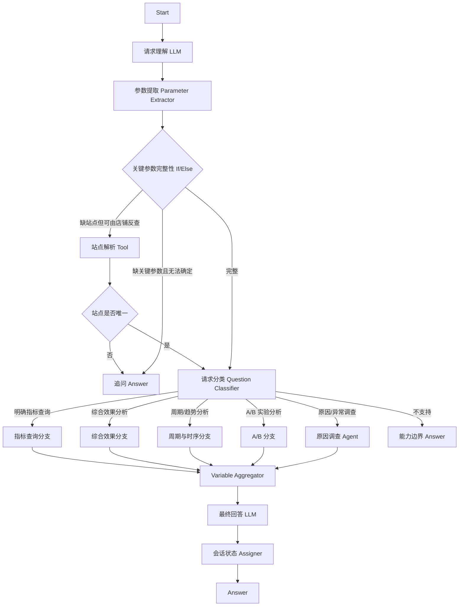

# 推荐效果分析 Agent：Dify 工作流重构方案

## 1. 整体设计

### 1.1 目标

本方案只设计 Dify 内部工作流，不再设计独立 Planner、Compiler、Reviewer、Scheduler、Task Runtime 或额外 Agent 编排框架。

目标是把推荐效果分析能力收敛为一条可直接在 Dify Chatflow / Advanced Chat 中搭建、调试和维护的工作流：

- Dify 负责用户意图理解、参数提取、条件分支、追问、多轮状态、Agent 推理、Tool 调用和最终回答。
- 现有推荐分析 Tool 继续负责 ES / DB 查询、指标计算、统计检验、异常检测、贡献拆解等确定性能力。
- 普通问题走固定工作流短链路；只有“为什么、原因、异常原因、实验为什么有差异”等调查型问题进入 Dify Agent 节点自主取证。
- 不在工作流层复制 Tool 内部规则，不重新实现数据计算逻辑。

### 1.2 设计原则

| 原则 | 规则 |
| --- | --- |
| Dify 原生优先 | Dify 已有 Question Classifier、Parameter Extractor、If/Else、Tool、Agent、Variable Assigner、Variable Aggregator、Conversation Variable、Answer 等节点时，优先直接使用，不用代码重新实现同类能力。 |
| 工作流负责控制，Tool 负责计算 | “调用什么、什么时候调用、是否继续调查”由工作流 / Agent 决定；“数据怎么查、指标怎么算、统计怎么检验”由 Tool 决定。 |
| 普通问题短链路 | 明确的指标查询、周期比较、趋势分析、A/B 对比直接进入对应 Tool，不经过通用 Planner。 |
| 原因问题 Agent 化 | 原因调查不预先拆成固定 Task 图，由 Dify Agent 根据 Observation 决定下一步调用哪个 Tool，直到证据足够或无法继续。 |
| 只追问会改变业务语义的信息 | 可使用公开默认值的参数直接默认；只有站点、A/B 角色、无法唯一确定的比较基准、无法唯一映射的对象等会改变分析对象或口径的信息才追问。 |
| 不替用户改问题 | 原比较基准无数据时，不自动换成另一套基准；原页面无法定位时，不切换到其他页面；没有证据时不把线索写成根因。 |
| 单轮一个主目标 | 一轮请求围绕一个主分析目标执行。同一主目标内部可以包含多个取证动作，例如“实验效果如何并分析异常原因”；互不相关的多个独立目标不在工作流中继续拆成通用 DAG。 |
| 结构化状态最小化 | 只保存本轮继续对话真正需要的结构化状态，不维护自研 completed_tasks、runtime_bindings、Capability Registry 快照等运行时。 |
| 输出统一 | Tool 分支和 Agent 分支最终都收敛为统一 `analysis_result`，由一个 Answer LLM 负责面向用户表达。 |

### 1.3 设计参考

| 参考项目 | GitHub | 参考点 | 本方案对应设计 |
| --- | --- | --- | --- |
| Awesome-Dify-Workflow / `Agent工具调用.yml` | https://github.com/svcvit/Awesome-Dify-Workflow/blob/main/DSL/Agent%E5%B7%A5%E5%85%B7%E8%B0%83%E7%94%A8.yml | Agent 节点直接持有 Tool，由 Function Calling 根据用户问题自主选择 Tool，而不是先实现一层自研 Planner。 | 原因调查使用单独的 Dify Agent 节点，直接挂推荐效果、时序、A/B、流量、配置等调查 Tool。 |
| Awesome-Dify-Workflow / `AgentFlow.yml` | https://github.com/svcvit/Awesome-Dify-Workflow/blob/main/DSL/AgentFlow.yml | 使用 Agent 节点承担多轮信息收集，并通过 conversation id 保存会话状态。 | 缺少关键参数时优先使用 Dify 对话状态和 conversation variables，不建立独立 Pending Runtime。 |
| Open-Deep-Research-workflow-on-Dify | https://github.com/AdamPlatin123/Open-Deep-Research-workflow-on-Dify | 使用 Conversation Variables、If/Else、Parameter Extractor、Assigner、Iteration、Tool、LLM 组合成完整多阶段流程，工作流本身承担编排。 | 本方案按“请求理解 → 完整性检查 → 路由 → 执行 → 汇总回答”组织，不在 Dify 外再做一套控制面。 |
| Awesome-Dify-Workflow / `llm2o1.cn.yml` | https://github.com/svcvit/Awesome-Dify-Workflow/blob/main/DSL/llm2o1.cn.yml | 使用 LLM 生成结构化任务、Parameter Extractor 提取、Iteration 执行、Template/LLM 汇总，说明复杂流程可直接由 Dify 节点表达。 | 需要批量执行时再使用 Dify Iteration；首版普通分析不主动引入自研任务调度。 |
| Datawhale `HelloAgent_difyCase.yml` | https://github.com/datawhalechina/hello-agents/blob/main/code/chapter5/HelloAgent_difyCase.yml | Question Classifier 先做业务路由，不同分支直接连接 Agent、Tool 或 LLM；不同业务不强制统一经过一个 Planner。 | 本方案使用 Question Classifier 将普通查询、综合效果、周期/时序、A/B、原因调查直接分流。 |
| `financial-company-comparison-agent` | https://github.com/liyixuan12/financial-company-comparison-agent | Dify Workflow 串联输入识别、API/Tool、数据整理和 LLM 报告生成，前后节点职责清晰。 | 推荐分析也按节点协议组织：上游只准备语义和参数，Tool 输出事实，最终 LLM 只负责解释。 |

### 1.4 Dify 工作流总览

应用类型采用 **Advanced Chat / Chatflow**，原因是需要多轮追问、会话上下文和 conversation variables。



### 1.5 工作流边界

工作流只描述以下内容：

1. 用户请求如何进入 Dify。
2. Dify 如何理解用户目标和已提供参数。
3. 哪些情况需要追问。
4. 不同问题进入哪条业务分支。
5. 哪些分支直接调用 Tool，哪些分支进入 Agent。
6. Tool / Agent 结果如何统一汇总和回答。
7. 多轮对话需要保存哪些最小状态。

以下内容不在本方案重复设计：

- Elasticsearch DSL。
- 指标公式、窗口聚合、TopN 算法。
- two-proportion z-test、Welch、MAD、BH-FDR 等统计实现。
- Contribution Decomposer 内部实现。
- Tool 内部字段合法性和 Repository 实现。
- Tool 大结果外置存储实现。

这些继续由已有 Tool 契约保证。

### 1.6 工作流公共状态

只保留 3 个 conversation variables：

| 变量 | 类型 | 用途 | 更新时机 |
| --- | --- | --- | --- |
| `pending_request_json` | object/string JSON | 保存因关键参数缺失而未执行的当前请求，用户下一轮补充后继续。 | 进入追问分支时写入；请求恢复并执行后清空。 |
| `analysis_context_json` | object/string JSON | 保存当前已确认的站点、页面、店铺、实验组等短期分析上下文，用于“那 EC20 呢”“这个实验呢”等省略表达。 | 成功理解本轮请求后更新。 |
| `last_result_summary` | string | 保存上一轮最终结果的短摘要，只供用户追问“为什么”“再看店铺”时理解指代。 | 最终回答后更新。 |

不保留：

- `completed_tasks`
- `previous_tasks_json`
- `runtime_bindings`
- `selected_contracts_json`
- 自研会话摘要滚动队列

Dify 原生对话历史负责自然语言上下文；conversation variables 只保存必须稳定复用的结构化状态。

### 1.7 公共提示词

#### 1.7.1 请求理解 Prompt

```text
<role>
你是推荐效果分析助手的请求理解节点。你的任务不是回答问题，而是把当前用户请求整理成一个可执行的分析目标，并提取已明确的信息。
</role>

<input>
当前用户输入：{{sys.query}}
待补充请求：{{pending_request_json}}
当前分析上下文：{{analysis_context_json}}
上一轮结果摘要：{{last_result_summary}}
当前时间：{{sys.datetime}}
</input>

<rules>
1. 以当前用户输入为最高优先级；只有当前输入明显是在补充或承接上一轮时，才合并待补充请求或分析上下文。
2. 不从历史中补造当前用户没有确认的实验角色、比较基准、站点或数据范围。
3. “效果怎么样/表现如何”视为综合效果分析目标，不等同于单指标查询。
4. “为什么/原因/异常原因/由什么导致”视为调查型目标。
5. “相比之前/之前一段时间”若无法唯一确定基准期，标记为需要澄清，不自行选择。
6. 页面名称、指标名、日期、店铺、ab_id 只提取用户已经明确表达或可由当前上下文唯一承接的内容。
7. 不调用 Tool，不生成最终答案。
</rules>

<output>
仅输出结构化 JSON，供下游 Parameter Extractor 使用。
</output>
```

#### 1.7.2 最终回答 Prompt

```text
<role>
你是推荐效果分析结果解释节点。你只依据 analysis_result 中的事实回答用户，不重新查询数据，不补造未返回的数据。
</role>

<rules>
1. 先直接回答用户最关心的结论，再给关键证据。
2. 有比较时说明当前值、基准值和变化方向；统计显著性只在结果明确给出时陈述。
3. 原因调查中区分“已确认原因、强相关线索、未发现证据”。贡献最大不自动等于根因。
4. no_data、partial、failed、unavailable 必须如实表达，不把缺数据解释成 0。
5. 不改变比较基准，不跨站点合并，不把未查询范围描述为全量结论。
6. 用户未要求时不展开 Tool 名、内部字段、统计实现和执行过程。
</rules>
```

---

## 2. 阶段一：请求接入与语义理解

### 2.1 Start 节点

**节点类型：** Start

#### 输入协议

| 字段 | 来源 | 必填 | 说明 |
| --- | --- | --- | --- |
| `sys.query` | Dify | 是 | 当前用户输入。 |
| `sys.conversation_id` | Dify | 是 | 会话标识。 |
| `sys.datetime` | Dify | 是 | 当前请求时间，用于解析“上周、昨天、Q2”等相对时间。 |
| `pending_request_json` | Conversation Variable | 否 | 上一轮待补充请求。 |
| `analysis_context_json` | Conversation Variable | 否 | 当前会话中最近一次确认的分析上下文。 |
| `last_result_summary` | Conversation Variable | 否 | 上一轮分析摘要。 |

#### 处理

Start 不做业务判断，只把 Dify 系统输入和 conversation variables 传给请求理解节点。

#### 规则

| 规则 | 处理 |
| --- | --- |
| 当前用户输入为空 | 直接进入通用提示 Answer。 |
| 存在 `pending_request_json` | 不直接恢复执行，仍交给请求理解 LLM 判断本轮是否是在补充该请求。 |
| 存在历史上下文但本轮是新问题 | 新问题优先，不强行继承上一轮参数。 |

#### 输出协议

```json
{
  "query": "用户当前输入",
  "request_time": "Dify 当前时间",
  "pending_request_json": {},
  "analysis_context_json": {},
  "last_result_summary": ""
}
```

#### 样例

用户：

```text
那 EC20 呢？
```

Start 仅把该输入和上一轮 `analysis_context_json` 一起传给下一节点，不在 Start 中判断“EC20”要继承什么。

### 2.2 请求理解 LLM 节点

**节点类型：** LLM

#### 输入协议

```json
{
  "query": "string",
  "request_time": "string",
  "pending_request_json": "object|null",
  "analysis_context_json": "object|null",
  "last_result_summary": "string|null"
}
```

#### 处理

将自然语言请求整理成一个主分析目标，并识别用户明确表达的条件、当前轮对历史上下文的承接关系、可能缺失的关键事实。

#### 规则

| 场景 | 处理 |
| --- | --- |
| “Q2 购物车页 CTR 是多少” | 目标识别为明确指标查询。 |
| “Q2 购物车页推荐效果怎么样” | 目标识别为综合效果分析。 |
| “为什么 GMV 跌了” | 目标识别为原因调查。 |
| “实验效果如何”且给出 control/treatment | 目标识别为 A/B 实验分析。 |
| “相比之前”但没有唯一基准 | 标记缺少 `comparison_reference`。 |
| 本轮只说“EC20”且存在待补充站点请求 | 合并到 `pending_request_json`。 |
| 本轮说“另外看一下昨天流量” | 视为新主目标，不把上一轮效果指标强行带入。 |

#### 输出协议

```json
{
  "objective": "分析目标自然语言描述",
  "intent_hint": "metric_query|effect_overview|period_analysis|ab_analysis|investigation|unsupported",
  "site": "EC10|EC20|null",
  "time_range": {
    "start_day": null,
    "end_day": null
  },
  "comparison_range": {
    "start_day": null,
    "end_day": null
  },
  "metrics": [],
  "scenes_text": [],
  "merchant_ids": [],
  "ab_ids": [],
  "control_ab_id": null,
  "treatment_ab_ids": [],
  "explicit_facts": [],
  "missing_semantic_fields": [],
  "inherits_pending_request": false
}
```

#### 样例

输入：

```text
Q2 的购物车页推荐效果怎么样？
```

输出：

```json
{
  "objective": "分析 Q2 购物车页推荐整体效果",
  "intent_hint": "effect_overview",
  "site": null,
  "time_range": {"start_day": 20260401, "end_day": 20260630},
  "comparison_range": {"start_day": null, "end_day": null},
  "metrics": [],
  "scenes_text": ["购物车页"],
  "merchant_ids": [],
  "ab_ids": [],
  "control_ab_id": null,
  "treatment_ab_ids": [],
  "explicit_facts": ["Q2", "购物车页"],
  "missing_semantic_fields": ["site"],
  "inherits_pending_request": false
}
```

### 2.3 Parameter Extractor 节点

**节点类型：** Parameter Extractor

#### 输入协议

请求理解 LLM 的文本结果。

#### 处理

将 LLM 输出稳定提取为 Dify 下游可引用字段。该节点只负责结构化，不再判断业务语义。

#### 规则

| 规则 | 处理 |
| --- | --- |
| 字段未出现 | 输出 null / 空数组。 |
| JSON 文本有额外解释 | 只提取定义字段。 |
| 日期格式非法 | 对应字段置空，后续完整性节点处理。 |
| 未定义字段 | 丢弃，不传给下游。 |

#### 输出协议

与 2.2 的输出字段一致，作为正式 `request_state`。

#### 样例

```json
{
  "intent_hint": "period_analysis",
  "site": "EC20",
  "metrics": ["rec_ctr"],
  "time_range": {"start_day": 20260901, "end_day": 20260907},
  "comparison_range": {"start_day": 20260825, "end_day": 20260831}
}
```

### 2.4 页面映射 Tool 节点

**节点类型：** Tool

只在请求包含页面名称但未得到标准 `scene` 时调用现有页面映射能力。

#### 输入协议

```json
{
  "site": "EC10|EC20",
  "page_names": ["购物车页"]
}
```

#### 处理

把自然语言页面名称转换为当前站点下的标准 scene。页面映射具有站点范围，不跨站点复用。

#### 规则

| 情况 | 处理 |
| --- | --- |
| 唯一匹配 | 返回标准 scene。 |
| 多个候选 | 标记 `ambiguous`，进入追问。 |
| 无匹配 | 标记 `not_found`，进入追问。 |
| site 未确定 | 不调用页面映射 Tool。 |

#### 输出协议

```json
{
  "status": "resolved|ambiguous|not_found",
  "scenes": [],
  "candidates": []
}
```

#### 样例

```json
{
  "status": "resolved",
  "scenes": [2],
  "candidates": []
}
```

---

## 3. 阶段二：关键参数完整性与业务路由

### 3.1 关键参数 If/Else 节点

**节点类型：** If/Else

#### 输入协议

`request_state` + 页面映射结果。

#### 处理

只判断“现在能否保持原语义继续执行”，不做通用参数校验框架。

#### 规则

| 检查项 | 继续执行条件 | 否则处理 |
| --- | --- | --- |
| 站点 | 已唯一确定 EC10 或 EC20 | 若只有 merchant_id，可进入站点反查；否则追问。 |
| 页面 | 已唯一映射或用户未限定页面 | 多候选 / 无匹配时追问。 |
| 周期比较 | 当前期和基准期均唯一 | “相比之前”无法唯一解释时追问。 |
| A/B 对比 | control 与 treatment 角色明确 | 角色缺失时追问，不按流量大小或名称猜测。 |
| 原因调查 | 调查对象和时间范围足够定位 | 无法确认调查对象时追问。 |
| 可选参数 | Tool 有公开默认值 | 不追问，交给 Tool 默认。 |

#### 输出协议

```json
{
  "next": "continue|resolve_site|clarify",
  "missing_fields": [],
  "clarification_question": ""
}
```

#### 样例

输入：

```text
Q2 的购物车页推荐效果怎么样？
```

若站点无法确定：

```json
{
  "next": "clarify",
  "missing_fields": ["site"],
  "clarification_question": "你要看 EC10 还是 EC20 的 Q2 购物车页？"
}
```

### 3.2 站点反查 Tool 节点

**节点类型：** Tool

仅当用户明确给出 merchant_id，但没有唯一 site 时进入。

#### 输入协议

```json
{
  "merchant_ids": ["merchant_123"]
}
```

#### 处理

调用现有站点解析能力，只用于确认店铺属于哪个站点。

#### 规则

| 返回 | 处理 |
| --- | --- |
| 唯一站点 | 写回 `request_state.site`，继续路由。 |
| 多站点 | 追问用户。 |
| 未匹配 | 追问用户，不默认站点。 |

#### 输出协议

```json
{
  "status": "unique|multiple|not_found",
  "site": "EC10|EC20|null",
  "sites": []
}
```

#### 样例

```json
{
  "status": "unique",
  "site": "EC20",
  "sites": ["EC20"]
}
```

### 3.3 追问 Answer + Assigner 节点

**节点类型：** Variable Assigner + Answer

#### 输入协议

```json
{
  "request_state": {},
  "missing_fields": [],
  "clarification_question": "string"
}
```

#### 处理

先把当前 `request_state` 写入 `pending_request_json`，再直接向用户提出一个最小必要问题。本轮到此结束。

#### 规则

| 规则 | 处理 |
| --- | --- |
| 同时缺多个普通可选参数 | 不追问，使用默认。 |
| 同时缺站点和 A/B 角色 | 一次问题中把两个必要信息一起问清。 |
| 用户下一轮补充 | 由 2.2 请求理解节点合并 pending 请求。 |
| 已进入正式执行 | 清空 `pending_request_json`。 |

#### 输出协议

用户可直接阅读的追问文本。

#### 样例

```text
这个实验需要先确认 A/B 角色：哪个 ab_id 是对照组，哪个是实验组？
```

### 3.4 Question Classifier 节点

**节点类型：** Question Classifier

#### 输入协议

使用 `objective`、`intent_hint` 和标准化参数，不直接重新读取全部历史对话。

#### 处理

将已具备执行条件的请求分到 5 条主业务分支。

#### 分类规则

| 类别 | 典型问题 | 路由 |
| --- | --- | --- |
| `metric_query` | “CTR 是多少”“曝光 Top10 店铺” | 指标查询分支 |
| `effect_overview` | “推荐效果怎么样”“Q2 成效如何” | 综合效果分支 |
| `period_analysis` | “比上周怎么样”“有没有变化”“趋势如何” | 周期与时序分支 |
| `ab_analysis` | “实验效果如何”“实验组比对照组怎么样” | A/B 分支 |
| `investigation` | “为什么下降”“异常原因”“实验差异由什么导致” | 原因调查 Agent |

#### 补充规则

| 场景 | 分类 |
| --- | --- |
| “CTCVR 是否异常？”只问是否异常 | `period_analysis`，直接走时序分析 Tool。 |
| “CTCVR 为什么异常？” | `investigation`。 |
| “实验效果如何，并看看为什么下降” | `investigation`，Agent 首先验证 A/B 差异，再继续原因调查。 |
| 无法落入业务能力 | `unsupported`。 |

#### 输出协议

Dify Question Classifier 分支 ID，不额外构造 Task JSON。

#### 样例

```text
20260605～20260611 引导 GMV 大幅上涨，原因是什么？
→ investigation
```

---

## 4. 阶段三：确定性分析分支

### 4.1 指标查询 Tool 节点

**节点类型：** Tool

#### 输入协议

传入 `rec_query_metrics` 已定义的必要参数；未显式指定且 Tool 有公开默认值的字段不由工作流补造。

```json
{
  "site": "EC20",
  "start_day": 20260901,
  "end_day": 20260907,
  "metrics": ["rec_ctr"],
  "group_type": "overall",
  "scenes": [2],
  "merchant_ids": []
}
```

#### 处理

调用现有指标查询 Tool。工作流不重算指标、不二次排序、不修正 Tool 返回值。

#### 规则

| 用户意图 | Tool 参数规则 |
| --- | --- |
| 明确问一个指标 | 只查询该指标及 Tool 契约要求的必要基础指标。 |
| 未指定分组 | 使用 Tool 的 overall 默认。 |
| 明确要求按店铺/策略等分组 | 使用对应 group_type。 |
| 请求 TopN | 由 Tool 按正式协议执行 TopN。 |
| 敏感或禁止指标 | 由 Tool / 已有安全约束返回错误，工作流不绕过。 |

#### 输出协议

工作流统一包装为：

```json
{
  "branch": "metric_query",
  "status": "available|no_data|partial|failed|unavailable",
  "objective": "...",
  "evidence": {},
  "warnings": []
}
```

#### 样例

用户：

```text
EC20 上周购物车页 CTR 是多少？
```

分支结果：

```json
{
  "branch": "metric_query",
  "status": "available",
  "objective": "查询 EC20 上周购物车页 CTR",
  "evidence": {
    "metric": "rec_ctr",
    "value": 0.083
  },
  "warnings": []
}
```

### 4.2 综合效果分支

**节点组成：** Tool → Tool（按需要）→ Variable Aggregator

综合效果不是一次“所有 Tool 全跑”，而是固定采用最小默认分析：**当前周期整体效果 + 一个明确可用的相邻基准比较**。若用户已指定分析重点，则只围绕该重点执行。

#### 输入协议

```json
{
  "site": "EC10|EC20",
  "time_range": {},
  "scenes": [],
  "merchant_ids": [],
  "ab_ids": [],
  "objective": "综合效果分析"
}
```

#### 处理

1. 调 `rec_query_metrics` 获取当前周期核心效果。
2. 当比较基准可由产品规则唯一确定时，调 `rec_compare_periods` 获取相对变化。
3. 不默认进入异常检测和原因调查；用户问“为什么”才进入 Investigation Agent。

#### 规则

| 规则 | 处理 |
| --- | --- |
| 用户只问“效果怎么样” | 使用站点允许的默认核心指标集合。 |
| 用户指定 CTR/GMV 等重点 | 以指定指标为主，不强制展开所有指标。 |
| 默认比较基准有正式产品定义 | 可直接使用。 |
| 基准无法唯一确定 | 只给当前周期效果，不私自换基准；必要时在回答中说明未做比较。 |
| 当前期无数据 | 不继续做无意义的比较。 |

#### 输出协议

```json
{
  "branch": "effect_overview",
  "status": "available|no_data|partial|failed",
  "current": {},
  "comparison": {},
  "warnings": []
}
```

#### 样例

```text
Q2 的购物车页推荐效果怎么样？
```

输出包含 Q2 当前核心指标以及有明确规则时的相邻周期对比，不自动扩展到“为什么”。

### 4.3 周期与时序分支

**节点类型：** If/Else → `rec_compare_periods` / `rec_analyze_metric_timeseries`

#### 输入协议

```json
{
  "analysis_mode": "comparison|trend|anomaly",
  "site": "EC20",
  "metric": "rec_ctr",
  "current_range": {},
  "comparison_range": {},
  "scenes": [],
  "merchant_ids": []
}
```

#### 处理

根据用户真正的问题选择一个主 Tool：

- 两段时间“差多少” → `rec_compare_periods`
- “趋势如何” → `rec_analyze_metric_timeseries` 的 trend
- “是否异常” → `rec_analyze_metric_timeseries` 的 anomaly / level_shift

不为了“看起来更完整”同时把三个 Tool 都跑一遍。

#### 规则

| 用户表达 | 调用 |
| --- | --- |
| “相比上周增长多少” | compare |
| “最近 14 天走势怎么样” | trend |
| “这周是否存在异常” | anomaly |
| “异常原因是什么” | 不在本分支处理，路由到 Investigation Agent |

#### 输出协议

```json
{
  "branch": "period_analysis",
  "status": "available|no_data|partial|failed",
  "analysis_mode": "comparison|trend|anomaly",
  "evidence": {},
  "warnings": []
}
```

#### 样例

```text
EC20 上周详情页曝光量是否有变化？
```

若问题语义是与前一周比较，则执行 `rec_compare_periods`；若用户表达为“每天走势”，则走 trend。

### 4.4 A/B 实验分支

**节点类型：** Tool

#### 输入协议

```json
{
  "site": "EC10",
  "control_ab_id": "control_x",
  "treatment_ab_ids": ["test_y"],
  "start_day": 20260327,
  "end_day": 20260402,
  "scene": 2
}
```

#### 处理

调用 `rec_analyze_ab_test` 获取实验组与对照组差异、显著性和已有贡献信息。

#### 规则

| 规则 | 处理 |
| --- | --- |
| site=EC20 | 直接返回不支持 A/B，不尝试伪造 ab_id。 |
| control/treatment 不明确 | 在阶段二追问，不在本节点猜测。 |
| 用户问“实验效果如何” | 只完成实验对比。 |
| 用户问“为什么实验组下降” | 应由分类器路由到 Investigation Agent。 |
| 单侧无数据 | 按 Tool 的 warning 输出，不解释成 0。 |

#### 输出协议

```json
{
  "branch": "ab_analysis",
  "status": "available|no_data|partial|failed|unavailable",
  "evidence": {},
  "warnings": []
}
```

#### 样例

```text
对照组 ab_id=xxx，实验组 ab_id=yyy，20260327～20260402 实验效果如何？
```

直接调用 A/B Tool，结果进入统一回答节点。

---

## 5. 阶段四：原因调查 Agent

### 5.1 Agent 节点定位

**节点类型：** Agent（优先 Function Calling；模型能力与工具调用稳定时可使用 ReAct）

原因调查是唯一允许根据 Observation 动态决定后续动作的核心节点。它替代原方案中的：

- Planning Agent
- Plan Reviewer
- Compiler
- Scheduler
- 原因任务 DAG
- 单独的 Binding Runtime

Agent 只接收当前已经通过阶段一、二确认的业务目标和范围上界，不重新扩大范围。

### 5.2 输入协议

```json
{
  "objective": "解释 20260605～20260611 EC20 购物车页 rec_gmv 大幅上涨的原因",
  "known_parameters": {
    "site": "EC20",
    "start_day": 20260605,
    "end_day": 20260611,
    "metrics": ["rec_gmv"],
    "scenes": [2],
    "merchant_ids": [],
    "control_ab_id": null,
    "treatment_ab_ids": []
  },
  "last_result_summary": ""
}
```

### 5.3 Agent 可用 Tool

Agent 只挂与原因调查相关的现有 Tool，不暴露全部系统能力。

| Tool | Agent 使用目的 |
| --- | --- |
| `rec_compare_periods` | 先确认变化是否真实存在，并取得变化幅度、贡献拆解。 |
| `rec_analyze_metric_timeseries` | 确认变化发生时间、异常点、变点和趋势。 |
| `rec_query_metrics` | 针对已发现的页面、店铺或维度进一步核对数据。 |
| `rec_analyze_ab_test` | 实验类问题先验证 control/treatment 的真实差异。 |
| `rec_analyze_traffic_timeseries` | 当证据指向流量变化或用户明确要求技术/流量排查时核对流量。 |
| `rec_query_traffic_store_diagnostics` / `rec_analyze_traffic_store_anomalies` | 已定位具体店铺且需要技术诊断时使用。 |
| 参数/配置查询 Tool | 当前项目接入后，用于核对实验参数、策略、发布记录。 |
| 大结果读取 Tool | 上游 Tool 返回外置结果引用且需要更多内容时按需读取。 |

### 5.4 Agent 调查规则

| 阶段 | 规则 |
| --- | --- |
| 变化验证 | 原因问题首先确认变化/实验差异是否真实成立；若不成立，直接说明，不继续构造原因。 |
| 来源定位 | 优先使用 compare / contribution / 时序定位“什么时候变化、主要来自哪里”。 |
| 深入核对 | 只有已有证据指向某页面、店铺、流量、配置时才继续查对应 Tool。 |
| 技术诊断 | 默认不从业务指标变化直接跳到错误、慢请求、空结果诊断；用户明确要求或证据指向技术问题时再查。 |
| 替代解释 | 有多个可能解释时分别核对；没有证据的不写成已确认原因。 |
| 范围约束 | 不突破 `known_parameters` 的 site、时间、页面、实验范围上界。 |
| Tool 重复 | 相同参数已经得到 available 结果时，不重复调用同一 Tool。 |
| 无数据 | Tool 返回 no_data 后，可在不改变原问题的前提下查其他证据；不能私自换时间范围或比较基准。 |
| 结束条件 | 已找到足够证据回答；或剩余可用 Tool 无法继续提供证据；或关键事实缺失只能由用户补充。 |

### 5.5 Agent Prompt

```text
<role>
你是推荐效果原因调查 Agent。你只处理当前已经确认的调查目标，使用已授权 Tool 逐步补齐证据。你可以根据每次 Observation 决定下一步，但不能扩大站点、时间、页面、店铺、实验或业务目标范围。
</role>

<input>
objective: {{objective}}
known_parameters: {{known_parameters}}
last_result_summary: {{last_result_summary}}
</input>

<investigation_rules>
1. 先验证变化或实验差异是否成立，再解释原因。
2. 优先回答“什么时候发生、主要来自哪里”，再调查“为什么”。
3. Contribution 是定位线索，不自动等于根因；需要其他证据核对。
4. 只有用户明确要求，或已有证据指向技术问题时，才进入流量错误、慢请求、空结果等技术诊断。
5. 不替换用户指定的比较基准、时间范围或实验角色。
6. 相同 Tool + 相同参数已有有效结果时，不重复调用。
7. no_data 不是 0；partial 只支持局部结论；failed/unavailable 不得编造补齐。
</investigation_rules>

<completion>
- complete：证据足以回答当前问题。
- blocked：关键事实只能由用户补充，或当前 Tool 能力无法继续。
</completion>

<answer_rules>
最终只输出面向下游汇总节点的调查结果：结论、关键证据、证据强度、未确认项和必要 warning。不要输出内部思考过程。
</answer_rules>
```

### 5.6 Agent 输出协议

```json
{
  "branch": "investigation",
  "status": "complete|blocked",
  "conclusion": "string",
  "evidence": [
    {
      "finding": "string",
      "support": "string",
      "strength": "confirmed|supporting|weak"
    }
  ],
  "unconfirmed": [],
  "warnings": []
}
```

### 5.7 样例一：指标变化原因

用户：

```text
20260605～20260611 期间 EC20 购物车页引导 GMV 大幅上涨，原因是什么？
```

Agent 典型调用链：

```text
rec_compare_periods
→ 确认 GMV 确实上涨，并发现主要贡献来自少数店铺
→ rec_analyze_metric_timeseries
→ 确认上涨集中发生在 6 月 8 日后
→ rec_query_metrics（只看已定位店铺）
→ 核对曝光、点击、转化和 GMV 是否同步变化
→ 若证据指向流量，再查 traffic；否则结束
```

这里没有预先生成 Task1/Task2/Task3，也没有 Compiler/Scheduler；调用顺序由 Agent 根据 Observation 决定。

### 5.8 样例二：A/B 异常原因

用户：

```text
对照组 ab_id=xxx，实验组 ab_id=yyy，20260327～20260402 期间实验组 CTCVR 异常，为什么？
```

Agent 典型调用链：

```text
rec_analyze_ab_test
→ 确认实验组与对照组差异
→ rec_analyze_metric_timeseries
→ 找到异常/变点日期
→ rec_query_metrics 或贡献结果
→ 定位主要页面/店铺
→ 参数/配置查询 Tool（若当前已接入）
→ 给出已确认原因或仍缺失的证据
```

---

## 6. 阶段五：结果收敛与最终回答

### 6.1 Variable Aggregator 节点

**节点类型：** Variable Aggregator

#### 输入协议

接收五条执行分支中任一条的结果：

- `metric_query_result`
- `effect_overview_result`
- `period_analysis_result`
- `ab_analysis_result`
- `investigation_result`

#### 处理

聚合为统一变量 `analysis_result`。该节点不修改业务值、不重新解释结论。

#### 规则

| 规则 | 处理 |
| --- | --- |
| 只有一个分支会命中 | 直接聚合该分支结果。 |
| 分支结果为空 | 进入通用失败回答。 |
| Tool 返回 warning | 原样保留给最终回答 LLM。 |

#### 输出协议

```json
{
  "analysis_result": {}
}
```

#### 样例

A/B 分支结束后：

```json
{
  "analysis_result": {
    "branch": "ab_analysis",
    "status": "available",
    "evidence": {},
    "warnings": []
  }
}
```

### 6.2 最终回答 LLM 节点

**节点类型：** LLM

#### 输入协议

```json
{
  "original_query": "string",
  "objective": "string",
  "analysis_result": {},
  "analysis_context_json": {}
}
```

#### 处理

把结构化事实转换为自然语言回答。所有分支共用一个 Answer LLM，避免每条分支维护不同口径的话术。

#### 规则

| 结果状态 | 回答规则 |
| --- | --- |
| `available` | 直接给结论 + 关键数值/差异。 |
| `partial` | 明确说明结论只覆盖已有数据范围。 |
| `no_data` | 说明当前条件下没有数据，不写成指标为 0。 |
| `failed` | 说明本次查询/分析失败，不编造结果。 |
| `unavailable` | 说明该站点/场景不支持对应能力。 |
| investigation `complete` | 区分已确认原因、支持性线索和未确认项。 |
| investigation `blocked` | 给已有证据和真正缺失的下一项信息，不虚构闭环。 |

#### 输出协议

```json
{
  "answer_text": "string",
  "result_summary": "用于下一轮指代解析的短摘要"
}
```

#### 样例

```text
Q2 购物车页 CTR 比前一周期上升 8.4%，曝光基本稳定，提升主要来自点击增长。当前结果支持“点击效率提升”，但没有进入原因调查，因此不进一步判断是哪项策略或配置造成的。
```

### 6.3 会话状态 Assigner 节点

**节点类型：** Variable Assigner

#### 输入协议

请求标准参数 + `result_summary`。

#### 处理

更新最小会话状态：

- 清空 `pending_request_json`
- 更新 `analysis_context_json`
- 更新 `last_result_summary`

#### 规则

| 规则 | 处理 |
| --- | --- |
| 本轮成功执行 | 更新分析上下文和结果摘要。 |
| 本轮 no_data | 可保留用户已确认的站点/页面等上下文，但摘要说明无数据。 |
| 本轮 failed | 不把失败结果写成成功事实。 |
| 用户明确切换站点/对象 | 新值覆盖旧上下文。 |

#### 输出协议

Conversation Variables，无额外用户可见输出。

#### 样例

```json
{
  "analysis_context_json": {
    "site": "EC20",
    "scenes": [2],
    "time_range": {"start_day": 20260401, "end_day": 20260630}
  },
  "last_result_summary": "Q2 EC20 购物车页整体效果已分析，CTR 较基准期上升。"
}
```

### 6.4 Answer 节点

**节点类型：** Answer

#### 输入协议

`answer_text`

#### 处理

直接返回最终用户答案。

#### 输出协议

自然语言文本；需要图表时引用 Tool 已返回并由现有前端支持的图表结果，不在 Answer 节点重新计算图表数据。

---

## 7. 端到端流程样例

### 7.1 明确指标查询

```text
用户：EC20 上周购物车页 CTR 是多少？

Start
→ 请求理解
→ 参数提取
→ 页面映射
→ 完整性检查通过
→ Question Classifier = metric_query
→ rec_query_metrics
→ Variable Aggregator
→ 最终回答 LLM
→ Assigner
→ Answer
```

### 7.2 综合效果分析

```text
用户：EC20 Q2 购物车页推荐效果怎么样？

Start
→ 请求理解
→ 参数提取
→ 页面映射
→ Question Classifier = effect_overview
→ rec_query_metrics
→ 有唯一默认基准时 rec_compare_periods
→ 聚合
→ 最终回答
```

### 7.3 缺站点追问并续跑

第一轮：

```text
用户：Q2 购物车页推荐效果怎么样？
→ 缺 site
→ pending_request_json 保存当前请求
→ Answer：你要看 EC10 还是 EC20？
```

第二轮：

```text
用户：EC20
→ 请求理解识别为补充 pending 请求
→ 合并得到完整 request_state
→ 清空 pending
→ 继续 effect_overview 分支
```

### 7.4 原因调查

```text
用户：EC20 6 月 5 日到 6 月 11 日购物车页 GMV 为什么上涨？

Start
→ 请求理解
→ 参数提取
→ 完整性检查
→ Question Classifier = investigation
→ 原因调查 Agent
   → compare
   → timeseries
   → 按 Observation 决定是否继续查询店铺/流量/配置
→ Variable Aggregator
→ 最终回答 LLM
→ Answer
```

### 7.5 A/B 实验效果

```text
用户：EC10 对照组 xxx、实验组 yyy，3 月 27 日到 4 月 2 日效果如何？

Start
→ 请求理解
→ 参数提取
→ A/B 角色完整
→ Question Classifier = ab_analysis
→ rec_analyze_ab_test
→ 最终回答
```

### 7.6 A/B 异常原因

```text
用户：EC10 对照组 xxx、实验组 yyy，3 月 27 日到 4 月 2 日实验组 CTCVR 为什么异常？

Start
→ 请求理解
→ 参数提取
→ Question Classifier = investigation
→ 原因调查 Agent
   → A/B 差异验证
   → 时序异常/变点
   → 贡献定位
   → 按证据继续配置或流量核对
→ 最终回答
```

---

## 8. 与旧方案的取舍

| 旧模块 | 新方案 | 原因 |
| --- | --- | --- |
| Strict Rule Router | Dify Question Classifier + 请求理解 LLM | 路由本身就是 Dify 原生能力。 |
| Fast / Search Planner | 普通问题固定分支；原因问题 Agent 自主调用 Tool | 不再为所有请求生成 Plan。 |
| Plan Reviewer | 删除 | 普通分支由固定节点约束；Agent 由 Prompt + Tool 白名单约束。 |
| Compiler | 删除 | Tool 节点直接绑定 Parameter Extractor 输出。 |
| Scheduler | 删除 | Dify Graph / Agent Runtime 本身负责节点和 Tool 调度。 |
| Capability Registry L0/L1/L2 | 删除工作流侧 Registry | 可用能力直接体现为 Question Classifier 分支和 Agent Tool 白名单。 |
| runtime_bindings | 删除 | Dify 节点变量选择器直接连接上游输出。 |
| completed_tasks / previous_tasks | 删除 | 使用 Dify 对话历史 + 最小 conversation variables。 |
| 专业原因 Agent 服务 | Dify 原生 Agent 节点 | 发挥 Dify Function Calling / ReAct 能力。 |
| 大量 Code 节点 | 只保留无法由原生节点表达的少量数据转换；首版尽量为 0 | 避免再次把 Dify 当代码容器。 |

新版核心链路收敛为：

```text
用户输入
→ LLM 理解
→ Parameter Extractor
→ If/Else 完整性检查
→ Question Classifier
→ Tool / Agent
→ Variable Aggregator
→ Answer LLM
→ Conversation Variables
```

其中只有原因调查存在动态 Tool 调用，其余高频分析全部走清晰、可观察、可调试的 Dify 固定节点。
