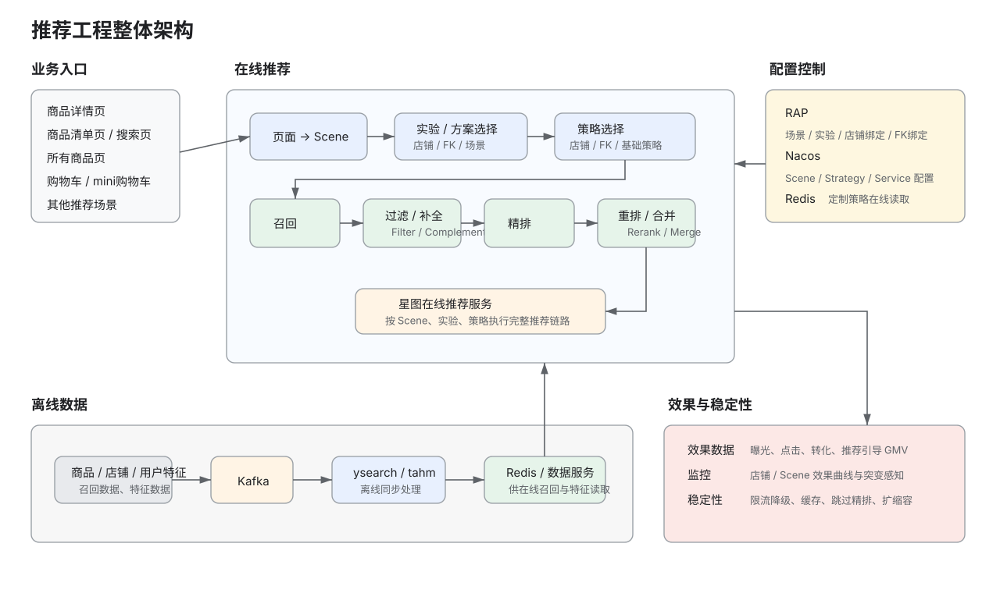

# 推荐工程整体业务背景

## 1. 业务定位

推荐工程面向 SHOPLINE 店铺，在不同页面和业务场景下为用户返回商品推荐结果。系统核心不是单一算法，而是一套从**场景识别、实验与策略选择、召回、过滤、排序到效果监控**的完整推荐链路。

当前业务按站点独立运行：

| 站点 | 业务范围 | 主要特点 |
| --- | --- | --- |
| EC10 | 港台推荐 | 已支持多页面场景、实验、店铺/FK 定制策略、店铺效果监控 |
| EC20 | 大陆推荐 | 与 EC10 数据、页面映射和业务维度独立 |

推荐分析、实验和配置都必须保留站点范围，不能跨站点混合。

---

## 2. 核心业务对象

| 对象 | 含义 |
| --- | --- |
| 店铺（Merchant / Store） | 推荐业务的基本租户和数据隔离单位 |
| 页面（Page） | 商品详情、商品清单、搜索、购物车等用户入口 |
| 场景（Scene） | 推荐服务内部使用的业务场景编号，由页面映射得到 |
| 实验（Experiment） | 控制不同方案或策略在指定流量中的生效范围 |
| FeatureKey（FK） | 用于进一步圈选特定商品/业务特征，并绑定定制实验或策略 |
| 方案（Solution） | 一组推荐执行配置，由场景和实验选择 |
| 策略（Strategy） | 定义一次推荐请求具体执行哪些召回、过滤、排序等能力 |
| 召回（Recall） | 从候选商品集合中取回可能相关的商品 |
| 特征（Feature） | 用户、商品、店铺等在线排序和策略判断需要的数据 |
| 推荐结果 | 最终返回给页面展示的商品列表 |
| 效果数据 | 曝光、点击、转化、订单、推荐引导 GMV 等推荐成效 |

EC10 当前常用页面包括商品详情页、商品清单页、搜索页、所有商品页、购物车页、mini 购物车页和 blog 页。

---

## 3. 整体架构

整体可以分成四部分：

- **配置控制面**：RAP 管理场景、实验、店铺/FK 绑定和定制策略，配置同步到 Nacos 和 Redis。
- **在线推荐面**：星图在线服务根据 Scene、实验和策略执行召回、过滤、补全、精排、重排和合并。
- **离线数据面**：算法和离线任务通过 Kafka、ysearch、tahm 等链路生成并同步召回数据和特征数据，供在线服务读取。
- **效果与稳定性**：离线产出每日推荐成效，工程侧按店铺和场景监控效果，同时通过限流、缓存、降级和扩缩容保证在线稳定性。

---

## 4. 在线推荐流程

一次推荐请求的核心决策分成三层：**先确定场景，再确定实验/方案，最后确定策略并执行推荐链路。**

\`\`\`mermaid
flowchart TD
    A[页面产生推荐请求] --> B[页面映射 Scene]
    B --> C{是否有店铺实验绑定}
    C -- 是 --> D[店铺实验]
    C -- 否 --> E{是否有 FK 实验绑定}
    E -- 是 --> F[FK 实验]
    E -- 否 --> G[场景实验]

    D --> H[选择方案]
    F --> H
    G --> H

    H --> I{是否有店铺定制策略}
    I -- 是 --> J[店铺定制策略]
    I -- 否 --> K{是否有 FK 定制策略}
    K -- 是 --> L[FK 定制策略]
    K -- 否 --> M[基础策略]

    J --> N[召回]
    L --> N
    M --> N

    N --> O[过滤 / 补全]
    O --> P[精排]
    P --> Q[重排 / 合并]
    Q --> R[返回商品列表]
\`\`\`

当前优先级可以概括为：

\`\`\`text
实验选择：店铺实验 > FK 实验 > 场景实验
策略选择：店铺定制策略 > FK 定制策略 > 基础策略
\`\`\`

这套设计让平台保留统一基础策略，同时支持特定店铺或 FeatureKey 做局部定制。

---

## 5. 配置与实验体系

推荐配置主要由 RAP、Nacos 和 Redis 三部分组成。

### RAP

RAP 是业务配置入口，主要管理：

- 场景及实验配置
- 店铺与场景实验绑定
- FeatureKey 实验绑定
- 店铺定制策略
- FeatureKey 定制策略

### Nacos

Nacos 保存在线推荐运行需要的配置，核心包括：

| 配置 | 作用 |
| --- | --- |
| scene-configs | 场景及场景配置 |
| ab-configs | 实验、应用和策略配置 |
| solution-plugin-configs | 推荐方案配置 |
| flow-controls | 页面与 Scene 的映射 |
| data-sources / data-services-go | 数据源和数据服务 |
| recall-services | 召回能力配置 |
| filter-services | 过滤配置 |
| complement-services | 补全配置 |
| rank-services-go | 精排配置 |
| rerank-services | 重排配置 |
| recommend-strategies | 基础推荐策略 |
| base-strategies | 基础策略定义 |
| store-strategy-configs | 店铺定制策略 |
| cache-configs | 推荐缓存配置 |
| sentinel.rule | 限流和降级配置 |

### Redis

定制策略的具体内容会同步到 Redis，供在线推荐服务快速读取；Nacos 同时保留是否存在定制策略等控制信息。

---

## 6. 离线数据链路

推荐在线服务依赖大量提前生成的数据，主要包括召回数据、商品/用户特征和店铺数据。

\`\`\`mermaid
flowchart LR
    A[算法/业务数据] --> B[Kafka]
    B --> C[ysearch / tahm 离线任务]
    C --> D[召回数据]
    C --> E[特征数据]
    C --> F[店铺数据]

    D --> G[召回 Redis / 数据服务]
    E --> H[特征 Redis / 数据服务]
    F --> I[店铺 Redis / 数据服务]

    G --> J[星图在线推荐]
    H --> J
    I --> J
\`\`\`

港台推荐 ToAll 后，召回和特征从 Beta 数据逐步切换为全量数据，并通过独立 Kafka Topic 和 Redis 集群支撑线上推荐。

---

## 7. 推荐效果数据

推荐工程不仅负责“返回什么商品”，还需要持续判断推荐是否有效。

核心效果指标包括：

| 指标 | 含义 |
| --- | --- |
| 曝光 | 推荐商品被展示的次数 |
| 点击 | 推荐商品被点击的次数 |
| 转化 | 推荐带来的转化次数 |
| CTR | 点击 / 曝光 |
| CVR | 转化 / 点击 |
| CTCVR | 转化 / 曝光 |
| 推荐引导 GMV | 推荐链路产生的 GMV |

效果数据按日离线产出，当前分析口径以 T+1 为主。港台已经支持把推荐成效展示给商家，工程侧进一步按店铺和场景维护效果曲线，并监控明显突变，用于发现工程异常或辅助算法调整策略。

---

## 8. 在线稳定性

推荐服务支持四类主要干预方式：

- **限流降级**：通过 Sentinel 按页面或店铺限制流量等级。
- **缓存降级**：按 Scene 或店铺开启自动/手动缓存，降低后端压力。
- **排序降级**：模型或特征服务出现瓶颈时，可通过 rank 配置跳过精排。
- **扩缩容**：在线容器或 Redis 出现容量瓶颈时进行人工扩容。

稳定性控制的粒度与业务对象一致，主要围绕**页面、Scene、店铺和推荐执行阶段**展开。

---

## 9. 扩展能力

### FeatureKey 定制推荐

FeatureKey 用来表达更细的业务或商品特征条件。基础配置可以声明某个召回需要的 FeatureKey，RAP 再基于 FK 圈选实验和定制策略，实现比店铺粒度更细的推荐控制。

### 图搜 / 向量检索

港台图搜是推荐工程中的独立检索能力：

\`\`\`mermaid
flowchart LR
    A[商品图片] --> B[离线 Embedding]
    B --> C[Qdrant 向量库]
    D[用户查询图片] --> E[在线 Embedding]
    E --> F[vsearch 向量检索]
    F --> C
    C --> G[返回相似商品]
\`\`\`

离线侧把商品图片向量写入 Qdrant；在线侧生成查询图片向量，通过 vsearch 检索相似商品。

---

## 10. 业务链路总结

推荐工程可以归纳成一条主链路：

\`\`\`text
页面
→ Scene
→ 实验/方案
→ 策略
→ 召回
→ 过滤/补全
→ 精排
→ 重排/合并
→ 推荐结果
→ 曝光/点击/转化
→ 效果监控与策略调整
\`\`\`

其中 RAP/Nacos/Redis 负责控制“**怎么推荐**”，Kafka/ysearch/tahm/数据服务负责准备“**拿什么数据推荐**”，星图在线服务负责执行“**本次请求具体推荐什么**”，效果数据和监控负责判断“**推荐得怎么样**”。
